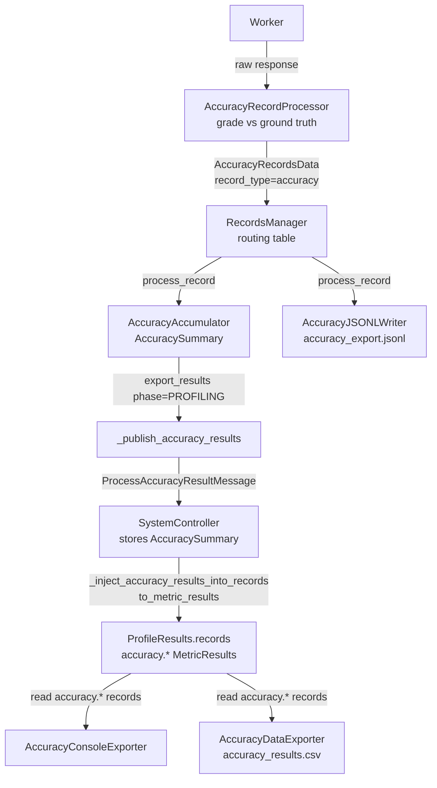
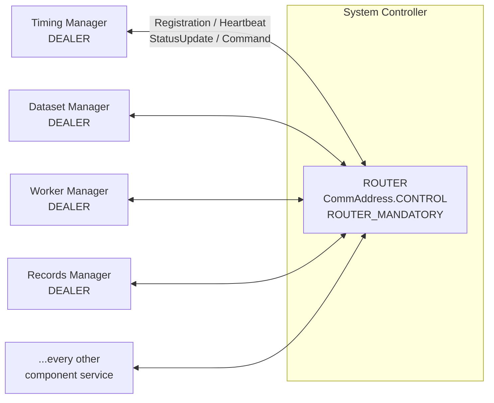
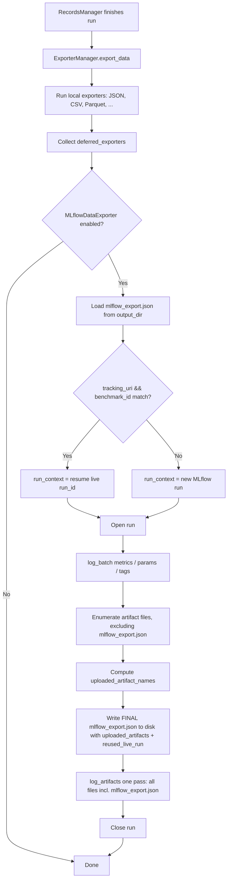
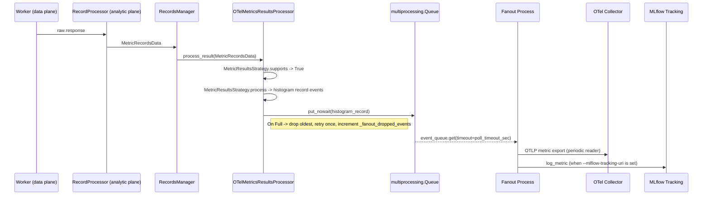
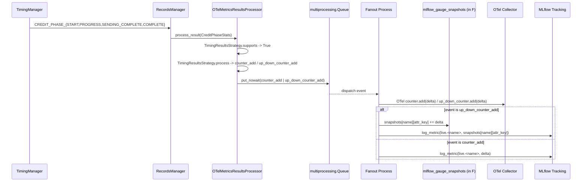

# Architecture of AIPerf

AIPerf is a modular benchmarking tool for measuring AI inference performance. It generates load against inference endpoints, collects detailed performance metrics, and provides comprehensive analysis of throughput, latency, and resource utilization.

## Architecture Overview

AIPerf is designed as a modular, extensible benchmarking framework that separates concerns across three architectural planes. The system scales horizontally as more workers are added while maintaining centralized orchestration.

### Three-Plane Architecture

| Plane | Components | Purpose |
|-------|-----------|---------|
| **Control Plane** | SystemController, Timing Manager, Dataset Manager, Worker Manager | Decides what, when, and how many requests to send |
| **Data Plane** | Workers, Inference Server | Executes the actual I/O and request/response cycle |
| **Analytic Plane** | Record Processors, Records Manager, GPU Telemetry Manager, Server Metrics Manager | Computes metrics and collects telemetry |

### Request Lifecycle

1. **Initialization**: Dataset Manager loads data, Timing Manager prepares schedule
2. **Warmup** (optional): Workers send warmup requests to prime JIT, caches, and connection pools. Results are discarded.
3. **Profiling**: Workers receive credits, access data, send requests to inference server
4. **Collection**: Workers capture response timing and content
5. **Processing**: Record Processors compute metrics in parallel
6. **Aggregation**: Records Manager collects and exports results

## Core Components

### System Controller

The System Controller is the central orchestrator that manages the lifecycle and coordination of all major modules involved in a benchmarking run.

**Key Responsibilities:**
- Registering and initializing core components
- Orchestrating the start, execution, and shutdown of benchmarking tasks
- Handling configuration, resource allocation, and inter-module communication
- Monitoring the overall progress and health of the benchmarking process
- Managing error handling, cleanup, and graceful termination of all modules

Result-producing services register their result domains with the System Controller.
Shutdown begins only after profiling has started and every registered domain has
either completed or been evicted after a confirmed service failure. This lifecycle
gate prevents an empty startup barrier from being mistaken for completed results.

Kubernetes result publication is a fail-closed filesystem transaction. Before
a controller starts benchmark work, and again immediately before export, it
durably removes any stale ready marker and atomically installs a processing
marker. After every required artifact is flushed and exported, it atomically
installs and fsyncs the ready marker before clearing the processing marker. Only
then does it publish `ResultsExportedMessage` and notify the operator. A crash
or restarted export before that commit leaves top-level artifacts hidden from
the results sidecar. Kubernetes sweep aggregation uses
the same durable ready-marker commit after plotting and scratch-artifact pruning
finish, so the operator never harvests a partially published aggregate tree.

### Dataset Manager

The Dataset Manager handles all aspects of input data management during benchmarking runs.

**Key Responsibilities:**
- Loading datasets from various sources (JSONL, CSV, synthetic generators, trace replay formats)
- Parsing and validating input data to ensure it matches the expected format
- Writing dataset to memory-mapped files, enabling workers to access data directly without message passing
- Supporting custom dataset types, such as MoonCake traces, for advanced benchmarking scenarios
- Managing the lifecycle of datasets, including initialization, iteration, and cleanup

### Timing Manager

The Timing Manager controls and coordinates the timing of requests during benchmarking runs through a credit-based system.

**Key Responsibilities:**
- Scheduling when each request should be sent based on the selected timing mode (fixed schedule, request-rate, or user-centric rate)
- Managing precise timing to accurately reproduce real-world or synthetic load patterns
- Supporting advanced timing scenarios, such as replaying traces with specific inter-arrival times or simulating bursty traffic
- Ensuring that requests are dispatched to workers at the correct intervals for reliable measurement

### Worker Manager

The Worker Manager orchestrates and manages the pool of worker processes that execute benchmarking tasks.

**Key Responsibilities:**
- Coordinating with the system controller to spawn and shut down workers that send requests to the inference server
- Monitoring worker status, progress, and resource usage
- Handling worker lifecycle events, such as startup, shutdown, and error recovery
- Managing worker pool size based on benchmarking requirements

### Workers

Workers are the processes that send HTTP requests to the inference server and measure response times.

**Key Responsibilities:**
- Send HTTP requests to inference servers and measure response timing
- Wait for timing credits before sending requests (enables precise load control)
- Track conversation state for multi-turn interactions
- Report timing measurements to Record Processors for analysis

**Scalability:**
- Run multiple workers (e.g., 10, 50, 100+) to support different workload patterns
- No coordination between workers
- Adding more workers increases load capacity and request rates

### Record Processor

The Record Processor processes and interprets the responses received from the inference server during benchmarking.

**Key Responsibilities:**
- Parsing raw inference results to extract relevant metrics (latency, output tokens, correctness)
- Handling different response formats from various model endpoints (OpenAI, vLLM, Triton, custom APIs)
- Validating and normalizing results to ensure consistency across benchmarking runs
- Computing metrics derived from individual requests (TTFT, ITL, Request Latency, Request Throughput etc.)
- Supporting error detection and handling for malformed or unexpected responses
- Scales horizontally to handle high-volume metric computation

### Records Manager

The Records Manager handles the collection, organization, and storage of benchmarking records and results.

**Key Responsibilities:**
- Aggregating data from the records processors (inference results, timing information, metrics)
- Storing records in memory and/or exporting them to files (CSV, JSON, Parquet) for later analysis
- Providing interfaces for querying, filtering, and summarizing benchmarking results
- Supporting the generation of reports and artifacts for performance evaluation
- Managing the final export of aggregated performance summaries and per-request details

#### Record-Type Channels

The Records Manager does not hard-wire one handler per producer. Instead, every typed record carries a `record_type` class attribute and is fanned out through a metadata-driven routing table: each accumulator and stream exporter declares the record types it consumes via `record_types` in `plugins.yaml`, and `_dispatch_record` routes each record by `getattr(record, "record_type")` to all registered handlers. This makes each record type a dedicated channel.

Accuracy benchmarking and GPU telemetry use dedicated Records Manager channels.
Server metrics use the same plugin metadata to select local consumers, but raw
Prometheus snapshots remain inside Server Metrics Manager:

| Channel (`record_type`) | Producer | Message | Consumers (`record_types`) |
|---|---|---|---|
| `metric_records` | Record Processor (`MetricRecordProcessor`) | `RecordsMessage` | `MetricsAccumulator`, JSONL/OTel stream exporters |
| `accuracy` | Record Processor (`AccuracyRecordProcessor`) | `RecordsMessage` | `AccuracyAccumulator`, `AccuracyJSONLWriter` |
| `gpu_telemetry` | GPU Telemetry Manager | `TelemetryRecordsMessage` | `GPUTelemetryAccumulator`, GPU JSONL writer |
| `server_metrics` | Server Metrics Manager | None (manager-local callback) | `ServerMetricsAccumulator`, server-metrics JSONL writer, both hosted by Server Metrics Manager |

**Two-stage record processing.** The `RecordProcessorService` runs two roles per parsed response (mirroring the accumulator/stream-exporter split on the consumer side): **producers** (`record_processor` category) parse and emit one finished typed record on a declared `record_type` channel — `MetricRecordProcessor` → `MetricRecordsData` (`metric_records`), `AccuracyRecordProcessor` → `AccuracyRecordsData` (`accuracy`) — and **observers** (`record_observer` category, e.g. the raw-record and outputs-json writers) receive a `RecordObserverContext` (the parsed record + all producer outputs keyed by `record_type`) and act without emitting a channel record. Each producer's output carries its own serialized `record_type` discriminator, so the service ships **one generic `RecordsMessage`** per request — `{metadata, records: list[RecordData], error}` — and the `RecordsManager` dispatches each record to its channel handlers by `record.record_type` (no per-type message classes, no type-sniffing). The metric record is the canonical per-request record that drives the phase-completion lockstep, keyed off the message metadata.

The `AccuracyRecordProcessor` grades each parsed response against ground truth and returns an `AccuracyRecordsData` (`session_num`, `conversation_id`, `x_request_id`, `worker_id`, `benchmark_phase`, `timestamp_ns`, `task`, `grader_name`, `passed`, `unparsed`, `confidence`, `expected`, `actual`, `explanation`, `model_output`, `model_thinking`). The Records Manager fans each accuracy record out to the `AccuracyAccumulator` (rolls records into an `AccuracySummary` of overall + per-task pass/unparsed rates) and the `AccuracyJSONLWriter` (streams the full per-response grading detail to `accuracy_export.jsonl`, one JSON object per graded response).

At end of the profiling phase, `RecordsManager._publish_accuracy_results(phase)` exports the phase-scoped `AccuracySummary` and publishes a `ProcessAccuracyResultMessage`. The `SystemController` receives it and stores the summary — gated in shutdown like the telemetry and server-metrics results. At export time, `SystemController._inject_accuracy_results_into_records` converts that summary back into legacy `accuracy.*` `MetricResult`s (via `AccuracySummary.to_metric_results()`) and appends them to `ProfileResults.records`. The `AccuracyConsoleExporter` and `AccuracyDataExporter` — like the main perf CSV/JSON exporters — then read those injected `accuracy.*` records. This inject bridge is what keeps the exported files (`accuracy_results.csv`, `profile_export_aiperf.{csv,json}`) byte-identical to the pre-refactor output. The dedicated per-response `accuracy_export.jsonl` is produced independently by the `AccuracyJSONLWriter` and is unaffected by this bridge.

### GPU Telemetry Manager

The GPU Telemetry Manager collects GPU metrics during benchmarking runs via pluggable collectors.

**Key Responsibilities:**
- Collecting GPU metrics (power, utilization, memory, temperature, errors) via pluggable collector backends:
  - **DCGM**: Scrapes DCGM Exporter HTTP endpoints (Prometheus format) — NVIDIA GPUs; exposes `nvidia_power_usage` and `nvidia_energy_consumption`
  - **PyNVML**: Queries NVIDIA GPUs directly via the pynvml Python library (no external endpoint required) — exposes `nvidia_power_usage`
  - **amdsmi**: Queries AMD GPUs via the amdsmi Python library — exposes `amd_power` and `amd_energy_consumption`
- Auto-discovering DCGM endpoints
- Supporting custom endpoints via `--gpu-telemetry` flag
- Exporting GPU telemetry alongside benchmark results

Final GPU samples travel on the telemetry PUSH socket while the completion command
travels on the control channel — separate transports entirely, so the command
response alone is not an ingest barrier. The GPU Telemetry Manager closes
record admission and sends a sequenced terminal marker on the telemetry PUSH socket.
The Records Manager waits until every sequence through that marker has finished
dispatch before summarizing or finalizing stream exporters. A missing marker or
sequence fails result finalization closed instead of publishing a partial JSONL file.

### GPU Power Efficiency Analysis

At the end of each profiling phase, `EnergyEfficiencyAnalyzer` — an `analyzer` plugin — joins GPU telemetry energy/power data with inference token and throughput totals to produce the GPU power-efficiency metric family.

`EnergyEfficiencyAnalyzer.analyze()` is called by the `SummaryContext` at summarize time. It calls `GPUTelemetryAccumulator.available_platforms()` to discover which vendors reported data, then fans out per vendor: querying windowed energy and power totals, computing the 12 derived metrics (total power, total energy, tokens/joule, energy/token, energy/request, energy/user, energy-delay product, performance/watt, output TPS/watt, goodput/watt, average power), and returning them as injected `MetricResult` objects. Each vendor's metrics render in their own console section (`GPU_POWER_EFFICIENCY_NVIDIA`, `GPU_POWER_EFFICIENCY_AMD`); a section is omitted entirely when no GPU of that vendor reported.

See [`docs/dev/patterns.md` — Externally-Injected Derived Metric Pattern](dev/patterns.md#externally-injected-derived-metric-pattern) for the metric class contract and instructions for adding a new vendor.

### Server Metrics Manager

The Server Metrics Manager collects metrics from Prometheus-compatible endpoints during benchmarking runs.

**Key Responsibilities:**
- Collecting metrics from Prometheus-compatible endpoints (inference server application metrics, system metrics, custom metrics)
- Auto-discovering metrics endpoints from configured inference server URLs (`--url`)
- Discovering eligible inference-server pods through the Kubernetes API, scoped to the benchmark namespace unless another namespace is explicitly configured
- Supporting custom Prometheus endpoints via `--server-metrics` flag
- Parsing any metrics exposed in Prometheus format (gauges, counters, histograms)
- Owning raw server-metric accumulation and JSONL writes locally; only bounded realtime summaries and the final aggregate cross the message bus
- Typical metrics collected: inference server KV cache usage, request counts, latencies, batch sizes, model-specific metrics, and server resource metrics
- Auto-detecting non-Prometheus endpoints (e.g. TRT-LLM serves an iteration-stats JSON array at `/metrics` by default), probing `<base>/prometheus/metrics` once as a fallback, and disabling collection for that endpoint after a single warning if neither path yields parseable Prometheus data — see [Server Metrics Compatibility & auto-disable](server-metrics/server-metrics.md#compatibility--auto-disable)
- Exporting server metrics alongside benchmark results

## How AIPerf Works

### Credit System & Request Timing

The Timing Manager uses a **credit-based flow control system** to control when requests are sent. This enables accurate load pattern reproduction and prevents server overload.

**How Credits Work:**
- Each credit grants permission to send one request
- The Timing Manager issues credits according to the configured timing mode:
  - **Fixed schedule mode**: Replays conversation traces at precise timestamps from dataset metadata
  - **Request-rate mode**: Issues credits at a specific rate with configurable arrival patterns (constant, Poisson, gamma, concurrency burst)
  - **User-centric rate mode**: Each session acts as a separate user with calculated gaps between turns

**Flow Control Benefits:**
- Prevents overwhelming the inference server
- Enables precise reproduction of load patterns
- Provides natural backpressure when the server slows down
- Allows accurate measurement without artificial delays

**Credit Distribution:**
- Credits are dispatched to workers via a ROUTER/DEALER pattern (the Timing Manager's sticky ROUTER to each worker's DEALER)
- Router selects workers based on sticky sessions (multi-turn conversations) or least-loaded worker selection
- If a registered worker that owns in-flight credits or sticky sessions is lost during an active benchmark, the Timing Manager cancels the phase and records a terminal failure rather than migrating or truncating worker-local state.
- Credit returns travel back on a dedicated PUSH/PULL fan-in channel: each worker PUSHes its `CreditReturn`/`FirstToken` to the Timing Manager's single PULL, separating the high-volume return path from credit dispatch
- The return channel carries no ZMQ envelope identity, so the returning worker id travels inside the message
- No coordination required between workers
- Scales to large numbers of workers without bottlenecks
- Efficient message routing minimizes overhead

### Data Flow & Messaging

This section describes the end-to-end message flow during a benchmark run, showing how data moves between components through the ZMQ message bus.

**Key Data Structures:**
- **Timing Credit**: Grants permission to send one request
- **Dataset Entry**: Prompt and conversation context
- **Raw Result**: Request timing, tokens, response text
- **Metric Record**: Per-request computed metrics plus trace data
- **Aggregated Results**: Final performance summary and per-request details

**Message Flow:**
1. Credit Router dispatches credits to workers via ROUTER/DEALER pattern
2. Workers access dataset entries via memory-mapped files
3. Workers send requests to Inference Server (external HTTP)
4. Workers return completed credits to the Timing Manager over a dedicated PUSH/PULL fan-in channel
5. Workers push raw results to Record Processors
6. Record Processors push metric records to Records Manager
7. Records Manager aggregates and exports final results

## Communication Architecture

AIPerf services communicate internally via a **ZeroMQ (ZMQ) message bus**, designed for low-latency, high-throughput message passing between components.

### Why ZMQ?

AIPerf uses ZMQ to maintain **measurement accuracy** by decoupling orchestration logic from execution:

- **Low-overhead messaging**: Credits are routed directly to workers
- **Asynchronous by design**: No blocking calls between services, ensuring workers spend maximum time on I/O and timing
- **Efficient transport**: ZMQ is designed for low-overhead inter-process communication
- **Scalability**: Supports many local worker processes and distributed Kubernetes execution through the registered `kubernetes` service-manager plugin

### Communication Patterns

AIPerf runs two distinct planes over ZMQ: a **pub/sub event bus** for data and
telemetry, and a **DEALER/ROUTER control channel** for orchestration.

**Event bus (ZMQ proxies).** Services publish strongly-typed messages to topics
and subscribe to the message types they care about. This carries every message
type *except* commands: records, telemetry, progress, results, status
broadcasts. Alongside it are the dedicated streaming channels:

- ROUTER/DEALER for credit dispatch to workers
- PUSH/PULL fan-in for credit returns from workers back to the Timing Manager
- Request/Reply for synchronous operations

For low event-loop overhead, the streaming credit sockets (the dispatch DEALER/ROUTER and the return PUSH/PULL) are driven directly off the raw ZMQ file descriptor with an edge-triggered, non-blocking batch drain rather than per-message `await` wrappers.

**Control channel.** Commands, service registration, heartbeats, and lifecycle
status do **not** ride the event bus. Each component service opens a DEALER to
`CommAddress.CONTROL` using its service ID as the ZMQ identity; the System
Controller binds the single ROUTER. Payloads are `msgspec` tagged-union structs
from `aiperf.common.control_structs` rather than Pydantic `Message` subclasses.

Because the ROUTER is the only path between two non-controller services, a
command aimed at a peer is relayed by a controller-side handler rather than sent
directly — this is how `PROFILE_COMPLETE` and `PROFILE_CANCEL` reach their
sibling services.

Addressing is symmetric in both directions:

- **Controller to service**: identified by the DEALER identity. A one-shot
  request awaits a response; a fan-out sends to an explicit list of service IDs.
  There is no untargeted command broadcast.
- **Service to controller**: `send_command_to_controller()` on the same socket.

Each command carries a correlation id and is answered exactly once, with an ack,
a result, an error, or an explicit "no handler" response. See
[`docs/dev/patterns.md`](dev/patterns.md) § "Control Channel Command Pattern".

Registration is deliberately the *second* readiness proof a service gives: it
runs after the event-bus connection probe succeeds, so a registered service has
demonstrated both planes are live.

**Heartbeats are sent on both planes, on purpose.** Every service emits a
`Heartbeat` struct on the control channel *and* a `HeartbeatMessage` on the event
bus each interval. These are not duplicates and neither may be removed as one:

| Send | Consumer | Consequence of losing it |
|---|---|---|
| `Heartbeat` (control channel) | System Controller's service registry | The service is declared unhealthy and reaped. |
| `HeartbeatMessage` (event bus) | `TimingManager` feeds it to `StickyCreditRouter.note_worker_heartbeat` | `WorkerLoad.last_heartbeat_ns` has no other source once the registration-time value ages out. Every worker eventually looks stale to `evict_stale_workers`, failing any sufficiently long run with `Fatal worker loss: worker_unavailable`. |

The bus heartbeat is intentionally not gated on registration — the credit
router's liveness clock is independent of the controller's registration
handshake — while the control-channel heartbeat is, so that services do not
provoke "unknown service" warnings before they have registered.

### State Management

**Stateless design** for scalability:
- **Workers**: No shared state between workers; each maintains only local conversation context for multi-turn requests
- **Services**: All service state is ephemeral and can be reconstructed from configuration
- **Coordination**: Credit distribution happens through the message bus; dataset access via memory-mapped files
- **Results**: Only aggregated results are persistent (exported to files)

## Design Principles

AIPerf is built on three core principles:
- **Separation of Concerns**: Control plane orchestrates, workers execute, record processors compute metrics
- **Scalability**: Horizontal scaling for workers and processors with credit-based flow control
- **Extensibility**: Plugin system for datasets, endpoints, transports, and metrics

## Deployment Modes

AIPerf supports two deployment models:

- **Multiprocess Mode**: Each service runs as a separate process on a single node (default for single-node deployments)
- **Kubernetes Mode**: Control-plane services run as sibling containers in the controller pod, while workers and record processors run in external pods managed by JobSet.

## Configuration Envelope

The top-level `AIPerfConfig` YAML accepts several optional sibling keys alongside the core `benchmark:` block — `sweep:`, `multi_run:`, `variables:`, `random_seed:`, and `plot:`. Each owns a single concern and is loaded by its own Pydantic model.

The `plot:` envelope describes which plots are rendered after the run. It accepts two forms: a bare-string path reference (e.g. `plot: ./plots/baseline.yaml`, resolved relative to the AIPerf YAML's directory) or an inline mapping mirroring `src/aiperf/plot/default_plot_config.yaml` 1:1. When `plot:` is set it replaces the `~/.aiperf/plot_config.yaml` fallback (the envelope is the spec) and presence implies `artifacts.auto_plot=True` unless the user explicitly sets it to `false`. The auto-plot callback materializes the resolved envelope to `<artifact_dir>/.aiperf-plot-config.yaml` so `aiperf plot <dir>` later reproduces the same plots without the original YAML. See `src/aiperf/config/plot.py` for the Pydantic models.

## External Dependencies

AIPerf integrates with external systems:

- **Inference Server**: The target system being benchmarked (vLLM, Dynamo, SGLang, etc.)
- **DCGM Exporter**: Optional GPU telemetry source (exposes GPU metrics in Prometheus format). Alternative: PyNVML queries GPUs directly without an external endpoint.
- **Prometheus-compatible endpoints**: Optional server/application metrics source for Server Metrics Manager (inference servers like vLLM expose metrics in Prometheus format at their /metrics endpoint)

## Telemetry Plane

The Telemetry Plane provides real-time streaming of benchmark metrics to OpenTelemetry collectors and MLflow tracking servers. It operates as a sidecar to the Analytic Plane, consuming processed results without affecting the core benchmarking pipeline.

### OTelMetricsResultsProcessor Registration

`OTelMetricsResultsProcessor` is a results processor registered with `RecordsManager`. When `--otel-url` is set (with `--stream` controlling which domains are active), the processor is instantiated and added to the Records Manager's processor chain. It receives every `MetricRecordsData` and `CreditPhaseStats` event that flows through the analytic plane, acting as the entry point into the telemetry pipeline.

The processor does not emit metrics directly. Instead, it delegates to strategy objects that decide whether a given result type is relevant and how to transform it into telemetry events.

### multiprocessing.Queue and Fanout Process

Telemetry export runs in a dedicated child process (`Fanout_Process`) to isolate the benchmarking hot path from network I/O to collectors and tracking servers. Communication between the main process and the fanout process uses a bounded `multiprocessing.Queue`.

**Back-pressure policy:** When the queue is full, the oldest event is dropped and the put is retried once. A `_fanout_dropped_events` counter tracks discards so operators can detect saturation without impacting benchmark accuracy.

The fanout process drains the queue with a configurable `poll_timeout_sec`, batches events through the OTel SDK periodic reader for OTLP export, and optionally forwards metrics to MLflow when `--mlflow-tracking-uri` is set.

### Strategy-Protocol Dispatch via --stream

The `--stream` flag activates strategy-based dispatch inside `OTelMetricsResultsProcessor`. Each strategy implements a two-method protocol:

- `supports(result)` — returns `True` if the strategy handles this result type.
- `process(result)` — transforms the result into one or more telemetry events pushed to the queue.

Two built-in strategies ship with the system:

| Strategy | Triggers on | Emits |
|----------|------------|-------|
| `MetricResultsStrategy` | `MetricRecordsData` | Histogram record events (latency, throughput) |
| `TimingResultsStrategy` | `CreditPhaseStats` | Counter add / UpDownCounter add events |

Strategies are evaluated in registration order; the first whose `supports` returns `True` wins.

### Deferred MLflow Path in ExporterManager

Post-run artifact upload follows a deferred export path. `MLflowDataExporter` is registered as a deferred exporter in `ExporterManager` so it runs after all local exporters (JSON, CSV, Parquet) have written their files. This guarantees that every artifact is available on disk before the upload begins.

The deferred path handles run identity, metric logging, and artifact upload in a single pass:

### Data Flow: Record Telemetry

The following diagram shows how per-request metrics flow from workers through the analytic plane into the telemetry pipeline:

### Data Flow: Timing Telemetry

Credit-phase timing events follow a similar path but use counters and up-down counters rather than histograms:

