# Kubernetes Flow End-to-End

This document describes the complete flow from user command to benchmark completion when running AIPerf on Kubernetes.

## Overview

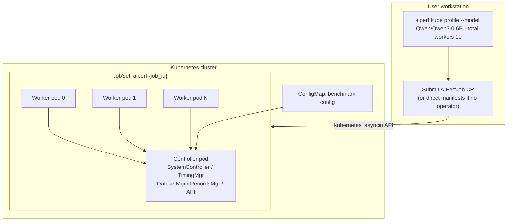

`WorkerGroupManager` is the readiness and capacity authority for each Kubernetes worker pod. Local multiprocessing is managed directly by `MultiProcessServiceManager` and `WorkerManager`.

## 1. CLI Entry Point

```bash
aiperf kube profile --model Qwen/Qwen3-0.6B --url http://server:8000 --image aiperf:latest --total-workers 10
```

CLI commands defined in `src/aiperf/cli_commands/kube/`:

| Command | Purpose |
|---------|---------|
| `init` | Generate a starter configuration template |
| `validate` | Validate AIPerfJob and AIPerfSweep YAML files against the CRD schema |
| `profile` | Run a benchmark in Kubernetes |
| `sweep` | Run a parameter sweep or multi-run benchmark in Kubernetes |
| `generate` | Generate Kubernetes YAML manifests |
| `delete` | Delete a benchmark and its backing Kubernetes resources |
| `cleanup` | Bulk-remove finished benchmarks from a namespace |
| `shutdown` | Retire a finished benchmark's controller pod |
| `cancel` | Cancel a running benchmark (patches `spec.cancel` on the CR) |
| `attach` | Attach to a running benchmark and stream progress |
| `list` | List benchmark jobs and their status; pass `--watch` for live updates |
| `logs` | Retrieve logs from benchmark pods |
| `results` | Retrieve benchmark results |
| `show` | Render an AIPerfJob CR with Jinja2/env-vars resolved |
| `debug` | Run diagnostic analysis on a deployment |
| `preflight` | Run pre-flight checks against the target cluster |
| `dashboard` | Open the operator results server UI in your browser |

## 2. Deployment Generation

The deployment logic in `src/aiperf/cli_commands/kube/profile.py` auto-detects whether the AIPerfJob CRD is installed. If the operator is present, `deploy_via_operator()` (in `profile_deploy.py`) submits an `AIPerfJob` custom resource and the operator reconciles it; otherwise `deploy_direct()` (in `profile_deploy_direct.py`) creates the manifests (ConfigMap, Role, RoleBinding, JobSet) directly. `--operator` forces operator mode without the cluster-scoped CRD probe; `--no-operator` forces direct mode. Both paths require the target namespace to exist — neither creates one. Pass `--namespace` explicitly or set a default in your kubeconfig context.

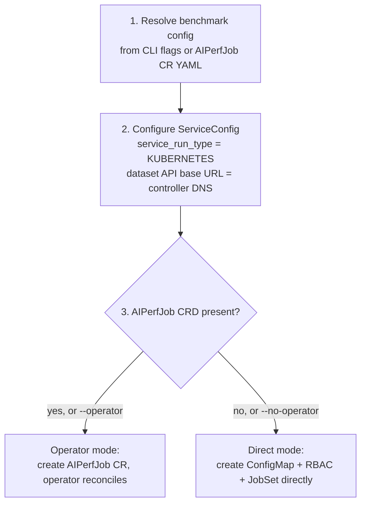

`ServiceRunType.KUBERNETES` is a generated plugin enum member — it comes from
`src/aiperf/plugin/plugins.yaml` via the generated `src/aiperf/plugin/enums.py`,
which is never hand-edited.

## 3. Kubernetes Resources

### Resource Creation Order

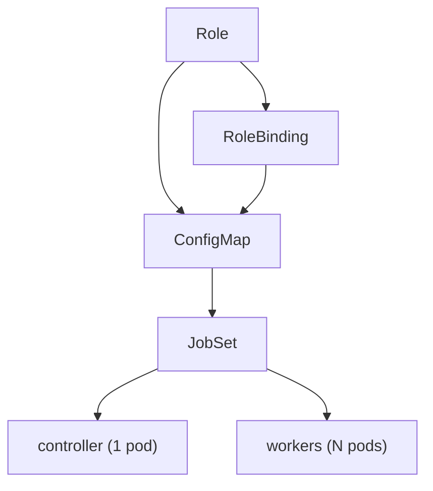

### Same-name recreation fencing

Operator-managed RBAC, ConfigMaps, and JobSets are adopted after an
`AlreadyExists` response only when their controller owner reference matches the
current AIPerfJob or AIPerfSweep name and immutable UID. A resource owned by an
older incarnation, or a matching resource already being deleted, remains on a
retry path until Kubernetes garbage collection finishes. A deterministic name
occupied by an unrelated or ownerless resource fails permanently instead of
being adopted.

Sweep child rollups and the sweep-controller pod apply the same UID fence to
parent status writes. Resource-version and JSON Patch test operations prevent a
delayed child event or stale controller pod from updating a newly recreated,
same-named AIPerfSweep.

AIPerfJob recovery callbacks also pin the parent resource version and accept
JobSet state only when its controller owner API version, kind, name, and UID
match the callback's immutable parent UID. Timeout, startup-failure, and result
salvage cleanup re-read that ownership and delete with the JobSet UID as a
precondition. A stable startup-blocker deadline first atomically adds
`aiperf.nvidia.com/startup-failure-claimed` with JSON Patch tests for the
parent UID, resource version, spec cancellation state, phase, exact
`status.startupIssue`, and annotation map. The annotation-map test makes this
failure-cleanup claim mutually exclusive with the durable completion claim;
only the winner may enter JobSet deletion. A matching persisted failure claim
resumes cleanup after an operator restart. Pod watches and stale-heartbeat
recovery only persist critical startup diagnosis; the cached-state deadline is
the sole path that may claim, delete, and terminalize that blocker. JobSet
failure events use the same ownership fence before a direct status patch.
Event status changes are rebased onto the fenced live status so every condition
type not demonstrably changed by the event survives concurrent controller
writes. Pod events resolve the full Pod to batch Job to JobSet to AIPerfJob
controller-owner chain before restart reporting, startup diagnosis, or
controller-termination salvage; transient owner-read failures request a
bounded kopf retry instead of dropping the one-shot event.

For an operator-managed AIPerfJob, the immutable owner UID is injected into
controller-pod services as `AIPERF_JOB_UID`. Completion and progress writers
read the live target, verify ownership, and use JSON Patch `test` operations on
the AIPerfJob or JobSet UID before adding annotations. If the named resource was
recreated between the read and patch, the API server rejects the whole atomic
patch and the stale controller cannot mutate the replacement.

Cancellation and completion callbacks use the same UID in their process-local
cancellation, progress-client, and completion-claim keys. JobSet deletion uses
the validated JobSet UID as a precondition, and terminal status merge patches
carry the live parent resource version. Ready/latest and runs-index publication
recheck the parent UID; the SQLite latest row advances only when `latest.txt`
accepted the same epoch. A delayed callback therefore cannot close a
replacement job's client, delete its JobSet, or publish terminal state for it.

AIPerfSweep deletion uses sweep-name, sweep-UID, and, when available, run-epoch
labels only to discover candidate child jobs. Before setting
`spec.cancel=true`, the handler requires an `AIPerfSweep` owner reference whose
name and immutable UID match the deleting parent. A standalone AIPerfJob cannot
be cancelled merely by carrying user-writable sweep tracking labels.

### Pod Architecture

Each control-plane service runs in its own container in the controller pod
(sibling containers, not subprocesses). Workers and record processors
likewise each run in their own container inside a worker pod.

**Controller pod** (container names from the `Containers` class in `src/aiperf/kubernetes/constants.py`):

| Container | Role |
|---|---|
| `control-plane` | SystemController (orchestration) |
| `dataset-manager` | Generates prompts, serves dataset |
| `timing-manager` | Schedules requests, issues credits |
| `records-manager` | Aggregates results from workers |
| `api` | WebSocket + HTTP on port 9090 |
| `gpu-telemetry-manager` | GPU metrics via DCGM (optional) |
| `server-metrics-manager` | Prometheus metrics (optional) |
| `results-sidecar` | Serves exported results after controller exit (port 9091) |
| `event-bus-proxy` | XPUB/XSUB ZMQ proxy sidecar (`AIPERF_K8S_EVENT_BUS_SIDECAR_ENABLED=true` by default; isolates pub/sub I/O from the SystemController process) |

Per-container health ports run 8080-8088 (`AIPERF_K8S_PORT_*_HEALTH`); the API
service is on 9090 and the results sidecar on 9091.

**Worker pod (x N):**

| Container | Role |
|---|---|
| `worker-group-manager` | Group-local readiness, dataset download, proxy |
| `worker-0` .. `worker-{N}` | One worker per container; each makes LLM API calls |
| `record-processor-0` .. `record-processor-{M}` | One record processor per container; each computes metrics per record |

### RBAC Permissions

The Role rules are the `_RULES` class-var on `RBACSpec` in
`src/aiperf/kubernetes/resources.py`:

| API group | Resources | Verbs |
|---|---|---|
| `aiperf.nvidia.com` | `aiperfjobs`, `aiperfjobs/status` | get, list, watch, patch |
| `""` (core) | `configmaps` | get, list, watch |
| `""` (core) | `pods`, `pods/log` | get, list, watch |
| `""` (core) | `services`, `endpoints` | get, list, watch |
| `""` (core) | `events` | get, list, watch |
| `batch` | `jobs` | get, list, watch |
| `jobset.x-k8s.io` | `jobsets` | get, list, watch, patch |
| `jobset.x-k8s.io` | `jobsets/status` | get, list, watch |

`patch` on `aiperfjobs`/`aiperfjobs/status` and `jobsets` is the only write verb
in the set, because controller and worker pods share one ServiceAccount and the
projected token is mounted in every container — so a worker inherits whatever
the controller holds. Everything a pod actually writes is an annotation or
`status` JSON-patch on its own AIPerfJob and JobSet. `create` on `jobsets` was
removed: it let any pod launch a JobSet, and therefore run arbitrary containers,
under the benchmark ServiceAccount.

Two tests keep this pinned and keep the Python and Helm copies in sync:
`TestRBACSpecLeastPrivilege` and `test_helm_benchmark_rbac_is_subset_of_rbac_spec`,
both in `tests/unit/kubernetes/test_resources.py`. The chart's benchmark Role
(`deploy/helm/aiperf-operator/templates/benchmark-rbac.yaml`) must stay a subset
of `_RULES`, so widening one without the other fails CI.

## 4. Inter-Pod Communication

### Network Topology

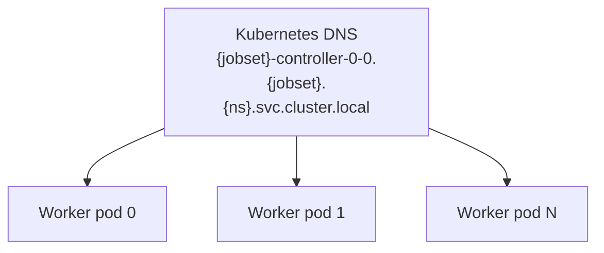

Each worker pod resolves the controller through that headless-service DNS name,
injected as `AIPERF_K8S_ZMQ_CONTROLLER_HOST` (the `AIPERF_K8S_ZMQ_` settings in
`src/aiperf/kubernetes/environment.py`).

### Communication Channels

| Channel | Port | Protocol | Purpose |
|---------|------|----------|---------|
| ZMQ Event Bus | IPC + TCP | ZMQ PUB/SUB | Message broadcasting (every message type except commands) |
| ZMQ Control Channel | IPC + 5667 | ZMQ DEALER/ROUTER | Registration, heartbeats, status, commands |
| API Service | 9090 | HTTP/WS | WebSocket streaming, Dataset API |
| Health | 8080 | HTTP | Kubernetes probes |

### Dual-Bind ZMQ Configuration

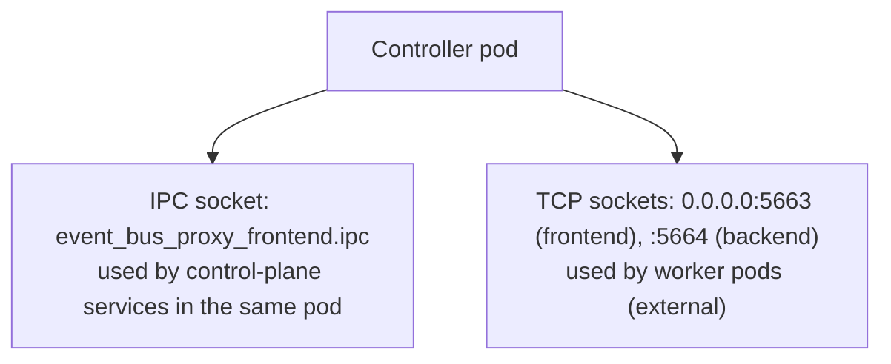

Port defaults live on the `AIPERF_K8S_PORT_` settings in
`src/aiperf/kubernetes/environment.py`.

### Control Channel (`CommAddress.CONTROL`)

`CommAddress.CONTROL` is bound, not just declared. `SystemController` binds a
ROUTER there with `ROUTER_MANDATORY`; every component service — in the
controller pod and in every worker pod — connects a DEALER whose ZMQ identity is
its service ID. Registration, heartbeats, lifecycle status, and all commands
ride this socket as `msgspec` structs.

It dual-binds the same way the event-bus proxies do, but from the
`SystemController` rather than from a proxy:

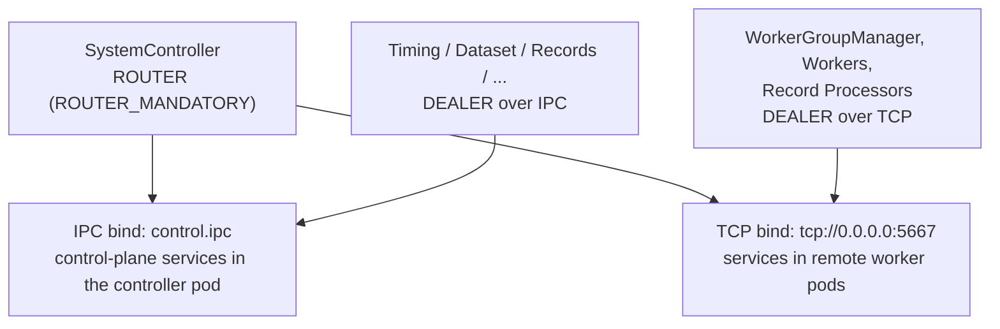

Which address a *connecting* service resolves is decided by
`ZMQDualBindConfig.control_address`: `tcp://{controller_host}:{control_tcp_port}`
when `AIPERF_K8S_CONTROLLER_HOST` is set (worker pods), and the IPC path
otherwise (controller pod). The controller adds the TCP bind via
`control_tcp_bind_address` only when it is itself the controller — that is, when
`controller_host` is unset. Port default: `control_tcp_port = 5667`.

**The ROUTER lives outside the comms lifecycle.** It is created with
`attach_lifecycle=False`, in `SystemController.__init__` rather than in a
lifecycle hook, because it must bracket the comms layer on both ends:

- It must be listening *before* comms starts, since services register during
  their own startup and a missed registration would stall the run.
- It must outlive `comms.stop()`, because children are told to shut down over
  this very socket. A lifecycle-attached ROUTER would be torn down as part of
  the shutdown it is supposed to deliver.

Consequently `SystemController` owns the ROUTER's initialize/start/stop itself.
Service-side DEALERs are ordinary lifecycle children of `self.comms`, so their
`@on_init` hook only registers the receiver — driving them a second time raises
`InvalidStateError`.

`ROUTER_MANDATORY` makes a send to an unknown or departed identity raise
`EHOSTUNREACH` instead of silently dropping. That is intentional: a broadcast
during teardown will legitimately hit services that have already exited, so
`_broadcast_control_command` swallows per-peer send errors, while a targeted
request surfaces them.

## 5. Dataset Transfer

In Kubernetes mode, the DatasetManager streams conversations directly to zstd-compressed files.
Workers download the compressed files via HTTP and decompress locally for memory-mapped access.

### Metadata Synchronization

The API Service waits for dataset metadata before serving files:

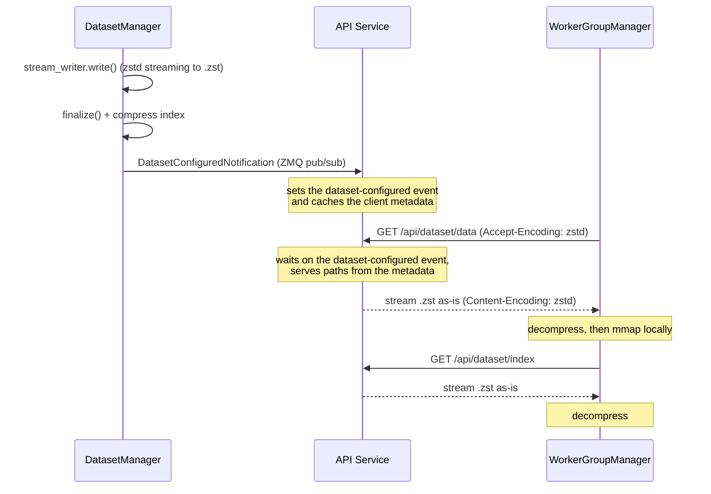

Net effect: only `.zst` files exist on the control plane, file serving is
metadata-driven, and each worker pod ends up with local `.dat` files for mmap
access.

### Key Components

| Component | Responsibility |
|-----------|----------------|
| **DatasetManager** | Streams to `.zst`, broadcasts `DatasetConfiguredNotification` with `MemoryMapClientMetadata` |
| **API Service** | Waits for notification via `asyncio.Event`, serves files using paths from metadata |
| **WorkerGroupManager** | Downloads via HTTP, decompresses within its Kubernetes worker pod, then exposes dataset readiness and current-state snapshots to sibling workers |

### Benefits

| Approach | Disk on Controller | Transfer | CPU Overhead |
|----------|-------------------|----------|--------------|
| **compress_only mode** | Compressed only | Passthrough | Compress once, decompress distributed |
| On-the-fly compression | Uncompressed + compressed | Re-compress per request | High on controller |

### Files Created

**Controller (DatasetManager):**
```
{mmap_base}/aiperf_mmap_{benchmark_id}/
├── dataset.dat.zst   # zstd-compressed conversations (streaming write)
└── index.dat.zst     # zstd-compressed byte offset index
```

**Workers (after download):**
```
{mmap_base}/aiperf_mmap_{benchmark_id}/
├── dataset.dat       # Decompressed conversations (mmap target)
└── index.dat         # Decompressed index
```

## 6. Benchmark Execution Flow

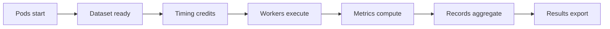

### Detailed Steps

1. **Pods Start** - Control-plane services register with `SystemController`, and each worker pod brings up one `WorkerGroupManager` as the controller-facing authority for that group
2. **DatasetManager** - Generates prompts, serves via HTTP at `/api/dataset`
3. **WorkerGroupManager** - Downloads dataset files once per Kubernetes worker pod, publishes current state, and makes sibling workers dispatchable only after readiness converges
4. **TimingManager** - Schedules requests, issues credits to workers
5. **Workers** - Make LLM API calls once their `WorkerGroupManager` reports group-local readiness, then generate raw records
6. **RecordProcessor** - Computes metrics (latency, TTFT, throughput)
7. **RecordsManager** - Aggregates results from all workers

### Service Discovery

`KubernetesServiceManager` in `src/aiperf/kubernetes/controller/kubernetes_service_manager.py`:

| Method | Behavior |
|--------|----------|
| `run_service()` | For service types in `EXTERNAL_K8S_SERVICES`, spawns nothing — records the expected instance count with `ServiceRegistry` and waits for the sibling container/worker pod to register. Anything else falls through to `MultiProcessServiceManager.run_service` and spawns a subprocess. |
| `stop_service()` | No-op for externally managed pods (they get shutdown over the control channel and exit on their own); otherwise delegates to the multiprocess manager. |
| `shutdown_all_services()` | Marks shutdown complete and stops any locally managed subprocesses; the subprocess half is usually empty because sibling containers come straight from the pod spec. |
| `check_pods_healthy()` / `_monitor_worker_pods()` | Polls worker-pod status so a crash-looping or evicted pod surfaces as a controller-side failure. |

`wait_for_all_services_registration()` is overridden here (via `ServiceRegistry.wait_for_all`) so the gate counts every expected service *instance*, not just one per service type, and is what actually blocks until they have all registered over ZMQ.

`SystemController` consumes both halves: `_verify_pods_healthy()` gates `PROFILE_START` on `check_pods_healthy()` (catching a pod that registered and then died), and `_watch_pod_failure_abort()` waits on `pod_failure_abort_event` so a mid-run breach of `AIPERF_POD_FAILURE_ABORT_THRESHOLD_PERCENT` cancels the benchmark through the same path as Ctrl+C. `BaseServiceManager` supplies inert defaults, so non-Kubernetes modes need no branch at the call site.

### Dual-Channel Credit Readiness Gate

Credits are dispatched controller -> worker on ROUTER/DEALER (`CommAddress.CREDIT_ROUTER`) and returned worker -> controller on a separate PUSH/PULL fan-in (`CommAddress.CREDIT_RETURN`), with the worker id carried in-message because PUSH/PULL has no envelope identity. The two sockets come up independently — the router binds ROUTER before PULL, and each worker connects each socket on its own schedule — so a DEALER that has handshaked proves nothing about the return half.

`Worker._await_return_channel_ready` closes that gap: before sending `WorkerDispatchable` the worker probes its credit-return PUSH socket via `aiperf.workers.return_channel_probe.probe_return_channel`, which retries a NOBLOCK send of `WorkerConnected` until libzmq accepts it. `IMMEDIATE=1` is what makes this a real liveness test — libzmq refuses the send with `zmq.Again` while no peer pipe exists — and the probe needs no reply, which matters because PUSH/PULL is unidirectional. The probe frame is a real `WorkerConnected` that the router already handles idempotently on the PULL path, so the message finally means what it says: the *return* path is connected.

The gate is bounded by `AIPERF_WORKER_RETURN_PROBE_BUDGET` (attempts spaced by `AIPERF_WORKER_RETURN_PROBE_RETRY_DELAY`, 0 disables) and degrades open on expiry with a warning: `ZMQStreamingPushClient` parks unsendable returns in an unbounded backlog and drains them on reconnect, so a late return channel costs latency, whereas never announcing dispatchability costs the run.

### Cross-Pod Clock Correction

Controller and worker pods have independent clocks. Every credit carries the controller's `issued_at_ns`, so each receipt is a one-way offset sample (`received - issued`) fed to `ClockOffsetTracker`, which min-filters a 20-sample window (NTP RFC 5905 clock filter) to reject transit jitter. That minimum is still `skew + min_transit`, so the transit term is removed separately: at startup a worker sends `TimePing` on its credit DEALER, `StickyCreditRouter._handle_time_ping` echoes `TimePong` verbatim so RTT is measured entirely against the worker's own clock, and half the minimum RTT is subtracted from the sample. Every `RequestRecord` leaving a worker is stamped with that combined value (`ClockOffsetTracker.correction_ns`, which degrades to the raw sample if no RTT baseline was established) as `clock_offset_ns`; the contract is `controller_time = worker_time - clock_offset_ns`. Both sampling and probing are gated on Kubernetes mode (`Worker._tracks_clock_offset`) — in local mode both sides share one clock, so records carry `None`.

## 7. Results Collection

### Data Flow

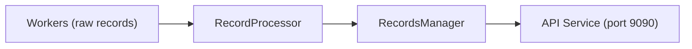

In operator mode, results are served by the `results-server` container inside the operator deployment (port 8081), which reads from the operator PVC. In direct mode (no operator) or when the operator PVC is unavailable, results can be copied from the controller pod's `results-sidecar` or via `kubectl cp`.

The same `results-server` container also hosts every `/api/v1/*` router for the operator (jobs, sweeps, results, config, admin, analytics, dashboard_proxy) — there is no separate FastAPI app in the operator container, which only runs kopf (`/healthz` on port 8080 and the Prometheus `/metrics` endpoint on port 9090). The sweep-controller's empty-summary fallback (`K8sChildJobExecutor._fetch_summary_from_operator`) targets this container too via `AIPERF_OPERATOR_BASE_URL` (default `http://aiperf-operator.aiperf-system:8081`); it does not point at the operator container's port 8080.

### Retrieval Methods

```bash
# Operator mode (default): fetch via operator results-server
aiperf kube results {job_id}

# Direct mode / fallback: copy from the controller pod
aiperf kube results {job_id} --from-pods
kubectl cp <controller-pod>:/results ./results -n <namespace>
```

## Results layout and history

Each AIPerfJob submission lands in its own artifact directory keyed by the CR's
**creationTimestamp epoch** (seconds since 1970). Re-creating a CR with the
same name never overwrites prior results.

On-disk shape under the operator's results PVC (`AIPERF_RESULTS_DIR`, default
`/data`):

```text
<base>/<namespace>/<name>/
  <epoch-A>/   ← run A artifacts
  <epoch-B>/   ← run B artifacts
  latest.txt   ← pointer to the epoch of the most recent successful run
```

The pointer file is written atomically (staged write + `os.replace`) at the
single success gate in `handlers/completion.py`, alongside `status.resultsPath`
and `status.runEpoch`. A retention pass (env `AIPERF_RESULTS_RETAIN_RUNS`,
default 10) trims older run dirs on every successful completion; the just-written
epoch is always protected from deletion.

### HTTP API

Every route that reaches a concrete result artifact requires an explicit run
epoch and returns `409 Conflict` if it is omitted. Callers must use the
`/runs/<epoch>` form; there is no implicit "latest run" fallback
(`_require_epoch_for_results` raises `HTTPException(409)` in
`src/aiperf/operator/routers/results_files.py`). Pure discovery routes stay
epoch-free, because they exist to tell a caller which epochs there are.

| Route | Behavior |
|---|---|
| `GET /api/v1/results` | List every namespace/job that has stored results |
| `GET /api/v1/results/<ns>/<name>/runs` | Run history for one job, newest first |
| `GET /api/v1/results/<ns>/<name>` | **409** — epoch required |
| `GET /api/v1/results/<ns>/<name>.zip` | **409** — epoch required |
| `GET /api/v1/results/<ns>/<name>/<filename>` | **409** — epoch required |
| `GET /api/v1/results/<ns>/<name>/runs/<epoch>` | List files from the pinned run |
| `GET /api/v1/results/<ns>/<name>/runs/<epoch>.zip` | Zip bundle of the pinned run |
| `GET /api/v1/results/<ns>/<name>/runs/<epoch>/<filename>` | Download one file from the pinned run |

`<epoch>` is validated against `EPOCH_RE` (`\A\d{9,10}(\d{6})?\Z`, in `src/aiperf/common/results_markers.py`) before any disk access, and a non-matching value is rejected with `422` — epoch-seconds, optionally carrying the single six-digit microsecond/uid suffix `epoch_key_from_body` appends.

### Edge cases

- **Rapid delete + resubmit within the same wall-clock second** does not collide:
  `epoch_key_from_body` appends a deterministic six-digit suffix derived from the
  CR's immutable `metadata.uid` (or the real microseconds, for a fractional
  `creationTimestamp`), so the two submissions land in distinct directories.
  A body with no uid falls back to bare epoch-seconds, matching the legacy
  `EPOCH=$(date +%s)` semantics.
- **A delayed older completion never rolls the pointer backward.**
  `write_latest` reads the current pointer first and no-ops when it already
  names a wall-clock-newer epoch. The comparison is on the leading
  whole-seconds component (`_epoch_wall_seconds`), not the full suffixed key,
  because the uid and microsecond suffix spaces overlap.
- **`latest.txt` points at a missing directory** (corruption, manual delete):
  default-route requests return 404 until the next successful completion
  rewrites the pointer. Historical routes still work.
- **A `creationTimestamp` that cannot produce a storable epoch is rejected at
  admission.** `epoch_key_from_body` is arithmetic on `creationTimestamp`, so a
  pre-1970 value yields a negative, `EPOCH_RE`-failing key
  (`1969-04-25T18:22:03Z` -> `-21620277`). Because the epoch is a directory
  name, an unstorable key would desync the two halves of the sweep harvest: the
  sweep-controller pod writes to the epoch it receives verbatim in
  `AIPERF_SWEEP_EPOCH`, while the operator reads
  `<base>/<ns>/sweeps/<name>/<status.runEpoch>/`. `handlers/sweep/create.
  _reject_unstorable_epoch` therefore gates the create handler on the same
  `EPOCH_RE` every downstream directory scan and API route uses, and raises
  `kopf.PermanentError` before RBAC or the JobSet is created. It is permanent
  rather than temporary because `creationTimestamp` is immutable — recreate the
  CR. The rejection lands on `status` (phase `Failed`, `ConfigValid=True`,
  `Failed` reason `SweepRejected`) plus a `Warning` event, so it is visible to
  `kubectl get`/`describe` and not only in operator logs.

### Runs/sweep index writes

The operator maintains a SQLite index at `<RESULTS.DIR>/.aiperf_index.sqlite` that mirrors disk state for fast queries. Writes happen at fixed handler points:

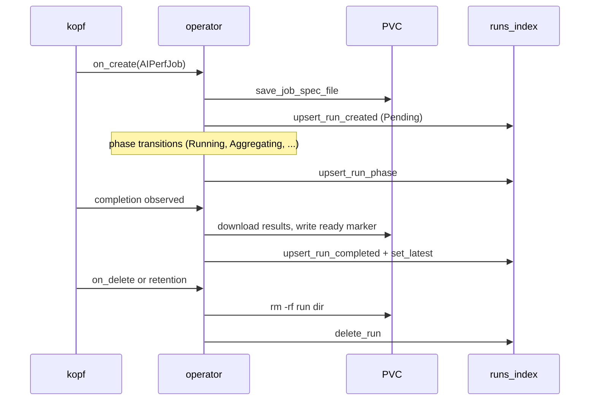

Read sites (`results_layout.list_runs_async`, `results_db.ResultsDB`, `routers/results_files.py`) consult the index first and fall back to disk only when a row is missing, firing a lazy backfill in the background.

CR deletion wins every race with completion. The delete handler first records a
sticky cancellation event. The result harvester waits on that event alongside
metrics requests, primary and sidecar downloads, and retry backoff, so deletion
interrupts long I/O instead of waiting for its timeout. Metrics and completed
downloads from earlier boundaries remain available for recovery, but completion
does not publish terminal status or a latest pointer after cancellation.
Completion also rechecks cancellation after retention and every index await. If
cancellation lands while an upsert is in flight, the completion writer deletes
that exact epoch after the upsert returns; it cannot recreate an orphan row after
delete cleanup has already passed. Set cancellation flags are never evicted to
satisfy the progress-client cache bound, including when a large sweep deletes
thousands of children concurrently.

## 8. Completion & Cleanup

### Lifecycle

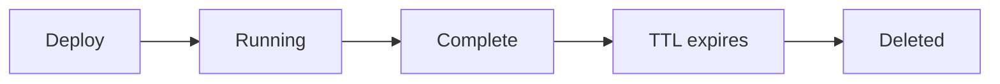

### Pending pod reconciliation

The Pod watch classifies each changed Pod body directly and records the
highest-priority startup blocker in `status.startupIssue` without listing the
JobSet's Pods. A healthy update for the same Pod clears the blocker. The
fingerprint and `firstObservedTime` make the grace period survive operator
restarts. The same diagnostic is exposed through `WorkersReady=False`, and a
Kubernetes warning event is emitted after
`AIPERF_K8S_WATCHDOG_PENDING_THRESHOLD_SECONDS`.

A bounded deadline handler re-evaluates only an already-cached
`status.startupIssue`; it does not list Pods or run the broad recovery engine.
This lets an unchanged blocker reach its warning or failure threshold even
when the controller heartbeat remains healthy and no further Pod event occurs.
Before deleting the JobSet it re-reads and validates the exact parent UID,
resource version, non-terminal phase, cancellation state, and blocker
fingerprint. It revalidates again after deletion and commits through an atomic
UID/resource-version/phase/full-startup-issue JSON fence, so a concurrent
recovery or terminal transition remains authoritative.

Image pull, container configuration, repeated crash-loop, and structural
scheduling failures may transition the AIPerfJob to `Failed` only after the
blocker remains unchanged for
`AIPERF_K8S_WATCHDOG_PENDING_CRITICAL_THRESHOLD_SECONDS`. Capacity shortages,
pending PVC binding, unknown scheduler reasons, and Kueue suspension remain
retryable: they are visible in status but do not auto-fail when the job timeout
is disabled. The operator checks both regular and init-container statuses and
`PodScheduled=False` conditions, using its shared `k8s_client` context.

### Lifecycle surface: `status.subPhase`

The controller pushes `status.subPhase` from its `SystemState`
(`src/aiperf/common/enums/enums.py`) directly to the AIPerfJob at least every
10 seconds, including quiet states with unchanged progress. It is distinct
from `status.phase` (the operator's own view) and `status.currentPhase` (the
per-benchmark stage), and is cleared on terminal transitions.

Focused watches maintain the operator-owned coarse lifecycle while the broad
recovery engine is gated. JobSet `replicatedJobsStatus` changes update worker
counts and `WorkersReady`, promoting Pending or Queued jobs to Initializing
when workers start. Controller `subPhase` transitions promote the job to
Running at profiling or later states. Event-authored status commits re-read the
live parent, reject terminal or cancelled jobs, and JSON-patch-test both the
resource version and expected live phase so a stale JobSet or Pod callback
cannot reverse a concurrent completion or cancellation. Resource-version or
JSON-test conflicts raise a bounded Kopf retry; the retried watch handler
re-reads the parent and rebuilds its status update, so one-shot readiness and
healthy-Pod clears are not lost to controller heartbeat writes. The subphase
watch uses this same direct fence and never writes through an ordinary Kopf
merge patch.

`status.currentPhase` preserves the user-provided phase name, such as
`cache_prime` or `steady_state_profile`; it is not restricted to the legacy
`warmup` and `profiling` names. Each `status.phases.<name>` entry includes
`phaseName`, the closed semantic `phaseKind` (`warmup` or `profiling`),
`phaseIndex`, and `profilingIndex`. The operator uses `phaseKind` for lifecycle
behavior: warmup-kind phases remain in Initializing, while a profiling-kind
phase promotes the job to Running and gates completion regardless of its name.
For stable `kubectl get` columns, the operator also projects the latest
profiling-kind phase's counters to top-level `status.requestsCompleted`,
`status.requestsTotal`, and `status.requestsPerSecond`; printer columns never
assume a phase is literally named `profiling`.

The controller-side `ProgressRouter` mirrors progress annotations to both the
JobSet and AIPerfJob and patches the AIPerfJob status. It also refreshes
the UID-fenced `aiperf.nvidia.com/controller-heartbeat` annotation on every
push.

`status.currentPhase` is written by that same push
(`_push_aiperfjob_status` in `src/aiperf/api/routers/progress.py`): it names the
most recently started phase, mirroring `JobProgress.current_phase`, and prefers
phases with an explicit identity over legacy aggregate entries. The written
value is always a key of the `status.phases` map it is pushed with — a phase
that has started but not yet sent a request is normally omitted from that map,
so the push emits a zeroed entry for it rather than naming a missing key.
Consumers such as `_requests_progress_percent` silently fall back to
alphabetized iteration (which resolves to warmup's 100%) on a miss, so an
unresolvable pointer is worse than omitting the key entirely.

The status push is fenced against terminal transitions. kopf clears
`currentPhase` and `subPhase` when it stamps a terminal phase
(`StatusBuilder.set_phase`), and a push that passed the UID fence just before
that could otherwise resurrect both keys. When the CR already carries a
`status.phase`, the push therefore goes out as `application/json-patch+json`
with a leading `test` op on `/status/phase`, so the apiserver rather than
wall-clock ordering settles the race. A rejection whose body identifies the
failed `test` op is logged at debug and dropped — that is the fence working;
any other rejection is logged at warning with the response body and re-raised,
so a CRD schema violation in the payload cannot masquerade as a lost race and
silently stop status updates. A push observing an already-terminal phase is
skipped outright, payload and all, rather than being trimmed to the non-racy
keys, so it can never overwrite the completion handler's final `summary`. Only a
CR with no `status.phase` at all still uses the plain merge patch — there is no
terminal value to race against yet, and a `test` op on an absent path would
fail with 422.

`status.serverMetrics` rides on the same push. It is the dashboard's
non-WebSocket fallback: `job-detail.js` prefers the live per-job socket's
`serverSummary` and falls back to the CR value when the socket is down, which is
a common port-forward failure mode. The status subresource has a 1.5 MB
apiserver object ceiling that neither the WebSocket frame nor the in-memory REST
cache has, so the CR carries a **curated subset**, not the full export.
`project_server_metrics_for_cr`
(`src/aiperf/kubernetes/server_metrics_projection.py`) emits an explicit
allow-list of the ~20 metric names that
`src/aiperf/operator/ui/components/server-metrics/helpers.js` (`backendMetric`)
actually renders, and per series only its `endpoint_url`, `labels`, and the
`avg`/`max`/`rate`/`p99_estimate`/`count` stats — never raw samples, buckets, or
timeslices. It is an allow-list rather than a full copy minus excludes so it
cannot silently regrow as new server metrics are added; adding a metric to
`backendMetric` requires adding it to `CURATED_METRIC_NAMES` too.

Three limits bound the write. `AIPERF_SERVER_METRICS_CR_PROJECTION_MAX_SERIES`
and `AIPERF_SERVER_METRICS_CR_PROJECTION_MAX_LABELS` are cardinality sanity
bounds; overflow drops the offending metric **whole**, with a debug log. Nothing
is truncated — labels are the series identity, and a trimmed series list or label
set would decode as a valid-but-wrong aggregate rather than as missing data.
`MAX_SERIES` is counted per metric across all endpoints, so it must clear the
worker or GPU count of the largest deployment: a per-worker metric such as
`dynamo_component_kvstats_gpu_cache_usage_percent` otherwise vanishes whole and
takes its dashboard tile with it.

`AIPERF_SERVER_METRICS_CR_PROJECTION_MAX_BYTES` is the authoritative backstop,
because the cardinality caps bound how *many* labels a series carries but not
how long each label string is. An over-budget projection carries no metrics.
This matters more than it looks: exceeding the apiserver's 1.5 MB object ceiling
rejects the whole status patch, `_write_status_patch` re-raises, and
`_patch_aiperfjob_status` swallows it at debug — so every other status update
(`phases`, `liveMetrics`, `resultsExported`, `controllerFailure`) stops silently
too. The projected value is also `scrub_non_finite`-cleaned, because a single NaN
gauge is an invalid JSON number that would reject the same patch the same way.

Note how the two limits interact before raising either. `MAX_SERIES` is only the
per-metric bound; the *total* is what `MAX_BYTES` sees. With all 20 allow-listed
metrics present, the byte budget binds at roughly 85 series per metric — well
below the 256 default — so on an all-20-metric or many-endpoint deployment
`MAX_BYTES` is the limit that actually fires. Raising `MAX_SERIES` past that
point does not buy more data; it hands control to `MAX_BYTES`, whose overflow
costs the **whole** panel rather than one metric. Raise `MAX_BYTES` alongside it,
or accept the per-metric drop.

Overflow does **not** omit the key. Omitting it would leave whatever snapshot
last fit sitting in the CR indefinitely — stale values indistinguishable from
live ones, which is the failure the snapshot semantic exists to prevent, and one
the panel cannot self-diagnose (`SummaryStrip` renders only a duration, never an
absolute `end_time`, so a frozen scrape window looks live). Instead the overflow
writes `{summary, metrics: {}, projection_dropped: true, projection_message}`,
which replaces the stale value, and `ServerMetricsSection` renders that flag as
an explicit "collected but too large to carry" card rather than the "no server
metrics collected" empty state — an operator who loses the panel should not go
debug their exporter. It is logged at warning, not debug. `summary` is kept only
if the marker itself fits, since endpoint URLs are unbounded too.

`status.serverMetrics` is a **snapshot** of the latest scrape, not an
accumulation. The push's JSON-patch path normally pre-resolves each key through
`_merge_patch_value` (RFC 7386) so a fenced write stays equivalent to the merge
patch it stands in for, but that recursively unions dicts — and this key is a
map of metric name to dict-valued stats, so a metric that stops being projected
would linger indefinitely with stale values indistinguishable from live ones.
The caps are a disappearance generator by design, so `serverMetrics` is listed in
`_SNAPSHOT_STATUS_KEYS` and emitted unresolved, letting the `add` op replace the
member outright.

Two consequences worth knowing. The CR fallback's per-endpoint details table
lists fewer source-metric rows than `server_metrics_export.json` does. And a
backend chip lights only when at least one of that backend's exposed metrics is
in the allow-list: `detectBackends` scans metric names on whatever payload it is
given, so any backend whose metrics do not intersect `CURATED_METRIC_NAMES` loses
its chip on the CR path. KVBM is the guaranteed case — `detectBackends` keys it
off a `kvbm_*` prefix and no `kvbm_*` metric appears in `backendMetric` — but it
is a class of gap, not a single instance. The live WebSocket path and the final
`server_metrics_export.json` are unaffected and keep the full payload.

### Ownership of `status.workers`

`status.workers` is the **controller's** field, not the operator's. The push
folds the controller's per-pod state cache through
`build_aggregate_worker_status`
(`src/aiperf/controller/system_controller_models.py`) and writes all nine
camelCase keys — `ready`, `total`, `dispatchable`, `routerConnected`,
`readyRecordProcessors`, `declaredRecordProcessors`, `readyPods`, `totalPods`,
`degradedPods`. The CRD object declares exactly those nine and carries no
`x-kubernetes-preserve-unknown-fields`, so the apiserver prunes any other
spelling; `_build_workers_payload` translates through the operator's
`WORKER_AGGREGATE_STATUS_CRD_KEYS` alias map so both writers agree on one.

`workers` is listed in `_SNAPSHOT_STATUS_KEYS` alongside `serverMetrics`: it
mirrors one controller tick rather than accumulating across ticks, so replace
semantics keep the block internally self-consistent and stop it ever holding
this tick's `ready` beside an earlier writer's `total`.

The operator still writes the field in the **bootstrap window**. `create.py`
seeds `{ready: 0, total: <spec workers>}` at admission, and
`_update_worker_counts` (`src/aiperf/operator/handlers/monitor.py`) refreshes a
JobSet-derived estimate — `replicatedJobsStatus[name="workers"].ready` scaled by
`workersPerPod` — until the controller takes over. Both write only `ready` and
`total`, so **the presence of `totalPods` in the live `status.workers` is the
takeover marker**, and the operator's write is gated on its absence
(`_controller_authored_workers`). That marker lives in the CR, so it survives an
operator restart and needs no extra status field. The controller withholds the
key entirely until `totalPods > 0`, which both keeps the bootstrap estimate live
through startup and stops an empty aggregate from overwriting the spec-derived
`total` with 0.

The two writers must never both be live in steady state: the operator counts
ready *pods* scaled by a config constant, the controller counts workers that
actually registered with the credit router. They disagree during rollout and
after partial worker failure, and `status.workers.ready` would flap between them
depending on which patched last. The CRD's own wording settles the tie — the
field is "Controller-authored aggregate worker status" and `ready` is a
"Dispatch-ready worker count", which a scaled ready-pod count is only an upper
bound on.

Because the operator's estimate is only ever the bootstrap value, the accuracy
of the `workersPerPod` derivation still matters: it is what `aiperf kube list`
and the `WorkersReady` condition read before the first controller tick lands.
That derivation must mirror the deployment-side one in
`src/aiperf/kubernetes/jobset.py` (fall back to
`Environment.WORKER.DEFAULT_WORKERS_PER_POD`, reproduce the single-pod collapse
when the total is not divisible) rather than reading the un-normalized CR spec.

The `WorkersReady` condition follows ownership rather than the writer. Once the
controller owns the field, `_set_workers_ready_condition` asserts the condition
from the controller-authored `ready`; before that it uses the JobSet estimate.
Nothing else sets `WorkersReady` true, so it must never be left without a
setter: the completion backfill would otherwise always fire and assert "Job
completed before workers (N) were observed ready" with N > 0.

The operator's recurring watchdog inspects only this cached parent body while
the heartbeat is fresh; broad JobSet, Pod, sidecar, and results recovery
runs only after heartbeat expiry or when an explicit `timeoutSeconds` deadline
is due. A controller service error is pushed as `status.controllerFailure`
before that controller exits; the operator fences and terminalizes the exact
parent as Failed, and never lets a later sidecar artifact salvage reinterpret
that explicit failure as a successful completion.

One transition is easy to misread: `SystemState.PROCESSING` is set when the
SystemController handles `CreditsCompleteMessage` — that is, when request
*dispatch* finishes and only record aggregation remains. It is **not** set at
profile completion; the whole aggregation phase happens while `subPhase` reads
`processing`.

For the same reason, the job-timeout drain guard in `_check_job_timeout` keys off
`status.resultsExported` — pushed by the controller only once every exporter has
flushed — and never off `status.currentPhase`. `currentPhase` is a pointer into
`status.phases` and carries user-supplied phase names, so a benchmark phase named
`processing` would otherwise bypass the timeout. A timed-out run is deferred to
the completion handler only when the completion claim is already held or
`resultsExported` is true; a run whose aggregation or export hangs still fails on
the deadline.

### Completion Signals

- Controller receives `ALL_RECORDS_RECEIVED` message
- Results available via API service
- Services shut down cleanly

For `exportLevel: raw`, result publication has an additional acknowledged
barrier before shutdown. While ZMQ and the group-local lifecycle channels are
still live, `SystemController` sends `FINALIZE_ARTIFACTS` to the exact set of
registered `WorkerGroupManager` service IDs. Each manager requires its exact
declared record-processor set to flush successfully, stops those processors,
waits for their exact shutdown notices, and uploads every materialized RAW
JSONL file. The controller API stages each upload under a temporary name,
fsyncs it, and atomically renames it before returning the size acknowledgement.
Only then does the manager acknowledge the controller command.

A rejected RAW row, timeout, flush error, HTTP failure, or size mismatch fails
the barrier: the controller withholds both the results-ready marker and
`ResultsExportedMessage`, so an incomplete RAW result set cannot be advertised
as authoritative. Missing worker-group managers are judged against the same
pod-loss tolerance the rest of the run uses
(`_raw_finalize_membership_is_acceptable` vs.
`AIPERF_POD_FAILURE_ABORT_THRESHOLD_PERCENT`): inside the threshold the barrier
proceeds against the managers that are still registered and records a
`DegradedRawArtifactSet` exit error, so the run keeps its results but exits
non-zero; outside the threshold — or with no manager left to ask — it fails
closed as above. Empty processors are valid and may produce no file; completion
is proven by service acknowledgements rather than filename counts or file-size
stability polling.

The controller performs final export before broadcasting service shutdown or
stopping its message bus. After the durable marker commits, the still-running
API service can therefore receive `ResultsExportedMessage`; the marker remains
the authoritative recovery signal if that live notification is lost.

### Cleanup Options

```bash
# Automatic (TTL-based)
ttlSecondsAfterFinished: 300  # Pods auto-delete after 5 minutes

# Manual cleanup (operator mode): delete the AIPerfJob CR
kubectl delete aiperfjob <name> -n <namespace>

# Manual cleanup (direct mode): delete the JobSet
kubectl delete jobset <name> -n <namespace>
```

## 9. Configuration

### CLI Options

```bash
aiperf kube profile \
  --image myregistry.io/aiperf:latest \
  --namespace benchmarks \
  --total-workers 10 \
  --ttl-seconds 300 \
  --kubeconfig ~/.kube/prod-config \
  --node-selector '{"nvidia.com/gpu": "A100"}' \
  --tolerations '[{"key":"nvidia.com/gpu","operator":"Exists"}]' \
  --image-pull-secrets registry-creds \
  --env-from-secrets.OPENAI_API_KEY llm-api-key/api-key
```

`--env-from-secrets` is a mapping flag. All three spellings are equivalent:
dot-notation (`--env-from-secrets.KEY value`), `KEY=VALUE`
(`--env-from-secrets KEY=value`), and a JSON object
(`--env-from-secrets '{"KEY": "value"}'`). The same applies to `--annotations`,
`--labels`, and `--env-vars`.

Only dot-notation is native to cyclopts. A bare token on a mapping-typed field
reaches `Argument._json` with an empty `keys` tuple and raises
`IndexError: tuple index out of range` — an upstream defect present in both
cyclopts 4.23.2 and 5.0.0b1. `normalize_mapping_flag_tokens`
(`src/aiperf/cli_commands/kube/_mapping_flags.py`) is registered as the `kube`
app's cyclopts `config` callable, which runs after token parsing and before
conversion. It re-keys bare `KEY=VALUE` and JSON-object tokens into the keyed
tokens cyclopts expects, and raises a usage error naming every accepted
spelling for anything else. Adding a new mapping-typed CLI field anywhere under
`aiperf kube` is covered automatically; pair it with `n_tokens=-1` so repeating
the flag accumulates entries instead of raising `RepeatArgumentError`.

Sensitive endpoint fields never rely on the ConfigMap copy. JSON
serialization redacts them, and `aiperf service --benchmark-run` restores them
from the Secret-backed `AIPERF_INJECTED_API_KEY`/`OPENAI_API_KEY`,
`AIPERF_INJECTED_HEADERS`, and `AIPERF_INJECTED_ENDPOINT_URLS` environment
variables. Generation and operator reconciliation fail closed when the
corresponding `valueFrom.secretKeyRef` mapping is absent.
`aiperf service` requires `--benchmark-run` and never resolves per-container
benchmark flags.

Anything the pre-bootstrap resolver chain would normally produce must therefore
either travel inside the serialized run or be rendered from it.
`artifacts.user_files` works this way: the declared entries ride along in
`run_config.json`, and `aiperf.kubernetes.user_files.materialize_serialized_run_user_files`
renders them once, in the `system_controller` container, before the benchmark
starts. Because the pod's `artifacts.dir` is the fixed `/results` mount and
carries neither the run epoch nor the AIPerfJob name, `handlers/create.py`
freezes a `RunMeta` (epoch key, job name, namespace) into the serialized run for
the template context; locally that field stays `None` and `ArtifactDirResolver`
derives it from the resolved artifact dir. See
[`docs/kubernetes/user-files.md`](../kubernetes/user-files.md).

### Environment Variables

Resource limits configured via `src/aiperf/kubernetes/environment.py`:

| Variable | Default | Description |
|----------|---------|-------------|
| `AIPERF_K8S_SYSTEM_CONTROLLER_CPU` | 75m | System controller container CPU (request and limit) |
| `AIPERF_K8S_DATASET_MANAGER_MEMORY` | 256Mi | Dataset manager container memory (request and limit) |
| `AIPERF_K8S_WORKER_POD_CPU` | 150m | Worker pod CPU (request and limit) |
| `AIPERF_K8S_WORKER_POD_MEMORY` | 4Gi | Worker pod memory (request and limit) |
| `AIPERF_K8S_PORT_API_SERVICE` | 9090 | API service port |
| `AIPERF_K8S_JOBSET_TTL_SECONDS_AFTER_FINISHED` | 300 | TTL after completion |

### AIPerfSweep handlers

The kopf operator registers sweep-lifecycle handlers in `src/aiperf/operator/main.py`. Seven registrations are on the parent `AIPerfSweep` CRD; one more watches child `AIPerfJob`s to roll their status up into the parent:

- `@kopf.on.create AIPerfSweep` (handler in `handlers/sweep/create.py`) — validates the workload through the canonical Config-v2 mapping loader and `AIPerfSweepSpec`, computes `totalVariations`/`maxTotalRuns`, sets `status.runEpoch` to a collision-safe decimal key derived from `metadata.creationTimestamp` and immutable `metadata.uid` (rejecting the CR outright if that key is not `EPOCH_RE`-storable — see "Edge cases" above), provisions a namespace-scoped ServiceAccount/Role/RoleBinding for the sweep-controller pod, and creates a single-replica JobSet that runs `python -m aiperf.sweep_controller.main`. The sweep-controller pod's two containers honour `spec.resourceMode`, including its unset `burstable` default; the resolved value is read off the validated `AIPerfSweepSpec` rather than the handler's `exclude_unset=True` dump, which omits unset fields.
- `@kopf.on.update AIPerfSweep field=spec.cancel` (handler in `handlers/sweep/lifecycle.py`) — mirrors the cancel signal into `status.conditions[Cancelling]` and advances `status.observedGeneration`, including terminal/no-op updates, so GitOps clients can distinguish an acknowledged spec change. The sweep-controller pod observes `spec.cancel` directly via its own poll and propagates it to the current child.
- `@kopf.on.update AIPerfSweep field=spec.ttlSecondsAfterFinished` — acknowledges the other mutable parent control immediately. The reaper timer reads the latest TTL; create-time execution fields are immutable after admission.
- `@kopf.on.field AIPerfSweep field=status.aggregation.phase new=Complete` plus `@kopf.on.resume` — triggers `handlers/sweep/_aggregate_fetch.fetch_sweep_aggregate_to_disk` to pull the cross-variation aggregate off the sweep-controller's `emptyDir` results-sidecar before the JobSet is reaped, and resumes an interrupted harvest after an operator restart. The fetch reports `(downloaded, listed)` counts; a partial harvest (`downloaded < listed`) or a missing/unparsable `aggregate.json` raises `kopf.TemporaryError` so the JobSet — and with it the only other copy of the artifacts — stays alive for re-harvest. During commit, the operator materializes every child `sweep.json` backlink on its PVC from the canonical `children.json` manifest before status publication. Delayed callbacks carry the parent CR's immutable UID, verify the live parent and exact JobSet owner API version/kind/name/UID with `controller: true`, and publish status with a JSON Patch UID test before advancing `latest.txt` or the runs index. Only a full harvest with a parseable `aggregate.json` and durable child lineage on the PVC publishes the operator-backed `aggregateRef`, flips `resultsAvailable` to true, and deletes that exact JobSet with its resource UID as a delete precondition. A same-name replacement makes the old callback a no-op; transient reads and status-validation failures against the current owner retry.
- `@kopf.on.delete AIPerfSweep` — cooperatively cancels only AIPerfJobs whose exact owner kind/name/UID matches the deleting sweep; sweep labels narrow discovery but never establish ownership. Kubernetes owner-reference GC tears down the sweep-controller JobSet and RBAC.
- `@kopf.timer` `cleanup_old_sweeps` — TTL reaper for terminal `AIPerfSweep`s, evaluated at the operator monitor cadence rather than the daily result-retention cadence. A completed aggregate is not eligible until the operator-backed result reference is published, so even `ttlSecondsAfterFinished: 0` cannot delete the only `emptyDir` copy during harvest. Parent deletion uses the timer body's immutable UID as a Kubernetes delete precondition, so a stale timer cannot reap a same-name replacement.
- `@kopf.on.field AIPerfJob field=status.phase` (handler in `handlers/sweep/child_rollup.py`) — this one is on **child AIPerfJobs**, not the AIPerfSweep CRD: for AIPerfJob children whose `ownerReferences` include an `AIPerfSweep`, it recomputes the parent's `runStates`/`currentChildRef`/`lastChildEvent`. The rollup step is a no-op for a standalone AIPerfJob, but the same registration always also mirrors the new phase into the runs index (`handlers/lifecycle.record_phase_transition`).

Sweep **result** retention is process-level rather than a CR timer. After the
runs-index bootstrap and once per day, the operator scans durable sweep epoch
directories, reads `aggregate.json.specSnapshot.resultsTtlDays` (falling back
to `AIPERF_RESULTS_TTL_DAYS` for legacy archives), removes expired archives
and SQLite rows, and reconciles `latest.txt`. This continues after the parent
CR's default 300-second lifecycle TTL has elapsed; bootstrap reverse-pruning
repairs an index delete interrupted by an operator crash.

The AIPerfJob CRD likewise permits only runtime-control edits after creation:
`spec.cancel` and `spec.timeoutSeconds`. Their dedicated field handlers advance
`status.observedGeneration` only after the edit is consumed successfully; a
failed JobSet deletion leaves a cancel edit unacknowledged for kopf to retry.

### Sweep plan convergence

Kubernetes and local sweeps use the same Config-v2 planning path. The kube CLI
keeps the post-environment, pre-Jinja template leaves in the submitted CR. The
operator and sweep-controller validate a rendered copy through
`load_config_from_mapping`, while retaining that raw envelope so each variation
can render its own values. The sweep-controller then calls
`build_benchmark_plan` from `build_plan_from_sweep`
(`src/aiperf/sweep_controller/plan_builder.py`), whose only plan adaptations are
attaching the Kubernetes-only `failurePolicy` and, for an unseeded stochastic
sweep (Sobol, Latin hypercube, adaptive search), deriving a seed from the CR's
immutable `metadata.uid` so variations stay stable across sweep-controller pod
restarts. Adaptive sweeps instantiate their planner through the shared
`build_search_planner` factory, and
`K8sChildJobExecutor` supplies the cluster execution backend behind the same
`RunExecutor` protocol used by local sweeps.

## CRD Generator

Both CRDs (`aiperfjobs.aiperf.nvidia.com`, `aiperfsweeps.aiperf.nvidia.com`)
are auto-generated by `tools/generate_crd.py` from the `AIPerfJobSpec` and
`AIPerfSweepSpec` Pydantic models (`src/aiperf/kubernetes/crd_models.py`).
Both inherit `AIPerfWorkloadSpec`, which composes the complete `AIPerfConfig`
envelope (`benchmark`, `sweep`, `multiRun`, `variables`, and related fields)
with the Kubernetes deployment surface. **Never edit the rendered YAML in
`deploy/helm/aiperf-operator/templates/crd*.yaml` directly** — the next
regeneration overwrites it.

### Generator pipeline

1. **JSON Schema walk** (`_convert_schema`) — recursively converts the
   Pydantic-emitted JSON Schema into K8s-compatible OpenAPI v3, resolving
   `$ref`, collapsing `anyOf`-with-null into nullables, and falling back to
   `x-kubernetes-preserve-unknown-fields: true` at narrow shorthand
   boundaries (`models`, `endpoint.urls`, top-level
   `model`/`dataset`/`warmup`/`profiling`, `sweep`).
2. **Type-on-marker pass** (`_ensure_type_on_preserve_unknown`) — defaults
   `type: object` on every node carrying `x-kubernetes-preserve-unknown-fields:
   true`. K8s structural-schema validation rejects the marker without a
   declared type, AND CEL field access compiles only on typed nodes.
3. **Shape-detector decorators** (`_decorate_*_node`) — each helper detects
   its target node by a unique fingerprint of property keys (e.g. an
   endpoint node has `urls` + `apiKey` + `connectionReuse`; a runtime node
   has `apiPort` + `apiHost` + `workersPerPod`). The walker
   (`_walk_dict_apply`) calls every decorator on every dict node, so the
   same set of CEL rules fires on both AIPerfJob's `spec.benchmark` and
   AIPerfSweep's `spec.benchmark` from a single pass.
4. **Kind-specific attachment** — after the walker runs, each builder attaches
   its own rules to the top-level spec node: `has(self.sweep)` makes the sweep
   block required in `_build_aiperfsweep_crd_from_schema`, and the inverse
   `!has(self.sweep)` fires on AIPerfJob. `_tighten_sweep_schema` reaches into
   the `sweep` property directly to pin its `type` enum and `parameters` shape.
   Both builders then call `_apply_workload_spec_immutability`, which emits a
   presence-safe `has(oldSelf.X) == has(self.X) && (!has(self.X) || oldSelf.X ==
   self.X)` transition rule for *every* top-level spec field except that kind's
   mutable set — `{cancel, timeoutSeconds}` for AIPerfJob and
   `{cancel, ttlSecondsAfterFinished}` for AIPerfSweep. The old Tier-1D rule that
   forbade `sweep`/`multi_run` inside the per-child benchmark was removed —
   `AIPerfJobSpec.benchmark` is typed as `BenchmarkConfig` (no such fields), so
   the generated structural schema enforces it at the apiserver without CEL.

### Adding a CEL rule

The user-facing catalog of every rule lives in
[`docs/kubernetes/crd-validation.md`](../kubernetes/crd-validation.md). To
add a new one:

1. Identify the **shape** the rule applies to (benchmark, endpoint,
   runtime, multiRun) and pick the matching `_decorate_*_node`
   helper. If your target is a brand new shape, write a new shape detector
   modelled on the existing ones.
2. Append a `{"rule": ..., "message": ...}` entry to that helper's
   `_add_validation_rules(...)` call. Tag the rule with the tier label
   (1A/1B/.../4O) in a comment so future-you can grep back to the
   brainstorm in `docs/kubernetes/crd-validation.md`.
3. Add a structural assertion in
   `tests/unit/operator/test_aiperfsweep_crd_generation.py` (the existing
   tests follow a "rule string is in `rules` set" pattern).
4. Regenerate with `uv run python tools/generate_crd.py` and confirm
   idempotency with `tools/generate_crd.py --check`.
5. Round-trip on a real apiserver (`kind create cluster && kubectl apply
   --dry-run=server -f crd.yaml`). The K8s apiserver compiles CEL at
   CRD-install time and rejects rules that reference undeclared fields
   (`undefined field 'X'`) or opaque preserve-unknown items.

CEL constraints worth remembering:

- `has(self.X)` requires X to be declared in the schema. Anything hidden
  inside a `x-kubernetes-preserve-unknown-fields: true` blob is invisible.
- Array items emitted as opaque preserve-unknown blobs cannot be
  dereferenced. Heterogeneous Pydantic discriminated unions
  (`phases[]`, `datasets[]`) end up opaque, so item-internal invariants
  (phase-name uniqueness, phase→dataset compatibility, "seamless not
  on first") stay enforced by the shared `@model_validator` decorators in
  `src/aiperf/config/config.py`, which the operator re-runs when it validates
  the spec, rather than at the apiserver.
- `oldSelf` is only available in transition rules and triggers on
  `kubectl edit` / `kubectl patch`. Kubernetes does not evaluate a
  *field-scoped* transition rule when an optional field is added or removed, so
  immutability rules go on the parent spec node in the
  `has(oldSelf.X) == has(self.X) && (!has(self.X) || oldSelf.X == self.X)` form
  (`_immutable_spec_field_rule`). The `has` parity is what rejects
  first-set-after-create and removal as well as value changes.

## Fail-Closed Semantics Are Kubernetes-Only

Kubernetes needs strictness that a local `aiperf profile` run does not. A pod
that dies silently must surface, and a nonzero exit is how the operator marks
the CR failed. The same semantics applied to a local run turn correct, complete
benchmarks into failures, so each one is gated on an explicit runtime
predicate:

| Behavior | Kubernetes | Local (`MULTIPROCESSING`) | Gate |
|---|---|---|---|
| Heartbeat-stale service | Reaped and failed — heartbeats are the only liveness signal available | Never reaped while its `multiprocessing.Process` is alive | `BaseServiceManager.get_service_liveness` returns `None` in Kubernetes, the real `Process.is_alive()` locally |
| Stale **optional** service (GPU telemetry, server metrics) | Unregistered with a warning | Unregistered with a warning | `service_type not in required_services` — same on both paths, matching `_reap_dead_processes_during_registration` |
| Advisory `PROCESS_RECORDS_RESULT` errors | Appended to `_exit_errors`, so the run exits 1 | Logged at ERROR only | `SystemController._is_kubernetes()` |
| A record artifact writer that failed to finalize | Raises `ExceptionGroup`, failing the run closed | Logged at ERROR; the healthy writers still finalize | `RecordProcessor._is_group_managed_mode()` |

The local relaxations never weaken the cluster path, and they never degrade
diagnostics: every condition above is still logged, only the verdict changes.
A genuinely crashed local child still reports `is_alive() is False` and is
still reaped, which remains strictly stronger than having no watchdog at all.

## Key Architecture Decisions

| Decision | Rationale |
|----------|-----------|
| **JobSet API** | Orchestrates controller + workers as atomic unit |
| **Dual-bind ZMQ** | IPC for in-pod speed, TCP for cross-pod reach |
| **API-based results** | Retrievable via API service or kubectl cp |
| **Dataset HTTP API** | Avoids shared volume complexity |
| **WebSocket streaming** | Real-time progress to local CLI |
| **Container-per-service** | One container per service; failure isolation and per-container resources |
