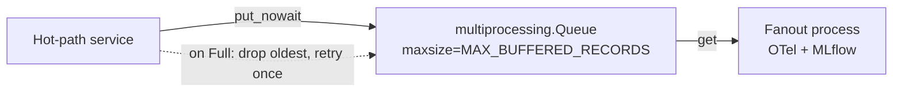

# AIPerf Code Patterns

Code examples for common development tasks. Referenced from CLAUDE.md.

## CLI Command Pattern

Commands live in `src/aiperf/cli_commands/`, one file per command. They are
lazily loaded via import strings in `aiperf.cli` — modules are only imported
when their command is invoked:

```python
# aiperf/cli.py — register with lazy import strings
app.command("aiperf.cli_commands.profile:app", name="profile")
```

```python
# aiperf/cli_commands/profile.py — thin command definition
from cyclopts import App
from aiperf.config.flags import CLIConfig

app = App(name="profile")

@app.default
def profile(*, cli_config: CLIConfig) -> None:
    """Run the Profile subcommand."""
    from aiperf.cli_utils import exit_on_error
    from aiperf.config.loader.errors import ConfigurationError

    with exit_on_error(title="Error Running AIPerf System", show_traceback=False):
        from aiperf.config.flags.resolver import resolve_config
        from aiperf.config.loader import build_benchmark_plan

        config = resolve_config(cli_config, cli_config.config_file)
        plan = build_benchmark_plan(config)

    with exit_on_error(
        title="Error Running AIPerf System",
        quiet_for=(ConfigurationError,),
    ):
        from aiperf.cli_runner import run_benchmark  # heavy import deferred

        run_benchmark(plan)
```

**Conventions:**
- Export a single `App` named `app`.
- Hyphenate multi-word commands: `App(name="analyze-trace")`.
- Keep module-level imports minimal; heavy deps go inside the function body.
- Heavy implementation logic lives in a `cli.py` inside the owning domain
  package (e.g. `aiperf/plugin/cli.py`), lazily imported at call time.

## Adding a New CLI Flag

CLIConfig is a flat DTO — every CLI flag is a top-level field on
`CLIConfig` with an `Annotated[...]` annotation that carries Pydantic
metadata + the cyclopts CLI binding. **Never add a new nested config
class.** Disambiguate collisions with a section prefix
(e.g. `image_batch_size` vs `audio_batch_size`).

```python
# src/aiperf/config/flags/cli_config.py — add the field in its section block
my_new_flag: Annotated[
    int | None,
    Field(
        ge=1,
        description="One-line user-facing description rendered in --help "
        "and docs/cli-options.md. Mention units, defaults, and obvious "
        "interactions with other flags.",
    ),
    CLIParameter(
        name=("--my-new-flag",),       # CLI flag name (independent of attr name)
        group=Groups.LOAD_GENERATOR,   # cyclopts --help group; pick from list below
    ),
] = None
```

**Pick a `Groups.X` from `src/aiperf/config/cli_parameter.py`:**

`ENDPOINT`, `INPUT`, `FIXED_SCHEDULE`, `GOODPUT`, `OUTPUT`, `HTTP_TRACE`,
`TOKENIZER`, `LOAD_GENERATOR`, `WARMUP`, `USER_CENTRIC`,
`REQUEST_CANCELLATION`, `CONVERSATION_INPUT`, `ISL`, `OSL`, `PROMPT`,
`PREFIX_PROMPT`, `RANKINGS`, `SYNTHESIS`, `AUDIO_INPUT`, `IMAGE_INPUT`,
`VIDEO_INPUT`, `SERVICE`, `SERVER_METRICS`, `GPU_TELEMETRY`, `UI`,
`WORKERS`, `ZMQ_COMMUNICATION`, `ACCURACY`, `MULTI_RUN`.

If none fit, prefer adding a new `Groups.X` constant in
`src/aiperf/config/cli_parameter.py` over reusing an unrelated group.

Then:

1. Add the attr name to the appropriate `<SECTION>_FIELDS` frozenset in
   `src/aiperf/config/flags/_section_fields.py` so the resolver/converter
   can scope `cli.model_fields_set & <SECTION>_FIELDS` queries.
2. If the flag maps to an existing `AIPerfConfig` key, add an entry to that section's
   field map (e.g. `_ENDPOINT_FIELD_MAP` in `_converter_endpoint.py`).
   Otherwise, read it directly in the relevant `_converter_*.py` builder.
3. Add the same explicit-field route to
   `config.flags.resolver.build_cli_overrides` when the flag is valid with
   `--config`. Test CLI-only and YAML-plus-CLI resolution against the same
   affected `AIPerfConfig` subtree; unrelated YAML must remain intact.
4. Run `make generate-cli-docs` to regen `docs/cli-options.md`. Run
   `make generate-env-vars-docs` if you also added a corresponding env var.
5. Add a unit test under `tests/unit/config/` constructing
   `CLIConfig(my_new_flag=...)` and asserting the converter emits the
   right `AIPerfConfig` shape.
6. The disjointedness invariant in
   `tests/unit/config/v1/test_section_fields.py` will catch any
   cross-section name collision automatically.

**CLI flag DTO charter (enforced):**
- No validators on CLIConfig fields. `BeforeValidator(parse_str_or_list)` for
  CLI input coercion is fine; domain validation (range checks across fields,
  cross-field constraints) lives on `AIPerfConfig`, not CLIConfig.
- The CLI-to-envelope converter and config-file resolver are the only modules
  outside `cli_commands/` that may read `CLIConfig` attributes.

### Config-file override envelope invariant

`resolve_config` keeps two Config-v2 dictionaries aligned when combining
`--config` with explicit CLI flags:

- The rendered dictionary is post-environment and post-Jinja; it feeds
  `AIPerfConfig.model_validate`.
- The raw envelope is post-environment but pre-Jinja; it is retained on
  `AIPerfConfig._raw_envelope` so `build_benchmark_plan` can render each
  `sweep.parameters` variation independently.

Every config-file override transformation must run through
`_merge_overrides_into_envelope`, which applies the same deep merge, dataset
filtering, phase targeting, and magic-list promotion to both dictionaries. Do
not mutate only the rendered dictionary: a CLI override of a templated field
would appear correct on the base config and then be replaced by the old Jinja
template during sweep expansion.

### Bool|object nested endpoint fields + flat CLI lowering

Some endpoint features (`reset_kv_cache`, `server_profiler`) are nested on
`EndpointConfig` as `false | true | object` via
`parse_enabled_or_config(ModelCls)` in `aiperf.config.control_hooks`. Nested
YAML stays ergonomic; CLIConfig remains flat.

Pattern:

1. Nested config classes live in `src/aiperf/config/control_hooks.py`
   (`ResetKvCacheConfig`, `ServerProfilerConfig`).
2. `EndpointConfig` fields use
   `Annotated[Model | None, parse_enabled_or_config(Model), Field(...)]`.
3. Flat CLI flags (`--reset-kv-cache`, `--reset-kv-cache-path`, …) live on
   `CLIConfig` and are listed in `ENDPOINT_FIELDS`.
4. `_converter_endpoint.build_endpoint` lowers via helpers such as
   `_maybe_build_reset_kv_cache` / `_maybe_build_server_profiler`: any
   enable flag **or** path/timeout override produces the nested dict
   (`{}` for defaults-only).
5. Runtime prepares absolute control URLs with
   `prepare_endpoint_control_hooks` (unique origins only) and fires them
   from the owning plane (CLI cell for reset; `TimingManager` /
   `PhaseOrchestrator` for profiler) — never from workers. Seamless
   non-final profiling defers profiler stop until drain.

See [Benchmark Control Hooks](../tutorials/benchmark-control-hooks.md).

## Adaptive Scale Implementation Pattern

Adaptive scale is a YAML-only timing strategy configured on the phase it controls. When changing adaptive control variables, SLA semantics, artifacts, or YAML normalization, update [Adaptive Scale](../tutorials/adaptive-scale.md) and keep these invariants intact:

- Exactly one adaptive control variable is active per phase. Supported variables are `concurrency`, `prefill_concurrency`, `request_rate`, and `users`.
- Adaptive scale settings stay attached to the concrete phase they control; do not add CLI-level adaptive overrides unless they include unambiguous phase targeting.
- Canonical YAML stores adaptive SLA filters on phase-level `sla`; any compatibility `adaptive_scale.sla` mirror must stay aligned before YAML lowering.
- Keep adaptive SLA docs aligned with `adaptive_scale_sla.SUPPORTED_METRICS_MESSAGE`; do not document a controller SLA metric until the runtime supports it.
- TTFT adaptive SLA requires `FirstToken` observations even when no static `prefill_concurrency` is configured.
- Ratio metrics such as `goodput_ratio` and `success_rate` are ratios rather than throughput values.
- Adaptive artifact fields are orchestration-facing. Renaming schema fields such as `control_variable`, `control_value_before`, `control_value_after`, `boundary_value`, `last_passing_value`, or `first_failing_value` needs migration and backcompat thought.


## Service Pattern

Services run in separate processes via `bootstrap.py`:

```python
class MyService(BaseComponentService):
    @on_message(MessageType.MY_MSG)
    async def _handle(self, msg: MyMsg) -> None:
        await self.publish(ResponseMsg(data=msg.data))
```

Register in `plugins.yaml`:

```yaml
service:
  my_service:
    class: aiperf.my_module.my_service:MyService
    description: My custom service
    metadata:
      required: true
      auto_start: true
```

**Config types:**
- `CLIConfig`: unified CLI input DTO carrying both benchmark params (endpoints, loadgen) and service-runtime knobs (ZMQ ports, logging level)

## Model Pattern

Use `AIPerfBaseModel` for data, `BaseConfig` for configuration:

```python
from pydantic import Field
from aiperf.common.models import AIPerfBaseModel

class Record(AIPerfBaseModel):
    ts_ns: int = Field(description="Timestamp in nanoseconds")
    value: float = Field(description="Measured value")
```

## Message Pattern

Messages require `message_type` field and handler decorator:

```python
from aiperf.common.messages import Message, MessageTypeT
from aiperf.common.hooks import on_message

class MyMsg(Message):
    message_type: MessageTypeT = MessageType.MY_MSG
    data: list[Record] = Field(description="Records to process")

# In service class:
@on_message(MessageType.MY_MSG)
async def _handle(self, msg: MyMsg) -> None:
    await self.publish(OtherMsg(data=msg.data))
```

Auto-subscription happens during `@on_init` phase.

## Control Channel Command Pattern

Commands do **not** ride the pub/sub event bus. They ride a dedicated
DEALER/ROUTER control channel at `CommAddress.CONTROL`: every component service
opens a DEALER (identity = its service ID), and `SystemController` binds the
single ROUTER. The wire format is the `msgspec` tagged-union structs in
`aiperf.common.control_structs`, not Pydantic `Message` subclasses. The same
channel also carries registration (`Registration` / `RegistrationAck`),
`Heartbeat`, and `StatusUpdate`.

Every other message type still goes over the event bus with `publish()` /
`@on_message`.

### Request/response structs

| Struct | Meaning |
|---|---|
| `Command{cid, cmd, payload}` | The request. `cid` correlates the response; `payload` is `orjson`-encoded bytes (`b""` when the command carries no data). |
| `CommandAck{cid, cmd, sid}` | Handler ran and returned `None`. |
| `CommandOk{cid, cmd, sid, payload}` | Handler returned a value, serialized into `payload`. |
| `CommandErr{cid, cmd, sid, error, traceback}` | Handler raised. |
| `CommandUnhandled{cid, cmd, sid}` | No `@on_command` hook matched. |

`CommandUnhandled` is deliberately not an ack: "no handler" is a *failure* to
callers that need the work done. `SystemController._finalize_artifact_response_error`
treats it as one. Do not assume an unhandled command is harmless.

### Adding a new command

1. Add the value to `CommandType` in `common/enums/enums.py`.
2. Add a handler on the receiving service. It takes a single `Command`:

```python
from aiperf.common.control_structs import Command
from aiperf.common.hooks import on_command

@on_command(CommandType.MY_COMMAND)
async def _on_my_command(self, message: Command) -> None:
    # Decode the payload only if the command carries data.
    opts = orjson.loads(message.payload) if message.payload else {}
    await self._do_the_thing(opts.get("mode"))
```

Returning `None` makes the dispatcher send `CommandAck`. Returning a value makes
it send `CommandOk` with the value serialized into `payload` (`bytes` pass
through, Pydantic models use `model_dump_json()`, everything else goes through
`orjson.dumps`).

Exactly **one** hook may claim a given `CommandType` per service — the dispatcher
stops at the first match, because the response it sends back is that hook's
result and a second hook would have no way to answer.

### Sending a command

From a service to the controller:

```python
response = await self.send_command_to_controller(
    CommandType.MY_COMMAND, payload=orjson.dumps({"mode": "fast"})
)
```

From the controller to services:

| Method | Behavior |
|---|---|
| `_send_control_command(identity, cmd, ...)` | One service, awaits its response. |
| `_send_control_command_to_all(cmd, service_ids, ...)` | Fan-out, returns responses in **input order** so callers can `zip(service_ids, responses, strict=True)`. Failures become `ErrorDetails` entries rather than raising. |
| `_send_control_command_to_all_fail_fast(cmd, service_ids, ...)` | Completion-ordered fan-out that stops waiting on the first `CommandErr` or timeout. `CommandUnhandled` is **not** an abort condition here — the two callers fan `PROFILE_CONFIGURE` / `PROFILE_START` at every registered service and several legitimately implement neither. |
| `_broadcast_control_command(cmd, service_ids, ...)` | Fire-and-forget; per-peer send errors are swallowed so one dead service cannot block the rest. |

### Peer-to-peer commands must be relayed

The ROUTER is the only path between two non-controller services — services have
no socket to each other. A command aimed at a *peer* therefore needs a
controller-side handler that re-fans it out. `PROFILE_COMPLETE` and
`PROFILE_CANCEL` both work this way: the originating service sends to the
controller, and the controller's handler broadcasts to the other services,
excluding the originator.

## Plugin System Pattern

YAML-based registry with lazy-loading:

```yaml
# plugins.yaml
endpoint:
  chat:
    class: aiperf.endpoints.openai_chat:ChatEndpoint
    description: OpenAI Chat Completions endpoint
    metadata:
      endpoint_path: /v1/chat/completions
      supports_streaming: true
      produces_tokens: true
      tokenizes_input: true
      supports_audio: true
      supports_images: true
      supports_videos: true
      metrics_title: LLM Metrics
```

Local GPU telemetry collectors declare themselves via `is_local`. Each collector class implements `validate_environment()` to surface missing native bindings before the benchmark starts; DCGM is a passthrough no-op.

```yaml
# plugins.yaml
gpu_telemetry_collector:
  my_local_gpu:
    class: my_package.gpu:MyLocalGPUCollector
    description: Local GPU telemetry collector using vendor Python bindings.
    metadata:
      is_local: true
```

```python
from aiperf.plugin import plugins
from aiperf.plugin.enums import PluginType

EndpointClass = plugins.get_class(PluginType.ENDPOINT, 'chat')
```

## Error Handling Pattern

Log errors and publish `ErrorDetails` in messages:

```python
try:
    await risky_operation()
except Exception as e:
    self.error(f"Operation failed: {e!r}")
    await self.publish(ResultMsg(error=ErrorDetails.from_exception(e)))
```

## Platform Branching

Platform-conditional code MUST branch on `IS_WINDOWS` / `IS_MACOS` / `IS_LINUX`
from `aiperf.common.constants` — never on `platform.system()` directly. The
constants are evaluated once at import time, are uniformly greppable, and
produce smaller diffs.

```python
# Yes — uniform pattern across the codebase
from aiperf.common.constants import IS_WINDOWS, IS_MACOS

if IS_WINDOWS:
    ctypes.WinDLL("winmm").timeBeginPeriod(1)
elif IS_MACOS:
    _redirect_stdio_to_devnull()

# No — re-imports `platform`, hits `platform.system()` per call, harder to grep
import platform
if platform.system() == "Windows":
    ...
```

Canonical examples:
- `src/aiperf/common/bootstrap.py` — event-loop policy switch, timer-resolution bump, stdio FD redirect (Windows + macOS branches)
- `src/aiperf/config/comm/ipc.py` — `build_socket_address` (ipc:// on POSIX vs tcp:// loopback on Windows)
- `src/aiperf/common/base_service.py` — force-kill path (`os._exit` on Windows vs SIGKILL on POSIX)

For tests that exercise both branches from non-target hosts, patch the constant at its consumer site (not at the source) — see `tests/unit/common/test_bootstrap_windows.py` for the pattern.

## Logging Pattern

Use lambda for expensive log messages:

```python
# Expensive - lambda defers evaluation
self.debug(lambda: f"Processing {len(self._items())} items")

# Cheap - direct string is fine
self.info("Starting service")
```

## Machine-Readable Kube CLI Output Pattern

Any `aiperf kube` command with a JSON or YAML output mode writes the payload
through `kube_console.emit_raw`, never `kube_console.console.print`. Rich
hard-wraps lines wider than the resolved console width — 80 whenever stdout is
not a tty — and the wrap lands inside the token, so a long image reference or
endpoint URL turns a valid document into an unparseable one under redirection
or in CI. `soft_wrap=True` also avoids the wrap, but it is per-call discipline
that is easy to forget; `emit_raw` makes the correct path the only path.

```python
from aiperf.kubernetes import console as kube_console

kube_console.emit_raw(orjson.dumps(payload, option=orjson.OPT_INDENT_2).decode())
kube_console.emit_raw(yaml.safe_dump(doc, width=float("inf")), end="")  # already \n-terminated
```

Wrap the work that produces the payload in `machine_readable_stdout()` when it
can log. The context manager retargets the `aiperf.kube` handlers to stderr for
the duration instead of filtering by level, so a record emitted at *any* level
— including one added by a later change — cannot prepend text to the document
on stdout. Diagnostics stay visible, just on the other stream.

```python
with kube_console.machine_readable_stdout():
    results = await checker.run_all_checks()
kube_console.emit_raw(orjson.dumps(results.to_dict()).decode())
```

Human-facing log text (`aiperf kube logs`, controller log streaming) keeps
going through `console.print`, but with `soft_wrap=True`: those lines may want
styling later, and letting the terminal fold a long URL beats breaking it
mid-token.

## NaN/Inf Discipline Pattern

NaN/+inf/-inf in metric data corrupts downstream artifacts in three ways:
`orjson.dumps` (and Pydantic `model_dump_json`) silently coerce them to JSON
`null`, which is indistinguishable from "metric was missing"; CSV writers
emit literal `"nan"`/`"inf"` strings that pandas/duckdb parse
inconsistently; and `np.mean`/`np.std`/`polyfit` poison downstream decision
logic (Pareto fronts, BO acquisition maxima, plateau detectors) without
raising.

The `aiperf.common.finite` module centralizes the discipline as four
primitives. Use them at every numeric boundary.

### `FiniteFloat` for Pydantic metric fields

```python
from pydantic import Field
from aiperf.common.finite import FiniteFloat
from aiperf.common.models import AIPerfBaseModel

class MetricSummary(AIPerfBaseModel):
    mean: FiniteFloat = Field(description="Sample mean (must be finite)")
    std: FiniteFloat | None = Field(
        default=None,
        description="Sample stddev; None means insufficient samples",
    )
    p99: FiniteFloat | None = Field(
        default=None,
        description="99th percentile latency in ms; None means no samples",
    )
```

The `AfterValidator` rejects NaN/+inf/-inf at config-load and
`model_validate` time with a debuggable message. For
finite-or-explicitly-missing semantics, use `FiniteFloat | None` — the
validator only fires when a non-None value is provided.

### `scrub_non_finite` before every JSON exporter

```python
import orjson
from aiperf.common.finite import scrub_non_finite

def export_records_json(records: list[Record], out_path: Path) -> None:
    payload = {"records": [r.model_dump() for r in records]}
    out_path.write_bytes(orjson.dumps(scrub_non_finite(payload)))
```

`scrub_non_finite` recursively walks `dict`/`list`/`tuple` containers and
rewrites non-finite numeric values to `None`. It leaves `str`/`bytes`/`bool`
alone and normalizes numpy scalars to the native Python type they actually
mean — `numpy.int64(7)` becomes `7`, not `7.0`, and `numpy.bool_(True)`
becomes `True`, not `1.0`.

That normalization is load-bearing, not incidental: `orjson.dumps` **raises**
`TypeError: Type is not JSON serializable: numpy.float64` rather than
degrading, so a numpy scalar anywhere in a payload aborts the export and
takes the run down with it. Any code that hands values to an exporter
(planners, scorers, analysis helpers) should still return native floats —
`scrub_non_finite` is the backstop, not the excuse.

Most exporters are shielded by accident: they call
`scrub_non_finite(model.model_dump(mode="json"))`, and Pydantic's JSON-mode
dump already coerces numpy. Payloads assembled as plain dicts from
dataclasses (`search_history.json` is the live example) have no such step,
so `scrub_non_finite` is their only guard.

### `is_finite_value` for the canonical finiteness check

```python
from aiperf.common.finite import is_finite_value

def maybe_record_throughput(value: float) -> None:
    if not is_finite_value(value):
        self.warning(lambda: f"Skipping non-finite throughput: {value!r}")
        return
    self._records.append(value)
```

Use `is_finite_value` instead of `math.isfinite` or `not math.isnan`:
`isinstance(x, float)` misses numpy scalar types on some numpy versions,
and `math.isfinite` raises on non-numeric inputs.

It rejects booleans — Python's and numpy's — because a bool is not a metric
value. That matters for `nan_safe_mean`/`nan_safe_std`, which filter through
it: admitting `numpy.bool_(True)` as `1.0` would make the same data average
differently depending only on which bool type produced it.

### `nan_safe_mean` / `nan_safe_std` for aggregation

```python
from aiperf.common.finite import nan_safe_mean, nan_safe_std

# Partial-failure samples may contain NaN; np.mean would propagate.
samples = [r.latency_ms for r in records]  # may contain NaN
mean = nan_safe_mean(samples)               # None if no finite values
std = nan_safe_std(samples, ddof=1)         # None if < 2 finite values
```

Both functions return `None` (not NaN) when the input has too few finite
values, so callers can distinguish "no data" from "data averaged to NaN".

### Don't: the bug pattern these primitives prevent

```python
# WRONG: raw float field accepts NaN silently
class BadSummary(AIPerfBaseModel):
    p99: float = Field(description="99th percentile latency")  # accepts NaN

# WRONG: orjson silently coerces NaN/inf to JSON null
out_path.write_bytes(orjson.dumps({"p99": float("nan")}))
# Result on disk: {"p99": null}  -- indistinguishable from "missing"

# WRONG: np.mean propagates NaN through Pareto/BO downstream
import numpy as np
mean = float(np.mean([1.0, 2.0, float("nan")]))  # NaN, poisons callers
```

Mechanical CI invariants in `tests/unit/property/test_finite_invariants.py`
reject all three patterns for new code; see
[`global-invariants.md`](global-invariants.md) for the full contract and
the baseline-ratchet mechanism.

## Safe Filesystem Reads Pattern

User-supplied filesystem paths reaching AIPerf (e.g. `--extra-inputs
payload_template=<path>`, `endpoint.template.body` in a YAML config) must
go through `aiperf.common.path_safety.safe_read_template_path` rather than
inline `Path(...).read_text()` / `open(...).read()`. The helper is the
canonical CWE-22 path-traversal sanitizer recognized by SAST tools — every
inline read regenerates that finding.

### What the helper does

```python
from aiperf.common.path_safety import safe_read_template_path

body = safe_read_template_path(user_string)
if body is None:
    # safety check failed — caller picks the fallback semantic
    body = user_string          # template "path or inline" idiom
    # or: raise ValueError(f"Template file not readable: {user_string!r}")
```

Sanitizer chain (in the order SAST engines walk it):

1. `Path(ts).expanduser()` — catches `TypeError` / `ValueError` /
   `RuntimeError` (the last fires on unresolvable `~user` prefixes).
2. Reject if `path` or any component in `path.parents` is a symlink.
   `resolve()` alone is insufficient because it follows symlinked parent
   directories silently.
3. `path.resolve(strict=True)` — the canonical sanitizer that
   Snyk/CodeQL/Semgrep recognize; raises on missing paths.
4. Require `resolved.is_file()` — rejects directories, devices, fifos.
5. `read_text(encoding="utf-8")` — explicit decode; no platform default. Catches `UnicodeError` alongside `OSError` so non-UTF-8 files fall back to the literal-string branch rather than crashing config conversion.

Returning `None` on any failure preserves the existing "treat as a literal
value" fallback that both call sites (`_converter_endpoint` and
`TemplateEndpoint.__init__`) already implement.

### When this pattern does NOT apply

- **Path joining of trusted strings** — `Path(__file__).parent / "data.yaml"`,
  `artifact_dir / "inputs.json"`. These never resolve untrusted input; no
  sanitizer needed.
- **Binary reads** — `open(p, "rb")` for parquet/orjson/etc. The helper is
  UTF-8-text only. If a hardened binary variant is needed, add it to
  `aiperf.common.path_safety` alongside the existing helper rather than
  inlining `read_bytes()`.
- **Reads where missing-file should hard-fail rather than fall back** — the
  helper still works (returns `None`); the caller is responsible for
  raising instead of substituting a literal.

## Externally-Injected Derived Metric Pattern

A normal `BaseDerivedMetric` computes its value from peer metrics in the
`MetricResultsDict` via `_derive_value`. Some derived metrics, however, are
computed from data that never lives in the `MetricResultsDict` at all —
GPU power and energy come from telemetry scrapes, not from request
records, so their values are injected at summarize time by the
`EnergyEfficiencyAnalyzer` plugin rather than derived by the standard
registry walk.

Reference files:
- [`src/aiperf/metrics/types/power_efficiency_metrics.py`](https://github.com/ai-dynamo/aiperf/blob/main/src/aiperf/metrics/types/power_efficiency_metrics.py) — metric registration classes
- [`src/aiperf/metrics/energy_efficiency_analyzer.py`](https://github.com/ai-dynamo/aiperf/blob/main/src/aiperf/metrics/energy_efficiency_analyzer.py) — injection site

### The three-part contract

A metric class that participates in registry listings but is computed
externally must spell out the contract in three places so future readers
don't copy-paste the shape as the canonical derived-metric pattern.

The shared base class `_InjectedEnergyMetric` fulfils all three parts for
the GPU power-efficiency family. Concrete vendor classes inherit from it and
only declare `tag`, `header`, `unit`, `display_order`, and `console_group`:

```python
class _InjectedEnergyMetric(BaseDerivedMetric[float]):
    """Shared deferred-derivation base for the analyzer-injected energy metrics.

    Not registered itself (abstract). Values are injected at summarize time
    by EnergyEfficiencyAnalyzer via SummaryContext; _derive_value always
    raises so the standard derivation walk skips these tags.
    """

    __is_abstract__ = True

    def _derive_value(self, metric_results: MetricResultsDict) -> NoReturn:
        raise NoMetricValue(
            f"'{self.tag}' is injected post-aggregation by EnergyEfficiencyAnalyzer "
            "from GPU telemetry + inference token totals; it cannot be derived from "
            "a single MetricResultsDict. If this surfaces, the derivation walk is "
            "missing its NoMetricValue handler (MetricsAccumulator."
            "_resolve_derived_metrics)."
        )


class NvidiaTotalGpuEnergyMetric(_InjectedEnergyMetric):
    """Sum of NVIDIA GPU energy consumed during the profiling phase, in joules."""

    __is_abstract__ = False
    tag = "nvidia_total_gpu_energy"
    header = "Total GPU Energy"
    unit = EnergyMetricUnit.JOULES
    display_order = 720
    flags = MetricFlags.NONE
    console_group = MetricConsoleGroup.GPU_POWER_EFFICIENCY_NVIDIA
```

**1. `__is_abstract__ = True` on the base; `False` on each concrete class.**
This prevents the base from appearing in the metric registry while still
allowing subclasses to auto-register.

**2. `_derive_value` returns `NoReturn`.** The body unconditionally raises,
so the truthful annotation is `NoReturn`. Returning `float` would lie to
type-checkers and downstream code that assumes derivation succeeded.

**3. Error message names the tag, the injection site, and the catching
path.** A message that only names the source gives debugging agents no clue
where the contract is enforced:

- *Tag*: `'{self.tag}'` — which metric failed.
- *Injection site*: `EnergyEfficiencyAnalyzer` — the source of truth.
- *Catching path*: `MetricsAccumulator._resolve_derived_metrics` — where
  `NoMetricValue` is expected to be absorbed. If this fires in production,
  the catching path has a bug.

### Why not skip the class entirely?

The class is still required because the rest of the system reads class
attributes (`tag`, `header`, `unit`, `display_order`, `flags`,
`console_group`) when emitting `MetricResult`s, ordering the console table,
and gating display behavior. The registry entry is structural metadata; the
*value* is the external injection.

### Where the injection happens

`EnergyEfficiencyAnalyzer.analyze()` (an `analyzer` plugin, called at
summarize time via `SummaryContext`) queries `GPUTelemetryAccumulator` for
per-vendor energy and power, joins them with token/throughput/latency totals
from `MetricsAccumulator`, and constructs `MetricResult` objects directly
from the registered class attributes (`tag`, `header`, `unit`). The standard
`MetricsAccumulator._resolve_derived_metrics` walk sees these tags too,
raises `NoMetricValue` via `_derive_value`, catches it, and skips — so the
analyzer-injected values are never overwritten.

### Test contract

The `_derive_value` invariants are pinned by
[`tests/unit/metrics/test_energy_efficiency_analyzer.py`](https://github.com/ai-dynamo/aiperf/blob/main/tests/unit/metrics/test_energy_efficiency_analyzer.py)
and the property tests in `tests/unit/property/`. The 24 concrete classes
(12 NVIDIA × 12 AMD) are each exercised: every `_derive_value` call must
raise `NoMetricValue` with a message naming the tag, the injection site, and
the catching path. A future weakening of any message fails the test rather
than silently drifting.

### Adding a new GPU telemetry vendor

To add a third GPU vendor (e.g. Intel) follow these steps:

**1. Define the platform constant** in `src/aiperf/gpu_telemetry/constants.py`:

```python
INTEL_GPU_TELEMETRY_PLATFORM = "intel"
```

**2. Add 12 metric classes** to `src/aiperf/metrics/types/power_efficiency_metrics.py`,
one per role, all inheriting `_InjectedEnergyMetric`. Mirror the NVIDIA or
AMD block verbatim, substituting `Intel`, `intel_`, `GPU_POWER_EFFICIENCY_INTEL`,
and `display_order` values starting at the next free band (e.g. 900–965):

```python
class IntelTotalGpuPowerMetric(_InjectedEnergyMetric):
    __is_abstract__ = False
    tag = "intel_total_gpu_power"
    header = "Total GPU Power"
    unit = PowerMetricUnit.WATTS
    display_order = 900
    flags = MetricFlags.NONE
    console_group = MetricConsoleGroup.GPU_POWER_EFFICIENCY_INTEL
# ... repeat for the other 11 roles
```

**3. Add the console group** to `MetricConsoleGroup` in
`src/aiperf/common/enums/enums.py`:

```python
GPU_POWER_EFFICIENCY_INTEL = "GPU Power Efficiency (Intel)"
```

**4. Register the console group** in the console exporter that renders this
section (search for `GPU_POWER_EFFICIENCY_NVIDIA` to find the registration
point).

**5. Add power/energy field constants** to `src/aiperf/gpu_telemetry/constants.py`
and extend `_PLATFORM_POWER_FIELDS` / `_PLATFORM_ENERGY_FIELDS` in
`src/aiperf/gpu_telemetry/accumulator.py` so `total_power_watts` and
`total_energy_joules` can query the new vendor's fields.

**6. Wire up `_VENDOR_METRICS`** in
`src/aiperf/metrics/energy_efficiency_analyzer.py` — import the 12 new
classes and add an entry keyed by `INTEL_GPU_TELEMETRY_PLATFORM`.

**7. Add tests** — extend the parametrize tables in
`tests/unit/metrics/test_energy_efficiency_analyzer.py` with an Intel stub
GPU and verify all 12 metric tags are emitted with correct values.

No changes are needed to `EnergyEfficiencyAnalyzer.analyze()` itself: the
fan-out over `available_platforms()` and the `_VENDOR_METRICS` lookup are
already vendor-agnostic.

## Testing Pattern

```python
import pytest
from aiperf.plugin import plugins
from aiperf.plugin.enums import PluginType
from tests.harness import mock_plugin

@pytest.mark.asyncio
async def test_async_operation():
    result = await some_async_func()
    assert result.status == "ok"

@pytest.mark.parametrize("input,expected",
    [
        ("a", 1),
        ("b", 2),
    ]
)  # fmt: skip
def test_with_params(input, expected):
    assert process(input) == expected

def test_with_mock_plugin():
    with mock_plugin(PluginType.ENDPOINT, "test", MockClass):
        assert plugins.get_class(PluginType.ENDPOINT, "test") == MockClass
```

**Auto-fixtures** (always active): asyncio.sleep runs instantly, RNG=42, singletons reset.

## Console Exporter Pattern

Console exporters subclass `ConsoleMetricsExporter` and configure rendering via class attributes — no method overrides required for the common case. The base class handles filtering, grouping, table construction, and printing; subclasses just declare what to show and when to run.

```python
# src/aiperf/exporters/internal_metrics_console_exporter.py — gated single-table
class ConsoleInternalMetricsExporter(ConsoleMetricsExporter):
    """Console exporter for INTERNAL framework metrics, gated on dev mode."""

    title = "[yellow]NVIDIA AIPerf | Internal Metrics[/yellow]"
    require_flags = MetricFlags.INTERNAL    # records must have this flag
    exclude_flags = MetricFlags.ERROR_ONLY  # records with this flag are hidden
    console_groups = None                   # single combined table; ignore groups

    def _check_enabled(self, exporter_config: ExporterConfig) -> None:
        if not (Environment.DEV.MODE and Environment.DEV.SHOW_INTERNAL_METRICS):
            raise ConsoleExporterDisabled("Internal metrics are not enabled, ...")
```

| Class attribute  | Type                                     | Purpose                                                                                  |
|------------------|------------------------------------------|------------------------------------------------------------------------------------------|
| `title`          | `str | None`                             | Static title; `None` derives from endpoint metadata.                                     |
| `require_flags`  | `MetricFlags`                            | Records must have ALL of these. Default `MetricFlags.NONE` (no requirement).             |
| `exclude_flags`  | `MetricFlags`                            | Records with ANY of these are hidden. Default `ERROR_ONLY | INTERNAL | EXPERIMENTAL`.    |
| `console_groups` | `tuple[MetricConsoleGroup, ...] | None`  | Groups to include, in render order. `None` disables group filtering (single table).      |
| `split_by_group` | `bool`                                   | `True` → one table per non-empty group. `False` → single combined table.                 |

Override `_check_enabled(self, exporter_config)` to raise `ConsoleExporterDisabled` when the exporter shouldn’t run (env var, user-config flag, dev mode). The base class no-ops (always-enabled). The flag-driven sibling exporters (`ConsoleInternalMetricsExporter`, `ConsoleExperimentalMetricsExporter`, `HttpTraceConsoleExporter`) follow this pattern verbatim — copy one of them as a starting point.

## Uncertainty Plot Pattern

The latency-throughput uncertainty plot uses a one-data-contract, three-renderers architecture.

### Data Contract

```python
from aiperf.plot.models.uncertainty import BenchmarkPoint, LatencyThroughputUncertaintyData

point = BenchmarkPoint(
    x_mean=10.0, y_mean=100.0,
    x_ci_low=8.0, x_ci_high=12.0,
    y_ci_low=90.0, y_ci_high=110.0,
    cov_xy=5.0,  # enables rotated ellipses; None for axis-aligned
    label="concurrency=4",
)
data = LatencyThroughputUncertaintyData(
    points=[point],
    confidence_level=0.95,
    title="Latency vs Throughput",
    x_label="Latency (ms)",
    y_label="Throughput (tok/s)",
)
```

### Multi-Series Data Contract

```python
from aiperf.plot.models.uncertainty import (
    BenchmarkPoint, LatencyThroughputUncertaintyData, UncertaintySeries,
)

# One series per experiment variant (e.g., request_count=20 vs 50).
# When `series` is non-empty it overrides `points`; see get_series().
data = LatencyThroughputUncertaintyData(
    series=[
        UncertaintySeries(name="request_count=20", points=[
            BenchmarkPoint(x_mean=5.0, y_mean=50.0, x_ci_low=4.0, x_ci_high=6.0,
                           y_ci_low=45.0, y_ci_high=55.0, label="c=2", n_runs=10),
            BenchmarkPoint(x_mean=15.0, y_mean=120.0, x_ci_low=13.0, x_ci_high=17.0,
                           y_ci_low=110.0, y_ci_high=130.0, label="c=10", n_runs=8),
        ]),
        UncertaintySeries(name="request_count=50", points=[
            BenchmarkPoint(x_mean=6.0, y_mean=48.0, x_ci_low=4.5, x_ci_high=7.5,
                           y_ci_low=42.0, y_ci_high=54.0, label="c=2", n_runs=10),
            BenchmarkPoint(x_mean=18.0, y_mean=110.0, x_ci_low=15.0, x_ci_high=21.0,
                           y_ci_low=100.0, y_ci_high=120.0, label="c=10", n_runs=10),
        ]),
    ],
    confidence_level=0.95,
    title="Latency vs Throughput by Request Count",
    x_label="Latency (ms)",
    y_label="Throughput (tok/s)",
)
```

### Plotly Renderer (interactive + Kaleido PNG)

```python
from aiperf.plot.core.plot_generator import PlotGenerator

pg = PlotGenerator()
fig = pg.create_uncertainty_plot(data)
fig.write_image("output.png")  # Kaleido export
```

### Matplotlib Renderer (code-gen reports)

```python
from aiperf.plot.exporters import export_uncertainty_matplotlib
from pathlib import Path

export_uncertainty_matplotlib(data, Path("output.png"))
```

### Ellipse Geometry Utility

```python
from aiperf.plot.geometry import compute_ellipse_vertices, compute_axis_aligned_ellipse_vertices
import numpy as np

cov = np.array([[4.0, 1.0], [1.0, 9.0]])
vertices = compute_ellipse_vertices(cov, center=(10.0, 100.0), confidence_level=0.95)
# Returns list of (x, y) tuples forming a closed polygon
```


## Plot Envelope (`plot:`)

`AIPerfConfig` accepts an optional top-level `plot:` key that fully describes
which plots are rendered after the run. Two forms are supported:

```yaml
# Form A: bare-string path reference (resolved relative to the AIPerf YAML's directory)
plot: ./plots/baseline.yaml
```

```yaml
# Form B: inline mapping (mirrors src/aiperf/plot/default_plot_config.yaml)
plot:
  visualization:
    multi_run_defaults: [pareto_curve_throughput_per_gpu_vs_latency]
    single_run_defaults: [ttft_over_time]
    multi_run_plots:
      pareto_curve_throughput_per_gpu_vs_latency:
        type: pareto
        x: {metric: request_latency, stat: avg}
        y: {metric: output_token_throughput_per_gpu, stat: avg}
        labels: [concurrency]
        groups: [model]
    single_run_plots:
      ttft_over_time:
        type: scatter
        x: request_number
        y: time_to_first_token
  settings:
    server_metrics_downsampling:
      enabled: true
      window_size_seconds: 5.0
      aggregation_method: mean
  experiment_classification:
    baselines: ["*baseline*"]
    treatments: ["*treatment*"]
```

When `plot:` is set, `~/.aiperf/plot_config.yaml` is ignored and
`artifacts.auto_plot` flips to `True` unless explicitly `false`. The auto-plot
callback writes the resolved envelope to `<artifact_dir>/.aiperf-plot-config.yaml`
as a reproducibility receipt, so `aiperf plot <run>` later picks it up
automatically without needing the original AIPerf YAML. Pydantic models live in
`src/aiperf/config/plot.py`.

## Validator Pattern

Per-feature load-time validators (e.g. `BranchOrchestrator` v1) run from the
end of dataset loaders. Unsupported constructs raise ``NotImplementedError``
with a ``<loc>: <reason>`` prefix where ``<loc>`` identifies the offending
conversation/turn so misconfigurations surface before any credit is issued:

```python
# src/aiperf/common/validators/orchestrator_v1.py - gate convention
raise NotImplementedError(
    f"conversation '{conv.conversation_id}' turn {idx}: "
    f"prerequisite kind '{prereq.kind}' not supported by v1 orchestrator"
)
```

## Endpoint Mixin Pattern

Reusable response-parsing behavior lives in mixins applied to endpoint classes:

```python
# src/aiperf/endpoints/raw_endpoint.py - composing a mixin
class RawEndpoint(JMESPathResponseMixin, BaseEndpoint):
    def __init__(self, model_endpoint: ModelEndpointInfo, **kwargs: Any) -> None:
        super().__init__(model_endpoint, **kwargs)
        self._init_response_parser()
```

The mixin in ``src/aiperf/endpoints/response_mixin.py`` compiles an optional
``endpoint.extra.response_field`` JMESPath query at construction time, with
auto-detect fallback when the query fails or no JSON body is present.

## Per-turn dataset `extra`

Custom dataset rows use `extra` for non-native request-body fields. Loaders map that user-facing field into internal `Turn.extra_body`. Every endpoint formatter that builds a JSON request body shallow-merges `Turn.extra_body` into the wire body at the very end of payload construction, AFTER `model_endpoint.endpoint.extra`. The merge is shallow `dict.update`; user-provided keys win on collision.

**Rules new formatters and loaders must follow:**

- **Dispatch-turn scoping.** Endpoint formatters read `turn.extra_body`, `turn.max_tokens`, and `turn.model` from `request_info.turns[-1]` only. Parent turns earlier in the conversation history must never leak these request-control fields into a child payload, so DAG/FORK children stay clean of parent vendor knobs, limits, or model overrides.
- **Tools-as-system-prompt.** Only `raw_tools` walks `request_info.turns` from the end via `BaseEndpoint._latest_turn_attr`. Tool definitions behave like a system prompt and persist across a multi-turn or FORK conversation when the dispatching turn does not redeclare them.
- **Dataset user-facing field is `extra`.** Custom dataset row schemas (`SingleTurn`, inner `MultiTurn` turns, `MooncakeTrace`, `DagTurn`) declare a per-turn `extra: dict[str, Any] | None`. Loaders translate `row.extra` into `Turn.extra_body` at construction time. `DagTurn` uses Pydantic's `extra="forbid"` so a typo'd `extra_body` is rejected at load time; the other dataset schemas are `extra="allow"` so an unrecognized `extra_body` is silently ignored — author the supported field instead.

Coverage:

- Chat-style formatters with full history flattening (`openai_chat`, `chat_embeddings` via inheritance, `openai_responses`).
- Single-turn formatters (`openai_completions`, `openai_embeddings` and `nim_embeddings`, `openai_image_generation`, `openai_video_generation`, `openai_image_edit`, `nim_image_retrieval`, `huggingface_generate`, `solido_rag`, the rankings family via `BaseRankingsEndpoint`, and `template_endpoint`).

`huggingface_generate` deliberately merges `extra_body` at the TOP level of the wire body (not nested under `parameters`).

`openai_image_edit` filters reserved keys (`prompt`, `image`, `url`, `mask`) out of both endpoint extras and `extra_body` to protect the multipart upload contract.

`raw_endpoint` intentionally skips this merge — it ships the user-authored `Turn.raw_payload` verbatim.

## Strategy Protocol Pattern

The OTel results processor uses a strategy protocol to dispatch incoming data
to specialised handlers. Each strategy declares what data it supports and
processes matching records independently:

```python
from typing import Protocol, runtime_checkable

from aiperf.common.messages.inference_messages import MetricRecordsData
from aiperf.common.models import CreditPhaseStats

OTelResultData = MetricRecordsData | CreditPhaseStats


@runtime_checkable
class OTelResultsStrategyProtocol(Protocol):
    """Public extension point for new streamed OTel result domains.

    A strategy owns exactly one ``OTelResultData`` variant and emits its
    telemetry via ``OTelStrategyContextProtocol``. Strategies MUST NOT touch
    OTel instruments, the fanout queue, or the MLflow client directly — the
    context owns instrument lifecycle and cross-strategy state so fanout
    stays consistent across strategies.
    """

    def supports(self, record_data: OTelResultData) -> bool:
        """Return True iff ``record_data`` is the variant this strategy consumes.

        Implementations use ``isinstance`` against a single concrete type —
        strategies are mutually exclusive by record type.
        """
        ...

    async def process(self, record_data: OTelResultData) -> None:
        """Emit telemetry for ``record_data`` without blocking the hot path.

        Instrument access goes through the context's ``get_or_create_*``
        factories, which enqueue fanout events rather than touching the OTel
        SDK inline. Raising is permitted; the processor is best-effort, so
        the records manager logs and swallows the failure.
        """
        ...
```

Concrete strategies accept a context object at construction time and implement
the two-method interface:

```python
from aiperf.post_processors.strategies.core import (
    OTelResultData,
    OTelResultsStrategyProtocol,
    OTelStrategyContextProtocol,
)


class MetricResultsStrategy(OTelResultsStrategyProtocol):
    """Streams per-request metric records as histogram observations."""

    def __init__(self, context: OTelStrategyContextProtocol) -> None:
        self._context = context

    def supports(self, record_data: OTelResultData) -> bool:
        return isinstance(record_data, MetricRecordsData)

    async def process(self, record_data: OTelResultData) -> None:
        # Emit histogram observations for each metric in the record.
        ...


class TimingResultsStrategy(OTelResultsStrategyProtocol):
    """Streams phase-level timing snapshots using counters and gauges."""

    def __init__(self, context: OTelStrategyContextProtocol) -> None:
        self._context = context

    def supports(self, record_data: OTelResultData) -> bool:
        return isinstance(record_data, CreditPhaseStats)

    async def process(self, record_data: OTelResultData) -> None:
        # Emit counter deltas and gauge snapshots for timing data.
        ...
```

The processor iterates registered strategies on each incoming record:

```python
for strategy in self._strategies:
    if strategy.supports(record_data):
        await strategy.process(record_data)
```

**Conventions:**
- One strategy class per file under `post_processors/strategies/`.
- `supports()` uses `isinstance` checks — no dynamic dispatch tables.
- `OTelStrategyContextProtocol` exposes instrument factories (`get_or_create_histogram`, etc.) so strategies never construct OTel instruments directly.

## Drop-Oldest Fanout Queue

`OTelMetricsResultsProcessor` fans out metric events to a dedicated child
process via a bounded `multiprocessing.Queue`. The queue uses drop-oldest
semantics so the hot path (the main benchmark loop) is never blocked by a slow
downstream consumer.



**Queue sizing:**

```python
import multiprocessing as mp
from aiperf.common.environment import Environment

event_queue = mp.Queue(maxsize=Environment.OTEL.MAX_BUFFERED_RECORDS)  # default 10 000
```

**Backpressure algorithm:**

1. Attempt `queue.put_nowait(event)`.
2. On `queue.Full`, call `queue.get_nowait()` to discard the oldest event.
3. Retry `queue.put_nowait(event)` once.
4. If the retry also fails, increment `_fanout_dropped_events` and log at
   thresholds (1, 100, 1 000 drops).

```python
from queue import Empty, Full

def _queue_fanout_event(self, event_type: str, payload: dict[str, Any]) -> None:
    """Enqueue streaming event for the fanout process without blocking the event loop."""
    if self._fanout_queue is None:
        return

    event = {"type": event_type, "payload": payload}
    try:
        self._fanout_queue.put_nowait(event)
        self._fanout_sent_events += 1
    except Full:
        if self._drop_oldest_fanout_event():
            try:
                self._fanout_queue.put_nowait(event)
                self._fanout_sent_events += 1
                return
            except Full:
                pass
        self._record_fanout_drop(
            "OTel fanout queue remained full; dropping newest event"
        )
    except Exception as exc:
        self.warning(f"Failed to enqueue OTel fanout event: {exc!r}")
```

**Design rationale:**
- The benchmark hot path must never block on telemetry I/O.
- Dropping the oldest event (rather than the newest) preserves the most recent
  state, which is more useful for live dashboards.
- The counter `_fanout_dropped_events` is reported at shutdown so operators can
  tune `AIPERF_OTEL_MAX_BUFFERED_RECORDS` if drops are frequent.
