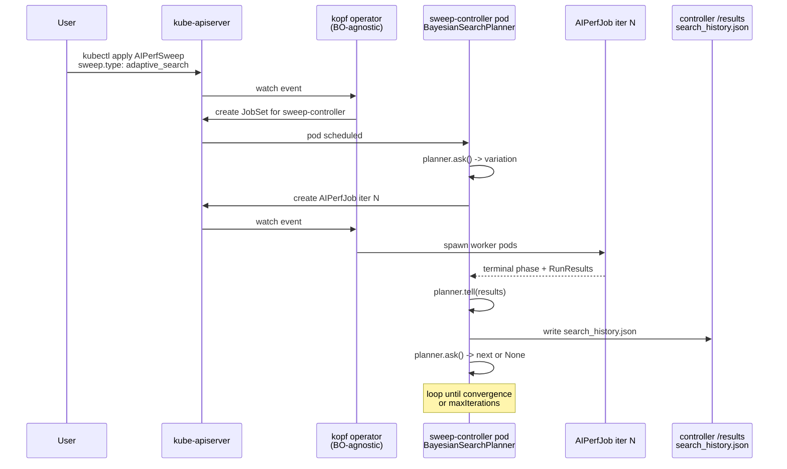

{/* # SPDX-FileCopyrightText: Copyright (c) 2026 NVIDIA CORPORATION & AFFILIATES. All rights reserved.
# SPDX-License-Identifier: Apache-2.0 */}

# Adaptive Search on Kubernetes

Adaptive search lets the cluster choose its own sweep points instead of
exhausting a grid. The same `BayesianSearchPlanner` (Optuna-backed, with
the Gaussian-process path supplied by BoTorch via the `[botorch]` extra) used
in-process by `aiperf profile --search-*` runs cluster-side when an
`AIPerfSweep` CR sets `spec.sweep.type: adaptive_search`. The planner
proposes one variation at a time; the sweep-controller pod creates a child
`AIPerfJob` per trial of that variation (one when `multiRun.numRuns` is
unset or 1), waits for them to terminate, scores the objective, and asks
for the next point. Convergence detection (max iterations,
improvement-patience plateau, or coefficient-of-variation plateau)
terminates the loop early when further evaluations stop helping.

Reach for adaptive search when the search space is too large to grid
enumerate (e.g. concurrency 1–1000), when a single scalar objective
captures what you care about, and when you want the proposed points
materialized as ordinary `AIPerfJob`s so each iteration is durable,
cancellable, and visible through normal `kubectl get aiperfjob`
workflows. For the algorithm details, flag grammar, and
`search_history.json` schema, defer to
[Bayesian-Optimization Outer Loop](../sweeping/bayesian-optimization.md);
for the in-process tutorial, see
[Adaptive Search](../tutorials/adaptive-search.md).

## Architecture



The kopf operator stays unaware of Bayesian Optimization: it only sees
ordinary `AIPerfJob` create/delete events. Planner state — the Gaussian
process model, trial history, and convergence accumulators — lives in the
controller process. After a restart, the controller constructs a fresh planner
and deterministically replays terminal child results through the canonical
`ask()` / `tell()` loop before proposing a new point. `search_history.json`
remains an output record rather than an input checkpoint; replay rebuilds it
from the Kubernetes-owned children.

If `sweep.randomSeed` is omitted, the Kubernetes plan builder derives a stable
planner seed from the immutable `AIPerfSweep` `metadata.uid`. An explicit
`randomSeed` always wins. Every child also carries
`aiperf.nvidia.com/run-identity`, a SHA-256 hash of its exact generated
`AIPerfJob.spec`. A deterministic child name is reused only when both ownership
and this execution contract match. A missing or mismatched identity fails the
sweep instead of feeding metrics from a different configuration into planner
history.

The optimization stack is pulled in through the AIPerf `[botorch]` extra
(alias `[optuna]`) and is present on the controller-pod image; operator
pods do not need it.

## Minimal `AIPerfSweep` CR

A single-dimension search over `phases.profiling.concurrency`. Dimension
paths are rooted **inside** the `benchmark:` block, so the `benchmark.`
prefix is redundant and rejected by the validator. This example optimizes
output token throughput on Llama 3.1 8B Instruct served by vLLM:

```yaml
apiVersion: aiperf.nvidia.com/v1alpha1
kind: AIPerfSweep
metadata:
  name: bo-concurrency-llama8b
  namespace: bench
spec:
  benchmark:
    models: [meta-llama/Llama-3.1-8B-Instruct]
    endpoint:
      urls: [http://vllm.bench.svc.cluster.local:8000/v1/chat/completions]
      type: chat
      streaming: true
    datasets:
      - name: main
        type: synthetic
    phases:
      - name: profiling
        type: poisson
        rate: 1.0  # fixed; concurrency is what searchSpace below overrides
        duration: 120
  sweep:
    type: adaptive_search
    planner: bayesian
    searchSpace:
      - path: phases.profiling.concurrency
        lo: 1
        hi: 1000
        kind: int
    objectives:
      - metric: output_token_throughput
        stat: avg
        direction: maximize
    maxIterations: 30
    nInitialPoints: 5
    improvementPatience: 8
    plateauWindow: 5
    plateauThreshold: 0.01
    randomSeed: 42
  multiRun:
    numRuns: 3
    cooldownSeconds: 30
```

`numRuns: 3` runs three benchmarks — three child `AIPerfJob`s, one per
trial — for each proposed point and feeds their pooled objective back to
the planner (`objectivePooling`, default `mean`). Confidence per point at
the cost of triple the wall clock. Drop to `numRuns: 1` for fastest
iteration and exactly one `AIPerfJob` per proposed point.

## Multi-dimensional search

Search over concurrency and Poisson rate jointly:

```yaml
spec:
  sweep:
    type: adaptive_search
    planner: bayesian
    searchSpace:
      - path: phases.profiling.concurrency
        lo: 1
        hi: 500
        kind: int
      - path: phases.profiling.rate
        lo: 1.0
        hi: 50.0
        kind: real
    objectives:
      - metric: output_token_throughput
        stat: avg
        direction: maximize
    maxIterations: 40
    nInitialPoints: 8
  multiRun:
    numRuns: 2
```

`kind: int` declares an integer dimension — Optuna suggests integer
parameters natively, no rounding step — while `kind: real` keeps
floats. `nInitialPoints` (default 5) becomes the sampler's
`n_startup_trials`: that many randomly-drawn startup points are
evaluated before the surrogate model takes over. Bump it for
higher-dimensional spaces (rule of thumb: `>= 2 * len(searchSpace)`).

## Status fields you can watch

The CRD declares typed counters in `status`:

| Field | Meaning under adaptive search |
|---|---|
| `status.phase` | `Pending` -> `Running` -> `Aggregating` -> `Succeeded` / `Failed` / `PartiallyFailed` / `Cancelled`. |
| `status.totalVariations` | Upper bound: equal to `maxIterations`. Actual count may be lower on early stop. |
| `status.maxTotalRuns` | Upper bound: `maxIterations * multiRun.numRuns`. |
| `status.completedRuns` | Authoritative count of finished child `AIPerfJob`s. |
| `status.failedRuns` | Authoritative failure count, tallied from child phases. `failurePolicy` decides whether that count aborts the sweep, it does not feed the count. |
| `status.runEpoch` | Integer sweep-run key (`int64`) used in the on-disk path: epoch-seconds, optionally suffixed with six digits. A fractional creation timestamp contributes real microseconds; a whole-second Kubernetes timestamp contributes a deterministic UID-derived suffix so rapid same-name recreation cannot reuse an archive. A `creationTimestamp` that cannot yield such a key (anything before 1970, which makes epoch-seconds negative) is rejected at admission with a `Failed` phase rather than silently stored, because the key doubles as the results directory name. |

`status` is a preserve-unknown object. `runStates`, `currentChildRef`,
`currentCell`, and `aggregation` are declared there as open objects —
the keys exist in the CRD but their inner shape is unvalidated.

Both `totalVariations` and `maxTotalRuns` are upper bounds — early
plateau or improvement-patience convergence shrinks the actual count
(the controller rewrites `totalVariations` to the number of distinct
variation indexes it actually ran). This mirrors how the trial-level
convergence rule (`multiRun.convergence`) can stop a grid sweep's cell
short of `multiRun.numRuns`.

```bash
$ kubectl -n bench get aiperfsweep bo-concurrency-llama8b
NAME                     PHASE       COMPLETED   TOTAL   FAILED   CURRENT   AGE
bo-concurrency-llama8b   Succeeded   54          90      0                  12m
```

The full BO trajectory — every proposed point, the per-iteration
objective, the running best, and the convergence reason — lives in
`search_history.json`, not on the CR. See
[Output layout](#output-layout) below and the
[search_history.json schema](../api/search-history.md).

A compact projection of that artifact is served on the sweep detail route
as `search_summary`, so the dashboard and any API client can read the
planner's own verdict without downloading the trajectory:

```bash
$ curl -s http://aiperf-operator.aiperf-system:8081/api/v1/sweeps/bench/bo-concurrency-llama8b \
    | jq '.search_summary | {convergence_reason, stop_kind, iteration_count,
                             sla_filter_count, best_trials, boundary_summary}'
```

| Field | Meaning |
|---|---|
| `convergence_reason` | Verbatim planner stop reason; `null` mid-loop or after an abnormal exit. |
| `stop_kind` | `converged` / `budget_exhausted` / `incomplete` — the classification of that reason, so clients need not track a growing string enum. |
| `iteration_count`, `feasible_iteration_count` | Iterations recorded, and how many met every SLA filter. |
| `sla_filter_count` | How many SLA filters were configured. **Zero makes every `feasible` flag vacuously true** — check it before rendering any feasibility claim. |
| `objectives` | The optimized targets, with `direction` normalized to lowercase. |
| `best_trials` | Planner-selected winner (Pareto front for multi-objective), capped at 20 with `best_trials_truncated`. Each entry's `objective_values` is **positional against `objectives`** and is never compacted: an objective the scorer could not produce keeps its slot as an explicit `null`, so `objective_values[i]` always belongs to `objectives[i]`. A `null` there means "not measured for this trial" and must be rendered as such — substituting a neighbouring value silently relabels it. The whole field is `null` when the trial was not scored at all. |
| `boundary_summary` | The empirical SLA boundary on the swept axis: `swept_dim_path`, `feasible_max`, and `infeasible_min` — the infeasible edge carries the `first_breach` that defined it. `null` for multi-dimensional searches and for runs with no iterations. |

`search_summary` is `null` for grid-family sweeps, for adaptive sweeps
whose trajectory has not been harvested to the operator PVC yet, and
whenever the artifact is unreadable — a missing verdict degrades the
response, it never fails it. The complete `search_history.json` remains
downloadable from the per-epoch sweep artifacts routes.

## Mutual exclusion rules

In the flat spec envelope, `adaptive_search` is one of the
`sweep.type` discriminator values (alongside `grid`, `zip`, `scenarios`,
`sobol`, and `latin_hypercube`), so "adaptive plus grid" is not even
expressible — the discriminator picks one. The remaining gates protect
the cardinality contract:

| Combination | Outcome | Enforced by |
|---|---|---|
| `kind: AIPerfJob` + `spec.sweep` (any type) | Rejected at admission — single benchmarks must use `kind: AIPerfJob` with `spec.sweep` unset | CRD `x-kubernetes-validations` rule (`!has(self.sweep)` on AIPerfJob) |
| `kind: AIPerfSweep` without `spec.sweep` | Rejected at admission — sweeps must declare a `sweep` block | CRD `x-kubernetes-validations` rule (`has(self.sweep)` on AIPerfSweep) |
| `sweep.type: adaptive_search` + `spec.benchmark.sweep` | Silently pruned at admission — `spec.benchmark` is a structural node with no `x-kubernetes-preserve-unknown-fields`, so the apiserver drops the unknown key and the nested block never reaches the controller. Sweep axes belong on the parent CR, not embedded in the per-iteration body | Structural-schema pruning on `spec.benchmark`; `BenchmarkConfig` additionally has no `sweep` field and forbids extras |
| Per-iteration `AIPerfJob` containing magic-list flags (`--concurrency 10,20,30`) | Rejected inside each child by `_reject_in_process_sweep_under_operator` | `src/aiperf/cli_runner/_multi_run.py` |

These prevent sweeping on top of sweeping and keep a single source of
truth for variation generation.

## Operator-managed gate exception

The operator sets `AIPERF_OPERATOR_MANAGED=1` in every controller and
worker pod, and `cli_runner._reject_in_process_sweep_under_operator`
hard-fails any in-process magic-list sweep under that flag — so the
cluster never sweeps on top of a sweep. **Adaptive search is the
exception**: the controller pod is the BO driver, and each per-iteration
child `AIPerfJob` sees a single-config plan (no `is_sweep` shape), so the
gate never fires for adaptive runs. The exemption is documented in the
`_reject_in_process_sweep_under_operator` docstring
(`src/aiperf/cli_runner/_multi_run.py`).

## Cancellation behaviour

Patching the parent `AIPerfSweep` with `spec.cancel: true` is cooperative
end to end:

1. A background poller in the sweep-controller pod
   (`_poll_cancel_flag` in `sweep_controller/main.py`) re-reads the parent
   CR and flips an in-process cancel flag when `spec.cancel` is true.
2. The adaptive loop and the child-wait loop both consult that flag as a
   `cancel_check` callable at their `await` boundaries.
3. The currently-running child `AIPerfJob` is patched with
   `spec.cancel: true` (`K8sChildJobExecutor._patch_child_cancel`), drains
   to a terminal phase, and contributes its results.
4. The controller skips remaining iterations, runs aggregation over the
   children that did complete, and flushes `search_history.json` with
   `convergence_reason: "cancelled"`.

`search_history.json` is rewritten after every iteration. Cancellation keeps
the completed prefix immediately; after a controller restart, the same prefix
is reconstructed by reusing terminal children and replaying their metrics into
the restart-stable planner before execution advances.

## Output layout

Artifacts land under the operator's `AIPERF_RESULTS_DIR` PVC (default
`/data`), scoped by namespace, sweep name, and the sweep run-epoch:

```
<AIPERF_RESULTS_DIR>/
  <namespace>/
    sweeps/
      <sweep-name>/
        <sweep-run-epoch>/
          search_history.json          # BO trajectory + convergence_reason
          aggregate.json               # durable parent aggregate
          children.json                # child manifest
          sweep_aggregate/             # mode-agnostic per-combination aggregate
            profile_export_aiperf_sweep.json
            profile_export_aiperf_sweep.csv
            manifest.json              # epoch lineage of every child run
    <sweep-name>-v00-t0/               # per-iteration child AIPerfJob
      <child-run-epoch>/
        profile_export_aiperf.json     # full per-trial artifacts
        ...
    <sweep-name>-v00-t1/
    <sweep-name>-v01-t0/
    ...
```

The operator harvests the whole tree from the sweep-controller's results
sidecar before the JobSet is deleted (the controller pod's `/results` is
an `emptyDir`), re-rooting it onto the operator PVC.

Per-iteration child names follow the same `<sweep>-v<NN>[-t<N>]` budget
as grid sweeps (`build_child_name` in `sweep_controller/_naming.py`):
the variation index is the BO iteration index (`-v00` is the first
proposed point), and the trial suffix is present whenever
`multiRun.numRuns > 1` or `multiRun.convergence` is set. Each child sits
at the same path layer as a standalone `AIPerfJob` and is reachable
through the standard `/api/v1/results/<ns>/<sweep>-v00-t1/` endpoints.

`sweep_aggregate/` carries the same per-combination CSV/JSON schema
produced by grid sweeps — `aggregate_sweep_and_export` groups by stamped
`variation_values` and is mode-agnostic, so downstream readers do not
need to know the sweep was adaptive.

## Where to read more

- [Bayesian-Optimization Outer Loop](../sweeping/bayesian-optimization.md) — algorithm, flag grammar, `search_history.json` schema, convergence reasons.
- [Adaptive Search tutorial](../tutorials/adaptive-search.md) — in-process walkthrough with `aiperf profile --search-*`.
- [Parameter Sweeps and Multi-Run on Kubernetes](../tutorials/sweeps.md#running-sweeps-on-kubernetes) — grid sweeps, multi-run confidence, cancellation, failure policy.
- [search_history.json schema](../api/search-history.md) — exact JSON shape consumed by post-run tooling.
- [AIPerfSweep CRD validation rules](./crd-validation.md) — full catalog of admission-time invariants.
