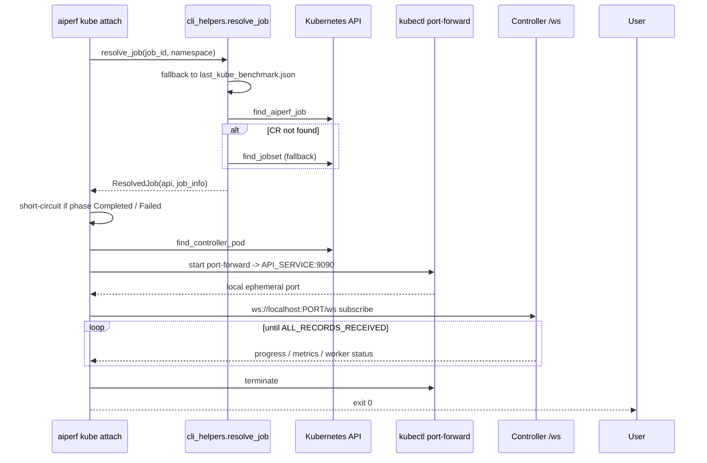

# Attach to a Running Benchmark

`aiperf kube attach` re-connects to an `AIPerfJob` that is already running in the cluster and streams its progress to your terminal until the benchmark finishes. It is the command you reach for when an earlier `aiperf kube profile` invocation was detached (Ctrl-C, closed laptop, disconnected VPN, separate deploy host) and you want to pick the session back up from another shell.

Attach is intentionally narrow:

- It does **not** deploy, modify, or cancel the `AIPerfJob`.
- It does **not** download results after completion. Use `aiperf kube results` for that.
- It does **not** poll the Kubernetes API for snapshots. Use `aiperf kube list` or `aiperf kube debug` for that.

Contrast with the neighbouring commands:

| Command | Shape | When to use |
|---|---|---|
| `aiperf kube attach` | Live WebSocket stream, exits on completion | Re-join a detached run in progress |
| `aiperf kube list` | Polled CR summary | See phase / pod status at a glance |
| `aiperf kube logs` | Raw container log stream | Debug a misbehaving container |
| `aiperf kube results` | Artifact download | After the run has completed |

---

## Quick Reference

```bash
# Attach to the most recently deployed benchmark
aiperf kube attach

# Attach to a specific job by ID
aiperf kube attach aiperf-bench-7f2a

# Attach in a specific namespace
aiperf kube attach aiperf-bench-7f2a --namespace aiperf-bench

# Use a fixed local port instead of an ephemeral one
aiperf kube attach aiperf-bench-7f2a --port 9091

# Attach to one variation (and trial) of an AIPerfSweep
aiperf kube attach my-sweep -v 7
aiperf kube attach my-sweep -v 5 -t 0
```

---

## CLI Reference

```text
aiperf kube attach [JOB_ID] [OPTIONS]
```

| Argument / Flag | Default | Description |
|---|---|---|
| `JOB_ID` (positional) | last deployed job | The `AIPerfJob` CR name — or an `AIPerfSweep` name, when combined with `-v` — to attach to. If omitted, the CLI reads `~/.aiperf/last_kube_benchmark.json`. |
| `-p`, `--port` | `0` | Local port for the `kubectl port-forward` tunnel. `0` asks the kernel for an ephemeral port, which avoids conflicts with other `aiperf kube` sessions on the same machine. |
| `-v`, `--variation` | unset | When `JOB_ID` names an `AIPerfSweep`, the child variation index (`0`..`199`). Resolves to the child `AIPerfJob` named `<sweep>-v<idx:02d>`. |
| `-t`, `--trial` | unset | Trial index (`0`..`9`) within a sweep variation, resolving to `<sweep>-v<idx:02d>-t<trial>`. Requires `-v`. |
| `--ignore-not-found` | `false` | Exit `0` instead of `1` when the target benchmark does not exist. Mirrors `kubectl`'s flag of the same name; the error is still printed. |
| `-n`, `--namespace` | last-benchmark namespace, else the kubeconfig context namespace | Kubernetes namespace containing the `AIPerfJob`. |
| `--kubeconfig` | unset | Path to a kubeconfig file. When unset, the CLI first tries in-cluster config, then the default kubeconfig resolution. |
| `--kube-context` | unset | Context name to select inside the kubeconfig. |

`--namespace`, `--kubeconfig`, and `--kube-context` are the composite options declared on `KubeManageOptions` and are shared with every other `aiperf kube` subcommand.

---

## Default Job-ID Resolution

If you do not pass a positional `job_id`, the CLI resolves it from the file written by the most recent `aiperf kube profile` (or `aiperf kube sweep`):

```text
~/.aiperf/last_kube_benchmark.json
```

The file stores a `{"job_id", "namespace", "name", "kind"}` record — `job_id` and `namespace` are always present, `name` and `kind` are written only when known (see `save_last_benchmark` / `get_last_benchmark` in `aiperf.kubernetes.console`). `resolve_job_id_and_namespace` reads it and prints a one-line info banner so you can confirm which job you are attaching to.

**Multi-cluster pitfall.** The last-benchmark file is keyed by nothing except "the last `aiperf kube` deploy that ran on this workstation". If you routinely switch between clusters or kubeconfig contexts, the stored `job_id` / `namespace` may belong to a *different* cluster than the one your current `--kube-context` targets. The symptom is "No AIPerf job found with ID: ..." even though you just deployed successfully — the job exists, but not on the cluster you are now pointing at. Pass the `job_id` explicitly, or re-confirm your context with `kubectl config current-context` before attaching.

---

## Execution Flow



The concrete steps performed by `attach_to_benchmark` (in `aiperf/kubernetes/attach.py`) are:

1. **Resolve the job.** `resolve_job` queries `AIPerfJob` CRs first. If the CR is missing, it falls back to `find_jobset` so that jobs deployed in direct-mode (JobSet-only, no operator) are still reachable. See [Direct-mode vs operator-mode](#direct-mode-vs-operator-mode).
2. **Short-circuit on terminal phase.** If the CR's `status.phase` is already `Completed` or `Failed`, `attach` exits early with a pointer at `aiperf kube results` or `aiperf kube logs` respectively. On failure, it best-effort prints the controller pod's last 30 log lines.
3. **Locate the controller pod.** `find_controller_pod` returns the `(pod_name, phase)` pair for the control-plane pod. If no pod exists, or the pod is not `Running`, attach prints a warning and exits cleanly (exit code 0) — this is the normal outcome when the CR is still `Pending` and pods have not been scheduled yet.
4. **Port-forward to the controller API.** `port_forward_with_status` spawns `kubectl port-forward -n NS pod/POD LOCAL:9090` (where `9090` is `K8sEnvironment.PORTS.API_SERVICE`). When `--port 0` is passed, `LOCAL` is `0`, and the actual port is parsed from kubectl's `"Forwarding from 127.0.0.1:NNNN"` stdout line.
5. **Open the progress WebSocket.** `stream_progress` builds `ws://localhost:PORT/ws`, subscribes to the progress message types enumerated in `WS_MESSAGE_TYPES` (phase start/progress/complete, realtime metrics, worker status summary, all-records-received), and logs each frame to the `aiperf.kube` rich logger.
6. **Exit on terminal message.** The subscription stops as soon as an `ALL_RECORDS_RECEIVED` frame is observed. The port-forward is then terminated by the `async with` exit handler.

---

## Port-Forward Behavior

The port-forward is managed by `aiperf.kubernetes.port_forward` and is shared by all `aiperf kube` commands that need to talk to the controller API. Key tunables (all seconds):

| Parameter | Value | Purpose |
|---|---|---|
| `_PORT_FORWARD_TIMEOUT` | `60.0` | Single wall-clock budget covering both `kubectl port-forward` printing its `"Forwarding from ..."` ready line and the `/health` probe answering. Exceeding it during verification raises `"Port-forward API verification exceeded budget (60.0s)"`. |
| `_API_INITIAL_DELAY` | `0.5` | Grace delay before the first `GET /health` probe, giving kubectl time to wire the tunnel. |
| `_API_RETRY_DELAY` | `2.0` | Sleep between port-forward restart attempts when `/health` fails. |
| `_API_MAX_RETRIES` | `10` | Maximum number of port-forward restarts while waiting for the API to answer. |
| `_PROCESS_CLEANUP_TIMEOUT` | `5.0` | Graceful-shutdown grace period for the `kubectl port-forward` child process. |
| pod-liveness probe interval | `10.0` | Background task runs `kubectl get pod ... -o name` every 10 s; if it returns non-zero, the port-forward is terminated. |

On top of the port-forward, `stream_progress_from_api` applies **WebSocket reconnection** with exponential backoff:

- `_WS_INITIAL_BACKOFF` = `1.0` s
- `_WS_MAX_BACKOFF` = `30.0` s (doubling per failure)
- `_WS_HEARTBEAT` = `30` s (aiohttp heartbeat ping)
- `max_retries` = `10` (`WS_MAX_RETRIES` in `ui_dispatch.py`)

After 10 consecutive failed reconnects, `ConnectionError` is raised with the underlying `aiohttp.ClientError` / `asyncio.TimeoutError` preserved as `__cause__`, and `cli_utils.exit_on_error` converts that into a non-zero exit.

---

## Signals and Exit Codes

| Scenario | Exit code | Notes |
|---|---|---|
| Benchmark completes (`ALL_RECORDS_RECEIVED`) | `0` | Port-forward is torn down cleanly; the `AIPerfJob` continues running to completion on the cluster. |
| Short-circuit on `phase=Completed` / `phase=Failed` | `0` | No port-forward is opened; the CLI prints a pointer to `results` / `logs`. |
| `Ctrl-C` during streaming (`KeyboardInterrupt`) | non-zero | `exit_on_error` deliberately re-raises `KeyboardInterrupt` rather than swallowing it. **The remote benchmark is not affected** — attach only tears down its own port-forward and WebSocket. |
| `resolve_job` could not find the CR or JobSet | `1` | The error is printed via `print_error` and the command exits non-zero, so `aiperf kube attach` is usable as a CI existence check. Re-run `aiperf kube list` to enumerate available jobs. Pass `--ignore-not-found` to force exit `0` in a cleanup script that must tolerate an already-deleted benchmark. |
| No `job_id` given and no last-benchmark record | `1` | Same path: the target could not be addressed at all. `--ignore-not-found` also covers this case. |
| WebSocket reconnection budget exhausted | `1` | Wrapped by `cli_utils.exit_on_error(title="Error Attaching to Benchmark")`. |
| `kubectl port-forward` budget exhausted | `1` | Same error wrapper; stderr from `kubectl` is surfaced in the message. |

Attach is safe to interrupt at any time. The CR, JobSet, and pods are owned by the cluster — the CLI only holds a read-only WebSocket subscription.

---

## Direct-Mode vs Operator-Mode

`resolve_job` is dual-mode by design:

- **Operator-mode** (the default): `aiperf kube profile` creates an `AIPerfJob` CR, and the in-cluster operator reconciles it into a JobSet. `find_aiperf_job` matches the CR directly.
- **Direct-mode**: `aiperf kube profile --no-operator` skips the CR and creates a JobSet. When no `AIPerfJob` exists, `resolve_job` falls back to `find_jobset` and wraps the returned `JobSetInfo` as a minimal `AIPerfJobInfo` so the rest of the attach flow is identical.

You do not need to tell `attach` which mode the job was deployed in — the fallback is automatic. In direct mode the `phase` that drives the terminal short-circuit comes from `JobSetInfo._parse_status`, which maps the JobSet's `Completed` condition to `"Completed"` and a `Failed` condition with a failed `controller` replicated job to `"Failed"`. Everything else — including a JobSet that has failed only on the worker side — reports `"Running"`, so `attach` will proceed to look for the controller pod. A run that is still in flight is detected as complete the same way in both modes: via the `ALL_RECORDS_RECEIVED` WebSocket message.

---

## Troubleshooting

**"No AIPerf job found with ID: ..."**
The `job_id` you passed (or the one stored in `~/.aiperf/last_kube_benchmark.json`) does not exist in the resolved namespace. Note that omitting `--namespace` does **not** search cluster-wide: `resolve_job_id_and_namespace` substitutes the namespace from the last-benchmark file, or, when you passed an explicit `job_id`, the one your kubeconfig context sets. Run `aiperf kube list -A` to see what is actually deployed, and confirm your current kubeconfig context matches the cluster you deployed to.

**"Port-forward did not become ready within 60.0s"**
`kubectl port-forward` never printed its ready line. Common causes: the controller pod is `CrashLoopBackOff`, the pod was evicted, or a network policy is blocking pod-to-apiserver traffic. Check `aiperf kube debug` for pod phases and `aiperf kube logs --container control-plane` for the controller's startup errors.

**"Port-forward failed after 10 retries"**
The tunnel connected but `GET /health` on the API port never returned. Most commonly this means the controller is alive but has not yet bound the API server (still executing the `INITIALIZING` phase) — retry after 30 s. If the problem persists, inspect the controller pod logs for API-service binding errors.

**"Connection lost, retrying in Ns..."**
The progress WebSocket dropped and is being re-opened. A handful of these during a long run are expected (e.g. when the apiserver throttles the port-forward). Only after 10 consecutive failures will attach give up; at that point the underlying `aiohttp.ClientError` is surfaced in the exception chain.

**Local port conflict (`bind: address already in use`)**
You passed `--port N` and something else on your machine is already listening on `N`. Either free the port, pick a different one, or drop the flag to get an ephemeral port.

**Auth errors (`Unauthorized` / `forbidden`)**
In an interactive terminal, `Unauthorized` (HTTP 401) causes AIPerf to wait while
you complete your normal Kubernetes login in another terminal, then reload the
selected kubeconfig and retry. Press **Ctrl+C** to stop waiting. `Forbidden`
(HTTP 403) means the current identity is authenticated but lacks permissions and
is not retried. At minimum attach needs `get`/`list` on `aiperfjobs` (or
`jobsets`), `list` on `pods`, `create` on `pods/portforward`, and — for the
last-30-lines tail printed when a job is already `Failed` — `get` on `pods/log`.
See [RBAC and Security](rbac-security.md) for the full CLI-user role.
