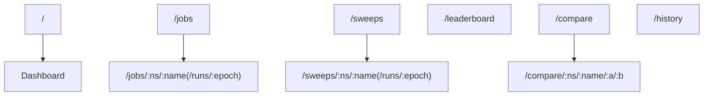

# Web Dashboard

The operator ships a browser-based dashboard for inspecting benchmark jobs,
comparing runs, and browsing historical analytics. It is a lightweight Preact
single-page application served directly from the operator's Results API
deployment — no separate service to deploy, no build step, just static assets
loaded from `src/aiperf/operator/ui/`.

This page documents every page, interaction, and keyboard shortcut in the UI.
For the HTTP endpoints that power it, see [`results-api.md`](results-api.md).

---

## Accessing the Dashboard

The dashboard and the Results API are served by the same FastAPI process and
share port **8081** inside the cluster. `results_server.py` mounts
`StaticFiles(directory=<operator>/ui, html=True)` at `/` after every API router,
so `/` serves `index.html` and every sibling asset resolves by filename. Client
routes are hash-based (`#/jobs/...`), so the browser only ever requests `/` —
there is no server-side SPA fallback, and an unknown *file* path returns `404`
rather than `index.html`.

### Recommended: `aiperf kube dashboard`

```bash
aiperf kube dashboard
```

This command locates the operator pod, opens a `kubectl port-forward` directly
to that pod on the results server port (`RESULTS_SERVER_PORT`, default `8081`,
overridable with `AIPERF_RESULTS_SERVER_PORT`), and launches your default
browser at the forwarded URL. The port-forward stays open until you press
`Ctrl+C`, auto-reconnecting with backoff in between.

Useful flags:

| Flag | Purpose |
|---|---|
| `--port 8081` | Bind to a specific local port (default: ephemeral). |
| `--no-browser` | Print the URL instead of opening a browser — useful in SSH sessions. |
| `--operator-namespace aiperf-system` | Override the namespace to look in. |

### Manual port-forward (enterprise clusters)

If your cluster policy forbids the `aiperf` CLI from spawning `kubectl`, or you
want a long-lived forward managed by your own tooling, forward the Service
directly:

```bash
kubectl port-forward -n aiperf-system svc/aiperf-operator 8081:results
# open http://localhost:8081
```

The Service name is whatever Helm's `aiperf-operator.fullname` template
renders — by default `aiperf-operator`, or `<release>-aiperf-operator` if your
release name differs from the chart name. The port is exposed under the
`results` named port (default 8081, see `resultsServer.port` in `values.yaml`).

### Local no-build UI development

For fast iteration on the static operator UI without adding a frontend build
step, run the local proxy against a forwarded or otherwise reachable operator
Results API:

```bash
uv run python tools/operator_ui_proxy.py --dev-reload --port 8123 --upstream http://127.0.0.1:8081
```

Open `http://127.0.0.1:8123/live/`. The proxy serves
`src/aiperf/operator/ui/`, forwards `/api/v1/*` to the configured upstream, and
reloads the browser when `.html`, `.js`, or `.css` files change.

### Authentication

The dashboard inherits the Results API's access model: **no per-user
authentication** is performed for reads. Access control is the port-forward
itself — whoever can reach port 8081 inside the cluster (or through a forward)
can view every job and every result. Do not expose this port via an
unauthenticated Ingress.

Mutating actions (cancel a run) *are* reachable from the browser, but only
through the operator's bearer token. `lib/api.js` routes them
through `mutatingFetch`, which requires a token in `sessionStorage`; the first
attempt without one raises a `TOKEN_REQUIRED` error, the page opens
`components/token-modal.js` to collect it, and the action retries. A `401`
clears the stored token and re-prompts. The token lives only in
`sessionStorage`, so it is gone when the tab closes and is never persisted to
disk. If the operator has not set `AIPERF_OPERATOR_MUTATING_ROUTES_ENABLED`, the
server answers `403` no matter what the browser sends — use `aiperf kube` or
`kubectl` in that case.

---

## Navigation

The UI is a **flat single-page app** with a text-led horizontal top bar — there
is no namespace-picker landing page and no per-namespace URL tier. Namespace is
only ever a path parameter (`:ns`) on a job/sweep detail route or a `?ns=` query
filter on the list pages; it is never a routing gate, and nothing about the last
namespace is persisted.

Routes are hash-based, so reloading any page works without server-side route
configuration. The full route table (`src/aiperf/operator/ui/app.js:52-86`):

| Route | Page | Purpose |
|---|---|---|
| `/` | `Dashboard` | Cluster-wide overview: cluster-stats banner, active-jobs cards, throughput-vs-latency scatter, KPI tiles, recent-jobs table. |
| `/jobs` | `Jobs` | Filterable/sortable table of every AIPerfJob (phase tabs, search, model/endpoint/namespace filters — all synced to the URL query). |
| `/jobs/:ns/:name` | `JobDetail` | Single-run workbench (see below). |
| `/jobs/:ns/:name/runs/:epoch` | `JobDetail` | Same workbench pinned to one epoch of a multi-epoch run. |
| `/sweeps` | `Sweeps` | Filterable/sortable table of every AIPerfSweep. |
| `/sweeps/:ns/:name` | `SweepDetail` | Sweep workbench (variation curves, Pareto, children). |
| `/sweeps/:ns/:name/runs/:epoch` | `SweepDetail` | Sweep workbench pinned to one sweep epoch. |
| `/leaderboard` | `Leaderboard` | Cross-run ranking for a chosen metric. |
| `/compare` | `Compare` | Multi-run comparison (metric table, bar/Pareto charts). |
| `/compare/:ns/:name/:epochA/:epochB` | `CompareEpochs` | Two-epoch diff of one run. |
| `/history` | `History` | A metric's value over time across runs. |

Any other path renders a "Not Found" stub.



### Operator top bar

`TopNav` (`components/top-nav.js`) renders a sticky horizontal bar: the
`AIPerf Operator` logo and two labelled tab groups on the left, the search
trigger on the right.

- **OPERATE:** Dashboard, Jobs, Sweeps.
- **ANALYZE:** Leaderboard, Compare, History.

When `/api/v1/config/features` reports `dashboard_enabled: true`, a third
(unlabelled) group adds an external **"Plots ↗"** link (see below). NVIDIA green
is reserved for deliberate actions and live or successful status. The search
button sits at the right end of the bar and shows its `Ctrl+K` shortcut as a
`kbd` hint.

### Breadcrumb

Below the top bar, in the workspace chrome, `Breadcrumb`
(`components/breadcrumb.js`) renders a
**route-path** breadcrumb derived from the current hash — e.g. `Jobs / <ns> /
<name> / runs / <epoch>` on a job-epoch route. It is a plain path trail with
clickable ancestors; there is **no** namespace dropdown or namespace switcher.

### External Plots link

The "Plots ↗" link points at `/dashboard/` — the optional Plotly Dash sidecar.
The results server mounts an **aiohttp reverse-proxy router**
(`operator/routers/dashboard_proxy.py`, wired in `results_server.py` right
before the static-UI mount) that forwards `/dashboard/{path:path}` to the
dashboard sidecar for GET, POST, PUT, DELETE, PATCH, and OPTIONS. Paths
containing `.` or `..` segments are rejected with `400` so a decoded traversal
cannot escape the `/dashboard/` prefix and reach the sidecar's unauthenticated
`POST /admin/refresh`. The link is gated by
`/api/v1/config/features`'s `dashboard_enabled` flag, and the proxy returns
`503` when the sidecar is disabled or unreachable. (The Dash app itself uses
`WSGIMiddleware` inside the sidecar's own `dashboard_server.py`, not on the
results server.)

---

## Pages

### Dashboard (`/`)

The cluster-wide landing view (`pages/dashboard.js`).

**What it shows:**

- **Cluster-stats banner** — GPUs used/total + free, utilization %, GPU-node
  breakdown, and a Kubernetes/cluster tile.
- **Active-jobs cards** — one card per running/initializing/pending job with a
  live metric strip (TTFT, output tok/s, P99, ITL, requests, error %) and a
  progress bar. Click a card to open the workbench.
- **Throughput-vs-latency scatter** — completed jobs, with TPS/P99, TPS/TTFT,
  tok-s/P99 axis toggles and a log-scale toggle.
- **KPI tiles** — Running, Completed, Peak Throughput, Best TTFT, Token
  Throughput.
- **Recent-jobs table** — newest completed/failed runs with headline metrics.

**Endpoints consumed:** `GET /api/v1/jobs` (5s), `GET /api/v1/cluster` (10s),
`GET /api/v1/analytics/scatter` (30s). The scatter poll is a single query that
replaced the old leaderboard-plus-per-entry-summary fan-out, and it feeds both
the scatter chart and the KPI tiles.

### Jobs (`/jobs`)

Filterable, sortable table of every AIPerfJob (`pages/jobs.js`). Phase tabs
(All / Running / Completed / Failed), free-text search, and model / endpoint /
namespace filters — all persisted to the URL query string. `GET /api/v1/jobs`
polled every 5s. Clicking a row opens the workbench.

### Job workbench (`/jobs/:ns/:name`)

The deepest page, scoped to one AIPerfJob (`pages/job-detail.js`). Sections
depend on whether the run is live or finished.

**Always visible:** header (name, phase badge, namespace/model pills, epoch
selector), conditions, a `PhaseBar` (Phases), record-processing, and a
`PodsBar` (per-pod JobSet status).

**While running:** a live-throughput line chart, a latency-distribution
histogram, a realtime KPI grid, and a diagnostics panel (Events / Logs /
Conditions / Pods tabs). A per-job WebSocket feeds live data. A **Cancel run**
button is live: clicking it swaps in an inline confirm/keep-running pair, and
confirming calls `POST /api/v1/jobs/{ns}/{name}/cancel` (prompting for the
bearer token if none is stored). The button shows a spinner while the patch is
in flight and stays pending until the next poll moves the phase out of running;
a failure is reported inline as "Cancel failed: …".

**After completion:** SLA compliance, server metrics, job configuration (with a
View-YAML modal), run metadata, per-record analysis (from
`profile_export.jsonl`), concurrency-vs-throughput, latency-percentile and
latency-timeline charts, ISL distribution, a full metrics-breakdown table, and
a result-files card.

**Endpoints consumed:** `GET /api/v1/jobs/{ns}/{name}[?epoch=]` (every 3s, or
8s while the WebSocket is connected, since the socket already carries the live
numbers), `.../epochs`, `GET /api/v1/config/{ns}/{name}`, and the run-scoped
file endpoints `GET /api/v1/results/{ns}/{name}/runs/{epoch}` plus the
per-record and server-metrics artifacts *named by that listing*
(`per_record_filename` / `server_metrics_filename` — not hardcoded filenames),
and a per-job WebSocket. The non-epoch results endpoint is deliberately never
called: until the route is pinned to `/runs/<epoch>`, the artifact cards render
as unavailable.

### Job epoch view (`/jobs/:ns/:name/runs/:epoch`)

The same workbench pinned to a specific epoch of a multi-epoch run
(concurrency/request-rate sweeps). Header widgets walk epochs and update the
URL; a no-epoch URL auto-redirects to the resolved current epoch.

### Sweeps (`/sweeps`)

Filterable, sortable table of every AIPerfSweep (`pages/sweeps.js`) — phase
tabs, progress, failed count, variation count, model, source, and age.
`GET /api/v1/sweeps` polled every 5s. Row click → sweep detail.

### Sweep detail (`/sweeps/:ns/:name`)

One AIPerfSweep workbench (`pages/sweep-detail.js`): header (phase, model,
epoch selector, and the currently executing variation), conditions, a KPI row
(variations / completed / failed plus headline peak metrics), an
aggregate-artifacts card, a live trial board while running, a variation curve
(metric selector + chart + table), a children table, and a diagnostics panel
while live.

Adaptive search has a deliberately state-aware surface:

| State | Surface | Claim the UI may make |
|---|---|---|
| Live adaptive search | **Optimization study** with a **Current leader** | The best observation seen so far is provisional; the planner is still sampling and no final recommendation is shown. |
| Successful terminal adaptive search with `search_summary.best_trials` | **Planner verdict** | The planner's final operating point, stopping evidence, and any SLA boundary. |
| Failed, cancelled, unknown, or terminal adaptive search without a verdict | **No final recommendation** | The UI directs the reader to the trial history and search artifact; it never promotes a partial result to a winner. |
| Grid/generator sweep | **Variation curve** | The curve and table are the result; no browser-derived winner summary is shown. |

Pareto analysis appears only for a sweep that declared more than one objective.
It is not used as a decorative throughput-versus-latency chart for a
single-objective or grid sweep.

The headline peak tiles (`Peak output tok/s`, `Peak req/s`, `Best TTFT p50`,
`Best req lat p99`) report the extremum across **every** variation, feasible or
not — "how much can this serve if I ignore latency" is a real question, and the
variation table below the tiles is unfiltered too. So that a peak the
constrained search *rejected* cannot be mistaken for the sweep's answer, each
tile states which SLA regime its number is from:

| Tile shows | When |
|---|---|
| `breaches SLA`, amber, no gold "award" tone | The variation that produced this extremum fails at least one `spec_summary.sla_filters` entry. Hover names the constraint, the observed value, and the best SLA-feasible alternative among the charted variations. |
| `meets SLA`, green | The variation satisfies every declared filter. |
| no feasibility line at all | Either the sweep declared no constraints (`search_summary.sla_filter_count == 0`, which makes every `feasible` flag in the API vacuously true), or it declared some that this page cannot check — `spec_summary.sla_filters` absent on an older archive, or a constraint on a metric the page does not collect. In the second case the tooltip says the tile is **not** filtered for feasibility, rather than leaving its silence to be read as a pass. |

The final verdict comes from `search_summary.best_trials[0]`, the search
planner's own result recorded from trial-level data. Its headline metric label,
unit, and direction all come from the objective itself, never from the chart
selector. An objective the planner could not score on the chosen trial renders
as `not measured` rather than borrowing a neighbouring objective's number.

**Endpoints consumed:** `GET /api/v1/sweeps/{ns}/{name}[?epoch=]` (5s),
`.../cells`, `.../epochs`, `.../children`,
`.../epochs/{epoch}/artifacts`, and per-child `GET /api/v1/jobs/{ns}/{name}`.

### Leaderboard (`/leaderboard`)

Cross-run ranking for a chosen metric + stat (`pages/leaderboard.js`): a
top-10 horizontal bar chart plus a ranked table, with namespace / model /
endpoint cross-filters. `GET /api/v1/analytics/leaderboard?metric=&stat=&limit=1000`
(fetched per selection, not polled). Rows link to the run workbench.

### Compare (`/compare`)

Multi-run comparison (`pages/compare.js`). Left: a job selector with search,
namespace/model/endpoint facet chips, and quick-pick buttons. Right: a
metric-comparison table (direction-aware best-value highlight), a grouped bar
chart, and throughput/latency Pareto scatters. Loads the run list from
`GET /api/v1/results`, then `GET /api/v1/analytics/compare?jobs=...` on compare.
Deep-linkable via a `?cluster=` query param. Requires ≥2 selections.

### Compare epochs (`/compare/:ns/:name/:epochA/:epochB`)

A fixed nine-metric diff of two epoch-pinned run summaries of a single run
(`pages/compare-epochs.js`) — columns Metric / Run A / Run B / Δ. Each side is
fetched through the quick-export alias
`GET /api/v1/results/{ns}/{name}/runs/{epoch}/profile_export`, so a run whose
`artifacts.prefix` renamed the summary file still diffs. When one side has no
summary, that column reads `n/a` instead of failing the page.

### History (`/history`)

One metric's value over time across runs (`pages/history.js`): a line chart
plus a data-points table, with namespace / model / endpoint filters synced to
the URL. `GET /api/v1/analytics/history?metric=&stat=&namespace=&model=&endpoint=&limit=10000`
— the filters are pushed to the server *and* re-applied client-side, and the
table warns "may be truncated" once the response hits the 10000-row request cap.

### Log strip (bottom bar)

`LogStrip` (`components/log-strip.js`) is an always-on strip pinned to the
bottom of every page. It derives lifecycle events **client-side** by diffing
successive `/api/v1/jobs` snapshots (new run detected, phase transition,
worker-ready change) — it consumes **no** endpoint of its own and keeps only an
in-memory ring buffer of the last 120 events, so its history is lost on reload.
Filter tabs: All / Warn / Error. Each entry links to the run workbench. It is
**not** a durable cross-namespace audit log.

---

## Command Palette

Press **`Ctrl+K`** (or `Cmd+K` on macOS) to toggle the command palette — the
same shortcut closes it. The search button at the right end of the top bar opens
the same modal.

The palette (`components/command-palette.js:9-17`) indexes:

- The six nav pages — Dashboard, Jobs, Sweeps, Leaderboard, Compare,
  History — each with the sub-label "Page".
- Every AIPerfJob from the current `jobs` signal — sub-label `ns: <namespace>`,
  selecting navigates to that job's workbench (`/jobs/<ns>/<name>`, pinned to
  its epoch when known).

There are no namespace entries. Type to fuzzy-match either the label or the
sub-label; matching is in-order-character, not substring. Navigation:

| Key | Action |
|---|---|
| `↑` / `↓` | Move highlight |
| `Home` / `End` | Jump to first / last |
| `Enter` | Select the highlighted item |
| `Tab` | Suppressed — focus is trapped on the search input so it cannot escape to the page behind the modal |
| `Escape` or backdrop click | Close |
| Mouse hover | Move highlight |

---

## Theme and Layout

The dashboard is **dark-only**, and the theme is not configurable — not by an
in-app control, not by the OS `prefers-color-scheme` setting, and not from the
browser console. `index.html` sets `data-theme="dark"` in a synchronous inline
script before the stylesheet loads (so a reload cannot flash unstyled content),
and `initTheme()` in `lib/theme-switch.js` pins the same constant after hydration.
The color tokens live in `src/aiperf/operator/ui/lib/theme.js` (the JS palette
that every Chart.js consumer imports) and in `style.css`.

Earlier builds did resolve an auto / light / dark preference from
`localStorage['aiperfTheme']` and from `prefers-color-scheme`. That was removed
because it could not work: `lib/theme.js` is a hardcoded dark palette that reads
no CSS custom properties, so a light chrome would have rendered around dark
charts. Worse, it was not inert — every visitor whose OS preferred light got
`data-theme="light"` on `<html>` with no control involved, and `style.css`
neutralized only part of the light palette, so 13 of its 73 custom properties
leaked into the dark UI (including a low-contrast muted accent and an inverted
table-row hover). `style.css` now contains no `[data-theme]` selector at all,
which `tests/ui/test_operator_css_static_edges.py` enforces.

Reviving light mode would mean making `lib/theme.js` read CSS custom properties
and re-theming every chart, not re-adding a toggle.

Model colors in charts are assigned deterministically from a hash of the model
name, so the same model keeps the same color across pages and reloads.

The layout is a single column: the sticky top bar, then a workspace chrome strip
holding the breadcrumb, an `EXPERIMENTAL / Operator UI preview` banner, the
data-freshness strip, and an optional global error banner; then the current
page; then a persistent log strip at the bottom. The SPA is responsive down to
tablet widths; very narrow viewports are not a supported target.

---

## Troubleshooting

### Blank page with console 404s for `/app.js`

The UI assets were not baked into the operator image, or `ui_dir.is_dir()`
returned false at startup, in which case `create_app()` silently skips the
`StaticFiles` mount — there is no log line for it either way. Verify the image
tag includes `src/aiperf/operator/ui/`; `curl -sI http://localhost:8081/app.js`
returning `404` while `/healthz` returns `200` confirms the mount is missing.

### "Error: API 503 …" banners

The Results API returned 503 — typically because `ResultsDB` hasn't finished
initializing, or the kubernetes_asyncio client failed to load config. Check
the operator pod logs:

```bash
kubectl logs -n aiperf-system deploy/aiperf-operator -c results-server --tail=200
```

If the line `kubernetes_asyncio client initialized for UI endpoints` is
missing, the live job and cluster endpoints will stay unavailable even after
the analytics engine comes up (the startup path logs
"Kubernetes client unavailable, live job endpoints disabled" instead). The
Dashboard page surfaces this as a "Cluster endpoint unavailable — GPU/node
counts may be stale" banner.

### Dashboard KPI tiles show `---` for throughput

The Dashboard's KPI tiles (Peak Throughput, Best TTFT, Token Throughput) and
the throughput-vs-latency scatter only populate from **completed** jobs whose
summary carries the relevant fields (e.g. `request_throughput.avg`). If your
runs never finished, the tiles fall back to `---`. Open the run workbench from
the recent-jobs table to inspect individual runs instead.

### Port-forward drops during operator rollout

`aiperf kube dashboard` **auto-reconnects with backoff** and pins the local
port across reconnects, so an open browser tab keeps working after a rollout
that terminates the operator pod — no need to re-run the command. Press
`Ctrl+C` to stop the forward.

### Cancel fails from the dashboard

Cancel is never unauthenticated: the browser must supply the
operator's bearer token. A `401` means the token you entered is wrong (the SPA
discards it and re-prompts); a `403` means the server has mutating routes turned
off entirely, or has them on with no token configured, and no browser input can
get past that. Verify the operator has
`AIPERF_OPERATOR_MUTATING_ROUTES_ENABLED=true` and a non-empty
`AIPERF_OPERATOR_MUTATING_ROUTES_TOKEN`. Read-only dashboard/API calls continue
to work without this token.

When mutating routes are off, use an authenticated terminal instead:

```bash
# Cancel a running AIPerfJob.
kubectl patch aiperfjob <name> -n <namespace> --type=merge -p '{"spec":{"cancel":true}}'
```

Two related notes: cancelling an *archived* run (PVC results present, CR
deleted) returns `400` — there is nothing left to patch. And
`POST /admin/index/rebuild` is mounted disabled and returns `503` regardless of
credentials; restart the operator pod to rebuild the index.

---

## Isolated Plotly Dashboard Sidecar (opt-in)

The Plotly Dash plot-building runs in its own container in the operator
Pod, behind the `dashboard.enabled` Helm value (default `false`). When
enabled:

- The operator Pod runs three containers: `operator`,
  `results-server`, and `dashboard`.
- `results-server` reverse-proxies `/dashboard/*` to
  `localhost:<dashboard.port>` so external callers still hit one URL
  (the existing `results-server.port`, default 8081).
- The SPA's "Plots ↗" top-nav link appears, opening `/dashboard/` in
  a new tab. The link is gated by `/api/v1/config/features`'s
  `dashboard_enabled` field so a misconfigured chart fails closed.
- After every benchmark completion, the operator fires a
  fire-and-forget `POST /admin/refresh` against the dashboard sidecar
  so the next `/dashboard/` view sees the new run.

### Memory budgeting

By default the dashboard container has `requests: 1Gi` and **no
memory limit** — it can burst to whatever the node has free. This
matches the original in-process behaviour but isolates blast radius
to a single container. To enforce a ceiling on shared clusters:

```yaml
dashboard:
  enabled: true
  resources:
    limits:
      memory: 4Gi
```

When the limit is exceeded, only the dashboard container is
OOMKilled — `results-server` (API, jobs router, WS) and the operator
keep running.

### Disabling

```bash
helm upgrade ... --set dashboard.enabled=false
```

When off, the `/dashboard/*` route returns 503 with a friendly body
and the SPA hides the "Plots ↗" link.

### Smoke test

1. `helm upgrade ... --set dashboard.enabled=true` — three containers
   in the operator Pod; "Plots ↗" link visible in the SPA top-nav.
2. Run a benchmark to completion. The operator POSTs `/admin/refresh`
   to the dashboard sidecar after a successful completion claim and the
   dashboard log shows the rebuild. (A `dashboard refresh skipped`
   DEBUG line in the operator log means the POST *failed* and was
   swallowed — refresh is best-effort.) Click "Plots ↗" — the new run
   is in the Dash app's run picker.
3. `--set dashboard.enabled=false` — link gone; `/dashboard/` returns
   503; dashboard container absent from the Pod.
4. `--set dashboard.resources.limits.memory=512Mi` — cap enforced;
   OOMKill of dashboard alone does not restart results-server or operator.
