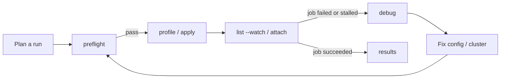

# Debug Command

`aiperf kube debug` produces a one-shot diagnostic snapshot of a benchmark namespace: which pods are in trouble, what Kubernetes events fired recently, what the cluster nodes look like, and — in verbose mode — the tail of every problem pod's logs. It is designed for triage *after* a benchmark has misbehaved, not for live observation.

If you need continuous updates while a benchmark is running, use [`aiperf kube attach`](./attach.md) instead.

---

## When to Use Which Command

AIPerf ships three cluster-inspection commands that overlap in theme but serve different moments in the lifecycle:

| Command | Timing | Duration | What it answers |
|---|---|---|---|
| `aiperf kube preflight` | Before deploy | One-shot | "Will my cluster even accept this job?" (JobSet CRD and controller present, RBAC permissions granted, nodes have capacity) |
| `aiperf kube attach` | During a run | Streaming | "What is the job doing right now?" (live progress from the controller) |
| `aiperf kube debug` | After something went wrong | One-shot | "Why did this job fail or stall?" (container-status problem map, recent events, node pressure, failed-pod logs) |

Use `debug` when:

- A benchmark is stuck in Pending and you want a single report to attach to an issue.
- Pods are CrashLoopBackOff-ing and you want all their log tails in one place.
- The operator's `status.phase` is `Failed` and you want a post-mortem summary without scripting `kubectl` calls.
- An AI agent is triaging a failure and needs a structured, grep-friendly snapshot.

Use `aiperf kube list --watch` instead when the job is still running and you
want to catch the state transition as it happens. Use `aiperf kube attach` for
the live progress and log stream of one job.



---

## CLI Reference

```
aiperf kube debug [OPTIONS]
```

All flags are optional. With no flags, `debug` falls back to the namespace of the last benchmark deployed from this machine (the same record `aiperf kube results` uses) and inspects every AIPerf pod it finds there.

| Flag | Short | Default | Description |
|---|---|---|---|
| `--namespace` | `-n` | last-deployed benchmark's namespace | Kubernetes namespace to inspect. |
| `--job-id` | `-j` | (auto-resolve) | AIPerf job ID **or AIPerfSweep name** to diagnose. A sweep name selects `status.currentChildRef.name`, or its latest completed `status.runs[].childName` when no child is running, and restricts the report to that child's pods. |
| `--all-namespaces` | `-A` | `false` | Inspect every namespace that contains at least one AIPerf JobSet. |
| `--verbose` | `-v` | `false` | Fetch logs from problem pods and show all recent events (not just `Warning`s). |
| `--variation` | | (unset) | When `--job-id` is an AIPerfSweep name, target child variation index (0..199); resolves to `<sweep>-v<idx:02d>[-t<trial>]`. `-v` is reserved for `--verbose`, so use the long form. |
| `--trial` | `-t` | (unset) | Trial index (0..9) within a sweep variation. Requires `--variation`. |
| `--kubeconfig` | | `$KUBECONFIG` or `~/.kube/config` | Path to kubeconfig file. |
| `--kube-context` | | current context | Kubernetes context to use. |

### Namespace resolution order

`debug` picks its target(s) using the first rule that matches:

1. `-A` / `--all-namespaces` — list every namespace with an AIPerf JobSet.
2. `-j <job-id>` — resolve the AIPerfJob / AIPerfSweep / JobSet with that name and use its namespace. For an AIPerfSweep, select the current child or latest completed child; use `--variation` and optionally `--trial` to choose a different child explicitly. Prints a warning and returns without a report when the sweep has not exposed any child yet.
3. `-n <namespace>` — use the given namespace verbatim.
4. Fall back to the namespace recorded for the last benchmark deployed from this machine (`default` when that record carries no namespace). When no last-benchmark record exists at all, `debug` prints `No job_id specified and no previous benchmark found` and returns without a report.

---

## What It Collects

For each target namespace, `debug` gathers five independent slices of cluster state and renders them as sections in the report. The collection is best-effort: a failing API call in one section does not prevent the others from being displayed.

### 1. Pod problem map

Every AIPerf pod in the namespace (selected by the `app=aiperf` label — `AIPerfLabels.SELECTOR` in `src/aiperf/kubernetes/constants.py` — or a narrower per-job selector when `-j` is set, which appends `aiperf.nvidia.com/job-id=<job-id>`) is walked for container-status problems. See `_extract_pod_info` in `src/aiperf/cli_commands/kube/_debug_extract.py` — every init and app container status is classified into one of:

| State | Severity | Suggested action |
|---|---|---|
| `CrashLoopBackOff` | CRITICAL | Check logs for the root cause. |
| `ImagePullBackOff` | CRITICAL | Verify the image name and registry access. |
| `ErrImagePull` | CRITICAL | Check image name, tag, and pull secrets. |
| `OOMKilled` (current or previous) | CRITICAL | Increase memory limits. |
| `CreateContainerConfigError` | ERROR | Check ConfigMaps, Secrets, and volume mounts. |
| `RunContainerError` | ERROR | Check security context and resource limits. |
| Pending with a waiting `reason` (e.g. `ContainerCreating`, `PodInitializing`) | WARNING | Container is waiting for the given reason. |
| `Unschedulable` (pod-level condition) | CRITICAL | Check node resources, taints/tolerations, and node selectors. |

The report also shows each pod's `phase`, total restart count across init and app containers, and the node it landed on.

### 2. Benchmark diagnostics

When `-j` / `--job-id` targets a specific AIPerfJob, directly or by resolving
an AIPerfSweep child, the operator-published
`status.liveMetrics` is run through the detectors in
`src/aiperf/kubernetes/benchmark_diagnosis.py` (`diagnose_benchmark`).
These complement the pod problem map above: that section reports *container*
faults, this one reports what the *benchmark* is doing. When the CR's `.status`
cannot be re-fetched, a minimal status is reconstructed from the cached job
projection so the detectors still run.

| Finding | Trips when | Threshold env var |
|---|---|---|
| `high_error_rate` | the `request_error_rate` metric, converted from percentage points to a fraction, exceeds the threshold | `AIPERF_K8S_DIAGNOSIS_HIGH_ERROR_RATE_THRESHOLD` (default `0.05`) |
| `high_latency` | request-latency p99 exceeds N x the average | `AIPERF_K8S_DIAGNOSIS_HIGH_LATENCY_P99_MULTIPLIER` (default `10.0`) |
| `stalled_pending` | phase is `Pending` for longer than the threshold | `AIPERF_K8S_DIAGNOSIS_STALLED_PENDING_THRESHOLD_SECONDS` (default `60.0`) |
| `stalled_running` | phase is `Running` past the threshold with **zero** throughput **and** zero completed requests | `AIPERF_K8S_DIAGNOSIS_STALLED_RUNNING_THRESHOLD_SECONDS` (default `30.0`) |

`stalled_running` deliberately requires both signals to be absent: throughput
legitimately reads `0.0` between liveMetrics windows on a healthy run, so
throughput alone would produce false alarms.

`high_error_rate` reads `request_error_rate` rather than the raw counters
because it is the only error signal that reaches `status.liveMetrics` at all:
`error_request_count` carries `MetricFlags.ERROR_ONLY` and is filtered out
before publication. Note the unit mismatch this creates — `request_error_rate`
is in **percentage points** (`100 x errors / completed`) while
`AIPERF_K8S_DIAGNOSIS_HIGH_ERROR_RATE_THRESHOLD` is a **fraction**, so the
detector divides by 100 before comparing. The denominator is completed requests
(successes + errors), taken from `completed_request_count`; `request_count`
counts valid requests only and is never the denominator. The finding's detail
line omits the `(errors/total)` counts on an all-error run, where no counter is
published and only the rate survives.

The section is omitted entirely when nothing trips, and when no specific job is
targeted (`-A` or a bare namespace), since the detectors need one CR's status.

#### Worker-state source

`AIPerfJob.status.workers.total` is set at job creation from
`RuntimeConfig.workers`, and `ready` comes from the JobSet's
`replicatedJobsStatus[name="workers"].ready` pod count multiplied by
`workersPerPod` (`_update_worker_counts` in
`src/aiperf/operator/handlers/monitor.py`) —
not from the controller pod. The controller's own worker view is served by its
API sidecar, which queries the SystemController's authoritative worker tracker
for each response, so a sidecar
that starts late or misses a pub/sub update still reports current data. The
internal `/api/debug/pod-states` and `/api/debug/worker-startup-states`
endpoints use the same snapshot and identify it with `source: controller`.
During controller startup, shutdown, or an RPC timeout, both API paths fall
back to their local bus-fed cache; the debug response then reports
`source: cache`. The query timeout is controlled by
`AIPERF_API_SERVER_GET_POD_STATES_TIMEOUT` (default `2.0` seconds).

### 3. Namespace events

Recent `Event` objects are fetched from the target namespace (CoreV1 `list_namespaced_event`) and sorted newest-first. By default `debug` shows up to 15 `Warning` events; with `-v` it widens to the 30 most-recent events of any type. See `_get_namespace_events` in `src/aiperf/cli_commands/kube/debug.py`.

### 4. Node resources

Cluster-wide node information is collected once per invocation (shared across all namespaces when `-A` is set). For each node the report shows:

- Ready condition
- CPU capacity and allocatable
- Memory capacity and allocatable
- `nvidia.com/gpu` capacity and allocatable (rendered as `-` when the node reports no GPUs)
- Any active pressure conditions: `MemoryPressure`, `DiskPressure`, `PIDPressure`

See `_get_node_resources` in `src/aiperf/cli_commands/kube/debug.py`.

### 5. Problem pod logs (verbose only)

When `-v` is passed, `debug` calls `read_namespaced_pod_log` on every container of every pod flagged with at least one problem, tailing the last 20 lines. If the API call fails (pod deleted, container not yet started, RBAC denied), the report substitutes `<logs unavailable>` or `<error fetching logs>` and continues. See `_get_problem_pod_logs` in `src/aiperf/cli_commands/kube/debug.py`.

---

## Output Format

`debug` renders a human-oriented Rich report to the terminal. Each namespace produces the same section sequence:

1. `Diagnostic Report: <namespace>` header
2. Pod overview table (`POD`, `STATUS`, `RESTARTS`, `NODE`, `ISSUES`), or a `No pods found` warning
3. `Problems Found` list (or a `Problems` header with `No problems detected` on a clean namespace)
4. `Benchmark Diagnostics` list (only when a specific job was targeted and at least one detector tripped)
5. `Warning Events` table (or `Recent Events` table under `-v`). Without `-v` and with no warning events, `No warning events found` is printed instead; under `-v` with no events at all the section is omitted
6. `Node Resources` table (omitted when no nodes could be listed)
7. `Problem Pod Logs` sections (only under `-v`, only for pods with problems)
8. `Summary` footer (pod counts, warning-event count, nodes under pressure)

The report is rendered by `_print_report` in `src/aiperf/cli_commands/kube/_debug_report.py`.

`debug` does not currently emit machine-readable JSON. If you need structured output for automation, script against `kubectl get events`, `kubectl get pods -o json`, and `kubectl get aiperfjob -o json` directly.

---

## Triage Recipes

The scenarios below are grouped by the symptom you'd see in `aiperf kube list`. Each one shows the exact command to run and what to look for in the output.

### Pod OOMKilled mid-run

Symptom: a worker pod restarts repeatedly; `list --watch` shows request-rate gaps.

```bash
aiperf kube debug -j aiperf-bench-7f2a -v
```

In the report:

- **Problems Found** section — look for `OOMKilled` or `OOMKilled (previous)` rows. The pod name is in brackets.
- **Summary** — `Nodes under pressure:` will list any node reporting `MemoryPressure`; if the OOM pod is pinned there, the node is the root cause rather than your memory request.
- **Problem Pod Logs** — the last 20 lines usually show the allocation site (e.g. a large dataset load).

Fix by raising the container's memory limit.

### ImagePullBackOff on a fresh deployment

Symptom: `aiperf kube list` shows the job in `Pending` for minutes; no worker pods have transitioned to `Running`.

```bash
aiperf kube debug -j aiperf-bench-7f2a
```

In the report:

- **Problems Found** — `ImagePullBackOff` or `ErrImagePull` with container name.
- **Warning Events** — the `Failed` event's `MESSAGE` column contains the actual registry error (unauthorized, manifest not found, network unreachable).

Fix by correcting the image tag in the spec, adding an `imagePullSecrets` reference, or verifying that cluster nodes can reach the registry.

### PVC binding failure

Symptom: pods stuck in `Pending`, but there is no image error.

```bash
aiperf kube debug -n my-benchmark -v
```

In the report:

- **Problems Found** — an `Unschedulable` entry on a pod, severity `CRITICAL`, with a message like `persistentvolumeclaim "aiperf-results" not found` or `0/4 nodes are available: pod has unbound immediate PersistentVolumeClaims`.
- **Recent Events** (verbose) — the `FailedScheduling` events from the scheduler, repeated every few seconds.

Fix by ensuring the StorageClass exists and a provisioner is running; see [configuration.md](./configuration.md#storage).

### CrashLoopBackOff in the controller

Symptom: `aiperf kube list` shows the job `Failed` within seconds of deploy.

```bash
aiperf kube debug -j aiperf-bench-7f2a -v
```

In the report:

- **Problems Found** — the controller pod's container is in `CrashLoopBackOff`.
- **Problem Pod Logs** — the tail almost always contains the Python traceback. Common causes: bad dataset URL, missing tokenizer HF token, invalid endpoint URL.

Fix the config and redeploy. If the traceback mentions an AIPerf subsystem, cross-reference it against [ai-debugging-guide.md](./ai-debugging-guide.md).

### Zero pods scheduled

Symptom: `aiperf kube list` shows the job, but `kubectl get pods` in the namespace is empty.

```bash
aiperf kube debug -n my-benchmark -v
```

In the report:

- **Pods table** — `No pods found` warning at the top.
- **Recent Events** (verbose) — look for `JobSet` or `AIPerfJob` `Warning` events. Common causes: the operator failed to admit the CR (check the operator pod itself with `kubectl logs -n aiperf-system deploy/aiperf-operator`), or the JobSet hit a quota.
- **Node Resources** — if every node reports `Ready: No` or pressure, the scheduler is refusing to place anything.

Fix by correcting the CR, clearing quota, or resolving the node-level issue before redeploying.

---

## Exit Codes

| Code | Meaning |
|---|---|
| `0` | Report printed successfully. Note: `debug` exits `0` even when problems are found — the report is the payload. |
| `0` | `-j <job-id>` was given, no job exists with that ID. A user-facing `No AIPerf job found with ID` error is printed and `debug` returns cleanly. |
| `0` | `-A` was given and no namespace contained an AIPerf JobSet. A warning is printed. |
| `1` | Unrecoverable failure (kubeconfig missing, cluster unreachable, unexpected exception). The error is surfaced via the shared `cli_utils.exit_on_error(title="Error Running Diagnostics")` wrapper, which prints a traceback and a red panel, then exits `1`. |

If you are wrapping `debug` from a script and need to distinguish "ran clean, found problems" from "ran clean, no problems", parse the **Summary** section — specifically the `Pods: N total, M running, K with issues` line.

---

## See Also

- [`aiperf kube attach`](./attach.md) — live progress stream for a running job.
- [`aiperf kube preflight`](./preflight.md) — pre-deploy checks that often prevent the failures `debug` diagnoses.
- [AI Debugging Guide](./ai-debugging-guide.md) — structured troubleshooting recipes that use `debug` output as input.
- Source: `src/aiperf/cli_commands/kube/debug.py`, `src/aiperf/cli_commands/kube/_debug_extract.py`, `src/aiperf/cli_commands/kube/_debug_report.py`.
