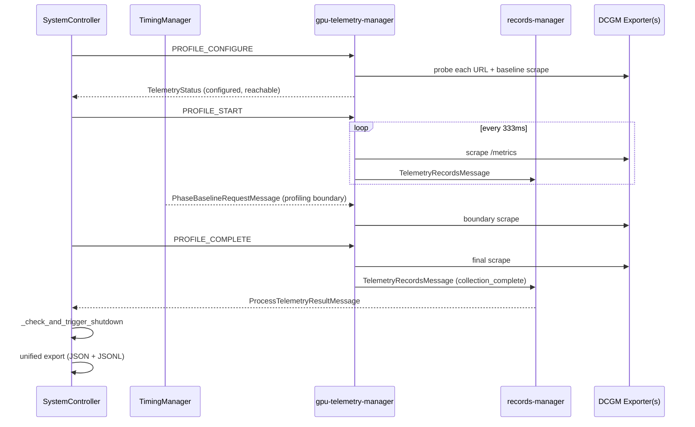

# GPU Telemetry on Kubernetes

This page documents how AIPerf collects GPU telemetry when running on Kubernetes: the dedicated
`gpu-telemetry-manager` sidecar container, how DCGM endpoints are resolved, and the
ingest path into the final benchmark report.

For the general (non-Kubernetes) tutorial — Dynamo setup, DCGM Exporter container
flags, pynvml mode, custom metrics CSVs, and console/dashboard output — see
[`docs/tutorials/gpu-telemetry.md`](../tutorials/gpu-telemetry.md). This page
focuses only on what is Kubernetes-specific.

## Opt-out by default

GPU telemetry is **on by default** for every `aiperf kube profile` run. The
`GpuTelemetryConfig` in [`src/aiperf/config/gpu_telemetry.py`](https://github.com/ai-dynamo/aiperf/blob/main/src/aiperf/config/gpu_telemetry.py)
defaults `enabled=True`, and the JobSet spec propagates that through
`AIPerfJobSetSpec.gpu_telemetry_enabled` in
[`src/aiperf/kubernetes/jobset.py`](https://github.com/ai-dynamo/aiperf/blob/main/src/aiperf/kubernetes/jobset.py).

To skip the sidecar entirely — useful for non-GPU inference targets, CPU-only
clusters, or clusters without a DCGM Exporter reachable at the pod level —
pass `--no-gpu-telemetry`:

```bash
aiperf kube profile --model Qwen/Qwen3-0.6B ... --no-gpu-telemetry
```

When disabled, the controller pod omits the `gpu-telemetry-manager` container
and the memory estimator drops its allocation (see `_estimate_gpu_telemetry`
in [`src/aiperf/kubernetes/_memory_estimator/components.py`](https://github.com/ai-dynamo/aiperf/blob/main/src/aiperf/kubernetes/_memory_estimator/components.py)).

## No auto-discovery — user supplies the DCGM URLs

AIPerf does **not** discover the in-cluster DCGM Exporter service via the
Kubernetes API. The candidate endpoint list is built entirely from two
sources:

1. **`Environment.GPU.DEFAULT_DCGM_ENDPOINTS`** — built-in defaults
   (overridable with `AIPERF_GPU_DEFAULT_DCGM_ENDPOINTS`):
   - `http://localhost:9400/metrics`
   - `http://localhost:9401/metrics`

   Inside the controller pod, `localhost` addresses point at the pod itself,
   which never runs DCGM — so the defaults are effectively unreachable on
   Kubernetes and exist only for parity with local Docker runs.

2. **`--gpu-telemetry <urls...>`** — user-supplied URLs, appended to the
   defaults in order (deduplicated) by `GPUTelemetryManager` in
   [`src/aiperf/gpu_telemetry/manager.py`](https://github.com/ai-dynamo/aiperf/blob/main/src/aiperf/gpu_telemetry/manager.py).

For a Kubernetes run you almost always need to pass at least one explicit URL
pointing at a cluster-reachable DCGM Exporter Service:

```bash
aiperf kube profile \
    --model Qwen/Qwen3-0.6B \
    --url dynamo-frontend.inference.svc.cluster.local:8000 \
    --gpu-telemetry \
        http://dcgm-exporter.gpu-operator.svc.cluster.local:9400/metrics
```

The URL scheme prefix (`http://`) is optional: bare `host:port` forms get an
`http://` prefix while the CLI flag is converted into the config section
(`_url` in [`src/aiperf/config/flags/_converter_telemetry.py`](https://github.com/ai-dynamo/aiperf/blob/main/src/aiperf/config/flags/_converter_telemetry.py)),
and a missing `/metrics` path suffix is appended later by
`GPUTelemetryManager._normalize_dcgm_url`. An item with neither `http` nor a
`:` in it is rejected as an invalid `--gpu-telemetry` value rather than
treated as a bare hostname.

There is **no `gpuTelemetry.*` section in the Helm chart**. Endpoint
configuration is a per-run CLI flag, not a cluster-wide operator setting.

## Sidecar container

When `gpu_telemetry_enabled=True`, the JobSet builder injects a dedicated
`gpu-telemetry-manager` container into the controller pod via
`_create_optional_manager_containers` in
[`src/aiperf/kubernetes/jobset.py`](https://github.com/ai-dynamo/aiperf/blob/main/src/aiperf/kubernetes/jobset.py).
It runs the `GPUTelemetryManager` service from
[`src/aiperf/gpu_telemetry/manager.py`](https://github.com/ai-dynamo/aiperf/blob/main/src/aiperf/gpu_telemetry/manager.py).

| Property | Value | Source |
|---|---|---|
| Container name | `gpu-telemetry-manager` | `Containers.GPU_TELEMETRY_MANAGER` |
| Service type | `gpu_telemetry_manager` | plugin registry (`plugins.yaml`) |
| Health port | `8086` (`GPU_TELEMETRY_MANAGER_HEALTH`) | `_PortSettings` |
| Default CPU request/limit | `25m` | `_K8sEnvironment.GPU_TELEMETRY_MANAGER` |
| Default memory request/limit | `192Mi` | `_K8sEnvironment.GPU_TELEMETRY_MANAGER` |
| Collection interval | `333ms` (~3Hz) | `Environment.GPU.COLLECTION_INTERVAL` |

Override resource limits with environment variables on the operator (or on
a direct-mode controller pod):

- `AIPERF_K8S_GPU_TELEMETRY_MANAGER_CPU=500m`
- `AIPERF_K8S_GPU_TELEMETRY_MANAGER_MEMORY=1Gi`

The scrape interval applies to every DCGM endpoint and is overridable via
`AIPERF_GPU_COLLECTION_INTERVAL`.

## Ingest path into the benchmark report

The sidecar does not accumulate anything itself: every scrape is pushed to
`RecordsManager` as a `TelemetryRecordsMessage` on the records PUSH socket,
and `RecordsManager` owns the GPU telemetry accumulator. Lifecycle commands
from `SystemController` drive the boundaries:

1. **`PROFILE_CONFIGURE`** — `GPUTelemetryManager` resolves endpoints, probes
   reachability, initializes each reachable collector, takes one pre-warmup
   baseline scrape, and publishes a `TelemetryStatusMessage` (including
   `endpoints_configured` / `endpoints_reachable`) back to the controller.
2. **`PROFILE_START`** — collectors start and begin periodic scrapes at
   `COLLECTION_INTERVAL`; each scrape is pushed to `RecordsManager` as it
   happens.
3. **`PhaseBaselineRequestMessage` (profiling phase boundary)** — the timing
   service's phase publisher broadcasts this message; `GPUTelemetryManager`
   handles it through `BaselineCollectorMixin`, which calls the manager's
   `collect_baseline` and forces a boundary scrape so counter deltas have a
   sample sitting right at the post-warmup boundary rather than relying on
   whichever periodic scrape happened to land last. Capture is best-effort —
   a failure is logged as a warning, never fatal.
4. **`PROFILE_COMPLETE`** — forces a final scrape, stops collectors, then
   pushes one terminal `TelemetryRecordsMessage` with
   `collection_complete=True` so `RecordsManager` knows no further telemetry
   records can follow.
5. **`RecordsManager`** — exports the accumulated telemetry over the
   profiling-phase window (plus `Environment.GPU.FINAL_SCRAPE_GRACE_NS` of
   trailing grace so the final scrape is included) and publishes exactly one
   `ProcessTelemetryResultMessage` carrying a `ProcessTelemetryResult`.
6. **`SystemController._on_process_telemetry_result_message`** — receives the
   published message (see
   [`src/aiperf/controller/system_controller.py`](https://github.com/ai-dynamo/aiperf/blob/main/src/aiperf/controller/system_controller.py)),
   overwrites `endpoints_configured` / `endpoints_successful` on the summary
   with the values it recorded from the earlier `TelemetryStatusMessage`, and
   stores the results for the unified export. `_check_and_trigger_shutdown`
   waits for every registered result domain (profile records, telemetry,
   server metrics, accuracy) before triggering the final export.
7. **Export** — the accumulator's results are written into the top-level
   `telemetry_data` block of `profile_export_aiperf.json` (shape shown in the
   [general tutorial](../tutorials/gpu-telemetry.md#example-json-export))
   and, separately, streamed per-record to `gpu_telemetry_export.jsonl`
   via the `gpu_telemetry_jsonl_writer` plugin
   (`src/aiperf/gpu_telemetry/jsonl_writer.py`).



## Recipes

### Minimal Kubernetes run with one in-cluster DCGM endpoint

```bash
aiperf kube profile \
    --model Qwen/Qwen3-0.6B \
    --endpoint-type chat \
    --endpoint /v1/chat/completions \
    --streaming \
    --url dynamo-frontend.inference.svc.cluster.local:8000 \
    --concurrency 32 \
    --request-count 1024 \
    --gpu-telemetry \
        http://dcgm-exporter.gpu-operator.svc.cluster.local:9400/metrics
```

### Multi-node DCGM

Each node's dcgm-exporter DaemonSet typically exposes a per-node endpoint
through a headless Service (one URL per node) or via a single Service that
load-balances across nodes (one logical URL, aggregated). AIPerf treats
each URL as an independent scrape target — supply them all:

```bash
--gpu-telemetry \
    http://dcgm-node01.gpu-operator.svc.cluster.local:9400/metrics \
    http://dcgm-node02.gpu-operator.svc.cluster.local:9400/metrics \
    http://dcgm-node03.gpu-operator.svc.cluster.local:9400/metrics
```

GPU indices and hostnames in the exported report disambiguate metrics
from different endpoints.

### Disable on a CPU-only cluster

```bash
aiperf kube profile --model ... --no-gpu-telemetry
```

### Verify the sidecar is present

After submitting the job, inspect the controller pod:

```bash
kubectl -n my-benchmarks get pod -l aiperf.nvidia.com/job-id=<job-id> \
    -o jsonpath='{.items[*].spec.containers[*].name}'
```

Look for `gpu-telemetry-manager` in the listed container names. If it is
missing, the JobSet was built with `gpu_telemetry_enabled=False` — either
`--no-gpu-telemetry` was passed or the CR spec was overridden.

### Verify reachability from inside the controller pod

```bash
kubectl -n my-benchmarks exec -c control-plane <controller-pod> -- \
    curl -s -o /dev/null -w '%{http_code}\n' \
    http://dcgm-exporter.gpu-operator.svc.cluster.local:9400/metrics
```

A `200` confirms the URL is reachable from the pod network. The
`gpu-telemetry-manager` container will do the same probe during
`PROFILE_CONFIGURE` and report the result via `TelemetryStatus`.

## Troubleshooting

### No `telemetry_data` in the exported report

Either no endpoints were reachable, no records were produced before
`PROFILE_COMPLETE`, or the sidecar was disabled. Check in order:

1. Did the run include the `gpu-telemetry-manager` container?
   (`kubectl get pod ... -o jsonpath='{.spec.containers[*].name}'`)
2. Are the URLs resolvable from inside the controller pod network?
   DNS must resolve the DCGM Service, and the pod's NetworkPolicy must
   permit egress to the `:9400` target.
3. The defaults `localhost:9400` / `localhost:9401` are always tried;
   in-cluster they will fail probes silently — that is expected. Look
   for the URL you passed via `--gpu-telemetry` in the status line.

### Endpoints listed as configured but not as successful

`ProcessTelemetryResult.summary.endpoints_configured` is a display-filtered
list, not every URL attempted: it is every URL you passed via
`--gpu-telemetry` plus only those built-in defaults that turned out to be
reachable (`GPUTelemetryManager._compute_endpoints_for_display`). Unreachable
defaults are deliberately omitted so in-cluster runs don't show two dead
`localhost` rows. `endpoints_successful` includes only the endpoints that
responded during the configuration probe. A URL in the first but not the
second means the probe failed — typically DNS, NetworkPolicy, or the exporter
not listening on the expected path. DCGM Exporter serves `/metrics` by
default; verify the path suffix matches.

### Counter metrics look wrong (energy, XID, violations)

Counter-style DCGM metrics are reported as a single delta: the last valid
in-window sample minus the last valid sample strictly *before* the profiling
window (`to_metric_result_filtered` in
[`src/aiperf/common/models/telemetry_models.py`](https://github.com/ai-dynamo/aiperf/blob/main/src/aiperf/common/models/telemetry_models.py)).
Negative deltas are clamped to `0.0` so a DCGM restart mid-run reads as no
movement rather than as a large negative number. If the phase-boundary
baseline scrape fails for an endpoint, the reference falls back to whichever
periodic scrape landed most recently before the boundary, so at most one
collection interval of warmup tail leaks into the value.
`BaselineCollectorMixin` logs
`Baseline capture failed for phase '<name>' <kind>: ...` at WARN level
when that happens — grep the `gpu-telemetry-manager` container logs for
`Baseline capture failed`.

### Memory estimator shows `disabled (no DCGM URLs)`

The memory estimator reports zero GPU-telemetry memory usage when
`gpu_telemetry.enabled=False` OR `gpu_telemetry.urls` is empty (defaults
never count as URLs for estimation purposes — see
`_derive_gpu_telemetry` in
[`src/aiperf/kubernetes/_memory_estimator/params.py`](https://github.com/ai-dynamo/aiperf/blob/main/src/aiperf/kubernetes/_memory_estimator/params.py)).
That is a display heuristic, not a runtime gate: the sidecar still runs
and still tries the built-in defaults. To prevent it from running at
all, use `--no-gpu-telemetry`.

## See also

- [`docs/tutorials/gpu-telemetry.md`](../tutorials/gpu-telemetry.md) — general (local) GPU telemetry tutorial, console/dashboard output, CSV and JSON schemas, pynvml mode
- [`docs/kubernetes/configuration.md`](configuration.md) — resource overrides and operator environment variables
- [`docs/kubernetes/sidecars.md`](sidecars.md) — other sidecar containers in the controller pod
- [`docs/dev/kubernetes-flow.md`](../dev/kubernetes-flow.md) — lifecycle hooks and CR state flow
