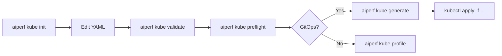

# Config Init and Manifest Generation

AIPerf ships two offline commands that let you author benchmarks as files
before touching a cluster:

- `aiperf kube init` — scaffold a starter YAML config (an `AIPerfJob` CR
  template) that you can edit by hand.
- `aiperf kube generate` — render the finished Kubernetes manifests
  (either an `AIPerfJob` CR or a raw `Namespace + RBAC + ConfigMap +
  JobSet` bundle) to stdout or a file, with no cluster calls.

Both commands are the foundation of a GitOps workflow: you commit the
rendered YAML to a repo, open a PR for review, and then `kubectl apply`
the reviewed file. No cluster access is required to run either command.

## `aiperf kube init`

### Purpose

`init` renders one of the bundled AIPerf config templates
(`src/aiperf/config/templates/`, the same library `aiperf config init`
uses), wraps it in an `AIPerfJob` CR shell, and writes the result to
stdout (or to a file with `--output`). The default template
(`minimal`) covers only the required fields; commented-out blocks for
deployment options, pod customization, and Kueue scheduling are
appended to every template so you can uncomment what you need.

### CLI reference

| Flag | Type | Default | Description |
| --- | --- | --- | --- |
| `-t`, `--template` | `str` | `minimal` | Template name to render (e.g. `minimal`, `goodput_slo`). Run with `--list` to see all bundled templates. |
| `-l`, `--list` | flag | `false` | List all available templates grouped by category. |
| `-s`, `--search` | `str` | `None` | Search templates by keyword (matches name, description, tags, features). |
| `-c`, `--category` | `str` | `None` | Filter template listings by category (substring match). |
| `-v`, `--verbose` | flag | `false` | Show tags, features, and difficulty in template listings. |
| `--model` | `str` | `None` | Override the model name in the generated config. |
| `--url` | `str` | `None` | Override the endpoint URL in the generated config. |
| `-o`, `--output` | path | `None` (stdout) | Output file path. When set, writes to disk; prompts before overwriting an existing file. |
| `--job-name` | `str` | `my-benchmark` | Value for `metadata.name` on the generated `AIPerfJob`. |

With no arguments, `init` renders the `minimal` template (bundled in
`src/aiperf/config/templates/`) wrapped in an `AIPerfJob` CR shell. Use
`--list` / `--search` / `--category` to browse the other bundled templates
and `--template` to pick one.

### Examples

```bash
# Print template to stdout, byte-for-byte (safe to pipe into kubectl or a file)
aiperf kube init

# Write to a file
aiperf kube init --output benchmark.yaml

# Write and confirm overwrite if benchmark.yaml already exists
aiperf kube init -o benchmark.yaml
```

### Template walkthrough

The scaffold is an `AIPerfJob` CR. Below is the template as emitted by
`init`; usage comments at the top are substituted with the filename
you wrote to (defaulting to `benchmark.yaml`).

```yaml
# AIPerf Kubernetes Benchmark - AIPerfJob Custom Resource
#
# Usage (CLI):
#   aiperf kube profile --config benchmark.yaml --image <your-image>
#
# Usage (GitOps / operator):
#   kubectl apply -f benchmark.yaml
#
# This file defines an AIPerfJob CR. When using the CLI, --image and other
# Kubernetes flags are still required; benchmark config comes from this file.

apiVersion: aiperf.nvidia.com/v1alpha1
kind: AIPerfJob
metadata:
  name: my-benchmark
spec:
  #
  # Minimal Configuration
  # =====================
  # The fastest way to benchmark a model. Uses shorthand forms that AIPerf
  # auto-expands:
  #   model:   -> models.items[0].name  (single string becomes a model list)
  #   dataset: -> datasets[0]            (singular becomes a one-entry list named "default")
  #   phases:  -> phases[0]              (single flat config becomes a one-entry list)
  #
  # Both snake_case and camelCase keys are accepted in all config files.
  #
  # Run: aiperf profile --config minimal.yaml

  schemaVersion: "2.0"

  benchmark:
    # "model:" is shorthand for models: { items: [{ name: ... }] }
    model: meta-llama/Llama-3.1-8B-Instruct

    endpoint:
      url: http://localhost:8000 # Path auto-detected from endpoint type (chat -> /v1/chat/completions)

    # "dataset:" (singular) is shorthand for datasets: [{name: default, ...}]
    dataset:
      type: synthetic
      entries: 100
      prompts:
        isl: 512
        osl: 128

    # Flat "phases:" with a "type:" key is shorthand for phases: [{name: profiling, ...}]
    phases:
      type: concurrency
      concurrency: 8
      requests: 100

  # === Deployment Options ===
  # ttlSecondsAfterFinished: 300
  # timeoutSeconds: 0
  # resourceMode: burstable  # burstable (requests only, default), guaranteed (requests==limits), none (omit all)

  # === Pod Customization ===
  # podTemplate:
  #   nodeSelector:
  #     nvidia.com/gpu.product: "A100"
  #   tolerations:
  #     - key: nvidia.com/gpu
  #       operator: Exists
  #       effect: NoSchedule
  #   imagePullSecrets:
  #     - my-registry-secret
  #   env:
  #     - name: AIPERF_HTTP_CONNECTION_LIMIT
  #       value: "200"
  #   volumes:
  #     - name: model-cache
  #       persistentVolumeClaim:
  #         claimName: model-cache
  #   volumeMounts:
  #     - name: model-cache
  #       mountPath: /root/.cache/huggingface

  # === Kueue Scheduling ===
  # scheduling:
  #   queueName: my-queue
  #   priorityClass: high-priority
```

The `minimal` template uses AIPerf's shorthand forms — `model:` (scalar),
`endpoint.url:`, `dataset:` (singular), and a flat `phases:` block — which
AIPerf auto-expands to their canonical list forms at load time. Point
`model:` and `endpoint.url:` at your real model and server before running
anything else. A realistic edit looks like:

```yaml
benchmark:
  model: meta-llama/Llama-3.1-8B-Instruct
  endpoint:
    url: http://llm-service.default.svc:8000/v1
```

To scaffold a different starting point (goodput SLOs, multi-phase load,
etc.), pick another bundled template with `aiperf kube init --list` and
`--template <name>`.

### Relationship with other commands

The file `init` writes is the same format accepted by every other
config-consuming command:

| Command | What it does with the file |
| --- | --- |
| `aiperf kube validate` | Parses and schema-checks the config without any cluster call. |
| `aiperf kube generate` | Renders the final manifests from the config. |
| `aiperf kube profile` | Applies and runs the benchmark on the cluster. |

`aiperf kube preflight` is deliberately absent from that table: it does
not read a config file at all. It takes `--image`, `--image-pull-secrets`,
`--secrets`, `--endpoint-url`, `--workers`, and `--output` (plus the shared
namespace/kubeconfig flags) and probes the cluster with them.

When invoking `profile` or `generate`, CLI flags for Kubernetes
settings (`--image`, `--namespace`, `--total-workers`, etc.) still
overlay the CR — the file owns the benchmark config, the flags own the
deployment shape.

## `aiperf kube generate`

### Purpose

`generate` renders the YAML that would otherwise be submitted by
`profile`, and writes it to stdout. It does not connect to a cluster
and does not require the AIPerf operator to be installed.

It has two mutually exclusive modes:

- `--operator` — emits one `AIPerfJob` CR document for a single run, or one
  `AIPerfSweep` CR document when the config has `sweep:` or requests multiple
  trials through `multiRun.numRuns > 1` / `multiRun.convergence`. Requires the
  AIPerf operator to be installed on the target cluster for `kubectl apply` to
  do anything useful.
- `--no-operator` — emits multiple documents separated by `---`:
  `Namespace`, `Role`, `RoleBinding`, `ConfigMap`, and `JobSet`. Works
  on any cluster with the JobSet controller (no operator required). This mode
  executes exactly one benchmark run; configs with `sweep:` or multi-run
  orchestration must use `--operator` or `aiperf kube sweep`.

One of the two flags must be specified; the command exits with an
error if neither (or both) is given.

### CLI reference

`generate` accepts the full set of `aiperf` benchmark flags plus the
`Kubernetes` / `KubeOptions` group. The mode flags are:

| Flag | Description |
| --- | --- |
| `--operator` | Emit one `AIPerfJob` or `AIPerfSweep` CR, selected from the resolved config. |
| `--no-operator` | Emit raw manifests (Namespace + Role + RoleBinding + ConfigMap + JobSet). |

Relevant `KubeOptions` flags that shape the rendered manifests:

| Flag | Default | Description |
| --- | --- | --- |
| `--image` | config value, installed chart default (`--operator`), or `nvcr.io/nvidia/aiperf:latest` (`--no-operator`) | Explicit container-image override. An image authored in workload YAML remains authoritative when omitted. |
| `--image-pull-policy` | `None` | `Always` / `IfNotPresent` / `Never`. |
| `--name` | auto-generated | Human-readable DNS label, max 40 chars. |
| `--namespace` | kubeconfig context namespace | Target namespace; required when your context does not set one. |
| `--total-workers` | `10` | Total workers; divided across pods by `workers_per_pod`. |
| `--ttl-seconds` | `300`. In `--no-operator` mode, when the flag is not set explicitly, `generate` overrides the default to `AIPERF_K8S_JOBSET_DIRECT_MODE_TTL_SECONDS` (8h / 28800s) so pods stay alive for `aiperf kube results`. | Seconds to keep pods after completion. |
| `--node-selector`, `--tolerations` | `{}`, `[]` | Pod placement. |
| `--queue-name`, `--priority-class` | `None` | Kueue scheduling. |
| `--annotations`, `--labels` | `{}` | Extra pod metadata. |
| `--image-pull-secrets`, `--env-vars`, `--env-from-secrets`, `--secret-mounts`, `--service-account` | `[]` / `{}` / `None` | Secrets and credentials. |

Output always goes to **stdout**. Redirect it to capture to a file; a
memory-usage estimate is printed to **stderr** so it does not
contaminate the YAML stream.

### Examples

```bash
# Render an AIPerfJob CR (or AIPerfSweep for sweep/multi-run config)
aiperf kube generate --operator \
  --model Qwen/Qwen3-0.6B \
  --url http://server:8000 \
  --image aiperf:latest

# Render raw manifests
aiperf kube generate --no-operator \
  --model Qwen/Qwen3-0.6B \
  --url http://server:8000 \
  --image aiperf:latest

# Pipe straight to kubectl
aiperf kube generate --no-operator \
  --config benchmark.yaml --image aiperf:latest \
  | kubectl apply -f -

# Capture to disk for review
aiperf kube generate --operator \
  --config benchmark.yaml --image aiperf:latest \
  > benchmarks/nightly-llama3.yaml
```

### What's in the rendered manifest

Operator mode (`--operator`) emits one document:

- `aiperf.nvidia.com/v1alpha1` `AIPerfJob` — for a single-run config, with
  `spec.benchmark` holding the benchmark body and deployment fields (`image`,
  `podTemplate`, `scheduling`, `connectionsPerWorker`, etc.) at the top of
  `spec`.
- `aiperf.nvidia.com/v1alpha1` `AIPerfSweep` — when the resolved config has a
  parameter `sweep:` or needs multiple trials. A multi-run-only config receives
  a one-cell `base` scenario so the sweep controller executes the canonical
  trial plan without inventing a parameter dimension.

Direct mode (`--no-operator`) emits, in order:

Direct mode accepts only a single-run config. It fails before writing manifests
when the resolved config requires parameter-sweep or multi-run orchestration,
because a raw JobSet has no sweep-controller owner and would otherwise execute
only the base cell.

The target namespace is not emitted -- it must already exist. Creating it
would demand cluster-scoped namespace-create rights that most benchmark
runners do not have.

1. `rbac.authorization.k8s.io/v1` `Role` — grants the benchmark pods
   get/list/watch on `configmaps`, `services`, `endpoints`, `events`,
   `pods`, `pods/log`, `jobs`, and `jobsets/status`, plus
   get/list/watch/**patch** on `jobsets` and on `aiperfjobs` /
   `aiperfjobs/status`. `patch` is the only write verb; the pods share one
   ServiceAccount, so nothing here can create, replace, or delete an object.
2. `rbac.authorization.k8s.io/v1` `RoleBinding` — binds the Role to
   the pods' ServiceAccount (default: `default`).
3. `v1` `ConfigMap` named `aiperf-<job_id>-config`, containing a single
   key `run_config.json` with the fully materialized `BenchmarkRun`
   (1 MiB hard cap — `generate` validates this before emitting).
4. `jobset.x-k8s.io/v1alpha2` `JobSet` named `aiperf-<job_id>` — two
   replicated jobs, one `controller` pod and N `workers` pods. GPU
   telemetry and server metrics are optional extra containers inside the
   controller pod, not separate pods.

Worker count is derived from the max phase concurrency and
`connections_per_worker`; `generate` runs the same
`apply_k8s_runtime_config` + `apply_worker_config` passes that
`profile` uses, so the rendered JobSet has the correct number of
replicas baked in.

### GitOps recipe

```bash
# 1. scaffold (once)
aiperf kube init -o benchmarks/nightly-llama3.yaml
$EDITOR benchmarks/nightly-llama3.yaml

# 2. render to a reviewable artifact
aiperf kube generate --operator \
  --config benchmarks/nightly-llama3.yaml \
  --image aiperf:latest \
  --total-workers 20 \
  --namespace bench-prod \
  > manifests/nightly-llama3.yaml

# 3. commit + PR
git add benchmarks/nightly-llama3.yaml manifests/nightly-llama3.yaml
git commit -s -m "Add nightly Llama3 benchmark"
# open PR, get reviews

# 4. merge + apply
kubectl apply -f manifests/nightly-llama3.yaml
```

The source config and the rendered manifest are both tracked; the
rendered file is the one the cluster sees, so reviewers can inspect
the exact JobSet spec, RBAC rules, and ConfigMap payload that will be
applied.

### Preview vs. `profile --dry-run`

Both `generate` and `profile --dry-run` run entirely offline and
neither submits anything to the cluster. The difference is output:

| Behaviour | `aiperf kube generate` | `aiperf kube profile --dry-run` |
| --- | --- | --- |
| Cluster calls | None | None |
| AIPerfJob CR output | Yes (`--operator`) | Yes (printed as JSON, operator path) |
| Raw manifests output | Yes (`--no-operator`, YAML) | Yes (YAML, direct path / `--no-operator`) |
| Memory estimate | Yes (stderr) | Yes (stderr) |
| Intended use | Stable GitOps authoring and review | Exact preview of the corresponding `profile` path |

Both commands keep stdout machine-readable and safe to pipe: the payload is
written verbatim, so a long image reference or endpoint URL is never wrapped
into an invalid document when stdout is a pipe or file. Use `generate` when the
YAML itself is the stable artifact you want to commit or diff. Use
`profile --dry-run` to preview the exact operator or direct deployment path
without actually running it.

## Validation chain

The typical end-to-end flow is:



Each step is independent and idempotent:

1. **`init`** writes the starter file.
2. **Edit** — adjust models, endpoint, phases, pod template.
3. **`validate`** — schema-check the file; purely offline.
4. **`preflight`** — verify cluster reachability and endpoint health.
5a. **GitOps path**: **`generate`** → commit → `kubectl apply`.
5b. **CLI path**: **`profile`** — deploy and stream progress directly.

For long-lived recurring benchmarks that are reviewed and versioned,
prefer the GitOps path. For ad-hoc experiments, run `profile`
directly — it performs the same manifest generation under the hood.
