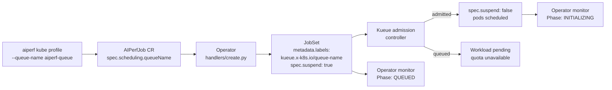

# Kueue Integration

AIPerf integrates with [Kueue](https://kueue.sigs.k8s.io/) to provide
gang-scheduling, quota management, and prioritization for benchmark JobSets.
This page explains what Kueue buys you, how to install and configure it, and
how AIPerfJobs bind to Kueue resources.

---

## What Kueue Is

Kueue is a Kubernetes-native job queueing system maintained by the upstream
`kubernetes-sigs` project. It sits between job controllers (JobSet, Job,
`RayJob`, etc.) and the cluster scheduler, admitting workloads only when the
cluster has enough free capacity in a named *ClusterQueue* (cluster-scoped
quota pool) addressed through a *LocalQueue* (namespace-scoped handle). A
workload either runs in full or stays suspended; Kueue never schedules a
partial JobSet.

Useful upstream entry points:

- [Overview](https://kueue.sigs.k8s.io/docs/overview/)
- [Concepts: ClusterQueue, LocalQueue, ResourceFlavor](https://kueue.sigs.k8s.io/docs/concepts/)
- [JobSet integration](https://kueue.sigs.k8s.io/docs/tasks/run/jobsets/)
- [Workload Priority Classes](https://kueue.sigs.k8s.io/docs/concepts/workload_priority_class/)

---

## Why Use Kueue With AIPerf

An AIPerf benchmark runs as a JobSet with two replicated jobs: one
`controller` pod (control plane, records manager, results sidecar, and the
optional telemetry containers) and N `workers` pods. All pods must start
together, or the controller sits idle while workers slowly trickle in and
the benchmark either fails or produces misleading numbers.

Kueue solves three problems that matter for benchmark campaigns:

- **Gang scheduling.** Kueue suspends the JobSet until the cluster can admit
  *every* pod at once. On a mixed cluster, this prevents a half-scheduled
  run that would skew latency metrics.
- **Priority and preemption across campaigns.** A
  `WorkloadPriorityClass` lets a smoke-test job jump the queue ahead of a
  long soak-test, or lets a tenant's urgent run preempt an idle reservation.
- **Fair sharing across teams.** A single ClusterQueue with `borrowingLimit`
  rules lets multiple namespaces share GPU capacity without one team
  starving another — useful when several groups run benchmarks on the same
  cluster.

Without Kueue, AIPerfJobs are submitted directly to the JobSet controller
and compete for nodes using default Kubernetes scheduling.

---

## Install

AIPerf does not vendor or pin a Kueue release; install any version whose
`kueue.x-k8s.io/v1beta1` API AIPerf targets (`LocalQueue`, `ClusterQueue`,
`ResourceFlavor`, `WorkloadPriorityClass`). Follow the upstream
[installation guide](https://kueue.sigs.k8s.io/docs/installation/). A typical
install applies the released manifest bundle:

```bash
kubectl apply --server-side -f \
  https://github.com/kubernetes-sigs/kueue/releases/latest/download/manifests.yaml
```

The operator runs a `Kueue Queue` preflight check during reconcile that
verifies the Kueue CRDs are present and that any referenced LocalQueue
actually exists (see `src/aiperf/operator/preflight/_infra.py`). If Kueue is
not installed and no queue was requested, the check is marked `SKIP` and
AIPerfJobs run without gang-scheduling. If an explicit queue was requested,
the check fails because the resulting suspended JobSet would otherwise never
be admitted. This check is operator-side only — the client-side
`aiperf kube preflight` command does not include it.

---

## Configuring a ClusterQueue and LocalQueue

A minimal setup for a benchmark cluster looks like this. Adjust the
`nominalQuota` values to match your real GPU inventory.

```yaml
apiVersion: kueue.x-k8s.io/v1beta1
kind: ResourceFlavor
metadata:
  name: default-flavor
---
apiVersion: kueue.x-k8s.io/v1beta1
kind: ClusterQueue
metadata:
  name: aiperf-cluster-queue
spec:
  namespaceSelector: {}
  resourceGroups:
    - coveredResources: ["cpu", "memory", "nvidia.com/gpu"]
      flavors:
        - name: default-flavor
          resources:
            - name: "cpu"
              nominalQuota: 256
            - name: "memory"
              nominalQuota: 1024Gi
            - name: "nvidia.com/gpu"
              nominalQuota: 16
---
apiVersion: kueue.x-k8s.io/v1beta1
kind: LocalQueue
metadata:
  name: aiperf-queue
  namespace: my-benchmarks
spec:
  clusterQueue: aiperf-cluster-queue
```

Optional: add a `WorkloadPriorityClass` for high-priority runs.

```yaml
apiVersion: kueue.x-k8s.io/v1beta1
kind: WorkloadPriorityClass
metadata:
  name: aiperf-high
value: 1000
description: "High-priority AIPerf benchmark runs"
```

---

## Binding an AIPerfJob to a Queue

AIPerf stamps the `kueue.x-k8s.io/queue-name` label onto the JobSet (and
starts it suspended) whenever it can resolve a queue name from either
`spec.scheduling.queueName` or the operator-side
`AIPERF_K8S_JOBSET_KUEUE_DEFAULT_QUEUE_NAME` env var. Kueue's own
namespace-annotation default works differently.

### 1. CLI flags

The `aiperf kube profile` command (and every other submit subcommand)
accepts `--queue-name` and `--priority-class`:

```bash
aiperf kube profile \
  --url http://my-server:8000/v1 \
  --model Qwen/Qwen3-0.6B \
  --queue-name aiperf-queue \
  --priority-class aiperf-high
```

These flags live in the `Kubernetes Scheduling` group and are defined on
`KubeOptions` in `src/aiperf/config/kube.py`.

### 2. CR YAML

Set the same fields directly in the AIPerfJob spec under `scheduling`:

```yaml
apiVersion: aiperf.nvidia.com/v1alpha1
kind: AIPerfJob
metadata:
  name: latency-sweep-7f2a
  namespace: my-benchmarks
spec:
  scheduling:
    queueName: aiperf-queue
    priorityClass: aiperf-high
  benchmark:
    models: ["Qwen/Qwen3-0.6B"]
    endpoint:
      urls: ["http://dynamo-agg-frontend.dynamo-server.svc:8000/v1"]
      streaming: true
    datasets:
      - name: main
        type: synthetic
        entries: 1000
    phases:
      - name: profiling
        type: concurrency
        concurrency: 50
        requests: 500
```

### 3. Cluster-wide default via Helm

The `aiperf-operator` Helm chart exposes a `kueue.defaultQueueName` value
(see `deploy/helm/aiperf-operator/values.yaml`). When set, the chart sets
`AIPERF_K8S_JOBSET_KUEUE_DEFAULT_QUEUE_NAME` on the operator container so
AIPerf's own manifest builder applies the queue label and starts the JobSet
suspended.

```yaml
# values.yaml
kueue:
  defaultQueueName: aiperf-queue
```

Kueue also honours a `kueue.x-k8s.io/default-queue-name` annotation on the
namespace, which you apply yourself with `kubectl annotate` (see
Troubleshooting below). AIPerf's own manifest builder does **not** read that
annotation: `AIPerfJobSetSpec._resolved_queue_name` in
`src/aiperf/kubernetes/jobset.py` consults only
`spec.scheduling.queueName` and the `AIPERF_K8S_JOBSET_KUEUE_DEFAULT_QUEUE_NAME`
env var, so the annotation alone does not make AIPerf add the queue label or
start the JobSet suspended. Operator preflight does read it, and treats an
annotated namespace as a satisfied queue configuration. To make Kueue
gang-scheduling default-on from AIPerf's side, set
`AIPERF_K8S_JOBSET_KUEUE_DEFAULT_QUEUE_NAME` (and optionally
`AIPERF_K8S_JOBSET_KUEUE_DEFAULT_PRIORITY_CLASS`) on the operator
deployment.

The chart can also provision the queue objects themselves instead of you
applying the YAML above by hand. Set `kueue.createQueues=true` and the chart
renders a `ResourceFlavor`, `ClusterQueue`, and `LocalQueue` from
`deploy/helm/aiperf-operator/templates/kueue-queues.yaml`, using
`kueue.flavorName`, `kueue.clusterQueueName`, `kueue.localQueueName`, and the
`kueue.resources` quota map (`cpu`, `memory`, and an optional `gpu` entry that
is skipped when empty). It is off by default so the chart renders on clusters
without Kueue CRDs, and even when enabled the template is additionally gated
on the `kueue.x-k8s.io/v1beta1` API being present. When `defaultQueueName` is
left empty and `createQueues=true`, the operator's default queue falls back to
`kueue.localQueueName`.

> **WARNING:** `kueue.createQueues=true` creates the `LocalQueue` in the
> chart's release namespace (`aiperf-system` by default), *not* in the
> namespaces your benchmarks run in. A `LocalQueue` is namespace-scoped and
> Kueue only admits a workload whose `kueue.x-k8s.io/queue-name` label
> resolves to a `LocalQueue` **in the workload's own namespace**. A benchmark
> submitted into `my-benchmarks` with the chart's queue name therefore sits in
> `Queued` forever with no error: the JobSet stays suspended and no pod is
> ever created.
>
> Create one `LocalQueue` per benchmark namespace, pointing at the shared
> `ClusterQueue` the chart made:
>
> ```bash
> kubectl create -n my-benchmarks -f - <<'EOF'
> apiVersion: kueue.x-k8s.io/v1beta1
> kind: LocalQueue
> metadata:
>   name: aiperf-queue
>   namespace: my-benchmarks
> spec:
>   clusterQueue: aiperf-cluster-queue
> EOF
> ```
>
> The `ClusterQueue` and `ResourceFlavor` are cluster-scoped, so those the
> chart really can own for you; only the `LocalQueue` handle has to be
> repeated per namespace. A missing `LocalQueue` does not surface as a CLI
> error — the JobSet simply stays suspended indefinitely — so create the
> per-namespace `LocalQueue` before submitting your first benchmark.

---

## What the Operator Does



Concretely:

1. `src/aiperf/kubernetes/jobset.py` translates
   `spec.scheduling.queueName` and `priorityClass` into JobSet labels
   (`kueue.x-k8s.io/queue-name`, `kueue.x-k8s.io/priority-class`) via
   `KueueLabels` in `src/aiperf/kubernetes/constants.py`.
2. When a `queueName` is set, the JobSet is created with
   `spec.suspend: true`. Kueue unsuspends it once the `Workload` it
   generates has been admitted.
3. `src/aiperf/operator/handlers/monitor.py::_handle_kueue_suspension`
   watches the JobSet's `spec.suspend` field. While the JobSet is suspended
   and carries a Kueue queue label, the operator surfaces the
   `QUEUED` phase on the AIPerfJob status (see `Phase.QUEUED` in
   `src/aiperf/kubernetes/phase.py`).
4. Once Kueue admits the workload, the JobSet unsuspends, pods start, and
   the monitor transitions the phase to `INITIALIZING` -> `RUNNING`.

You can observe admission directly with `kubectl`:

```bash
kubectl get workloads -n my-benchmarks
kubectl get aiperfjob latency-sweep-7f2a -n my-benchmarks \
  -o jsonpath='{.status.phase}'
```

---

## Troubleshooting

**Job stuck in `QUEUED` phase.** Kueue has accepted the Workload but has
not admitted it. Check in order:

1. `kubectl describe workload -n my-benchmarks` — look at the
   `QuotaReserved` and `Admitted` conditions. The message usually names
   the resource that is over quota.
2. `kubectl get clusterqueue aiperf-cluster-queue -o yaml` — compare
   `spec.resourceGroups.*.nominalQuota` to what the JobSet requests. Each
   worker pod requests the `AIPERF_K8S_WORKER_POD_CPU` /
   `AIPERF_K8S_WORKER_POD_MEMORY` budget (default `3350m` / `6Gi`), split
   across its containers, and `spec.resourceMode` decides whether limits are
   emitted alongside requests; see
   [`configuration.md`](configuration.md) for defaults.
3. Another admitted Workload may be holding the quota. List active
   workloads with
   `kubectl get workloads -A -o wide` and cancel stale ones.

**Operator preflight fails: `Kueue LocalQueue '<name>' not found`.** The
resolved `scheduling.queueName` references a LocalQueue that does not exist
in the target namespace. Either create it (see the YAML above) or drop the
field. `_verify_kueue_local_queue` reports `FAIL` for both causes but names
them separately: "Kueue is not installed, but LocalQueue '<name>' was
explicitly requested" versus "Kueue LocalQueue '<name>' not found". The
`SKIP` outcome comes from `_check_kueue_queue`, and only when no queue was
requested at all.

**Operator preflight warns: `Kueue is installed but no queue configured`.**
Kueue is present on the cluster but the job bypasses it. Fix by either passing
`--queue-name`, setting `spec.scheduling.queueName` in the CR, or adding
the namespace default:

```bash
kubectl annotate namespace my-benchmarks \
  kueue.x-k8s.io/default-queue-name=aiperf-queue
```

**`priorityClass` set but preemption never happens.** The
`WorkloadPriorityClass` value must be *higher* than currently admitted
workloads, and the ClusterQueue must enable preemption
(`spec.preemption.reclaimWithinCohort` / `withinClusterQueue`). See the
upstream
[preemption guide](https://kueue.sigs.k8s.io/docs/concepts/preemption/).

---

## See Also

- [`getting-started.md`](getting-started.md) — install the operator and
  run your first job.
- [`configuration.md`](configuration.md) — full AIPerfJob spec reference,
  including the `scheduling` block.
- [`production.md`](production.md) — multi-tenant and HA considerations.
