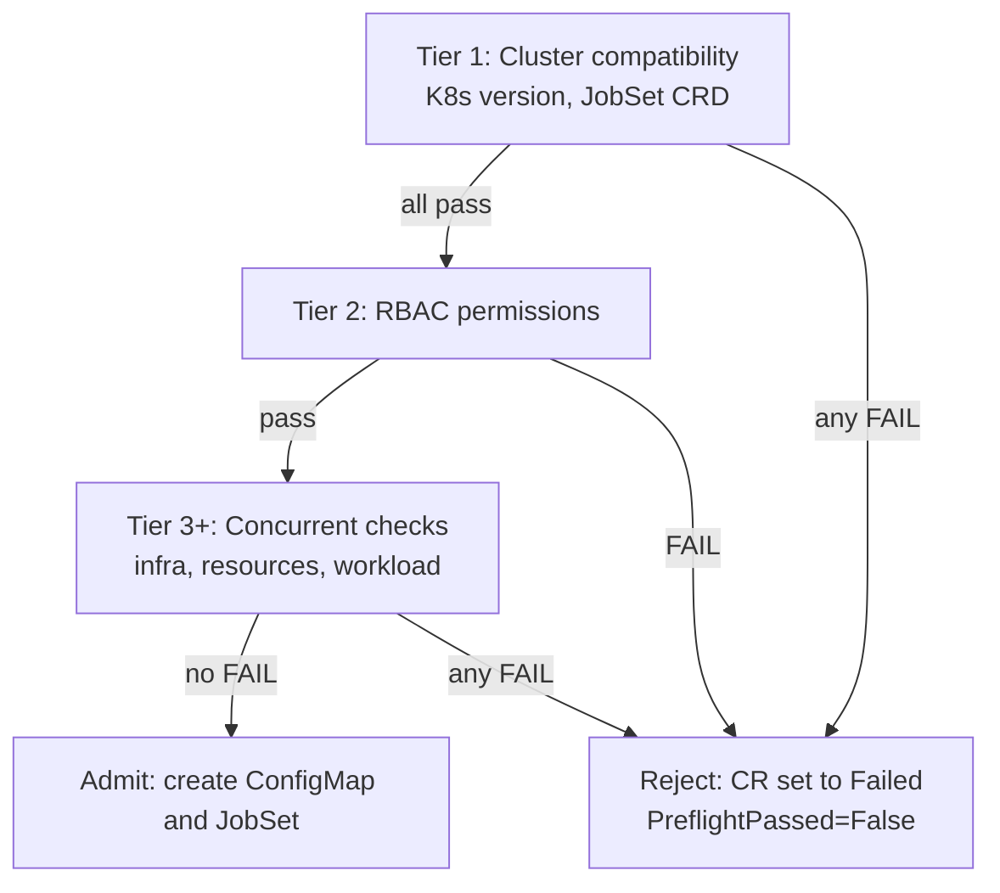

# Preflight Checks

Preflight checks validate that a Kubernetes cluster is ready to run an AIPerf benchmark
before any resources are created. They surface common failure modes (missing CRDs,
insufficient RBAC, exhausted quotas, malformed manifests) as explicit, actionable
failures instead of cryptic pod errors an hour into a run.

There are two entry points:

- **`aiperf kube preflight`** — ad-hoc CLI check against the target cluster. Does not
  require an AIPerfJob CR.
- **Operator preflight** — runs on every `AIPerfJob` creation, before the operator
  creates the ConfigMap, JobSet, Role, or RoleBinding. On any `FAIL`, the operator
  sets the CR to `Failed` with a `PreflightPassed=False` condition and does not create
  resources.

Both share the same `CheckResult` / `CheckStatus` / `PreflightResults` shapes
(`src/aiperf/kubernetes/preflight.py`). The check sets differ because each has
different inputs: the CLI knows only what the user passed on the command line; the
operator has the full resolved deployment spec.

## Tiered execution

The operator runs checks in tiers. Later tiers only run if earlier tiers pass —
no point probing node capacity if the cluster is the wrong Kubernetes version.
See `src/aiperf/operator/preflight/_checker.py:89` (`OperatorPreflightChecker.run_all`).



Tier 1 and Tier 2 are sequential and short-circuit: the first failing check aborts the
whole run. Tier 3+ checks are fanned out with `asyncio.gather` and all results are
collected regardless of individual failures — users see every problem in one pass
rather than fix-and-retry whack-a-mole.

The whole sequence is bounded by `AIPERF_PREFLIGHT_TIMEOUT` (default 30 s,
`src/aiperf/operator/environment.py:367`). If the deadline fires while a
sequential blocking check is still running, the synthetic `Preflight Timeout`
check is `FAIL` and the operator rejects the CR. A timeout among concurrent
advisory checks is reported as `WARN`; completed results are retained.

## Operator vs. CLI invocation

| Aspect | Operator (`OperatorPreflightChecker`) | CLI (`CLIPreflightChecker`) |
|---|---|---|
| Trigger | `kopf.on.create` for `AIPerfJob` | `aiperf kube preflight` |
| Inputs | Fully resolved `DeploymentConfig`, `KubernetesDeployment`, `AIPerfConfig` | CLI flags only |
| Check count | 19 | 14 |
| On FAIL | CR → `Failed`, `kopf.PermanentError` raised | CLI exits 1, JSON output on stdout if `-o json` |
| Source | `src/aiperf/operator/preflight/_checker.py` | `src/aiperf/kubernetes/preflight.py:CLIPreflightChecker` |

## Status values

Every check produces one of five statuses (`CheckStatus`,
`src/aiperf/kubernetes/preflight.py`):

| Status | When |
|---|---|
| `pass` | Check confirmed the cluster meets the requirement. |
| `fail` | Check confirmed a blocking problem. Operator rejects the CR; CLI exits 1. |
| `warn` | Potential problem or non-blocking concern (e.g. quota close to limit, tainted-node mismatch). Does not block. |
| `skip` | Check not applicable (e.g. no nodeSelector set, no secrets referenced, Kueue not installed). |
| `info` | Informational only — value reported, no pass/fail judgment (e.g. external endpoint URL was parsed but cannot be dialled from the CLI). |

## CLI command

```
aiperf kube preflight [OPTIONS]
```

| Flag | Type | Default | Purpose |
|---|---|---|---|
| `-i`, `--image` | string | unset | Container image to inspect. Enables image-registry and pull-secret checks. |
| `--image-pull-secret`, `--image-pull-secrets` | string (repeatable) | unset | Image pull secret name to verify and associate with the image check. Repeat for multiple names. |
| `--secret`, `--secrets` | string (repeatable) | unset | Referenced Kubernetes secret name to verify. Repeat for multiple names. |
| `-e`, `--endpoint-url` | string | unset | LLM endpoint URL to probe. Enables the endpoint-connectivity check (cluster-service lookup for `*.svc` URLs; informational for external URLs). |
| `-w`, `--workers` | int | 1 | Planned worker pod count. Used to project CPU and memory requirements against node capacity and namespace quotas. |
| `--node-selector` | string (JSON or repeatable `key=value`) | unset | Restricts capacity admission to nodes matching the planned pod selector. |
| `--tolerations` | JSON object or array | unset | Tolerations the planned pods carry; allows capacity admission to include matching NoSchedule or NoExecute taints. |
| `-o`, `--output` | `text`\|`json` | `text` | Output format. `text` prints rich-formatted progress; `json` prints only the machine-parseable `PreflightResults` dict on stdout. Log records are retargeted to stderr for the duration and quietened to `WARNING`, so stdout is safe to pipe into `jq` even when checks fail. |

Composite flags inherited from `KubeManageOptions` — `-n`/`--namespace`,
`--kubeconfig`, `--kube-context` — resolve connection and namespace identically to
every other `aiperf kube` subcommand. When `--namespace` is omitted, preflight
targets the namespace your kubeconfig context sets, and fails if it sets none.

Source: `src/aiperf/cli_commands/kube/preflight.py`.

### Example: JSON output

```bash
aiperf kube preflight \
    --namespace my-benchmarks \
    --image nvcr.io/nvidia/aiperf:25.04 \
    --image-pull-secret nvcr-creds \
    --secret endpoint-api-key \
    --endpoint-url http://vllm.models.svc.cluster.local:8000 \
    --workers 8 \
    -o json
```

```json
{
  "passed": true,
  "has_warnings": true,
  "checks": [
    {
      "name": "Cluster Connectivity",
      "status": "pass",
      "message": "Connected to Kubernetes cluster",
      "details": [],
      "hints": [],
      "duration_ms": 42.1
    },
    {
      "name": "Kubernetes Version",
      "status": "pass",
      "message": "Kubernetes v1.29.3 (1.24+ required)",
      "details": [],
      "hints": [],
      "duration_ms": 18.0
    },
    {
      "name": "RBAC Permissions",
      "status": "pass",
      "message": "All 8 required permissions granted",
      "details": ["  ✓ create configmaps", "  ✓ get pods"],
      "hints": [],
      "duration_ms": 210.6
    },
    {
      "name": "Resource Quotas",
      "status": "warn",
      "message": "Benchmark may exceed resource quota(s)",
      "details": ["ResourceQuota 'team-quota':", "    cpu: 40 / 64"],
      "hints": [
        "Request a quota increase or reduce worker count",
        "Quota may be scoped to a different namespace than the one you targeted"
      ],
      "duration_ms": 33.2
    }
  ]
}
```

## Check catalog — Tier 1 (blocking, cluster compatibility)

### Cluster Connectivity (CLI only)

- **Validates**: `client.VersionApi.get_code()` succeeds against the cluster.
- **Source**: `src/aiperf/kubernetes/preflight_checks.py:check_cluster_connectivity`
- **Fails if**: kubeconfig missing, cluster unreachable, TLS error, or auth rejected
  in a noninteractive session. In an interactive terminal (both stdin and stdout are
  TTYs), an apiserver `401` — or a kubeconfig load failure whose text matches a
  refreshable OIDC/exec-provider auth failure — pauses while AIPerf reloads
  kubeconfig on a capped exponential backoff until the normal external login is
  completed; press **Ctrl-C** to stop waiting. HTTP 403 still fails immediately.
- **Fix**: set `KUBECONFIG`, check `~/.kube/config`, complete the usual credential-
  provider login, and verify VPN/tunnel and RBAC.

This check is implicit for the operator (the operator is already in-cluster by the
time handlers run). On CLI failure, the remaining checks are skipped.

### Kubernetes Version

- **Validates**: `major.minor >= 1.24` per `MIN_K8S_MAJOR`/`MIN_K8S_MINOR`
  (`src/aiperf/operator/preflight/_common.py`).
- **Source**: `src/aiperf/operator/preflight/_tier1.py:_check_kubernetes_version`,
  `src/aiperf/kubernetes/preflight_checks.py:check_kubernetes_version`
- **Fails if**: cluster runs Kubernetes < 1.24.
- **Fix**: upgrade the control plane. Older versions lack JobSet support and
  sub-resource patch semantics the operator depends on.

### JobSet CRD

- **Validates**: `jobset.x-k8s.io/v1alpha2` CRD is registered and responds to
  `list_cluster_custom_object` (operator) or `read_custom_resource_definition` (CLI).
- **Source**: `src/aiperf/operator/preflight/_tier1.py:_check_jobset_crd`,
  `src/aiperf/kubernetes/preflight_checks.py:check_jobset_crd`
- **Fails if**: the CRD is not installed (HTTP 404). Any other HTTP error also
  fails — JobSet is a hard prerequisite, so neither side downgrades to a warning.
- **Fix**: install JobSet per the install-hint emitted in the failure message.
  See [Getting Started](getting-started.md) for full install steps.
  Example: `kubectl apply --server-side -f https://github.com/kubernetes-sigs/jobset/releases/latest/download/manifests.yaml`.

## Check catalog — Tier 2 (blocking, RBAC)

### RBAC Permissions

- **Validates**: every `(verb, resource, group)` in `OPERATOR_RBAC_PERMISSIONS`
  (operator) or `REQUIRED_RBAC_PERMISSIONS` (CLI) resolves `allowed=true` via
  `SelfSubjectAccessReview`.
- **Source**: `src/aiperf/operator/preflight/_tier1.py:_check_rbac_permissions`,
  `src/aiperf/kubernetes/preflight_checks.py:check_rbac_permissions`,
  `src/aiperf/operator/preflight/_common.py:OPERATOR_RBAC_PERMISSIONS`
- **Fails if**: any permission probe returns `allowed=false`. Missing permissions are
  listed as `<verb> <group>/<resource>` (core-group resources have no `<group>/`
  prefix). A probe that raises instead — apiserver timeout, 5xx, or a
  `SelfSubjectAccessReview` response with no `status` block — is classified as
  transient and downgrades the check to `warn`, never `fail`.
- **Fix**: bind a Role or ClusterRole granting the listed verbs on the namespace.
  The operator Helm chart installs these by default
  (`deploy/helm/aiperf-operator/templates/clusterrole.yaml` and
  `benchmark-rbac.yaml`); the benchmark-pod Role is also built in code by
  `RBACSpec._RULES` in `src/aiperf/kubernetes/resources.py`.

Operator permission set (15 verbs over 8 resources): configmaps, roles,
rolebindings, pods, pods/log, events (all core / rbac), jobsets, jobsets/status
(jobset group). CLI requires a subset of 8.

`SelfSubjectAccessReview` reviews *the caller's* identity, so this check covers
the operator ServiceAccount (operator path) or your kubeconfig user (CLI path).
It does not probe the benchmark pods' ServiceAccount, whose narrower Role is
built separately in code by `RBACSpec._RULES` in
`src/aiperf/kubernetes/resources.py` — see
[RBAC and Security](rbac-security.md#operator-created-per-job-role). In
particular, `create jobsets` appearing in the list above is a requirement on the
caller, never on a benchmark pod.

## Check catalog — Tier 3 (concurrent, infra)

### Namespace (CLI only)

- **Validates**: the target namespace already exists. AIPerf never creates
  namespaces, so "you could create it" is not a pass.
- **Source**: `src/aiperf/kubernetes/preflight_checks.py:check_namespace`
- **Status**:
  - `pass` — namespace exists.
  - `fail` — namespace missing, or a non-404/403 HTTP error.
  - `skip` — 403 on `read_namespace` (cannot verify; the namespace may still work).
- **Fix**: `kubectl create namespace <ns>`, or have an admin do so, then re-run.

### JobSet Controller

- **Validates**: a deployment containing `"jobset"` in its name exists in
  `jobset-system` and has `ready_replicas > 0`.
- **Source**: `src/aiperf/operator/preflight/_infra.py:_check_jobset_controller`,
  `src/aiperf/kubernetes/preflight_checks.py:check_jobset_controller`
- **Status**:
  - `pass` — deployment found and ready.
  - `warn` — deployment found but not ready.
  - `warn` — deployment not found (CLI: `fail`).
  - `skip` — cannot list `jobset-system` (403).
- **Fix**: `kubectl get pods -n jobset-system` to diagnose; reinstall the JobSet
  controller if missing.

### AIPerf Operator (CLI only)

- **Validates**: the `AIPerfJob` CRD is registered and an AIPerf operator pod can
  be found cluster-wide.
- **Source**: `src/aiperf/kubernetes/preflight_checks.py:check_aiperf_operator`
- **Status**: `pass` when a running operator pod is found; `warn` when the CRD or
  pod cannot be verified, including a forbidden cluster-wide pod list. Direct-mode
  submission does not require the operator.
- **Fix**: install or diagnose the operator, grant cluster-wide pod-list access to
  verify it, or submit with `--direct`.

### Service Account (operator only)

- **Validates**: if `spec.podTemplate.serviceAccountName` is set, the named service
  account exists in the target namespace.
- **Source**: `src/aiperf/operator/preflight/_infra.py:_check_service_account`
- **Status**:
  - `skip` — no custom service account configured (operator uses default).
  - `pass` — service account exists.
  - `fail` — 404 on `read_namespaced_service_account`.
  - `warn` — any other API error (cannot verify).
- **Fix**: `kubectl create serviceaccount <name> -n <namespace>`.

### DNS Resolution

- **Validates**: a `kube-system` deployment carrying the canonical
  `k8s-app=kube-dns` label exists and is ready. The label is matched rather than a
  `"coredns"` name substring so sibling deployments like `coredns-monitoring` do
  not satisfy the check. Workers resolve the controller's DNS name for ZMQ
  connections, so a broken DNS plane is a silent killer.
- **Source**: `src/aiperf/operator/preflight/_infra.py:_check_dns`,
  `src/aiperf/kubernetes/preflight_checks.py:check_dns`
- **Status**: `pass` if ready, `warn` if found-but-not-ready or not found. The
  operator returns `skip` on a 403 listing `kube-system`; the CLI reports any
  API error — 403 included — as `warn`.
- **Fix**: `kubectl get pods -n kube-system -l k8s-app=kube-dns`.

### Network Policies

- **Validates**: enumerates `NetworkPolicy` objects in the target namespace.
- **Source**: `src/aiperf/operator/preflight/_infra.py:_check_network_policies`,
  `src/aiperf/kubernetes/preflight_checks.py:check_network_policies`
- **Status**:
  - `pass` — no policies (pod-to-pod traffic unrestricted).
  - `warn` — at least one policy exists; lists all by name. AIPerf pods need
    multi-port TCP intra-namespace traffic, so restrictive policies can silently
    break the ZMQ mesh.
  - `skip` — 403.
- **Fix**: ensure policies allow ingress/egress within the namespace on ZMQ ports.

### Kueue Queue (operator only)

- **Validates**:
  - If `spec.scheduling.queueName` is set: the named `LocalQueue` exists in the
    namespace.
  - If not set and Kueue is installed: the namespace has the
    `kueue.x-k8s.io/default-queue-name` annotation.
- **Source**: `src/aiperf/operator/preflight/_infra.py:_check_kueue_queue`
- **Status**:
  - `pass` — queue exists, or namespace has default-queue annotation.
  - `fail` — explicit `queueName` set but Kueue is not installed or the
    `LocalQueue` is not found.
  - `skip` — Kueue CRD not installed and no queue was requested.
  - `warn` — Kueue installed, no queue configured; job will bypass gang-scheduling.
- **Fix**: create the `LocalQueue`, set `scheduling.queueName`, or annotate the
  namespace with `kueue.x-k8s.io/default-queue-name`.

### Pod Security Admission (operator only)

- **Validates**: reads the `pod-security.kubernetes.io/enforce` label on the
  namespace. AIPerf pods run as non-root (UID 1000) with
  `seccomp=RuntimeDefault` and drop all capabilities, so they are compatible with
  `privileged` and `baseline`. The `restricted` level adds further constraints
  (runAsNonRoot, allowPrivilegeEscalation=false, locked seccomp/capabilities, no
  host paths) that the AIPerf pod template has not been fully audited against.
- **Source**: `src/aiperf/operator/preflight/_infra.py:_check_pod_security_admission`
- **Status**:
  - `pass` — no PSA label, or label is `privileged` or `baseline`.
  - `warn` — label is `restricted` (not yet verified compatible) or unknown PSA
    level, or namespace lookup failed.
- **Fix**: usually informational; relabel the namespace if the enforced level
  blocks pod creation.

## Check catalog — Tier 3 (concurrent, resources)

Four checks — `Node Resources`, `Per-Node Schedulability`, `Resource Quotas`, and
`Memory Estimation` — are short-circuited to `skip` when `spec.resourceMode=none`
(controller and worker CPU/mem requests and limits are intentionally omitted).
`Node Selector Match` and `Tolerations` inspect placement rather than capacity and
still run. See `OperatorPreflightChecker._resource_mode_skip`.

### Node Resources

- **Validates**: free CPU and memory across Ready, uncordoned nodes is at least
  the deployment's estimated requirement (controller pods + `workers * worker-pod`).
  The CLI check subtracts the resource *requests* of all Running pods
  (`list_pod_for_all_namespaces`) from each node's allocatable, so a
  95%-booked cluster no longer reports full capacity; nodes with
  `spec.unschedulable` (cordoned) are excluded entirely. When the pod list is
  unavailable — typically a user without cluster-wide pod read — the check falls
  back to raw allocatable and says so in its details rather than silently
  overstating free space. The operator additionally excludes Ready nodes whose
  `NoSchedule` / `NoExecute` taints are not tolerated by
  `spec.podTemplate.tolerations`, so a cluster of all-tainted GPU nodes does not
  report false capacity for a CPU-only workload.
- **Source**: `src/aiperf/operator/preflight/_resources.py:_check_node_resources`,
  `src/aiperf/kubernetes/preflight_capacity_checks.py:check_node_resources`
- **Status**:
  - `pass` — cluster has sufficient aggregate free capacity and at least one node
    can fit the single largest pod (CLI combined check).
  - `warn` — aggregate shortfall. Message includes required vs. available CPU/mem.
    The CLI also warns when every node is individually too booked right now to
    fit the largest pod, since those pods stay Pending until capacity frees up.
    The operator also warns when no nodes exist at all, or when no node is both
    Ready and schedulable.
  - `fail` (CLI only) — no nodes in the cluster, or no single node can fit any
    one pod even when empty (a structural sizing problem rather than a transient
    booking). (The operator covers the per-node case with `Per-Node
    Schedulability` instead.)
- **Fix**: reduce worker count, add nodes, or right-size the pods via
  `AIPERF_K8S_WORKER_POD_*` and the per-container control-plane resource vars
  (`AIPERF_K8S_SYSTEM_CONTROLLER_*`, `AIPERF_K8S_RECORDS_MANAGER_*`, etc.).
  There is no `AIPERF_K8S_CONTROLLER_POD_*` variable — `AIPERF_CONTROLLER_POD`
  is only a boolean marker that tells a pod it is running the controller role.

### Node Selector Match (operator only)

- **Validates**: at least one Ready node has labels matching every
  key/value pair in `spec.podTemplate.nodeSelector`.
- **Source**: `src/aiperf/operator/preflight/_resources.py:_check_node_selector_match`
- **Status**:
  - `skip` — no `nodeSelector` specified.
  - `pass` — one or more nodes match.
  - `fail` — no Ready nodes match the selector.
- **Fix**: label an existing node (`kubectl label node <name> key=value`) or drop
  the selector from the CR.

### Per-Node Schedulability (operator only)

- **Validates**: at least one Ready node (matching any `nodeSelector`) has
  allocatable capacity to fit the single largest pod in the deployment (max of
  controller-pod and worker-pod CPU/mem).
- **Source**: `src/aiperf/operator/preflight/_resources.py:_check_per_node_schedulability`
- **Status**:
  - `pass` — at least one node can fit the largest pod.
  - `fail` — no node can; reports the largest pod size in the message.
- **Fix**: add larger nodes or reduce per-pod requests/limits.

### Resource Quotas

- **Validates**: for each `ResourceQuota` in the namespace, projected CPU and memory
  usage after the benchmark deploys stays under the hard limit.
- **Source**: `src/aiperf/operator/preflight/_resources.py:_check_resource_quotas`,
  `src/aiperf/kubernetes/preflight_capacity_checks.py:check_resource_quotas`
- **Status**:
  - `pass` — no quotas, or (operator) all quotas have headroom.
  - `info` (CLI) — quotas exist, headroom available; details list each quota.
  - `fail` (operator) — at least one quota would be exceeded. Message calls out
    which resource and the overage.
  - `warn` (CLI) — the same overage, reported non-blocking so a quota that does
    not actually apply cannot stop a local run; details list each quota plus the
    projected requirement.
  - `warn` — the quota list could not be read, or a quota quantity could not be
    parsed.
- **Fix**: request a quota increase, reduce worker count, or deploy to a
  different namespace.

### Memory Estimation (operator only)

- **Validates**: runs `aiperf.kubernetes.memory_estimator.estimate_memory` with the
  resolved config, total workers, and connections-per-worker. Flags configurations
  that are predicted to OOM.
- **Source**: `src/aiperf/operator/preflight/_resources.py:_check_memory_estimation`
- **Status**:
  - `pass` — estimator returned no warnings.
  - `warn` — estimator produced warnings; hints are the estimator's own
    recommendations.
- **Fix**: follow the estimator hints — usually reduce concurrency, reduce
  dataset size, or raise the pod memory ceiling via `AIPERF_K8S_*_MEMORY`.

### Tolerations (operator only)

- **Validates**: if `spec.podTemplate.tolerations` is set, at least one node has
  a taint whose `key` matches a configured toleration key.
- **Source**: `src/aiperf/operator/preflight/_resources.py:_check_tolerations`
- **Status**:
  - `skip` — no tolerations configured.
  - `pass` — at least one tainted node matches.
  - `warn` — no matching tainted nodes (tolerations may be unnecessary).
- **Fix**: either taint the intended nodes or remove the tolerations from the CR.

## Check catalog — Tier 3 (concurrent, workload)

### Secrets

- **Validates** (operator): every secret referenced by the pod template —
  `imagePullSecrets`, `volumes[].secret.secretName`, and
  `env[].valueFrom.secretKeyRef.name` — exists in the namespace; required
  `secretKeyRef.key` entries must also be present. References marked
  `optional: true` retain Kubernetes' optional-secret semantics.
- **Validates** (CLI): only the names passed on the command line via
  `--image-pull-secret` and `--secret`. The CLI has no pod template to walk and
  does not check individual secret keys.
- **Source**: `src/aiperf/operator/preflight/_workload.py:_check_secrets`,
  `src/aiperf/kubernetes/preflight_capacity_checks.py:check_secrets`
- **Status**:
  - `skip` — no secrets referenced (operator) or none passed on the CLI.
  - `pass` — all secrets readable.
  - `fail` — a required secret returned 404 (or another non-403 error) or a
    required key is absent.
  - `warn` — at least one secret returned 403 (cannot verify).
- **Fix**: `kubectl create secret -n <namespace>` for missing names, or grant
  `get secrets` to the caller.

### Image Reference (operator) / Image Pull (CLI)

- **Validates**: the configured image has a well-formed reference and a pull path
  that is plausibly authenticated. Neither side contacts the registry.
- **Source**: `src/aiperf/operator/preflight/_workload.py:_check_image_reference`,
  `src/aiperf/kubernetes/preflight_capacity_checks.py:check_image`
- **Operator (`Image Reference`)** — `fail` on an empty image; `warn` on either an
  implicit `:latest` tag (neither tag nor digest present — inconsistent deployments
  across reconciles) or a registry outside `PUBLIC_REGISTRIES` (`docker.io`,
  `registry-1.docker.io`, `ghcr.io`, `quay.io`, `nvcr.io`, `registry.k8s.io`) with
  no `imagePullSecrets` configured; otherwise `pass`.
- **CLI (`Image Pull`)** — `skip` when no `--image` was passed; `pass` when
  `--image-pull-secret` was supplied; `info` for a public registry; `warn`
  otherwise, hinting that the registry may need credentials. The CLI reports an
  implicit `latest` tag as a detail line only, not as a warning.
- **Fix**: pin an explicit tag; add `imagePullSecrets` for private registries.

### ConfigMap Size (operator only)

- **Validates**: the generated benchmark ConfigMap's data payload fits within
  Kubernetes' 1 MiB per-ConfigMap limit (`CONFIGMAP_MAX_SIZE_BYTES`).
- **Source**: `src/aiperf/operator/preflight/_workload.py:_check_configmap_size`
- **Status**:
  - `pass` — size below 1 MiB; exact byte count reported.
  - `fail` — over 1 MiB (API server would reject the Create), or the size could
    not be computed at all.
- **Fix**: reduce input-dataset size, move large fixtures to a `PersistentVolume`,
  or drop optional config fields.

### Dry Run (operator only)

- **Validates**: posts the generated JobSet manifest with `dryRun=All`. Catches
  admission-time rejections (OPA/Gatekeeper, validating webhooks, schema errors)
  before the CR is admitted.
- **Source**: `src/aiperf/operator/preflight/_workload.py:_check_dry_run`
- **Status**:
  - `pass` — API server accepts the manifest.
  - `fail` — API server rejects; error body is parsed and surfaced.
  - `warn` — transient network/timeout error.
- **Fix**: read the API server's error message; usually points to a missing
  label, a forbidden field, or an admission-controller rule.

### Endpoint Connectivity (CLI only)

- **Validates**: the `--endpoint-url` is reachable. For `*.svc` / `*.svc.cluster.local`
  hosts, looks up the corresponding `Service` in the cluster. For external URLs,
  only parses the URL and reports `info` — actual egress cannot be tested from the CLI.
- **Source**: `src/aiperf/kubernetes/preflight_checks.py:check_endpoint_connectivity`
- **Status**:
  - `skip` — no `--endpoint-url` passed.
  - `pass` — cluster service exists.
  - `fail` — cluster service not found.
  - `info` — external URL; connectivity verified later at runtime.
  - `warn` — the URL could not be parsed.
- **Fix**: `kubectl get svc -A | grep <service>`.

## Skipping preflight

### Skipping the endpoint reachability probe

Endpoint reachability has a single operator-side probe. In the create handler,
after spec validation and before the preflight tiers run, the operator calls
`_check_endpoint_reachable` and records an `EndpointReachable` condition. Passing
`--skip-endpoint-check` on
`aiperf kube profile` serializes `spec.skipEndpointCheck: true` for an
operator-managed AIPerfJob, so the operator skips this probe and proceeds
without setting the condition.

Direct `--no-operator` mode accepts `--skip-endpoint-check` for CLI parity but
does not perform a client-side endpoint reachability probe, so the flag has no
effect in that mode.

```bash
aiperf kube profile --model Qwen/Qwen3-0.6B \
    --url http://vllm.models.svc.cluster.local:8000 \
    --image nvcr.io/nvidia/aiperf:25.04 \
    --skip-endpoint-check
```

Source: `src/aiperf/cli_commands/kube/profile.py` (CLI option),
`src/aiperf/cli_commands/kube/profile_deploy.py` (CR spec propagation),
`src/aiperf/cli_commands/kube/profile_deploy_direct.py` (direct-mode no-op),
`src/aiperf/kubernetes/crd_models.py` (`skip_endpoint_check` field on
`AIPerfWorkloadSpec`), and `src/aiperf/operator/handlers/create.py`
(`_check_endpoint_reachable`).

### `spec.resourceMode=none`

Setting `resourceMode: none` on the `AIPerfJob` spec causes the operator's
resource-capacity checks (`Node Resources`, `Per-Node Schedulability`,
`Resource Quotas`, `Memory Estimation`) to return `skip`. Use this when pod
resource requests and limits are intentionally omitted so the scheduler can
fit pods anywhere. See `OperatorPreflightChecker._resource_mode_skip`.

### Per-check skip conditions

Several checks `skip` automatically when they have nothing to validate:

| Check | Skips when |
|---|---|
| Service Account | `serviceAccountName` not set |
| Node Selector Match | `nodeSelector` not set |
| Tolerations | `tolerations` not set |
| Secrets | no secrets referenced |
| Kueue Queue | Kueue CRD not installed *and* no `scheduling.queueName` requested |
| Endpoint Connectivity (CLI) | `--endpoint-url` not passed |
| Image Pull (CLI) | `--image` not passed |

### `AIPERF_PREFLIGHT_TIMEOUT`

Increase the whole-preflight timeout if your cluster is slow to respond:

```bash
export AIPERF_PREFLIGHT_TIMEOUT=90
```

Default: 30 s. Range: 0 (exclusive) to 120 s. Set on the operator pod's
environment — not on the CLI. See `src/aiperf/operator/environment.py:367`.

## Exit codes

`aiperf kube preflight` exits based on the aggregated `PreflightResults`:

| Condition | Exit code |
|---|---|
| All checks `pass` / `skip` / `info` | `0` |
| At least one `warn`, no `fail` | `0` (`has_warnings=true` in JSON) |
| At least one `fail` | `1` |

Source: `src/aiperf/cli_commands/kube/preflight.py` — `if not results.passed:
raise SystemExit(1)`. `results.passed` is false iff any check status is `fail`.
Warnings never block.

With `-o json`, stdout carries only the JSON document on every exit path;
the human-readable failure summary goes to stderr. A CI job can therefore
consume both streams independently:

```bash
aiperf kube preflight -o json > preflight.json || echo "preflight failed"
jq -e '.passed' preflight.json
```

## Further reading

- [ai-debugging-guide.md](ai-debugging-guide.md) — interpreting `PreflightResults`
  JSON and surfacing failures in CI pipelines. The preflight-related CR status
  conditions are `PreflightPassed` and `PreflightHasWarnings`
  (`ConditionType` in `src/aiperf/operator/status.py`).
- [configuration.md](configuration.md) — CRD fields consumed by preflight
  (`resourceMode`, `scheduling.queueName`, `podTemplate.nodeSelector`,
  `podTemplate.tolerations`, `podTemplate.serviceAccountName`).
- [production.md](production.md) — recommended RBAC, Kueue setup, and PSA
  configurations for production clusters.
