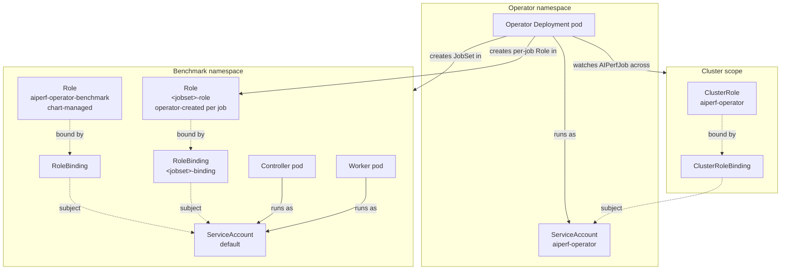

# RBAC and Security

AIPerf separates cluster-wide operator authority from per-namespace benchmark
authority. The operator Deployment runs under a ServiceAccount bound to a
`ClusterRole` so a single operator replica can watch `AIPerfJob` custom
resources across the cluster and create JobSets in benchmark namespaces.
The chart grants no `coordination.k8s.io/leases` rule because the operator
implements no leader election at all: `operator.replicas` defaults to 1 and
`templates/deployment.yaml` calls `fail` on any other value, so a
leader-elected set is not merely undocumented but unrenderable.
Benchmark pods (controllers, workers, record
processors) run under the `default` ServiceAccount of their namespace, bound
to namespace-scoped `Role`s so that nothing they hold reaches cluster scope.

The split lets cluster admins pre-provision the operator's cluster-wide
RBAC once (under a security review), then hand developers a `Role` template
that cannot escalate beyond the benchmark namespace. Developers never touch
cluster-scoped resources. Within a benchmark namespace, controller and worker
pods share one ServiceAccount, so every pod holds the union of what the
controller needs. Because that union is what a compromised worker inherits, it
is held to exactly the operations a pod performs: `patch` on its own AIPerfJob
and JobSet, and read-only access to everything else. No benchmark pod can
create, replace, or delete any object. Namespace boundaries are still what
separate tenants — see [Least-privilege recipe](#least-privilege-recipe).



The operator owns JobSet/ConfigMap/Role creation in the benchmark namespace.
Two distinct `Role`s apply to benchmark pods: the narrow chart-managed
`aiperf-operator-benchmark` Role, and a broader per-job Role the operator
creates on every reconcile. The effective grant is the union of the two --
see [Benchmark-namespace Role catalog](#benchmark-namespace-role-catalog).

## Operator ClusterRole catalog

The operator's `ClusterRole` is rendered from
`deploy/helm/aiperf-operator/templates/clusterrole.yaml`. Every rule exists
to support a concrete operator responsibility; nothing is granted
speculatively.

| API group | Resources | Verbs | Purpose | Source |
|---|---|---|---|---|
| `apiextensions.k8s.io` | `customresourcedefinitions` | `get, list, watch` | kopf CRD discovery at startup | `clusterrole.yaml` |
| `aiperf.nvidia.com` | `aiperfjobs`, `aiperfjobs/status`, `aiperfjobs/finalizers` | `get, list, watch, create, update, patch, delete` | Reconcile AIPerfJob CRs, patch status/phase, manage finalizers | `clusterrole.yaml` |
| `aiperf.nvidia.com` | `aiperfsweeps`, `aiperfsweeps/status`, `aiperfsweeps/finalizers` | `get, list, watch, create, update, patch, delete` | Reconcile AIPerfSweep CRs, patch status, manage finalizers | `clusterrole.yaml` |
| `jobset.x-k8s.io` | `jobsets` | `create, delete, get, list, patch, update, watch` | Create/own the controller + worker JobSet for each AIPerfJob | `clusterrole.yaml` |
| `jobset.x-k8s.io` | `jobsets/status` | `get, list, watch` | Observe JobSet readiness and roll it up to AIPerfJob status | `clusterrole.yaml` |
| `kueue.x-k8s.io` | `localqueues` | `get, list` | Preflight verifies `scheduling.queueName` resolves to an existing LocalQueue and probes whether Kueue is installed at all | `clusterrole.yaml` |
| `batch` | `jobs` | `get, list, watch` | Monitor the Jobs that JobSet creates under the hood | `clusterrole.yaml` |
| `apps` | `deployments` | `get, list, watch` | Preflight checks for the JobSet controller and other operators | `clusterrole.yaml` |
| `""` (core) | `serviceaccounts` | `get, list, watch, create` | Preflight verifies custom SA; sweep handler creates a per-sweep SA | `clusterrole.yaml` |
| `""` (core) | `resourcequotas` | `get, list` | Preflight enumerates ResourceQuota headroom (`list_namespaced_resource_quota`) | `clusterrole.yaml` |
| `""` (core) | `secrets` | `get` | Preflight reads named imagePullSecrets / env secrets by name (`read_namespaced_secret`); never enumerates | `clusterrole.yaml` |
| `networking.k8s.io` | `networkpolicies` | `get, list, watch` | Preflight checks whether the benchmark namespace has a restrictive NetworkPolicy | `clusterrole.yaml` |
| `""` (core) | `configmaps` | `create, delete, get, list, patch, update, watch` | Store benchmark configuration ConfigMap consumed by every benchmark pod | `clusterrole.yaml` |
| `""` (core) | `services`, `endpoints` | `create, delete, get, list, watch` | Headless Service for pod DNS; endpoint monitoring | `clusterrole.yaml` |
| `rbac.authorization.k8s.io` | `roles`, `rolebindings` | `create, delete, get, list, watch` | Create the per-namespace benchmark `Role`/`RoleBinding` on first deploy | `clusterrole.yaml` |
| `""` (core) | `namespaces` | `get, list, watch` | Resolve the benchmark namespace referenced by AIPerfJob | `clusterrole.yaml` |
| `""` (core) | `pods`, `pods/log` | `get, list, watch` | Surface pod status, restart counts, and logs in `aiperf kube logs`. Deliberately no `patch` — see the comment above the rule, and the `test_clusterrole_pods_restart_event_path_is_read_only` guard it names | `clusterrole.yaml` |
| `""` (core) | `nodes` | `get, list` | Count GPUs for the cluster endpoint served by the API sidecar | `clusterrole.yaml` |
| `""` (core) | `events` | `get, list, watch, create, patch` | Emit Kubernetes events for AIPerfJob diagnostics | `clusterrole.yaml` |

The binding
(`deploy/helm/aiperf-operator/templates/clusterrolebinding.yaml`) connects
this `ClusterRole` to the operator `ServiceAccount` in the release namespace.

## Benchmark-namespace Role catalog

`deploy/helm/aiperf-operator/templates/benchmark-rbac.yaml` renders a `Role`
and a matching `RoleBinding` in every namespace where benchmark pods may
run: the chart's release namespace plus every entry in the
`benchmarkRbacNamespaces` list. The `RoleBinding` subject is
hardcoded to that namespace's `default` ServiceAccount; unlike the
operator-created Role below, it does not follow
`podTemplate.serviceAccountName`.

| API group | Resources | Verbs | Purpose | Source |
|---|---|---|---|---|
| `""` (core) | `pods` | `get, list, watch` | Workers discover controller and peer record processors via pod labels | `benchmark-rbac.yaml:19-21` |
| `jobset.x-k8s.io` | `jobsets` | `get, list, watch, patch` | Controller patches JobSet annotations to signal graceful completion | `benchmark-rbac.yaml:27-29` |
| `aiperf.nvidia.com` | `aiperfjobs`, `aiperfjobs/status` | `get, list, watch, patch` | Controller reads AIPerfJob spec and patches per-phase progress fields | `benchmark-rbac.yaml:33-35` |

This chart-managed Role grants no create, update, or delete verbs and no access
to Secrets or Events. `patch` without `update` is deliberate: both writers issue
JSON-patch requests against annotations and `status`, so the whole-object `PUT`
that `update` authorizes is never needed and would let a pod rewrite `spec`.
It is not, however, the whole grant.

### Operator-created per-job Role

On every AIPerfJob reconcile the operator also creates a `Role` named
`<jobset>-role` and a `RoleBinding` named `<jobset>-binding` in the benchmark
namespace, owned by the AIPerfJob CR so it is garbage-collected with the job.
The rules live in `RBACSpec._RULES`
(`src/aiperf/kubernetes/resources.py:211-269`); the create path is
`_create_rbac` in `src/aiperf/operator/handlers/create.py:275-294`. The
`RoleBinding` subject is `podTemplate.serviceAccountName`, falling back to
`default`, so it lands on the same identity the benchmark pods run under.

| API group | Resources | Verbs |
|---|---|---|
| `aiperf.nvidia.com` | `aiperfjobs`, `aiperfjobs/status` | `get, list, watch, patch` |
| `""` (core) | `configmaps` | `get, list, watch` |
| `""` (core) | `pods`, `pods/log` | `get, list, watch` |
| `""` (core) | `services`, `endpoints` | `get, list, watch` |
| `""` (core) | `events` | `get, list, watch` |
| `batch` | `jobs` | `get, list, watch` |
| `jobset.x-k8s.io` | `jobsets` | `get, list, watch, patch` |
| `jobset.x-k8s.io` | `jobsets/status` | `get, list, watch` |

The effective permission set for benchmark pods is the union of this Role and
the chart-managed one, and `patch` on `aiperfjobs`/`aiperfjobs/status` and
`jobsets` is the only write verb in it. Everything else is read-only.
Benchmark pods have no access to Secrets, ServiceAccounts, or RBAC objects.

Because controller and worker pods share one ServiceAccount and the token is
mounted in every container, the grant is scoped to exactly what in-pod code
calls:

- **`aiperfjobs` `get`/`patch`** — `signal_benchmark_complete`
  (`src/aiperf/kubernetes/completion_signal.py`) sets the
  benchmark-complete annotation, and the controller pod's API container pushes
  per-phase progress into `status` (`src/aiperf/api/routers/progress.py`).
  Both patches are UID-fenced with a JSON-patch `test` op so a pod from a
  replaced incarnation cannot mutate the current CR.
- **`jobsets` `get`/`patch`** — the same API container writes JobSet
  annotations, after verifying the JobSet's `ownerReferences` name the expected
  AIPerfJob UID.
- **`pods` `list`, `pods/log` `get`, `events` `list`** — peer discovery, the
  heartbeat watchdog (`src/aiperf/kubernetes/watchdog_source.py`), and
  cross-namespace server-metrics endpoint discovery.

Nothing in a pod creates, replaces, or deletes anything. The run config arrives
as a kubelet-mounted ConfigMap volume rather than an API read, the headless
Service for pod DNS is provisioned by the JobSet controller via
`network.enableDNSHostnames`, JobSet deletion is the operator's job
(`delete_jobset` has no in-pod caller), and Events are emitted by the operator
under its own ClusterRole. `create` on `jobsets` in particular used to be
granted here; it let any compromised pod launch a JobSet, and therefore run
arbitrary containers, under the benchmark ServiceAccount.

Widening these verbs is a deliberate blast-radius change, and two mechanical
guards make it fail CI: `TestRBACSpecLeastPrivilege` in
`tests/unit/kubernetes/test_resources.py` pins the exact verb set per rule and
rejects every mutating verb other than `patch`, and
`test_helm_benchmark_rbac_is_subset_of_rbac_spec` in the same file requires the
chart's benchmark Role to stay a subset of `RBACSpec._RULES`, so the Python and
Helm copies cannot drift apart.

What remains reachable from a compromised benchmark pod is status and annotation
spoofing on its own job: it can report a false phase or a false completion, and
it can read every pod, ConfigMap, Service, Endpoint, Event, and Job in the
namespace. That is the concrete reason for the per-team namespace rule below.

The one deliberate exception to namespace confinement is cross-namespace
server-metrics discovery. Each entry in `serverMetricsDiscoveryNamespaces`
renders a second, narrower `Role` (`<fullname>-metrics-discovery`, `pods:
get/list/watch` only) in that inference namespace, bound back to the
benchmark namespaces' ServiceAccounts. A plain string entry binds the
`default` ServiceAccount; use the `{namespace, serviceAccounts}` object form
when benchmark pods run under a custom `podTemplate.serviceAccountName`. The
chart does not create those namespaces.

## Credential redaction at metadata boundaries

When endpoint configuration derived from an AIPerfJob CR crosses a persistence
or display boundary, AIPerf redacts both the public YAML `apiKey` spelling and
the internal `api_key` spelling, credential-bearing headers, URL userinfo, and
sensitive URL query parameters. This applies to `job_spec.json`, the runs
index (including its flattened endpoint), operator results/config/analytics
API responses, Kubernetes events and status messages, JobSet endpoint
annotations, preflight details, and CLI submission summaries. Redaction keeps
non-secret URL host, path, and query context available for diagnosis.
Legacy `job_spec.json` files are also sanitized when downloaded directly or as
part of a result bundle; this compatibility protection does not rewrite the
copy already stored on the results PVC.

This boundary protection does not rewrite the source CR stored by the
Kubernetes API server. Prefer Secret-backed endpoint credentials and restrict
CR read permissions; do not rely on result/API redaction as storage encryption.
Credentials cannot be Kubernetes sweep parameters: grid, zip, scenario,
adaptive, Sobol, and Latin Hypercube axes that target credential fields or
contain credential-bearing values are rejected before child creation. Keep
endpoint credentials fixed and use the Secret-backed pod environment transport
for every variation.

## `rbac.create=false` workflow

In security-sensitive clusters, RBAC is usually reviewed and committed
separately from workload charts. Set `rbac.create=false` and
`serviceAccount.create=false` to make the operator chart use a
pre-provisioned `ServiceAccount` and skip both the `ClusterRole` + `ClusterRoleBinding`
and the per-namespace `Role` + `RoleBinding`.

```bash
helm install aiperf-operator ./deploy/helm/aiperf-operator \
  --namespace aiperf-system \
  --set rbac.create=false \
  --set serviceAccount.create=false \
  --set serviceAccount.name=aiperf-operator-sa \
  --set tests.enabled=false
```

`tests.enabled=false` is what makes the chart emit **zero** `ClusterRole` and
`ClusterRoleBinding` objects; see
[Eliminating all cluster-scoped RBAC](#eliminating-all-cluster-scoped-rbac).
Omit it if you want `helm test` and accept the two `…-tests` cluster-scoped
objects.

The cluster admin applies the RBAC tree out-of-band. A minimal example
mirroring the chart defaults:

```yaml
---
# ServiceAccount in the operator namespace
apiVersion: v1
kind: ServiceAccount
metadata:
  name: aiperf-operator-sa
  namespace: aiperf-system
---
# ClusterRole — copy the rules from clusterrole.yaml verbatim
apiVersion: rbac.authorization.k8s.io/v1
kind: ClusterRole
metadata:
  name: aiperf-operator
rules:
- apiGroups: ["aiperf.nvidia.com"]
  resources: ["aiperfjobs", "aiperfjobs/status", "aiperfjobs/finalizers"]
  verbs: ["get", "list", "watch", "create", "update", "patch", "delete"]
# ... (remaining rules from clusterrole.yaml) ...
---
apiVersion: rbac.authorization.k8s.io/v1
kind: ClusterRoleBinding
metadata:
  name: aiperf-operator
roleRef:
  apiGroup: rbac.authorization.k8s.io
  kind: ClusterRole
  name: aiperf-operator
subjects:
- kind: ServiceAccount
  name: aiperf-operator-sa
  namespace: aiperf-system
---
# Per-benchmark-namespace Role + RoleBinding (apply once per namespace)
apiVersion: rbac.authorization.k8s.io/v1
kind: Role
metadata:
  name: aiperf-operator-benchmark
  namespace: my-benchmarks
rules:
- apiGroups: [""]
  resources: ["pods"]
  verbs: ["get", "list", "watch"]
- apiGroups: ["jobset.x-k8s.io"]
  resources: ["jobsets"]
  verbs: ["get", "list", "watch", "patch"]
- apiGroups: ["aiperf.nvidia.com"]
  resources: ["aiperfjobs", "aiperfjobs/status"]
  verbs: ["get", "list", "watch", "patch"]
---
apiVersion: rbac.authorization.k8s.io/v1
kind: RoleBinding
metadata:
  name: aiperf-operator-benchmark
  namespace: my-benchmarks
roleRef:
  apiGroup: rbac.authorization.k8s.io
  kind: Role
  name: aiperf-operator-benchmark
subjects:
- kind: ServiceAccount
  name: default
  namespace: my-benchmarks
```

`rbac.create=false` only suppresses the chart's own RBAC. The operator still
creates its per-job `Role` and `RoleBinding` on every reconcile (see
[Operator-created per-job Role](#operator-created-per-job-role)), and those
names are derived from the JobSet, so pre-provisioning the chart-named
`aiperf-operator-benchmark` Role does not satisfy them. The admin-owned
`ClusterRole` must therefore keep `create` on
`rbac.authorization.k8s.io/roles` and `rolebindings`: only HTTP 409
`AlreadyExists` is tolerated by `create_idempotent_role`
(`src/aiperf/operator/k8s_helpers.py:201-234`), so a 403 aborts the reconcile
and the job never starts. Do not trim those verbs, even for a single fixed
namespace.

### Eliminating all cluster-scoped RBAC

`rbac.create=false` does not suppress the `helm test` hook RBAC, and
deliberately so. With that flag alone the chart still creates an
`<fullname>-tests` ServiceAccount, a namespaced `Role`/`RoleBinding`
(`pods: get, list`), and a `ClusterRole`/`ClusterRoleBinding` scoped by
`resourceNames` to the two AIPerf CRDs with `get` only
(`deploy/helm/aiperf-operator/templates/tests/rbac.yaml`). The privilege is
negligible, but a cluster whose policy is "this chart creates no cluster-scoped
RBAC" needs a way to reach zero.

Use `tests.enabled=false`:

```bash
$ helm template aiperf-operator ./deploy/helm/aiperf-operator \
    --namespace aiperf-system \
    --set rbac.create=false \
    --set serviceAccount.create=false \
    --set serviceAccount.name=aiperf-operator-sa \
    --set tests.enabled=false \
  | grep -c '^kind: Cluster'
0
```

`tests.enabled` gates the hook Pods and their RBAC together, so neither is left
referencing the other. `helm test` against a release installed this way prints
`TEST SUITE: None` and exits 0 — an unambiguous "no tests were defined", not a
failure.

The flag is separate from `rbac.create` on purpose. `rbac.create=false` means
"the operator's own RBAC is pre-provisioned out-of-band", which says nothing
about the chart's smoke-test scaffolding. Folding them together would strip the
test ServiceAccount while still rendering the hook Pods that name it, so
`helm test` would fail on pod creation with a `serviceaccount not found` error
instead of reporting that there is nothing to run.

`test-crd-installed` reads cluster-scoped CustomResourceDefinitions, so its
`ClusterRole` cannot be narrowed to a namespace — keeping `helm test` and
reaching zero cluster-scoped RBAC are mutually exclusive. If you disable the
hooks, run the equivalent checks out-of-band: `kubectl get crd
aiperfjobs.aiperf.nvidia.com aiperfsweeps.aiperf.nvidia.com` and `aiperf kube
preflight`.

The helper
`deploy/helm/aiperf-operator/templates/_helpers.tpl`'s
`aiperf-operator.serviceAccountName` template resolves to `.Values.serviceAccount.name`
when `serviceAccount.create` is false, so the operator Deployment will
reference the pre-provisioned SA as expected.

`serviceAccount.name` is **required** in that mode. Leaving it empty used to
resolve to the namespace `default` ServiceAccount — an identity holding none of
the operator's `ClusterRole` — so the install succeeded and the operator then
403'd on every reconcile. The helper now fails the render instead:

```
Error: execution error at (aiperf-operator/templates/deployment.yaml:33:29):
serviceAccount.name is required when serviceAccount.create=false. ...
```

Set `serviceAccount.name` to the pre-provisioned account named in your
`ClusterRoleBinding` subject.

## Pod `securityContext`

Every container in both the controller and worker pods receives a
hardened `securityContext` assembled by
`build_security_context()` in `src/aiperf/kubernetes/jobset_helpers.py:19-51`.
The base context applied to every container is:

```yaml
securityContext:
  runAsNonRoot: true
  runAsUser: 1000
  runAsGroup: 1000
  allowPrivilegeEscalation: false
  readOnlyRootFilesystem: true
  capabilities:
    drop: ["ALL"]
  seccompProfile:
    type: RuntimeDefault
```

This context is applied to:

- The five control-plane containers in the controller pod
  (`jobset.py`)
- The event-bus proxy sidecar (`jobset.py`)
- The results-serving sidecar (`jobset.py`)
- Each worker and record-processor container

### Overriding via `podTemplate.containerSecurityContext`

The CRD schema at
`deploy/helm/aiperf-operator/templates/crd-aiperfjob.yaml:917` exposes
`spec.podTemplate.containerSecurityContext` as a free-form object. Keys
supplied there merge on top of the base context. `capabilities` is merged
shallowly (user keys update the drop/add lists); all other keys are replaced.

Privilege-escalating values cannot be merged in at all. `privileged: true`,
`allowPrivilegeEscalation: true`, `runAsNonRoot: false`, `runAsUser: 0`, and
`runAsGroup: 0` are rejected by `PodTemplateConfig` validation and dropped
again by the builder as defense in depth -- see
`privilege_escalating_keys()` in `src/aiperf/config/deployment.py`.

Other keys **widen** the baseline rather than escalating privilege, and those
are permitted and warned about rather than rejected -- a benchmark pod
legitimately needs `SYS_ADMIN` for perf/profiling tooling, and
`seccompProfile: Unconfined` is a normal requirement for GPU and tracing
workloads. `risky_security_context_details()` in
`src/aiperf/config/deployment.py` flags:

| Construct | Effect on the baseline |
|---|---|
| `capabilities.add: [...]` | merged over `drop: ["ALL"]`, granting the listed capabilities |
| `capabilities.drop` without `ALL` | narrows the dropped set |
| `readOnlyRootFilesystem: false` | container root filesystem becomes writable |
| `seccompProfile.type` != `RuntimeDefault` | e.g. `Unconfined` removes syscall filtering |

The warning fires twice over a job's life, deliberately: once at CR validation
(`PodTemplateConfig._reject_weakened_security_context`) and once on the merge
path in `build_security_context()`, which is also reachable from templates
constructed directly in code that never pass through Pydantic validation. The
merge-path warning is deduplicated per distinct message, because
`build_security_context()` runs once per container.

Note that `capabilities` is intentionally exempt from the escalating-key filter
in `build_security_context()` -- it is merged shallowly so `add` lists survive.
Bound it at admission (step 12 of the least-privilege recipe) if your cluster
must forbid it.

```yaml
apiVersion: aiperf.nvidia.com/v1alpha1
kind: AIPerfJob
metadata:
  name: hardened-run
spec:
  podTemplate:
    containerSecurityContext:
      runAsUser: 65534
      runAsGroup: 65534
      capabilities:
        drop: ["ALL"]
        add: []
  benchmark:
    models: [meta-llama/Meta-Llama-3-8B-Instruct]
    endpoint: {type: chat, url: https://llm.example.com/v1}
    datasets:
      - name: main
        type: synthetic
    phases:
      - name: profiling
        type: concurrency
        concurrency: 10
        requests: 100
```

### What `readOnlyRootFilesystem: true` requires

The root filesystem is read-only. AIPerf writes to five locations, which
must be provided as writable volumes. The JobSet builder already handles
this: `build_shared_volumes()` declares them as pod-level `emptyDir`
volumes and `build_volume_mounts()` attaches them to each container, both in
`src/aiperf/kubernetes/jobset_helpers.py`. (The results-serving sidecar is the
one exception -- it carries a hand-written mount list of read-only `/results`
plus writable `/tmp`, which is all it needs.)

- `/aiperf/ipc` — ZMQ IPC socket files (controller mode)
- `/aiperf/datasets` — shared dataset mmap files (dataset-manager writes, API serves to workers)
- `/aiperf/hf_home` — HuggingFace cache (`tokenizer-cache` volume; `HF_HOME` points here)
- `/results` — exported metrics, profile artifacts
- `/tmp` — general scratch (tempfile, matplotlib config)

If you supply an alternate `podTemplate.volumeMounts`, ensure each of these
paths is covered by a writable volume. Otherwise the controller will fail
to bind IPC sockets on startup and pods will CrashLoopBackOff.

## Unhardened passthroughs: `volumes` and `initContainers`

AIPerf is a benchmarking tool first. `podTemplate.volumes` and
`podTemplate.initContainers` are deliberately free-form passthroughs: GPU
benchmarking legitimately needs `hostPath` mounts (device nodes, driver
directories, local NVMe scratch), and init containers exist for sysctl tweaks
(e.g. raising `ip_local_port_range`), model pre-fetch, and permission fixups.
Neither field is restricted, and no construct is rejected.

What AIPerf does instead is **validate and warn**, plus apply a safe default
where one cannot break a workload:

**Volumes.** `PodTemplateConfig` logs one WARNING per volume whose source
reaches outside the pod sandbox (`hostPath`, `nfs`, `iscsi`, `cephfs`,
`glusterfs`, `rbd`, `flexVolume` — see `RISKY_VOLUME_SOURCE_KEYS` in
`src/aiperf/config/deployment.py`). The message names the field path, the volume
name, and for `hostPath` the exact node path. A `hostPath` at the node root or
under a credential/runtime directory (`/etc`, `/root`, `/var/run`, `/run`,
`/var/lib/kubelet`, `/var/lib/docker`, `/var/lib/containerd`, `/proc`, `/boot`,
`/home`) is additionally called out as exposing node credentials, the container
runtime, or kubelet state. The volume is still rendered into the PodSpec.

```
podTemplate.volumes[0] ('node-root'): hostPath volume mounting node path '/'
which exposes node credentials, the container runtime, or kubelet state to the
benchmark pod. This is allowed - AIPerf benchmarks legitimately need host
access - but it is not covered by AIPerf's pod hardening.
```

**Init containers.** An init container that declares **no** `securityContext`
receives AIPerf's hardened container baseline as a default — the same context
`build_security_context()` produces for regular containers, minus
`readOnlyRootFilesystem` (init containers do not get AIPerf's writable emptyDir
mount layout, and commonly write to the image filesystem). An init container
that **does** declare a `securityContext` is passed through verbatim so
privileged setup work stays possible; it is not merged key-by-key, because
merging the baseline's `allowPrivilegeEscalation: false` under a user's
`privileged: true` produces a combination the Kubernetes API rejects outright.
Such a container is logged as a WARNING naming the escalating keys and any added
capabilities. See `_build_init_containers()` in
`src/aiperf/kubernetes/jobset_specs.py`.

Note that the pod-level `securityContext` (`runAsNonRoot: true`,
`runAsUser: 1000`, `seccompProfile: RuntimeDefault`) applies to init containers
too unless they override it, so even a passthrough init container is non-root
by default.

If your cluster must forbid these constructs, enforce them at admission
(PodSecurity `restricted`, or a Gatekeeper/Kyverno policy on `hostPath`) rather
than expecting AIPerf to refuse the spec.

## NetworkPolicy expectations

The chart ships an opt-in `NetworkPolicy` template for the operator pod
itself (`deploy/helm/aiperf-operator/templates/networkpolicy.yaml`, enabled
via `networkPolicy.enabled=true`) — it restricts ingress to the health
port 8080, the results-server port (`resultsServer.port`, default 8081), and
the operator metrics port (`operator.metrics.port`, default 9090) and permits
egress to DNS (kube-system UDP/TCP 53), the Kubernetes
API server (443/6443), and the configured benchmark namespaces. See
[Operator NetworkPolicy](#operator-networkpolicy) below. For benchmark-pod
traffic — the flows listed in the table below — the chart does not ship a
policy; policy is site-specific. When you enforce a default-deny policy
in the benchmark namespace, allow:

| Source | Destination | Ports | Reason |
|---|---|---|---|
| Worker pods | Controller pod | 5557, 5564, 5661/5662, 5663/5664, 5665/5666, 5667, 5668, 5669 (TCP) | ZMQ records push/pull (5557), credit router (5564), dataset-manager proxy DEALER/ROUTER (5661/5662), event-bus XPUB/XSUB (5663/5664), raw-inference PUSH/PULL (5665/5666), control ROUTER/DEALER (5667), credit-return router (5668), credit-return PUSH/PULL fan-in (5669). Kubernetes runs the dual-bind backend, so the authoritative defaults are `src/aiperf/config/comm/dual_bind.py:241-291`; the event-bus pair is bound by the proxy sidecar from `src/aiperf/kubernetes/environment.py:216-229`. |
| All benchmark pods | Controller pod | 8080-8088 (TCP) | Health and readiness probes (`src/aiperf/kubernetes/environment.py:180-215`) |
| Client / ingress | API service | 9090 (TCP) | UI dispatch, progress streaming (`environment.py:195-197`) |
| Client / ingress | Results sidecar | 9091 (TCP) | Post-run result downloads (`environment.py:198-203`) |
| Controller + worker pods | LLM inference endpoint | 443 (TCP) | Outbound HTTPS to the endpoint under benchmark |
| All benchmark pods | `kube-dns` (UDP 53) | 53 | Pod DNS lookups for headless Service peer discovery |
| Operator pod | Kube API server | 443/6443 (TCP) | Watch CRDs, create JobSets, patch status |

Sample allow-list in the benchmark namespace:

```yaml
apiVersion: networking.k8s.io/v1
kind: NetworkPolicy
metadata:
  name: aiperf-benchmark-allow
  namespace: my-benchmarks
spec:
  podSelector:
    matchLabels:
      app.kubernetes.io/name: aiperf
  policyTypes: [Ingress, Egress]
  ingress:
  - from:
    - podSelector:
        matchLabels:
          app.kubernetes.io/name: aiperf
    ports:
    - {protocol: TCP, port: 5557}
    - {protocol: TCP, port: 5564}
    - {protocol: TCP, port: 5661}
    - {protocol: TCP, port: 5662}
    - {protocol: TCP, port: 5663}
    - {protocol: TCP, port: 5664}
    - {protocol: TCP, port: 5665}
    - {protocol: TCP, port: 5666}
    - {protocol: TCP, port: 5667}
    - {protocol: TCP, port: 5668}
    - {protocol: TCP, port: 5669}
  - from: []
    ports:
    - {protocol: TCP, port: 9090}
    - {protocol: TCP, port: 9091}
  egress:
  - to:
    - podSelector:
        matchLabels:
          app.kubernetes.io/name: aiperf
  - to:
    - namespaceSelector:
        matchLabels:
          kubernetes.io/metadata.name: kube-system
      podSelector:
        matchLabels:
          k8s-app: kube-dns
    ports:
    - {protocol: UDP, port: 53}
  - to: []
    ports:
    - {protocol: TCP, port: 443}
```

The final egress rule to `0.0.0.0/0:443` is the LLM endpoint reach; lock
it down to the endpoint's `Service`/`Endpoints` selector or an
`ipBlock.cidr` matching your inference gateway when the target is on-cluster.

### Operator NetworkPolicy

`deploy/helm/aiperf-operator/templates/networkpolicy.yaml` ships an opt-in
policy that locks down the **operator pod** (not the benchmark pods).
Enable with `networkPolicy.enabled=true`. The rendered policy:

- **Ingress** — allows TCP 8080 (operator health), TCP
  `resultsServer.port` (default 8081), and TCP `operator.metrics.port`
  (default 9090, omitted when set to 0) from four namespace selectors: the
  release namespace itself (so `helm test` hook pods can reach `/healthz`),
  every entry in `benchmarkRbacNamespaces`, and every entry in
  `networkPolicy.allowedNamespaces`. CIDR blocks in
  `networkPolicy.allowedIngressCIDRs` are added as a second ingress rule
  for external scrapers (e.g. Prometheus, ingress controllers) on the same
  ports.
- **Egress** — allows DNS (UDP/TCP 53 to `kube-system`), the Kubernetes
  API server (TCP 443 and 6443, no selector), and full egress to the release
  namespace plus any `benchmarkRbacNamespaces` and `allowedNamespaces`
  entries.

Pair this with a default-deny in the operator namespace so only these
flows are permitted. The policy's `podSelector` targets the operator
Deployment labels (`aiperf-operator.operatorSelectorLabels`), so other
workloads in the namespace are unaffected.

### Ingress

`deploy/helm/aiperf-operator/templates/ingress.yaml` ships an opt-in
`Ingress` that exposes the operator's **results-server** (the FastAPI app on
`resultsServer.port`, default 8081) outside the cluster. Disabled by
default — results are reachable via ClusterIP + `kubectl port-forward` or
the `aiperf kube` CLI. Enable with `ingress.enabled=true`.

Security implications:

- **TLS** — set `ingress.tls` to a list of `{hosts, secretName}` entries;
  the chart threads them straight into the Ingress `spec.tls`. Without
  this, traffic to the results server transits the ingress controller as
  plain HTTP.
- **Annotations** — `ingress.annotations` is passed through verbatim. Use
  it to wire ingress-controller-specific auth (e.g. `nginx.ingress.kubernetes.io/auth-*`,
  OIDC annotations), rate limits, and WAF rules. The results server itself
  has no built-in authentication; if the Ingress is reachable from
  untrusted networks, front it with auth at the controller layer.
- **IngressClass** — set `ingress.className` to pin the controller (e.g.
  `nginx`, `traefik`); empty uses the cluster default. Mis-pinning to a
  public-facing class when you meant internal-only is the most common
  misconfiguration.
- **Backend** — each path's default backend port is
  `resultsServer.port`; override per-path with `portNumber` if you fan
  multiple services behind a single host. Nothing routes the kopf liveness
  endpoint (8080) or the metrics port (9090) by default, so they stay
  reachable only through the ClusterIP Service. Do not point a `portNumber`
  at either one.

Pair with `networkPolicy.enabled=true` (see above) so only the Ingress
controller's namespace can reach the operator pod on the results port.

## Least-privilege recipe

A hardened rollout checklist:

1. **Pre-provision operator RBAC** — apply the `ServiceAccount`,
   `ClusterRole`, and `ClusterRoleBinding` under admin review. Install the
   chart with `rbac.create=false` and `serviceAccount.create=false`, and pass
   `serviceAccount.name` naming the account you created — the chart rejects
   `serviceAccount.create=false` without it.
2. **Dedicated benchmark namespace per team** — never share the benchmark
   namespace between teams. Benchmark pods have read access to every pod
   in the namespace (`benchmark-rbac.yaml:19-21`), so coexisting unrelated
   workloads leak metadata. The operator-created per-job Role widens the read
   surface further: pods can also list `configmaps`, `services`, `endpoints`,
   `events`, and `jobsets` anywhere in the namespace. It grants no write verb
   beyond `patch` on the pod's own AIPerfJob and JobSet.
3. **Distinct ServiceAccounts per namespace** — the chart's benchmark
   `RoleBinding` hardcodes `default` and exposes no values key to change it.
   To avoid granting the namespace's `default` SA anything, create your own
   SA (e.g. `aiperf-benchmark-sa`) and set
   `spec.podTemplate.serviceAccountName` on the AIPerfJob. The operator's
   per-job `RoleBinding` follows that field, so the pods still get the
   permissions they need without the chart Role applying to `default`.
4. **`runAsNonRoot: true` everywhere** — the base context already enforces
   this, and `runAsUser: 0` / `runAsNonRoot: false` overrides are rejected
   rather than honored. Nothing to configure.
5. **`readOnlyRootFilesystem: true`** — keep the default; cover the five
   writable paths above with `emptyDir` volumes.
6. **Drop all Linux capabilities** — the base context drops `ALL`. If a
   sidecar demands `NET_BIND_SERVICE` for a low port, add via
   `containerSecurityContext.capabilities.add` rather than reverting the
   drop. Note that `capabilities.add` is not on the rejected-override list,
   so this field is the one remaining way a CR author can widen the
   container's capability set; step 12 is what actually bounds it.
7. **`seccompProfile: RuntimeDefault`** — default-applied. Do not downgrade
   to `Unconfined`.
8. **NetworkPolicy default-deny + allow-list** — apply the sample above
   and lock the LLM endpoint egress to a CIDR or selector.
9. **ResourceQuota on the benchmark namespace** — AIPerf preflight reads
   quotas (`clusterrole.yaml`) and projects the run's CPU and memory
   against them. Insufficient headroom is reported as a warning, not a
   failure, so gate on it yourself with `aiperf kube preflight -o json` if
   CI must stop there.
10. **Audit logging** — enable Kubernetes audit logging on the
    `aiperf.nvidia.com` and `jobset.x-k8s.io` API groups. Operator
    reconciliation events, including status patches and JobSet creation,
    appear under the operator SA and are easy to attribute.
11. **Image pull secrets** — reference secrets via `imagePullSecrets` in
    `values.yaml` rather than mounting credentials into pods.
12. **PodSecurity admission** — enforce the `restricted` profile on the
    benchmark namespace. AIPerf's default container `securityContext`
    already satisfies it.

With this profile, a compromised benchmark pod cannot escape its namespace,
cannot read cluster-wide resources, cannot read Secrets, cannot write outside
its emptyDir volumes (unless the CR author added a writable `hostPath` or other
host-backed volume — see "Unhardened passthroughs" above), cannot escalate privilege or run as root, cannot create,
replace, or delete any Kubernetes object, and can only reach the LLM endpoint and
its own peers. Two capabilities remain inside the namespace: it can read the
metadata of every pod, ConfigMap, Service, Endpoint, Event, and Job there, and it
can `patch` annotations and `status` on its own AIPerfJob and JobSet — enough to
report a false phase or a premature completion for its own run, not enough to
affect another job. Namespace-per-team is still the boundary that matters.
