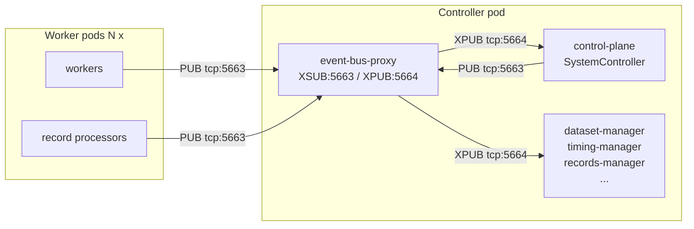

# Controller Pod Sidecars

> **Scope:** **controller-pod** sidecars only — the event-bus proxy and the
> results sidecar that ride alongside the SystemController. The operator
> Pod's `results-server` container (port 8081) is also colloquially called
> a sidecar; that one hosts the operator's HTTP API and is documented in
> [`docs/kubernetes/results-api.md`](results-api.md) and
> [`docs/dev/kubernetes-flow.md`](../dev/kubernetes-flow.md). Don't confuse
> the two — the URL stamped onto `AIPerfSweep.status.apiUrl` and the
> sweep-controller's empty-summary fallback both target the **operator**'s
> results-server, never the controller's `results-sidecar`.

Every AIPerf benchmark controller pod runs a short stack of sidecar containers alongside the control-plane process. Two of them — the **event-bus proxy** and the **results sidecar** — exist to offload load or provide a fallback surface that the SystemController itself cannot reliably host. They are invisible in normal usage, but anyone debugging fan-in hangs, startup races, or partial result retrieval needs to know what they do and how to tune them.

The source of truth is `src/aiperf/kubernetes/jobset.py` (composition), `src/aiperf/kubernetes/results_sidecar.py` (FastAPI app), and `src/aiperf/kubernetes/environment.py` (resource defaults and ports).

---

## Overview

**Event-bus proxy** runs the XPUB/XSUB ZMQ proxy for the benchmark's pub/sub event bus in a dedicated container. It exposes `tcp://*:5663` (XSUB frontend — publishers connect here) and `tcp://*:5664` (XPUB backend — subscribers connect here) on the controller pod so that workers and record processors can connect and publish/subscribe without talking to the SystemController directly. It is an independent sidecar because, at high concurrency, hundreds of simultaneous RP and worker pub/sub connections arriving at pod startup previously starved the SystemController's event loop while it tried to forward socket I/O itself. Health endpoint is `:8088/healthz` and `:8088/readyz`.

**Results sidecar** runs a minimal FastAPI app on `:9091` that serves the controller pod's `/results` volume read-only. It exists as a fallback so the **operator's** completion fetch can still retrieve exported artifacts after the main control-plane container exits — for example, when the controller completes exports and terminates but the JobSet TTL hasn't cleaned the pod up yet. (`aiperf kube results --from-pods` does not use it; see [When the results sidecar is used](#when-the-results-sidecar-is-used).) Non-checkpoint files are hidden until the controller writes the `.aiperf_results_ready.json` marker on clean exit, so clients never download half-written artifacts.

Both sidecars are always injected into controller pods by default. Disabling them is almost never correct.

---

## Event-bus proxy

### Architecture



All pub/sub traffic for the benchmark flows through the proxy, not the SystemController. The SystemController is just another subscriber.

### Ports

| Port | Protocol | Name          | Purpose                                    |
|------|----------|---------------|--------------------------------------------|
| 5663 | TCP      | pub-frontend  | XSUB socket that publishers connect to     |
| 5664 | TCP      | sub-backend   | XPUB socket that subscribers connect to    |
| 8088 | HTTP     | health        | `/healthz` liveness, `/readyz` readiness   |

### Resource budget

Defaults are set in `_K8sEnvironment.EVENT_BUS_PROXY`:

| Setting              | Default | Env var                                |
|----------------------|---------|----------------------------------------|
| CPU request + limit  | 50m     | `AIPERF_K8S_EVENT_BUS_PROXY_CPU`       |
| Memory request + limit | 64Mi  | `AIPERF_K8S_EVENT_BUS_PROXY_MEMORY`    |

Both values are set as request *and* limit, so the container lands in the Guaranteed QoS class. The default is small because the proxy is pure socket I/O forwarding. Isolating it in its own container (rather than in the SystemController event loop) keeps large startup fan-ins — hundreds of simultaneous record-processor and worker connections — from starving the control plane's event loop while it forwards socket I/O itself. If you observe the proxy pegging its core at very large fan-ins, raise `AIPERF_K8S_EVENT_BUS_PROXY_CPU`.

### Startup ordering

The proxy container is prepended to the controller pod's container list (`create_controller_containers` inserts it at index 0), so the kubelet begins pulling and starting it before the control-plane container. The proxy's bind sockets come up in tens of milliseconds — well inside the client connection-probe timeout, which is 90 s by default (`AIPERF_SERVICE_CONNECTION_PROBE_TIMEOUT`) and 60 s for k8s worker containers specifically (`AIPERF_K8S_JOBSET_WORKER_CONNECTION_PROBE_TIMEOUT`).

### Disabling (legacy fallback)

Set on the operator deployment:

```bash
AIPERF_K8S_EVENT_BUS_SIDECAR_ENABLED=false
```

This reverts to pre-sidecar behavior: the SystemController's `ProxyManager` hosts the XPUB/XSUB proxy inside its own event loop. This is a legacy code path kept only for bisecting regressions — do not run production benchmarks with it disabled. At large fan-ins it will reintroduce the startup stall that motivated the sidecar in the first place.

---

## Results sidecar

The results sidecar is a small FastAPI app launched via `python -m aiperf.kubernetes.results_sidecar`. It mounts the controller pod's shared `/results` volume — an `emptyDir`, so it lives and dies with the pod — read-only, and exposes three endpoints on port **9091**.

### Endpoint catalog

| Method | Path                              | Purpose                                        |
|--------|-----------------------------------|------------------------------------------------|
| GET    | `/healthz`                        | Liveness probe. Always `200 OK`.               |
| GET    | `/api/results/list`               | List available result files (JSON)             |
| GET    | `/api/results/files/{filename}`   | Download a result file (with content negotiation) |

The response models (`ResultFileInfo`, `ResultsListResponse`) live in `src/aiperf/api/models/results.py` and are shared with the in-process controller API router (`src/aiperf/api/routers/results.py`), so the two HTTP surfaces are schema-identical. Their listing behavior differs in one respect: the sidecar walks `/results` recursively once the ready marker exists, while the controller router lists only top-level files (plus a recursive walk of `checkpoints/`).

### `GET /healthz`

```bash
curl http://localhost:9091/healthz
# {"status":"ok"}
```

### `GET /api/results/list`

Returns the JSON body defined by `ResultsListResponse`. Names are paths
relative to `/results` (the walk is recursive, so nested sweep-harvest
layouts surface too), and the response also carries the two readiness flags:

```json
{
  "files": [
    {"name": "checkpoints/phase_0.parquet", "size": 1048576},
    {"name": "metrics.json",                "size": 41820},
    {"name": "profile_export_aiperf.json",  "size": 18331144},
    {"name": "profile_export_console.txt",  "size": 3402}
  ],
  "ready": true,
  "processing": false
}
```

Readiness semantics:

- If `.aiperf_results_ready.json` exists, every file under `/results` is listed recursively (both transaction markers are excluded — `.aiperf_results_ready.json` and `.aiperf_results_processing.json` are sidecar-internal state, not artifacts).
- If the marker is absent, only files under `/results/checkpoints/` are listed. Everything else is hidden until the controller finishes cleanly.
- `processing` reflects the separate `.aiperf_results_processing.json` marker written while the controller is still exporting.

### `GET /api/results/files/{filename}`

Streams a single file. Honors `Accept-Encoding` — if the client advertises `zstd` or `gzip`, the sidecar streams the compressed body and sets `Content-Encoding` accordingly (via `aiperf.common.compression.stream_file_compressed`). Otherwise the file is returned as-is.

- Sets `Content-Disposition: attachment; filename="..."` and `X-Filename` headers.
- `Content-Type` is inferred from the extension: `.json`, `.jsonl`, `.csv`, `.parquet`, `.txt`; everything else is `application/octet-stream`.

Error semantics:

| Status | When                                                                          |
|--------|-------------------------------------------------------------------------------|
| 400    | Path traversal (`..`, symlink escaping `/results`) or a reserved marker name  |
| 404    | Controller not ready (marker absent) and file is not under `checkpoints/`     |
| 404    | File path resolves correctly but does not exist                               |

### Path safety

`_safe_resolve` resolves the requested filename under the base directory and rejects anything that, after resolution, does not sit inside `base_dir.resolve()`. This catches `..`, absolute paths, and symlinks that would escape `/results`. Both transaction markers (`.aiperf_results_ready.json`, `.aiperf_results_processing.json`) are explicitly unfetchable.

### Readiness marker

The controller writes `/results/.aiperf_results_ready.json` via `write_ready_marker()` at the end of `SystemController` shutdown, once all exporters have flushed. The payload records whether the run was cancelled:

```json
{"ready": true, "was_cancelled": false}
```

`terminal_phase` and `terminal_error` keys are added only when the caller supplies them.

Until the marker exists, the sidecar returns 404 on any top-level file. Checkpoint artifacts under `/results/checkpoints/` are served unconditionally so that in-flight progress can be inspected mid-run.

---

## When the results sidecar is used

The results sidecar is reached by the operator, not directly by `aiperf kube results --from-pods`:

1. **`aiperf kube results --from-pods`** never targets `:9091`. On the default `--all` path it uses only the **Controller API** (`http://controller-pod:9090/api/results/files/...`) via port-forward. The second tier — **`kubectl cp`** against the `control-plane` container's `/results` directory — is reached only on the `--summary-only` path, when the API call fails first. Both tiers require the control-plane container to still be running.
2. **Operator completion fetch** reaches the results sidecar directly via `_download_final_and_sidecar` in `src/aiperf/operator/handlers/_completion_fetch.py`. When the primary client returns without the key result files, the operator re-issues the download against the sidecar port (`:9091`). Because the sidecar outlives the control-plane container, it covers the window between export completion and pod deletion.

If neither path returns the files, results can only be recovered from operator-side storage (see `aiperf kube results` without `--from-pods`).

---

## Tuning

### Event-bus proxy

| Env var                                | Default | Notes                                                                     |
|----------------------------------------|---------|---------------------------------------------------------------------------|
| `AIPERF_K8S_EVENT_BUS_PROXY_CPU`       | `50m`   | Raise if the proxy pegs one core at very large fan-ins                    |
| `AIPERF_K8S_EVENT_BUS_PROXY_MEMORY`    | `64Mi`  | Rarely the bottleneck                                                     |
| `AIPERF_K8S_EVENT_BUS_SIDECAR_ENABLED` | `true`  | `false` only for bisecting regressions against the pre-sidecar code path  |

### Results sidecar

| Env var                              | Default | Notes                                                               |
|--------------------------------------|---------|---------------------------------------------------------------------|
| `AIPERF_K8S_RESULTS_SIDECAR_CPU`     | `25m`   | Adequate; streaming is compression-bound not CPU-bound              |
| `AIPERF_K8S_RESULTS_SIDECAR_MEMORY`  | `192Mi` | Adequate                                                            |
| `AIPERF_RESULTS_DIR`                 | `/results` | Volume mount path; set explicitly by the JobSet builder. Do not change unless you also remount the `results` volume |
| `AIPERF_RESULTS_SIDECAR_PORT`        | `9091`  | Container port; set by the JobSet builder to match `PORTS.RESULTS_SIDECAR`. A malformed or out-of-range value is ignored with a warning and the sidecar falls back to `AIPERF_K8S_PORT_RESULTS_SIDECAR` rather than crash-looping |
| `AIPERF_K8S_RESULTS_SIDECAR_LOG_LEVEL` | `info` | Operator-side setting. Allowed values: `critical`, `error`, `warning`, `info`, `debug`, `trace`. Injected into benchmark-controller and sweep-controller results sidecars as `AIPERF_RESULTS_SIDECAR_LOG_LEVEL` |
| `AIPERF_RESULTS_SIDECAR_LOG_LEVEL` | `info` | Sidecar process-local input written by the operator; do not set directly in Kubernetes manifests. Validated against the same allowed values as the operator-side setting; anything else is ignored with a warning and falls back to `AIPERF_K8S_RESULTS_SIDECAR_LOG_LEVEL` |

---

## When to disable

- **Event-bus proxy**: basically never. The pre-sidecar code path exists only as a bisection escape hatch and will reintroduce the SystemController startup starvation it was built to fix.
- **Results sidecar**: always-on. There is no supported toggle to turn it off, because the operator's completion-fetch path depends on it when the control-plane container has already exited. If you want to skip artifact retrieval entirely, set `ttlSecondsAfterFinished: 0` on the AIPerfJob and let the JobSet delete the pod immediately.

---

## Troubleshooting

### The `results-sidecar` container shows `Running` but `/api/results/list` returns only checkpoints (or 404 on key files)

The controller has not finished exporting. The sidecar filters out top-level files until `.aiperf_results_ready.json` is written. This is expected while the run is still in progress — checkpoint artifacts will appear as they are written, but `metrics.json` and the profile exports only show up after a clean controller exit.

If the controller has exited but the marker is still missing, the run was killed (OOM, SIGKILL, node eviction) before exporters flushed. Recover partial results by:

1. Downloading `checkpoints/` via the sidecar — these are written incrementally.
2. Falling back to `aiperf kube results` without `--from-pods` (operator-side storage, if the operator successfully fetched anything before termination).

### `event-bus-proxy` is `CrashLoopBackOff`

Check `aiperf kube logs <job> --container event-bus-proxy`. The two real failure modes:

- `Address already in use` on 5663/5664 — something else is bound to those ports inside the pod; almost always a sign that the main control-plane container was started with the legacy in-process proxy (`AIPERF_K8S_EVENT_BUS_SIDECAR_ENABLED=false` on one side and `true` on the other). Align both.
- Missing `run_config.json` — the ConfigMap didn't mount before the container started. `aiperf kube debug <job>` will show the volume error.

### `/healthz` returns `200` but connections to `5663`/`5664` hang

The proxy is up but has no subscribers yet. This is normal during pod startup before the control-plane container has registered as a subscriber on `tcp://127.0.0.1:5664`. If it persists well after the control-plane container reports `RUNNING`, inspect its logs for `ProxyManager` / `ZMQXPubXSubProxy` activity — the control-plane may be trying to run its own in-process proxy instead of connecting to the sidecar.
