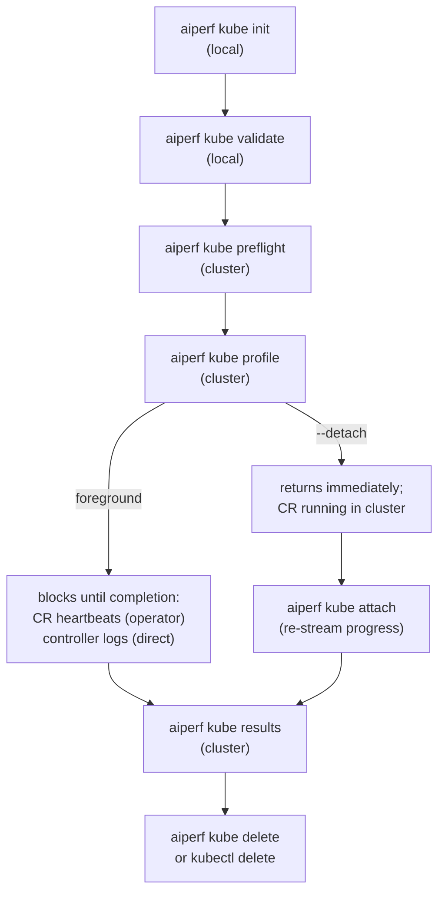

# End-to-End Workflow

This guide walks through the full lifecycle of a single AIPerf benchmark on
Kubernetes: from generating a config template all the way through retrieving
results and cleaning up. Each individual subcommand has its own reference
page; this page is the linear narrative that ties them together and shows how
state flows from one step to the next.

If you have never deployed AIPerf on Kubernetes before, start with
[Getting Started](./getting-started.md) for cluster prerequisites and
installing the operator, then return here.

## Lifecycle overview

Most runs follow the same path. Commands marked "local" run entirely on your
laptop; commands marked "cluster" talk to the Kubernetes API server.



The commands on the left-hand column (init, validate, preflight) are
pre-flight work: they write or inspect files and poke at the cluster but
never create workload resources. `profile` is the one command that actually
deploys. `attach`, `results`, `logs`, and `debug` all operate on an
already-deployed benchmark; `list --watch` continuously refreshes cluster
status.

## Stage 1: `init` — scaffold a config

`aiperf kube init` renders one of the bundled AIPerf config templates
(`src/aiperf/config/templates/`), wraps it in an `AIPerfJob` CR shell, and
prints it to stdout — or writes it to a file with `-o` / `--output`.

```bash
# Print the default 'minimal' template to stdout
aiperf kube init

# Browse the bundled templates
aiperf kube init --list
aiperf kube init --search goodput

# Pick a template and pre-fill model / endpoint, write to benchmark.yaml
aiperf kube init -t goodput_slo \
    --model Qwen/Qwen3-0.6B \
    --url http://server:8000 \
    --output benchmark.yaml
```

The output is an `apiVersion: aiperf.nvidia.com/v1alpha1`, `kind: AIPerfJob`
document: the template body lands under `spec`, and commented-out blocks for
deployment options, pod customization, and Kueue scheduling are appended. It is
the same CR format the operator accepts, so you can either hand it to
`aiperf kube profile --config benchmark.yaml` or `kubectl apply -f
benchmark.yaml` it directly. `--job-name` (default `my-benchmark`) sets
`metadata.name`. See [init-and-generate.md](./init-and-generate.md) for the
full flag list and a walkthrough of the emitted template.

`init` writes nothing else — no cluster state, no `last_kube_benchmark.json`,
no container image references. Image, workers, and namespace are still
supplied at `profile` time via CLI flags.

## Stage 2: `validate` — offline config check

`aiperf kube validate` reads one or more YAML files and validates them
against the CRD schema and the `AIPerfConfig` model, without touching the
cluster. Use it in CI or in a pre-commit hook to catch typos before you
deploy.

```bash
aiperf kube validate benchmark.yaml
find recipes -name perf.yaml -print0 | xargs -0 aiperf kube validate --strict
aiperf kube validate -o json benchmark.yaml
```

See [validate.md](./validate.md) for the full list of checks (RFC 1123 name
validation, endpoint presence, worker math, unknown-field detection, etc.)
and CI recipes.

## Stage 3: `preflight` — cluster-side check

`aiperf kube preflight` confirms that the cluster you are about to deploy
into is actually capable of running the benchmark. It is the first command
that contacts the cluster.

```bash
# Basic
aiperf kube preflight

# With image and endpoint probes and a worker-count projection
aiperf kube preflight \
    --image aiperf:latest \
    --endpoint-url http://server:8000 \
    --workers 8

# JSON output for CI
aiperf kube preflight -o json
```

It verifies connectivity, API versions, RBAC, node capacity vs. worker
projection, image pull-ability, and endpoint reachability. See
[preflight.md](./preflight.md) for the full check list and the JSON schema.
Running `validate` and `preflight` together gives you full coverage of "is
the config sane?" plus "is the cluster ready?".

## Stage 4: `profile` — deploy the benchmark

This is the load-bearing command. It parses a config (from CLI flags or from
the YAML file you validated), picks a deployment mode, submits resources to
the cluster, and optionally streams logs until the benchmark finishes.

### Operator mode vs. direct mode

By default, `profile` looks for the `aiperfjobs.aiperf.nvidia.com` CRD on the
cluster (see `operator_available` in
`src/aiperf/cli_commands/kube/profile_deploy.py`). Use `--operator` to select
operator mode without that cluster-scoped discovery request, or
`--no-operator` to select direct mode.

- **Operator mode (default when CRD is present).** `profile` creates a
  single `AIPerfJob` custom resource. The in-cluster operator reconciles the
  CR and owns the lifecycle of the downstream `JobSet`, `ConfigMap`, `Role`,
  and `RoleBinding`. When the run reaches a terminal phase the operator's
  completion handler copies the results onto a shared operator PVC; on a
  failure it instead salvages whatever partial checkpoint files the controller
  had written. Nothing is harvested incrementally mid-run. `profile` never
  creates a namespace: the target namespace must already exist. This lets
  namespace-scoped tenants submit AIPerfJobs without cluster-wide CRD-read or
  Namespace-create permission by combining `--operator` with `--namespace`.

- **Direct mode (CRD absent, or forced with `--no-operator`).** `profile`
  skips the operator and creates the `ConfigMap`, `Role`, `RoleBinding`, and
  `JobSet` itself, in a namespace that must already exist. There is no CR and no operator-managed
  PVC; results stay on the pod filesystem until you pull them with `aiperf
  kube results --from-pods`. See [direct-mode.md](./direct-mode.md). The
  JobSet TTL defaults to 8 hours in direct mode (vs. 5 minutes in operator
  mode) specifically so pods stay alive long enough for manual results
  retrieval.

Both modes accept the same flags. To preview the manifests without
submitting them, use `aiperf kube generate --operator` or `aiperf kube
generate --no-operator` instead — or pass `--dry-run` to `profile`, which
prints the would-be CR as JSON in operator mode, or the raw manifests as
multi-document YAML in direct mode. Both forms write the payload to stdout
verbatim, so `--dry-run > job.json` and `--dry-run | jq` stay valid however
long the image reference or endpoint URL is.

#### `--dry-run` fidelity

`--dry-run` is intentionally usable with no cluster reachable at all, which
is what makes `--no-operator --dry-run > bench.yaml` (see
[direct-mode.md](./direct-mode.md)) work from a laptop with no kubeconfig.
Two consequences follow, and both mean dry-run output can differ from what a
real run would submit:

1. **The mode shown is assumed, not detected.** `--dry-run` skips the
   `operator_available` CRD probe entirely, so with neither `--operator` nor
   `--no-operator` it always renders the `AIPerfJob` CR — even on a cluster
   where the CRD is absent and a real run would have fallen back to direct
   mode. `profile` prints a note to stderr saying so; pass `--no-operator`
   to preview direct-mode manifests. Only the *unset*-flag row diverges:

   | `--dry-run` | operator flag | AIPerfJob CRD | Path previewed / taken | Cluster probed |
   |---|---|---|---|---|
   | yes | unset | present | operator | no |
   | yes | unset | **absent** | **operator** | no |
   | yes | `--operator` | either | operator | no |
   | yes | `--no-operator` | either | direct | no |
   | no | unset | present | operator | yes |
   | no | unset | **absent** | **direct** | yes |
   | no | `--operator` | either | operator | no |
   | no | `--no-operator` | either | direct | no |

2. **The CR is printed before validation.** In operator mode a real run pipes
   the spec through `validate_job_spec` and submits the canonicalized Pydantic
   dump, whereas `--dry-run` prints the literal pre-validation spec so you can
   see exactly what you authored. For CLI-flag input the two are byte-identical,
   but a hand-authored `AIPerfJob` CR passed with `-f` can differ: snake_case
   envelope keys such as `ttl_seconds_after_finished` are printed as-is by
   dry-run and submitted as `ttlSecondsAfterFinished`, and a spec carrying an
   unknown key is printed happily by dry-run while a real submission exits 1
   with `Unknown top-level envelope key(s)`. Use `aiperf kube validate` (or a
   real submission) to check a CR's validity; `--dry-run` does not.

### Foreground vs. `--detach`

Once the resource is created, `profile` decides whether to block:

- **Foreground (the default, when stdout is a TTY).** In operator mode the CLI
  polls the AIPerfJob CR every 2 seconds via `watch_job`, logging phase/worker
  heartbeats and condition transitions, until the phase reaches `Completed`,
  `Failed`, or `Cancelled` — or a hard 600-second timeout raises `TimeoutError`.
  It does not port-forward to the controller pod; use `aiperf kube attach` after
  submission for real-time progress streaming. Ctrl+C returns to the shell but
  leaves the cluster-side run intact. For benchmarks that run longer than 600
  seconds, pass `--detach` and monitor separately with `aiperf kube attach`.
  Direct mode takes a different foreground path (`wait_or_detach` ->
  `auto_attach_workflow`): it waits up to 300 seconds for the controller pod to
  reach `Running`, tails that pod's `control-plane` container, and on completion
  downloads all artifacts plus per-pod logs into `./artifacts/<job_id>/`, so a
  separate `aiperf kube results` call is not required.
- **`--detach` (or any non-interactive stdout, e.g. a pipe or CI).** The CLI
  submits the resource, prints "Detached" with a hint about how to re-attach,
  and exits immediately. The benchmark continues running in the cluster.
  Non-interactive environments auto-upgrade to detach mode with a warning —
  see `wait_or_detach` in `src/aiperf/cli_commands/kube/profile_deploy.py`.

### The "last benchmark" handoff

As part of a successful submit, `profile` writes
`~/.aiperf/last_kube_benchmark.json` — this is how the rest of the workflow
commands default their `job_id` and `--namespace` to "whatever you just
deployed". The file is written by both operator-mode (`deploy_via_operator`)
and direct-mode paths. See [Last benchmark persistence](#last-benchmark-persistence)
below for details.

Operator jobs and sweeps also record their custom-resource kind. Destructive
commands use that kind when no `job_id` is supplied, so a same-named
`AIPerfJob` and `AIPerfSweep` cannot redirect the last-benchmark shorthand to
the wrong resource. Legacy and direct-mode records remain readable without a
kind.

### Common `profile` invocations

```bash
# From a CR-format YAML file (validated above), with operator auto-detect
aiperf kube profile \
    --config benchmark.yaml \
    --image aiperf:latest \
    --total-workers 10

# From pure CLI flags, foreground, follows logs until done
aiperf kube profile \
    --model Qwen/Qwen3-0.6B \
    --url http://server:8000 \
    --image aiperf:latest \
    --total-workers 8

# CI / scripted: deploy and return control immediately
aiperf kube profile \
    --config benchmark.yaml \
    --image aiperf:latest \
    --detach

# Force direct mode even if the operator is installed
aiperf kube profile \
    --model Qwen/Qwen3-0.6B \
    --url http://server:8000 \
    --image aiperf:latest \
    --no-operator

# Pre-provisioned tenant namespace; skip cluster-scoped CRD discovery
aiperf kube profile \
    --config benchmark.yaml \
    --namespace team-a-benchmarks \
    --operator
```

## Stage 5: `attach` — re-connect to a detached run

If you detached (or Ctrl-C'd out of a foreground run), `aiperf kube attach`
re-opens the log stream. It port-forwards to the controller pod's API
container and streams real-time progress over WebSocket.

```bash
# Re-attach to the last deployed benchmark
aiperf kube attach

# Re-attach to a specific job
aiperf kube attach my-benchmark --namespace aiperf-bench
```

Called without arguments, `attach` reads
`~/.aiperf/last_kube_benchmark.json` for the job-id and namespace, so the
zero-argument form works as long as you haven't deployed a second benchmark
in between. Ctrl+C disconnects from the stream without killing the
benchmark.

### Cancelling a run

`aiperf kube cancel` patches `spec.cancel: true` on the CR. The operator
tears down the JobSet, stamps `status.phase=Cancelled`, and emits a
`Cancelled` event; already-terminal benchmarks are left alone. A job created
with `spec.cancel: true` is terminalized the same way before any endpoint
probe, preflight check, or Kubernetes benchmark resource is created.

```bash
# Cancel the last deployed benchmark
aiperf kube cancel

# Cancel a specific job, a whole sweep, or one variation of it
aiperf kube cancel my-benchmark --namespace aiperf-bench
aiperf kube cancel my-sweep
aiperf kube cancel shared-name --kind sweep
aiperf kube cancel my-sweep -v 7
```

When an `AIPerfJob` and `AIPerfSweep` share a name, pass `--kind job` or
`--kind sweep`. The CLI refuses an ambiguous destructive command instead of
selecting one kind by lookup order.

Cancelling is not the same as deleting: the CR (and any results already
harvested) stays, so `aiperf kube results` still works afterwards.

### Retiring and removing runs

```bash
# Let a finished benchmark's controller pod exit and free its reservation.
# Refuses while the run is still going -- cancel it first.
aiperf kube shutdown my-benchmark

# Delete one benchmark; the JobSet and pods go with it via ownerReferences.
aiperf kube delete my-benchmark --force
aiperf kube delete shared-name --kind sweep --force

# Bulk-remove finished benchmarks from a namespace (running ones are left alone)
aiperf kube cleanup --dry-run
aiperf kube cleanup

# Include running benchmarks; each is cancelled before it is removed
aiperf kube cleanup --all --force
```

`delete` and `cleanup` prompt before removing anything and refuse outright
when stdin is not a terminal, so a CI job cannot delete by accident -- pass
`--force` when you mean it. Results already harvested onto the operator's PVC
survive all three commands.

Neither command touches the namespace itself. AIPerf never creates one, so
removing it is your call: `kubectl delete namespace <ns>`.

## Stage 6: `results` — pull the artifacts

When the run is complete (phase `Completed` in `aiperf kube list`), fetch
the artifacts:

```bash
# Default: operator mode — reads from the operator's PVC via HTTP.
aiperf kube results

# Custom output directory (default is ./artifacts/{name})
aiperf kube results --output ./out

# Direct mode, or fallback if the operator hasn't imported results yet
aiperf kube results --from-pods

# Direct mode + let the controller pod exit cleanly
aiperf kube results --from-pods --shutdown

# Summary only (no per-request parquet)
aiperf kube results --summary-only
```

`results` has two retrieval paths:

1. **Operator PVC (default).** Calls the operator's results API at
   `/api/v1/results/...` over a port-forward to the operator pod. Works
   even after the benchmark pods have been TTL-deleted, because the operator
   copied everything into its persistent volume. See
   [results-api.md](./results-api.md) for the HTTP surface and PVC layout.

2. **`--from-pods`.** Goes directly to the benchmark controller pod's HTTP
   API. On the default `--all` path that API is the only tier — if it fails,
   the download fails. The `kubectl cp` fallback exists only on the
   `--summary-only` path, which tries the API first and copies from the
   `control-plane` container if it fails. Required for direct-mode
   deployments; useful in operator mode if the operator hasn't synced yet or
   if you want the raw on-pod artifact tree. Combined with `--shutdown`, the
   controller pod exits cleanly after the copy so the JobSet can complete.

The command exits with status 1 when the target cannot be resolved or any
requested result download fails. This makes a successful exit safe to use as
the artifact-collection gate in CI; partial sweep downloads also fail the
command even though successfully downloaded child artifacts remain on disk.

Output directory defaults to `./artifacts/{benchmark-name}`, or
`./artifacts/{namespace}__{benchmark-name}__{epoch}` when you pin a historical
run with `--run` (see `aiperf kube results list-runs`) so the pinned download
cannot overwrite the latest-run directory.

## Intermediate commands

These don't fit the linear sequence but are part of everyday operation:

- **`aiperf kube list`** — enumerates AIPerfJob CRs (falls back to JobSet
  lookup in direct mode), with `--running`, `--completed`, `--failed`,
  `--watch`, and `-A`. This is how you discover names you've forgotten.
- **`aiperf kube logs`** — raw pod logs, with `--follow`, `--tail`,
  `--container`, and `--output` (save per-pod files to a directory).
- **`aiperf kube debug`** — one-shot diagnostic: pod states, recent events,
  node resources, and a slice of logs from any pod with problems. See
  [debug-command.md](./debug-command.md).
- **`aiperf kube dashboard`** — port-forwards the operator's results server
  UI and opens it in your browser. Useful for browsing multiple past
  benchmarks stored on the operator PVC.
- **`aiperf kube sweep`** — deploys an `AIPerfSweep` (parameter sweep or
  multi-run) instead of a single `AIPerfJob`. See [Running Sweeps on Kubernetes](../tutorials/sweeps.md#running-sweeps-on-kubernetes).
- **`aiperf kube show`** — renders an `AIPerfJob` CR with Jinja2 and env-var
  substitutions resolved, so you can see what the operator will actually read.

## Stage 7: cleanup

Benchmark resources carry a TTL, but you often want to reclaim space (and the
CR name) sooner.

- **Operator mode:**
  ```bash
  aiperf kube delete my-benchmark -n my-benchmarks
  # or, equivalently, straight through kubectl:
  kubectl delete aiperfjob my-benchmark -n my-benchmarks
  ```
  The downstream JobSet, ConfigMap, Role, and RoleBinding carry
  ownerReferences back to the CR, so Kubernetes garbage-collects them. The
  operator's `on_delete` handler deliberately does not delete them itself; it
  only sets the in-process cancellation flag, closes the cached
  `ProgressClient`, and drops the job's `runs_index` rows. Deleting through
  `aiperf kube delete` also clears the matching `last_kube_benchmark.json`
  entry; deleting through `kubectl` leaves it stale, so subsequent
  `attach`/`results` calls will report "not found" until you pass the job ID
  (positional) and `-n` / `--namespace` explicitly, or deploy a new benchmark
  to repopulate.

- **Direct mode:**
  ```bash
  kubectl delete jobset my-benchmark -n my-benchmarks
  ```
  Delete the ConfigMap, Role, and RoleBinding before re-deploying the same
  name. Direct mode reuses an existing Namespace but refuses to adopt any
  existing workload or RBAC resource because it cannot prove that resource
  belongs to the new invocation. The JobSet `ttl_seconds` defaults to 28800
  (8 hours) so the pods stay alive long enough for `aiperf kube results
  --from-pods`; after TTL, Kubernetes garbage-collects the JobSet for you.

## Last benchmark persistence

The file `~/.aiperf/last_kube_benchmark.json` is the glue that lets
`attach`, `results`, `logs`, `debug`, `cancel`, `delete`, and `shutdown`
default to the most recently deployed benchmark.

The format is:

```json
{
  "job_id": "qwen3-0-6b-openai-throughput",
  "namespace": "my-benchmarks",
  "name": "my-benchmark",
  "kind": "AIPerfJob"
}
```

`job_id` and `namespace` are always present. `name` is the
user-supplied-or-generated friendly name and is written only when set.
`kind` is `AIPerfJob` or `AIPerfSweep` and is absent for direct-mode and
legacy records; any other value is discarded on read. See
`LastBenchmarkInfo`, `save_last_benchmark`, and `get_last_benchmark` in
`src/aiperf/kubernetes/console.py`.

Default-resolution logic lives in `resolve_job_id_and_namespace` in
`src/aiperf/kubernetes/cli_helpers.py`: if `job_id` is explicitly passed,
the flag wins. Otherwise the file is consulted, and if the file is missing
the command prints an error and exits.

**Multi-cluster pitfall.** The file is per-user, not per-kubeconfig or
per-context. If you alternate between clusters in one shell session, always
pass the job ID positionally plus `-n` / `--namespace` (and `--kube-context`)
explicitly. Otherwise "I deployed to
staging and `results` is reading from prod" is an easy way to chase a ghost.

### Command interaction matrix

| Command | Reads `last_kube_benchmark.json` | Writes it | Notes |
| --- | --- | --- | --- |
| `kube init` | no | no | Pure local file generator. |
| `kube validate` | no | no | Offline YAML validation. |
| `kube preflight` | no | no | Uses `--namespace`; no job concept. |
| `kube profile` | no | **yes** (on successful submit) | Both operator and direct paths write the file. |
| `kube sweep` | no | **yes** (on successful submit) | Records `kind: AIPerfSweep`. |
| `kube generate` | no | no | Prints manifests; never hits cluster state. |
| `kube attach` | yes (if `job_id` omitted) | no | Exits `1` when the target does not exist; see [exit-code convention](#exit-code-convention-for-target-addressing-commands). |
| `kube results` | yes (if `job_id` omitted) | no | Exits `1` on any incomplete download, not only on a missing target. |
| `kube logs` | yes (if `job_id` omitted) | no | Exits `1` when the target does not exist; see [exit-code convention](#exit-code-convention-for-target-addressing-commands). |
| `kube debug` | yes (if `-j` and `-n` both omitted and `-A` not set) | no | |
| `kube cancel` | yes (if `job_id` omitted) | no | Also reads the stored `kind` to disambiguate. |
| `kube shutdown` | yes (if `job_id` omitted) | no | |
| `kube delete` | yes (if `job_id` omitted) | **clears it** | Only when the stored record names the deleted benchmark. |
| `kube cleanup` | no | **clears it** | Cleared per removed benchmark that matches the stored record. |
| `kube list` | no | no | Enumerates the cluster directly. |
| `kube dashboard` | no | no | Operator-scoped, not job-scoped. |

## Exit-code convention for target-addressing commands

Eleven `aiperf kube` subcommands take a benchmark name or job ID. They split
into two groups, and the split is deliberate: **validation and retrieval
commands gate, addressing commands narrate.**

| Group | Commands | Non-zero exit on… |
| --- | --- | --- |
| **Gating** — the command's whole purpose is to produce a verdict or a file | `validate`, `preflight`, `results`, `results list-runs` | any failure, including a missing target *and* a partial or failed download |
| **Addressing** — the command reports on whatever it finds | `attach`, `logs`, `cancel`, `delete`, `shutdown`, `debug`, `list` | nothing, **except** `attach` and `logs`, which exit `1` when the named target does not exist |

`attach` and `logs` are the two commands people reach for in CI to answer "is
this benchmark there?", so a missing target is an error for them. A target that
exists but has nothing left to show — pods already garbage-collected, a
`--container` filter that matched nothing, a container that logged zero lines —
is **not** an error: the command says so and exits `0`.

Both accept `--ignore-not-found`, spelled and behaving like `kubectl`'s flag:
the diagnostic is still printed, only the exit status is suppressed. Use it in
teardown scripts that must tolerate an already-deleted benchmark.

```bash
# Gate a pipeline on the benchmark existing
aiperf kube logs "$JOB" --tail 1 >/dev/null || exit 1

# Best-effort log capture during teardown, must not fail the job
aiperf kube logs "$JOB" -o ./triage --ignore-not-found
```

`cancel`, `delete`, `shutdown`, `debug`, and `list` intentionally stay at exit
`0` for a missing target: they are idempotent or exploratory, and "the thing you
asked me to stop is already gone" is the desired end state, not a failure.

## Common end-to-end recipes

### Quick smoke test, foreground

Typical developer loop: validate, deploy, watch logs inline, pull results.

```bash
aiperf kube init --output smoke.yaml
# edit smoke.yaml: set models, endpoint, datasets
aiperf kube validate smoke.yaml
aiperf kube preflight --image aiperf:latest --endpoint-url http://server:8000
aiperf kube profile --config smoke.yaml --image aiperf:latest
aiperf kube results
```

Because `profile` stays in the foreground, the last three commands are a
tight cycle: change config, re-run `profile`, inspect artifacts.

### Long-running benchmark, detached

For multi-hour runs from a laptop, CI, or SSH session, detach up front and
poll with `list --watch`.

```bash
aiperf kube profile --config long.yaml --image aiperf:latest --detach
# ... walk away; come back later ...
aiperf kube list --watch --running # continuously refresh running jobs
aiperf kube debug                  # diagnose a job that looks stuck
aiperf kube results                # once list reports Completed
```

CI systems automatically hit this path because stdout is not a TTY — no need
to pass `--detach` explicitly. Use `kubectl wait --for=condition=Complete aiperfjob/<name>` if you need
scripted completion detection; the CRD exposes `Complete` / `Failed`
conditions with the same semantics as a `batchv1.Job`. Every terminal
transition, including a permanent validation or preflight failure during
creation, stamps `status.completionTime` for TTL and history consumers.

### Multi-user shared cluster

On a cluster shared by multiple users, deploy each benchmark into its own
namespace and use [Kueue](./kueue.md) to gate admission.

```bash
aiperf kube profile \
    --config long.yaml \
    --image aiperf:latest \
    --namespace bench-alice \
    --queue-name aiperf-local-queue \
    --detach
aiperf kube list --namespace bench-alice
aiperf kube results --namespace bench-alice
```

Because `last_kube_benchmark.json` is per-user (not per-namespace), Alice's
shell and Bob's shell each remember their own most-recent deploy
independently. Within a single shell, always pass `--namespace` explicitly
when you work across more than one.

## Related references

- [Getting Started](./getting-started.md) — cluster prerequisites, operator
  install.
- [Configuration](./configuration.md) — CLI and CR configuration surfaces.
- [Validate](./validate.md) — YAML validation details.
- [Preflight](./preflight.md) — cluster-readiness checks.
- [Direct mode](./direct-mode.md) — running without the operator.
- [Results API](./results-api.md) — operator PVC retrieval and HTTP surface.
- [Kueue](./kueue.md) — multi-tenant admission control.
- [Production](./production.md) — hardening, quotas, and monitoring.
