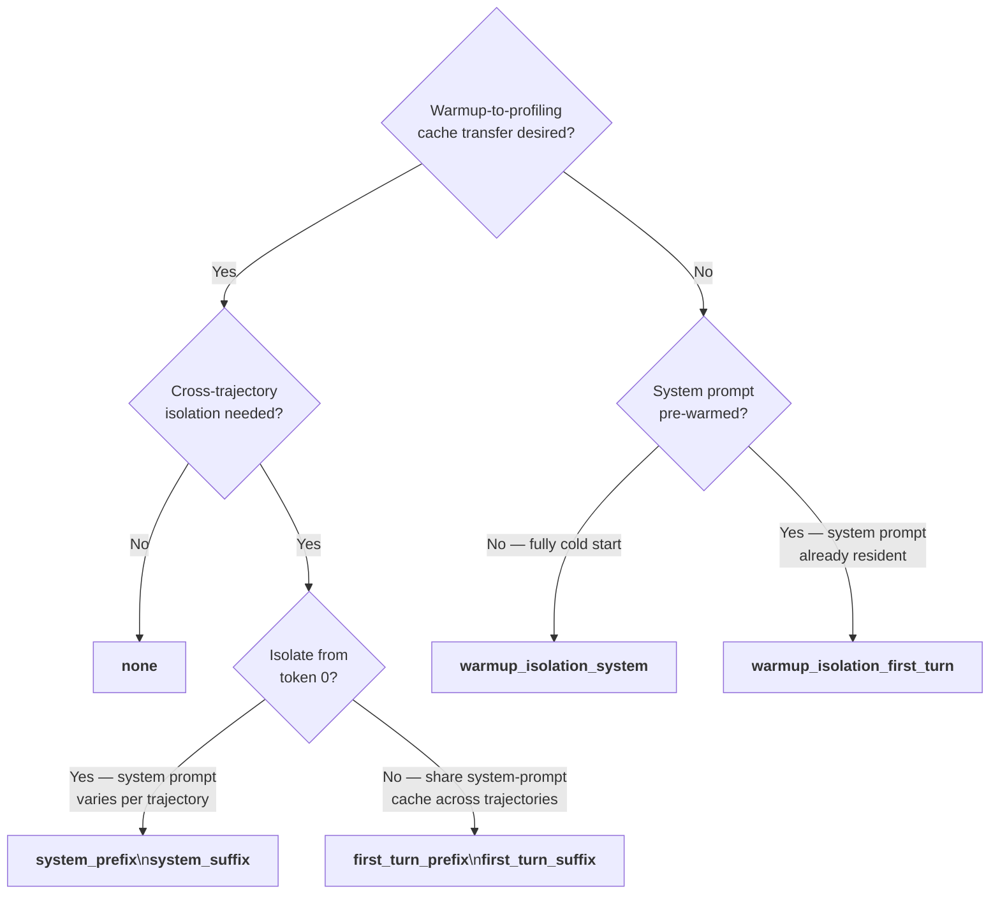

# Cache-Bust Targets

The `--cache-bust` flag (CLI) or `cache_bust.target` (YAML) controls how AIPerf mutates outgoing
request payloads to defeat the server's KV-cache prefix matching. This is essential when you need
per-trajectory isolation or want precise control over how much warmup KV-cache work carries over
into the profiling phase.

## Configuration

**CLI:**
```bash
aiperf profile --cache-bust warmup_isolation_first_turn ...
```

**YAML (`cache_bust.target` inside a dataset's `prompts` block):**
```yaml
datasets:
  - name: main
    type: synthetic
    prompts:
      isl: 512
      osl: 128
      cache_bust:
        target: warmup_isolation_first_turn
    prefix_prompts:
      shared_system_length: 512
```

## Behavior Table

| Target | Marker | Per-trajectory unique | Injection point | Warmup→Profiling KV cache | Cross-trajectory isolation |
|---|---|---|---|---|---|
| `none` | — | — | — | Full warmup priming | None |
| `system_prefix` | `[rid:xxx]\n\n` | Yes (SHA-256 digest) | System message (token 0) | Full warmup priming (shared marker) | Yes |
| `system_suffix` | `\n\n[rid:xxx]` | Yes (SHA-256 digest) | System message (end) | Full warmup priming (shared marker) | Yes |
| `first_turn_prefix` | `[rid:xxx]\n\n` | Yes (SHA-256 digest) | First user turn (token 0) | System prompt pre-warmed; user cold | Yes |
| `first_turn_suffix` | `\n\n[rid:xxx]` | Yes (SHA-256 digest) | First user turn (end) | System prompt pre-warmed; user cold | Yes |
| `warmup_isolation_system` | `[warmup]\n\n` | No (constant) | System message (token 0) | None — fully cold start | N/A |
| `warmup_isolation_first_turn` | `[warmup]\n\n` | No (constant) | First user turn (token 0) | System prompt pre-warmed; user cold | N/A |

## `none` (default)

Cache-bust is disabled. No marker is injected. The server's KV-cache prefix matching operates
without interference: warmup turns prime the cache, and profiling requests for the same trajectory
benefit from that warm state.

**Wire payload (chat, warmup and profiling identical):**

```json
{
  "messages": [
    {"role": "system", "content": "You are a helpful assistant."},
    {"role": "user",   "content": "What is the capital of France?"}
  ]
}
```

## RID-Based Targets

`system_prefix`, `system_suffix`, `first_turn_prefix`, and `first_turn_suffix` each inject a
per-trajectory unique marker derived from a SHA-256 digest of the benchmark ID, recycle pass,
trajectory index, and base trace ID. The same trajectory always receives the same digest — across
warmup and profiling — so warmup KV-cache work transfers to profiling for that trajectory.
Different trajectories (different lanes or recycle passes) receive distinct digests, preventing
cross-trajectory cache sharing.

The marker format is `[rid:<12-hex-chars>]`. Prefix variants append `\n\n` after the marker;
suffix variants prepend `\n\n` before it.

### `system_prefix`

Injects `[rid:xxx]\n\n` at the very beginning of the system message content (token 0).

```json
{
  "messages": [
    {"role": "system", "content": "[rid:a3f9b2c1d4e5]\n\nYou are a helpful assistant."},
    {"role": "user",   "content": "What is the capital of France?"}
  ]
}
```

Both warmup and profiling payloads are identical (same digest for the same trajectory).

### `system_suffix`

Injects `\n\n[rid:xxx]` at the end of the system message content.

```json
{
  "messages": [
    {"role": "system", "content": "You are a helpful assistant.\n\n[rid:a3f9b2c1d4e5]"},
    {"role": "user",   "content": "What is the capital of France?"}
  ]
}
```

Both warmup and profiling payloads are identical (same digest for the same trajectory).

### `first_turn_prefix`

Injects `[rid:xxx]\n\n` at the very beginning of the first user turn content (token 0). The
system message is untouched, so system-prompt tokens are always prefix-cached across trajectories
while per-trajectory isolation starts at the first user turn.

```json
{
  "messages": [
    {"role": "system", "content": "You are a helpful assistant."},
    {"role": "user",   "content": "[rid:a3f9b2c1d4e5]\n\nWhat is the capital of France?"}
  ]
}
```

Both warmup and profiling payloads are identical (same digest for the same trajectory).

### `first_turn_suffix`

Injects `\n\n[rid:xxx]` at the end of the first user turn content. The system message is untouched.

```json
{
  "messages": [
    {"role": "system", "content": "You are a helpful assistant."},
    {"role": "user",   "content": "What is the capital of France?\n\n[rid:a3f9b2c1d4e5]"}
  ]
}
```

Both warmup and profiling payloads are identical (same digest for the same trajectory).

## Warmup-Isolation Targets

`warmup_isolation_system` and `warmup_isolation_first_turn` use a constant marker
(`[warmup]\n\n`) during the WARMUP phase. During PROFILING, no marker is injected (the field is
`None`). Because the warmup and profiling payloads differ, the server cannot reuse warmup KV-cache
entries for profiling requests — warmup work is deliberately discarded.

These targets are **phase-aware**: the marker is present only during warmup and absent during
profiling. This is the opposite of the RID targets, which are phase-agnostic (same marker in both
phases) so warmup primes profiling.

> **Incompatibility with `agentic_replay`:** These targets cannot be used with the
> `agentic_replay` timing mode. In agentic replay, the same session object spans the
> WARMUP→PROFILING boundary and Turn objects mutated during warmup would carry the
> `[warmup]` marker into profiling credits. Use `cache_bust=none` for `agentic_replay`
> workloads, or one of the RID-based targets for per-trajectory isolation.

### `warmup_isolation_system`

Injects `[warmup]\n\n` at the very beginning of the system message during WARMUP. During
PROFILING the payload is clean — no marker anywhere.

> **Synthetic datasets only — requires a shared system prompt.**
> For synthetic datasets, `warmup_isolation_system` is rejected at config validation time
> if no system message is statically present. This means either
> `--shared-system-prompt-length` or `--system-prompt`/`--system-prompt-file` must be set.
> If you are using `--user-context-prompt-length` or `--num-prefix-prompts`
> without a shared system prompt, switch to `warmup_isolation_first_turn` instead.
>
> File and public datasets are not checked statically — system-message presence depends
> on the dataset content and cannot be determined at config time. If the dataset does not
> produce a system message, the marker will silently fall through to the first user turn.

**WARMUP phase:**

```json
{
  "messages": [
    {"role": "system", "content": "[warmup]\n\nYou are a helpful assistant."},
    {"role": "user",   "content": "What is the capital of France?"}
  ]
}
```

**PROFILING phase:**

```json
{
  "messages": [
    {"role": "system", "content": "You are a helpful assistant."},
    {"role": "user",   "content": "What is the capital of France?"}
  ]
}
```

The warmup marker poisons every prefix cache token from position 0, so profiling sees a fully
cold start — no benefit from warmup at any level.

### `warmup_isolation_first_turn`

Injects `[warmup]\n\n` at the very beginning of the first user turn during WARMUP. The system
message is untouched in both phases.

**WARMUP phase:**

```json
{
  "messages": [
    {"role": "system", "content": "You are a helpful assistant."},
    {"role": "user",   "content": "[warmup]\n\nWhat is the capital of France?"}
  ]
}
```

**PROFILING phase:**

```json
{
  "messages": [
    {"role": "system", "content": "You are a helpful assistant."},
    {"role": "user",   "content": "What is the capital of France?"}
  ]
}
```

Because the system message is identical in both phases, the server can prefix-cache system-prompt
tokens during warmup. However, the diverging first user turn means user-turn tokens onward are
cold in profiling.

## Scenario Summary

The table below maps each combination of prefix prompt mode and cache-bust target to the resulting
warmup→profiling cache behavior. Use it to pick the right pair of flags for your scenario.

| Prefix prompt mode | Flags | `--cache-bust` | Profiling system cache | Profiling user cache | Valid? |
|---|---|---|---|---|---|
| None | _(no prefix flags)_ | `none` | Pre-warmed | Pre-warmed | ✅ |
| None | _(no prefix flags)_ | `warmup_isolation_first_turn` | Pre-warmed | Cold | ✅ |
| None | _(no prefix flags)_ | `warmup_isolation_system` | — | — | ❌ no system message |
| Shared system | `--shared-system-prompt-length N` | `none` | Pre-warmed | Pre-warmed | ✅ |
| Shared system | `--shared-system-prompt-length N` | `warmup_isolation_system` | Cold | Cold | ✅ fully cold start |
| Shared system | `--shared-system-prompt-length N` | `warmup_isolation_first_turn` | Pre-warmed | Cold | ✅ system pre-warmed |
| User context | `--user-context-prompt-length N` | `none` | N/A (no system) | Pre-warmed | ✅ |
| User context | `--user-context-prompt-length N` | `warmup_isolation_first_turn` | N/A (no system) | Context pre-warmed; query cold | ✅ |
| User context | `--user-context-prompt-length N` | `warmup_isolation_system` | — | — | ❌ no system message |
| Prefix pool | `--num-prefix-prompts N --prefix-prompt-length M` | `none` | N/A (no system) | Pre-warmed | ✅ |
| Prefix pool | `--num-prefix-prompts N --prefix-prompt-length M` | `warmup_isolation_first_turn` | N/A (no system) | Cold (prefix + query) | ✅ |
| Prefix pool | `--num-prefix-prompts N --prefix-prompt-length M` | `warmup_isolation_system` | — | — | ❌ no system message |

**Key:** "Pre-warmed" = profiling requests can reuse KV-cache entries from warmup for those tokens.
"Cold" = warmup marker differs from profiling payload; server cannot reuse warmup cache entries.
"N/A (no system)" = configuration produces no system message; system cache column does not apply.

## Prefix Prompt Compatibility

The warmup-isolation targets interact with the three prefix prompt modes differently.

### Shared system prompt (`--shared-system-prompt-length`)

A synthetic system message is created and shared identically across all sessions.

| Target | Warmup system msg | Profiling system msg | Warmup user msg | Profiling user msg |
|---|---|---|---|---|
| `warmup_isolation_system` | `[warmup]\n\n<system>` | `<system>` (clean) | `<user>` | `<user>` |
| `warmup_isolation_first_turn` | `<system>` | `<system>` | `[warmup]\n\n<user>` | `<user>` (clean) |

`warmup_isolation_system` makes profiling fully cold (system poisoned during warmup).
`warmup_isolation_first_turn` keeps the system prompt pre-warmed; only user-turn tokens are cold.

### Verbatim system prompt (`--system-prompt` / `--system-prompt-file`)

A user-supplied system message, identical across all sessions, works with synthetic **and**
file/public datasets.

It is **mutually exclusive** with `--shared-system-prompt-length`: both fill the same
system-message slot, so setting both is rejected at config-validation time rather than one
silently taking precedence. There is no ordering between them — the run fails before any
request is sent. The same exclusivity applies to
`--num-prefix-prompts`/`--prefix-prompt-length`.

For marker routing the verbatim prompt behaves exactly like
`--shared-system-prompt-length`: the `system_*` and `warmup_isolation_system` targets land
on it rather than falling through to the first user turn.

One difference in token accounting: the synthetic system prompt is shrunk by the marker's
token cost so its wire length still matches the configured `--shared-system-prompt-length`.
Verbatim text has no target length to compensate against, so the marker is simply **additive**
— consistent with the system prompt's own tokens, which sit on top of `--isl` rather than
inside it.

### User context prefix (`--user-context-prompt-length`)

Each session gets a unique per-session context message prepended as a **user-role** message
before the main user prompt. No system message is created.

| Target | Warmup msg 1 (context) | Warmup msg 2 (prompt) | Profiling msg 1 | Profiling msg 2 |
|---|---|---|---|---|
| `warmup_isolation_system` | — | — | — | — |
| `warmup_isolation_first_turn` | `<context>` (clean) | `[warmup]\n\n<prompt>` | `<context>` | `<prompt>` (clean) |

`warmup_isolation_system` is **rejected** at config validation time because there is no system
message slot to target. Use `warmup_isolation_first_turn` instead.

`warmup_isolation_first_turn` injects into the main user prompt (the second user message), not
the per-session context prefix. This means the context prefix tokens are pre-warmed during
profiling; only the main query tokens are cold.

### Prefix prompt pool (`--num-prefix-prompts` / `--prefix-prompt-length`)

The prefix pool content is concatenated directly into the user message — there is no system
message.

| Target | Warmup user msg | Profiling user msg |
|---|---|---|
| `warmup_isolation_system` | — | — |
| `warmup_isolation_first_turn` | `[warmup]\n\n<prefix><prompt>` | `<prefix><prompt>` (clean) |

`warmup_isolation_system` is **rejected** at config validation time (no system message slot).

`warmup_isolation_first_turn` injects at the start of the combined prefix+prompt user message,
making the entire content cold in profiling — including prefix pool tokens.

## Choosing a Target



### `none`

Warmup primes the full KV cache for the profiling phase. Best for latency benchmarks where KV
cache hit rate is itself a variable under test, or when you want to measure a fully warmed
steady-state server.

### RID targets (`system_prefix`, `system_suffix`, `first_turn_prefix`, `first_turn_suffix`)

Each trajectory receives a unique digest marker. Trajectories cannot share each other's cached
prefixes. Within a single trajectory, warmup still primes the profiling phase because the digest
is phase-agnostic — the same marker appears in both warmup and profiling turns for that
trajectory. Use these when running multi-trajectory agentic workloads where cross-session cache
contamination would skew latency numbers.

Choose the `system_*` variants when the system prompt itself must be unique per trajectory.
Choose the `first_turn_*` variants when you want the system prompt pre-cached across all
trajectories (cheaper amortized cost) but each trajectory's user path isolated from others.

> **Note:** RID targets do not isolate warmup from profiling — the same digest appears in both
> phases, so warmup primes the profiling cache for each trajectory. There is no single target that
> provides both per-trajectory isolation and a cold profiling start; if you need a fully cold
> profiling phase, use `warmup_isolation_system` or `warmup_isolation_first_turn` instead (which
> offer no per-trajectory isolation).

### `warmup_isolation_system`

Profiling sees a fully cold start — no KV cache benefit from warmup. Use this to measure
cold-cache throughput or to simulate the first ever request to a freshly started server.

### `warmup_isolation_first_turn`

The system prompt is pre-warmed (as if already resident from prior real traffic), but each user
turn arrives cold. This models a common production deployment where a shared system prompt is
always in cache while individual user queries are novel. Use this to benchmark the realistic
latency of new user queries against a pre-warmed system prompt.

## Mutual Exclusivity

Pass only one `--cache-bust` value per run. The `warmup_isolation_*` targets and the RID targets
are mutually exclusive by design: warmup-isolation targets are phase-aware (marker present only
during WARMUP) while RID targets are phase-agnostic (marker identical in both phases). Combining
them in a single run is not supported.
