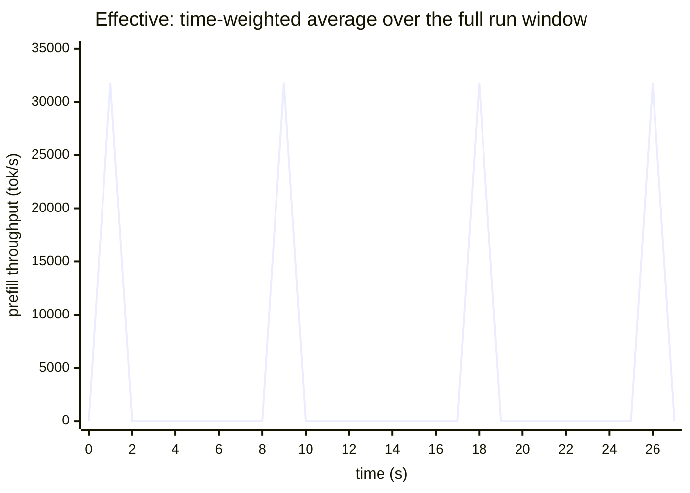
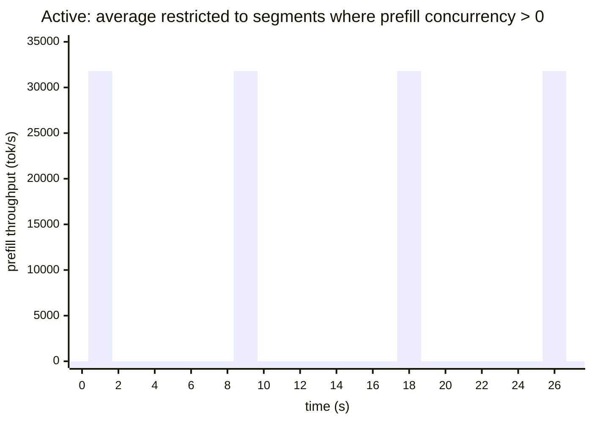

# Effective vs Active Metrics in AIPerf

*A short technical brief on time-weighted throughput, concurrency, and coordinated-omission-aware latency.*

## TL;DR

AIPerf reports two complementary families of time-weighted metrics:

- **Effective** metrics are time-weighted averages of a step function over the **full benchmark window**. An "average concurrency of 14.6" means that, integrating across every nanosecond from the first credit to the last response, the in-flight request count averaged 14.6.
- **Active** metrics are the same time-weighted averages **restricted to segments where the relevant phase has at least one request in flight**. An "active prefill throughput of 28k tok/s" means: while *any* request was actually in prefill, tokens were being produced at that rate on average.
- **`effective_latency`** is a separate per-record metric grouped under `EFFECTIVE`. It is `end_ns - credit_issued_ns` — the latency a saturating user actually perceives, including time waiting in the credit queue. It is the only AIPerf latency metric that is coordinated-omission-aware.

Rule of thumb: cite **Effective** when capacity-planning at the workload mix you measured; cite **Active** when characterizing peak phase intensity; cite **`effective_latency`** when reporting user-perceived latency under load that could be saturating.

## Why classical record-averages mislead

LLM inference has three measurement traps that simple arithmetic means hide:

1. **Equal-weight averaging over records is biased toward fast requests.** A run with one 10-second request and ninety-nine 1-second requests has the same record-arithmetic-mean as a run with one 100-second request and ninety-nine 1-second requests, even though the first run is far healthier. Time-weighted averages weight by *duration*, so the heavy request contributes proportionally to how long it actually occupied the system.

2. **Whole-run averages dilute by idle gaps.** LLM inference has two distinct phases per request: prefill (compute-bound, brief, processes the input) and decode (memory-bound, long, generates one token at a time). At any instant most in-flight requests are in decode; prefill windows are brief and sparse. A whole-window average of "prefill throughput" reports a number diluted by all the decode-only time and is much smaller than the per-prefill-burst intensity the hardware actually delivers.

3. **Coordinated omission.** Under a saturating load generator, requests pile up in the AIPerf credit queue before being dispatched. The server-side timing (`request_start_ns` to `end_ns`) excludes that queue wait, so a naive latency understates what an actual user — who issued the request at `credit_issued_ns` — would have observed. AIPerf addresses this with `effective_latency`, which charges the queue wait to the request.

The Effective and Active metric groups, together with `effective_latency`, are AIPerf's responses to these three traps.

## Effective metrics: full-window time-weighted views

AIPerf's analyzer builds a step function over each quantity of interest (concurrency, decode throughput, prefill throughput, total throughput, tokens-in-flight) using a vectorized sweep-line algorithm on the per-request timestamp columns. The step function holds value `v_i` from event `t_i` to event `t_{i+1}`. An Effective metric is then the **time-weighted average**

```
avg = Σ (v_i × Δt_i) / (run_end − run_start)
```

Percentiles (p50, p90, p95, p99) are also duration-weighted: AIPerf sorts the `(v_i, Δt_i)` pairs by value, takes a cumulative duration fraction, and reads off the quantile. A "p99 of 920 tok/s" therefore means *"99% of the run-window time, decode throughput was at or below 920 tok/s"* — not "99% of the records had throughput at or below 920 tok/s".



The full set of Effective metrics emitted today:

| Metric | Unit | What it represents |
|---|---|---|
| `effective_concurrency` | requests | Time-weighted in-flight request count over the run window (includes failed requests) |
| `effective_decode_concurrency` | requests | Same, restricted to the decode phase `[generation_start, end]` |
| `effective_prefill_concurrency` | requests | Same, restricted to the prefill phase `[start, generation_start]` |
| `effective_decode_throughput` | tokens/sec | Σ per-request decode rates, time-weighted over the run |
| `effective_prefill_throughput` | tokens/sec | Σ per-request prefill rates, time-weighted over the run |
| `effective_total_throughput` | tokens/sec | Prefill + decode combined |
| `effective_decode_throughput_per_user` | tokens/sec/user | Decode throughput divided by decode concurrency |
| `effective_prefill_throughput_per_user` | tokens/sec/user | Prefill throughput divided by prefill concurrency |
| `tokens_in_flight` | tokens | KV-cache occupancy proxy: tokens currently being processed |

## Active metrics: phase-restricted views

Active variants use the same sweep-line rate curve, but the integration window is restricted to segments where the relevant **phase mask** is strictly positive. For `active_prefill_throughput` the mask is `prefill_concurrency > 0`; for `active_decode_throughput` it is `decode_concurrency > 0`. Time when no request is in that phase contributes zero duration to the denominator, so the average reflects intensity *during* the phase rather than diluted by gaps.



In the bar diagram, only the non-zero spikes contribute to both numerator and denominator — the zero-valued bands are excluded.

The Active metrics emitted today:

| Metric | Mask used | Unit |
|---|---|---|
| `active_decode_throughput` | `decode_concurrency > 0` | tokens/sec |
| `active_prefill_throughput` | `prefill_concurrency > 0` | tokens/sec |
| `active_total_throughput` | overall `concurrency > 0` | tokens/sec |
| `active_decode_throughput_per_user` | `decode_concurrency > 0` | tokens/sec/user |
| `active_prefill_throughput_per_user` | `prefill_concurrency > 0` | tokens/sec/user |

### Worked example (real AIPerf run)

Run: `aiperf profile -m mock-model --streaming --concurrency 16 --request-count 200 --synthetic-input-tokens-mean 200 --output-tokens-mean 100` against the in-repo mock server with TTFT=100 ms, ITL=20 ms. Benchmark duration: 27.06 s.

Selected rows from the end-of-run console tables:

| Metric | avg | p50 | p90 | p99 | max |
|---|---:|---:|---:|---:|---:|
| Effective Decode Concurrency (req) | 14.63 | 16.00 | 16.00 | 16.00 | 16.00 |
| Effective Prefill Concurrency (req) | **0.75** | 0.00 | 0.00 | 16.00 | 16.00 |
| Effective Decode Throughput (tok/s) | 726.33 | 792.31 | 830.99 | 859.22 | 921.87 |
| Effective Prefill Throughput (tok/s) | **1,477.97** | 0.00 | 0.00 | 31,786.15 | 31,851.62 |
| Active Decode Throughput (tok/s) | 754.96 | 795.03 | 831.04 | 859.40 | 921.87 |
| Active Prefill Throughput (tok/s) | **28,140.81** | 31,746.34 | 31,791.31 | 31,851.62 | 31,851.62 |

Two observations:

- **Decode is almost always active**, so Effective Decode and Active Decode track each other (727 vs 755 tok/s). Decode dominates the run window — the mean decode concurrency of 14.63 is ≈ 91% of the 16 offered slots (`14.63/16.0`), so at almost every instant nearly all in-flight requests are in decode.
- **Prefill is sparse**, so Effective and Active disagree by ~19×. `effective_prefill_concurrency` averages 0.75 across the whole window — prefill is in flight only a small fraction of the time. When you ask "what is the prefill throughput of this system?", **Active** (28k tok/s) is the answer about hardware capability; **Effective** (1.5k tok/s) is the answer about how much prefill work the workload demanded on average. Both are correct; they answer different questions.

The Effective row's `p50 = 0` for prefill is not a bug — it correctly reports that for more than half of the run window, no request was in prefill, so the time-weighted median of the prefill-throughput step function is exactly zero.

## `effective_latency`: the coordinated-omission-aware latency

`effective_latency` is grouped under `MetricConsoleGroup.EFFECTIVE` even though, unlike the sweep-line metrics, it is a per-record metric. The definition is:

```
effective_latency = end_ns − credit_issued_ns
```

Compare to the classical `request_latency = end_ns − start_ns`. The difference, `start_ns − credit_issued_ns`, is the time the request spent waiting in AIPerf's credit queue — invisible to the server but real to the user.

This metric is only emitted when at least one record carries a `credit_issued_ns` timestamp. Every AIPerf load mode dispatches requests through the credit issuer, which stamps each credit with `issued_at_ns` — the worker then records it as `credit_issued_ns` — so `effective_latency` is available for closed-loop (`--concurrency`) and open-loop (`--request-rate`, trace replay) runs alike. It is suppressed only when no record in the run carries a `credit_issued_ns` timestamp. Comparing `effective_latency` against `request_latency` tells you how much of perceived latency is queue-induced (load-generator backpressure) versus server-induced (the model itself):

- If they are essentially equal — as in the worked example above, where both averaged ~2,081 ms — your load is not saturating; queue wait is negligible.
- If `effective_latency` is materially larger than `request_latency`, you have crossed into a saturating regime. The "real" tail latency users observe is the `effective_latency` distribution, not the server-side one.

This is AIPerf's answer to the coordinated-omission problem made famous by Gil Tene: a naïve benchmark that omits queue wait under-reports user-perceived latency precisely when the system is most stressed.

### Failed requests

`effective_latency` is drawn from **successful records only**, the same population every other latency metric uses. `RequestRecord.valid` is `not has_error and …`, so a failed request is already absent from `request_latency`, TTFT, ITL and the rest; excluding it here keeps a failure's time-to-error from being averaged into the success distribution at full weight.

The failure-aware view is `adj_effective_latency`, rendered as **Effective Latency (CO-aware) (error-adjusted)**. It applies the same treatment the [`PERCENTILE_INCLUDES_FAILED_REQUESTS`](../metrics-reference.md#metric-flags-reference) flag gives the registry latency metrics: the success-only distribution plus one `+inf` sample per errored record. `avg` and `sum` become `inf` once any request fails, and a percentile becomes `inf` when failed samples occupy its rank (p50 flips at a 50% failure rate, p99 at 1%) — that is the intended reading, not a defect. `std` is undefined over a distribution containing `inf`. Non-finite values are omitted from the JSON export, rendered as empty cells in CSV, and shown as `N/A` on the console, matching `adj_request_latency`. The metric is omitted on a clean run (nothing to inflate) and on a total-failure run (no distribution to inflate).

> **The sweep-line Effective metrics behave differently.** `effective_concurrency` and the throughput/`tokens_in_flight` curves are built from `[start_ns, end_ns)` intervals and **do** include failed requests. This is deliberate: a request that hung for two minutes before returning a 504 genuinely occupied a slot for those two minutes, and dropping it would under-report the load the server was actually carrying. So on a run with slow failures, expect `effective_concurrency` to exceed the concurrency implied by the successful requests alone. The token-weighted curves are unaffected in practice, since an errored record has no `input_sequence_length` / `output_sequence_length` to weight by, and the decode-phase curves exclude it too because it never reached first-token.

## Choosing a metric

| You want to answer… | Cite |
|---|---|
| "What sustained decode throughput should I plan for at this concurrency level?" | `effective_decode_throughput` |
| "What was the peak decode throughput the GPU achieved while decoding?" | `active_decode_throughput` (close to `effective_decode_throughput` when decode is rarely idle) |
| "What is this server's prefill capability under bursty arrival?" | `active_prefill_throughput` — Effective will dilute it by decode-only time |
| "How saturated was my load generator? Did the credit queue back up?" | Compare `effective_latency` against `request_latency` |
| "What latency does a user actually perceive under this load?" | `effective_latency` (when emitted) |
| "What did users perceive on a run where some requests failed?" | `adj_effective_latency` — failures enter as `+inf` |
| "How many requests was the server actually holding, failures included?" | `effective_concurrency` |
| "What is the KV-cache pressure during this run?" | `tokens_in_flight` |

## Reading the console output

In the standard end-of-run output, AIPerf renders one table per non-empty `MetricConsoleGroup` in the order `EFFECTIVE`, `ACTIVE`, `USAGE`, `CACHE`, `PREDICTION`, `AUDIO`, `REASONING`, `DEFAULT`. A vanilla LLM run typically shows three: `NVIDIA AIPerf | LLM Metrics: Effective`, `NVIDIA AIPerf | LLM Metrics: Active`, and the legacy/default `NVIDIA AIPerf | LLM Metrics` table containing record-level distributions (TTFT, ITL, request latency, OSL, ISL). Endpoint types that emit usage, cache, prediction, audio, or reasoning tokens add intermediate tables. The grouping is driven by the `console_group` class attribute on each metric.

## References

- Definitions and formulas for the record-level metrics referenced here (TTFT, ITL, request latency, ISL/OSL): [`docs/metrics-reference.md`](../metrics-reference.md). The Effective/Active families themselves are defined only in this brief.
- Coordinated omission background: Gil Tene, "How NOT to Measure Latency" (Strange Loop 2015)
