{/* SPDX-FileCopyrightText: Copyright (c) 2025-2026 NVIDIA CORPORATION & AFFILIATES. All rights reserved.
SPDX-License-Identifier: Apache-2.0 */}

# GPU Telemetry & Power-Efficiency Metrics Dataflow

How per-vendor GPU power/energy signals flow from the collectors to the console.
NVIDIA and AMD stay in **separate lanes end-to-end**: they converge only in the
shared `TelemetryHierarchy` store, then re-split at the per-platform aggregation
so each vendor's totals sum only its own GPUs. A mixed NVIDIA+AMD run emits both
lanes' sections; a vendor with no reporting GPU is omitted entirely.

<Note>
A self-contained, richly-styled HTML version of this diagram lives alongside
this page at [`gpu-telemetry-metrics-dataflow.html`](gpu-telemetry-metrics-dataflow.html)
(open it directly in a browser).
</Note>

## Dataflow

```mermaid
flowchart LR
    subgraph produce["1 · Produce"]
        direction TB
        dcgm["DCGMTelemetryCollector<br/><small>DCGM /metrics → DCGM_TO_FIELD_MAPPING → nvidia_*</small>"]
        pynvml["PyNVMLTelemetryCollector<br/><small>local NVML → nvidia_power_usage, nvidia_energy_consumption</small>"]
        amdsmi["AMDSMITelemetryCollector<br/><small>amdsmi → amd_power (W), amd_energy_consumption (MJ)</small>"]
        record["TelemetryRecord + TelemetryMetrics<br/><small>stamps platform (nvidia/amd) + vendor fields</small>"]
        dcgm --> record
        pynvml --> record
        amdsmi --> record
    end

    subgraph converge["2 · Converge (shared store)"]
        direction TB
        process["GPUTelemetryAccumulator<br/>.process_telemetry_record()"]
        hierarchy["TelemetryHierarchy<br/><small>telemetry_source_url → gpu_uuid → GpuTelemetryData series<br/>holds BOTH vendors, tagged by metadata.platform</small>"]
        process --> hierarchy
    end

    subgraph aggregate["3 · Aggregate (re-split per vendor)"]
        direction TB
        compute["compute_efficiency_metrics()<br/><small>once per phase; loops _EFFICIENCY_VENDORS</small>"]
        nvsum["NVIDIA: _sum_gpu_power_watts / _sum_gpu_energy_joules<br/><small>platform=nvidia · NVIDIA_POWER_USAGE_FIELD / NVIDIA_ENERGY_CONSUMPTION_FIELD</small>"]
        amdsum["AMD: _sum_gpu_power_watts / _sum_gpu_energy_joules<br/><small>platform=amd · AMD_POWER_FIELD / AMD_ENERGY_CONSUMPTION_FIELD</small>"]
        inputs["shared inputs<br/><small>total_output_tokens (records) + concurrency (config)</small>"]
        compute --> nvsum
        compute --> amdsum
        inputs -.-> nvsum
        inputs -.-> amdsum
    end

    subgraph tags["4 · Vendor MetricResults"]
        direction TB
        nvtags["nvidia_total_gpu_power<br/>nvidia_total_gpu_energy<br/>nvidia_output_tokens_per_joule<br/>nvidia_energy_per_user"]
        amdtags["amd_total_gpu_power<br/>amd_total_gpu_energy<br/>amd_output_tokens_per_joule<br/>amd_energy_per_user"]
        groups["console_group<br/><small>GPU_POWER_EFFICIENCY_NVIDIA / _AMD</small>"]
    end

    subgraph render["5 · Render"]
        direction TB
        banner["ConsoleGpuVendorDisclaimerExporter<br/><small>vendor warning banner — heads all GPU sections</small>"]
        nvexp["ConsoleNvidiaPowerEfficiencyExporter<br/><small>“GPU Power Efficiency (NVIDIA)”, avg-only</small>"]
        amdexp["ConsoleAmdPowerEfficiencyExporter<br/><small>“GPU Power Efficiency (AMD)”, avg-only</small>"]
        telexp["GPUTelemetryConsoleExporter<br/><small>per-GPU telemetry tables</small>"]
        files["CSV / JSON exporters<br/><small>all vendor tags persisted</small>"]
    end

    record --> process
    hierarchy --> compute
    nvsum --> nvtags
    amdsum --> amdtags
    nvtags --> groups
    amdtags --> groups
    groups --> banner
    banner --> nvexp
    nvexp --> amdexp
    amdexp --> telexp
    telexp --> files

    classDef nv fill:#1c2a05,stroke:#76b900,color:#e6edf3;
    classDef amd fill:#2a0708,stroke:#ed1c24,color:#e6edf3;
    classDef shared fill:#0d2440,stroke:#58a6ff,color:#e6edf3;
    class dcgm,pynvml,nvsum,nvtags,nvexp nv;
    class amdsmi,amdsum,amdtags,amdexp amd;
    class record,process,hierarchy,compute,inputs,groups,banner,telexp,files shared;
```



## Lanes

- **NVIDIA lane** (green): `DCGMTelemetryCollector` and `PyNVMLTelemetryCollector`
  write `nvidia_*` fields on `TelemetryMetrics`. The DCGM path maps raw DCGM field
  names via `DCGM_TO_FIELD_MAPPING`; both stamp `platform="nvidia"`.
- **AMD lane** (red): `AMDSMITelemetryCollector` writes `amd_power` /
  `amd_energy_consumption` and stamps `platform="amd"`.
- **Shared** (blue): the single `TelemetryHierarchy`, the aggregation entry point,
  the token/concurrency inputs, the `console_group` routing, the warning banner,
  and the per-GPU / file exporters.

## Convergence and re-split

The two lanes meet in exactly one place: `GPUTelemetryAccumulator` stores every
record — regardless of vendor — in a single `TelemetryHierarchy`, with each GPU
tagged by `metadata.platform`. `compute_efficiency_metrics` then iterates
`_EFFICIENCY_VENDORS` and calls `_sum_gpu_power_watts` / `_sum_gpu_energy_joules`
with a `(platform, field)` pair, so each vendor's sums include only its own GPUs.
This is what keeps a mixed cluster's NVIDIA and AMD totals from blending.

## Resulting console order

The disclaimer banner renders first, so it's clear everything below it is
vendor-specific:

```text
╭─ GPU Telemetry Platform ─╮  Platform: nvidia, amd · metric semantics are platform-specific
GPU Power Efficiency (NVIDIA)   Total GPU Power · Total GPU Energy · Output Tokens per Joule · Energy per User  (avg only)
GPU Power Efficiency (AMD)      Total GPU Power · Total GPU Energy · Output Tokens per Joule · Energy per User  (avg only)
AIPerf | GPU Telemetry Summary  per-GPU tables (power, util, mem, temp, …)
```

## Source of truth

- `src/aiperf/gpu_telemetry/` — collectors, `accumulator.py`, `constants.py`
- `src/aiperf/metrics/types/power_efficiency_metrics.py` — the eight vendor metric classes
- `src/aiperf/exporters/console_*_exporter.py` — the disclaimer, per-vendor efficiency, and telemetry exporters
