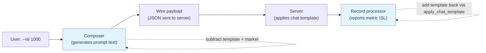

# Input Sequence Length (ISL) Tokenization

When you run `aiperf profile --isl 1000`, you're asking AIPerf to send **1000-token prompts** to the server. The number 1000 is intuitive, but the path from "the text I generated" to "the tokens the model actually processes" passes through several layers — each of which adds or removes tokens. This page explains how AIPerf reconciles those layers so that the value you ask for, the value the model sees, and the value AIPerf reports back to you all line up.

## What "ISL" actually counts

The model server doesn't see your raw text. It sees a tokenized, **chat-template-wrapped** payload. Concretely, when you send:

```json
{"messages": [{"role": "user", "content": "Hello"}]}
```

The server's tokenizer turns this into something like:

```
<|im_start|>user
Hello<|im_end|>
<|im_start|>assistant
```

That wrapping — the role markers, the headers, the trailing "now generate the assistant response" suffix — is the **chat template overhead**. It's not part of "Hello", but the model still has to process it. A single user turn typically adds 5–15 wrapper tokens depending on the model.

There's also a second source of extra tokens: AIPerf's **cache-bust marker**, a short hex string injected into the wire payload to prevent the server's KV cache from short-circuiting load tests. It's only present when `--cache-bust` is set, and only on the message it's targeted at. Cache-bust works with every timing mode and synthetic, file, and public datasets when endpoint plugin metadata sets `supports_cache_bust=true` (currently `chat`, `responses`, and Anthropic `messages`); unsupported endpoint shapes and pre-encoded `PAYLOAD_BYTES` workloads are rejected rather than silently sending unchanged bytes.

When AIPerf computes ISL, it has a choice: count the bare prompt text, or count what the model actually processes. By default AIPerf counts the **bare prompt** — the value you asked for in `--isl` is exactly what gets reported and what the composer aims to generate, so the metric is intuitive and matches the user's mental model. Pass `--apply-chat-template` to opt into the wire-payload total instead, which makes the metric **comparable to `--use-server-token-count`** (which reads ISL from the server's `usage.prompt_tokens` field) and matches the model's view of the workload.

## The two-sided fix (when `--apply-chat-template` is set)

`--apply-chat-template` is opt-in. With the flag off (default), neither the composer nor the record processor touches `apply_chat_template`: synthetic ISL passes through at the bare-text token count, and reported ISL is the bare-text encode of the wire payload's text. The two-sided compensation described below only kicks in when you pass the flag.

To make `--isl 1000` actually mean "1000 tokens reach the model" AND "AIPerf reports 1000 in the metrics", AIPerf compensates on **both sides** of the request when the flag is set.



### Side 1: Composer subtracts the wrapper before generating

If the chat template adds 9 tokens of fixed overhead per request (BOS + assistant-prompt suffix) and 5 tokens of wrapping per message, and the cache-bust marker adds 10 tokens to the first user turn, the composer needs to generate a **bare prompt of 976 tokens** for the first turn so that after wrapping and marker injection, the wire payload contains ~1000 tokens. Subsequent turns of the same conversation only pay the per-message wrap (5 tokens), so they're sized at 995.

The composer does this once at startup by:

1. **Probing the chat template** with three short sample messages, rendering each through `apply_chat_template` twice — once as a single-message prompt (`[user(S)]`) and once as a three-message prompt (`[user(S), assistant(S), user(S)]`). Subtracting the bare-encoded content from each and solving the resulting two-equation system yields:
   - `per_msg_wrap` — the role-header + EOT cost of one additional message;
   - `per_request_fixed` — the BOS + generation-prompt cost charged once per request.
   See [`isl-budget-compensation.md`](./isl-budget-compensation.md) for the full derivation.
2. **Sampling the cache-bust marker** by building 8 representative markers and averaging their token counts. The marker is dominated by a 12-hex-character digest, so the variance is small and 8 samples is enough.

The composer subtracts:

- **First user turn**: `per_request_fixed + per_msg_wrap + first_turn_marker_tokens`
- **Subsequent user turns**: `per_msg_wrap` only

This split keeps multi-turn wire ISL accurate per-message instead of over-subtracting the request-fixed cost on every turn. The marker subtraction is also conditional on where the marker actually lands — see "When the marker compensation applies" below.

### Side 2: Record processor adds the wrapper when reporting

When a response comes back, AIPerf needs to compute "what was the input length?" The naive answer is "tokenize the text in the messages array." But that gives you the bare prompt count (986 in the example, after the marker is added back) — roughly the per-message wrap (5) and per-request fixed (9) tokens shy of the wire-payload total (1000).

So the record processor uses the same `apply_chat_template` call the server uses. It walks the wire payload (which is preserved on the request record as `payload_bytes`), reconstructs the messages list, and runs it through the tokenizer's chat template with `add_generation_prompt=True`. The returned token count includes role markers, headers, the assistant prompt suffix — everything the server saw.

When this works, the metric value matches `--isl` to within a small rounding error (the chat template overhead is averaged from samples, not exact). When it doesn't work — completions endpoints, embeddings, models with no chat template configured — the record processor falls back to the bare-text encoding, just like before. The fallback never raises.

For models whose HF tokenizer explicitly carries `chat_template = None` (most "base" / un-instruct-tuned checkpoints), the parser short-circuits before calling `apply_chat_template`: a single attribute check avoids one raise + one f-string format per record on the bare-text fallback path. With `--apply-chat-template` off, the entire chat-template branch is skipped regardless of the tokenizer.

## When the marker compensation applies

The cache-bust marker isn't always on the first user turn. Where it lands depends on `--cache-bust target` and whether you have a synthetic shared system prompt configured. The composer mirrors the worker's fallback rules exactly:

| `--cache-bust` target | Synthetic shared system prompt? | Where the marker lands | Composer compensation |
| --- | --- | --- | --- |
| `none` | — | (no marker) | None |
| `first_turn_prefix` / `first_turn_suffix` | any | First user turn | First user turn ISL reduced by marker tokens |
| `system_prefix` / `system_suffix` | yes | System message | **Shared system prompt length** reduced by marker tokens (composer reconstructs the synthetic system prompt with the smaller target) |
| `system_prefix` / `system_suffix` | no | First user turn (worker fallback) | First user turn ISL reduced by marker tokens |

The "system fallback" row exists because the worker has a fallback path: if you ask for a system-targeted marker but there's no system message to put it on, it lands on the first user turn instead. The composer reads the same configuration and predicts the same outcome.

The "system message" row uses a different lever: instead of reducing the user prompt, the composer rebuilds the synthetic shared system prompt with `length - marker_tokens` synthetic content tokens, so that after the worker prepends/appends the marker, the wire system message is exactly `length` tokens — matching the user's `--shared-system-prompt-length`. The user-facing config object is **not mutated**; the composer makes a private `model_copy` so other components still see the original length value.

## What gets dropped from the templated count

The chat template path tokenizes **text only**. When the record processor builds the messages list to pass to `apply_chat_template`, it makes three deliberate simplifications:

1. **Multimodal parts are dropped from the templating input**. Image, audio, and video parts on a message don't have a meaningful "token cost" in a generic chat template — server-side multimodal tokenization is model-specific. AIPerf already tracks image/audio/video counts separately on `MediaCounts` and exposes per-image/per-audio metrics, so dropping these parts here doesn't lose information; it just means the templated ISL covers text only. For a request with images, use `--use-server-token-count` if you need the multimodal-inclusive ISL.

   **Cache-bust on multimodal payloads still works.** When the targeted message's `content` is a list of parts (the OpenAI multimodal shape), the worker injects the marker as a new `{"type": "text", "text": "<marker>"}` part at the start of the parts list (prefix targets) or end (suffix targets), rather than concatenating it onto a string. The templated-ISL view still drops media parts but keeps the marker text part, so the marker contributes the same handful of tokens to reported ISL as it does for text-only payloads. Composer-side compensation is unchanged. Unknown content shapes (neither `str` nor `list[dict]`) trigger a one-time worker warning and the marker is dropped — the run continues but cache-busting is effectively off; tighten the payload shape if you see that warning.

2. **Mixed-content messages are concatenated into a single text string** for templating. HuggingFace chat templates expect string content per message, not a list of content parts. AIPerf joins the text parts of a message in payload order so the template still sees the full text the user wrote.

3. **Tools and function-call schemas are not passed**. If your payload includes `tools=[...]`, the server's chat template will add token costs for the tool definitions; AIPerf's client-side estimate doesn't currently include those. For tool-heavy benchmarks, prefer `--use-server-token-count`.

## Why we always use `add_generation_prompt=True`

`add_generation_prompt=True` tells `apply_chat_template` to append the "now begin the assistant response" suffix (e.g. `<|im_start|>assistant\n`). The model server appends the same suffix in production — that's why the model knows to start generating instead of continuing the user message. Including it in our count keeps the client-side ISL in sync with the server-side prompt-token count.

For multi-turn requests, the wire payload's last message is always a user (or tool) message, never an assistant message — the server is being asked to generate the next assistant turn. So `add_generation_prompt=True` is the right setting in every case AIPerf produces.

## What this means for `--use-server-token-count`

When you set `--use-server-token-count`, AIPerf reads ISL straight off the server's response (`usage.prompt_tokens`) and skips its own tokenization entirely. The server's count is canonical — it includes everything the server saw, including tools and any non-text content the server tokenizes.

Before the chat-template-aware change, AIPerf's client-side ISL undercounted by ~5–15 tokens per turn (the chat template overhead). That made client-side and server-side counts disagree even when the tokenizer matched. Now they agree to within a small rounding error on text-only chat payloads, so you can mix and match the two modes more freely.

The two modes can still diverge when:

- The server uses tools or other non-text payload features the client estimate doesn't model.
- The client tokenizer name doesn't match the server's exactly (different revision, different fork).
- The server applies a custom prompt template not encoded in the published HuggingFace tokenizer.

In those cases, `--use-server-token-count` is the source of truth.

## Where this happens in code

If you want to see the implementation:

- **Composer overhead probe**: `_estimate_chat_template_overheads` in `src/aiperf/dataset/composer/base.py` — returns the `(per_request_fixed, per_msg_wrap)` pair.
- **Composer marker probe**: `estimate_marker_token_cost` in `src/aiperf/timing/strategies/cache_bust.py`.
- **Composer compensation**: `BaseDatasetComposer.__init__` (computes the per-turn adjustments and the optional shared-system-prompt regeneration), exposes `first_turn_isl_adjustment` / `subsequent_turn_isl_adjustment` properties; `SyntheticDatasetComposer._generate_text_payloads` consumes the appropriate property per turn.
- **Worker marker injection (text + multimodal)**: `_inject_marker_into_raw_messages`, `_inject_marker_into_first_user_turn`, `_inject_marker_into_first_user_text` in `src/aiperf/workers/worker.py` — the helpers that handle `str` content, `list[dict]` multimodal content, and the synthetic-Turn fallback respectively.
- **Cache-bust validator**: `BenchmarkConfig.validate_cache_bust_compatibility` in `src/aiperf/config/config.py` — the model-validator that refuses incompatible timing-mode / endpoint-type combinations when knowable at construction time (scenario bypass + deferral when timing_mode is unset).
- **Wire-payload extraction**: `BaseEndpoint.extract_payload_inputs` in `src/aiperf/endpoints/base_endpoint.py` — populates `ExtractedPayload.messages` for chat-shape payloads.
- **Record-processor templating**: `InferenceResultParser._compute_chat_template_token_count` in `src/aiperf/records/inference_result_parser.py`.

The composer-side and record-processor-side estimates are independent — they probe the same tokenizer, but they don't share state. That's intentional: the composer runs once at startup; the record processor runs continuously and per-record. Decoupling them lets each side be tested in isolation.

For the full design rationale of the composer-side compensation — including each rejected alternative, edge cases, and limitations — see [`isl-budget-compensation.md`](./isl-budget-compensation.md).
