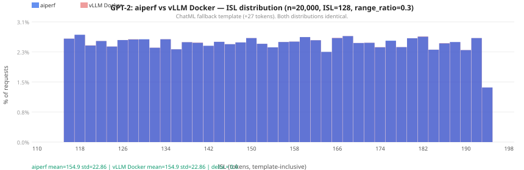
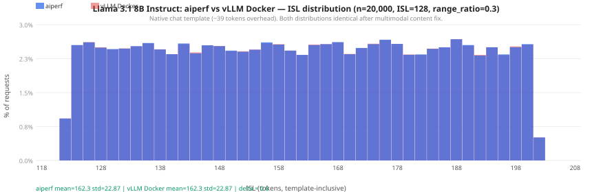

{/* SPDX-FileCopyrightText: Copyright (c) 2026 NVIDIA CORPORATION & AFFILIATES. All rights reserved.
SPDX-License-Identifier: Apache-2.0 */}

# Validating ISL/OSL distributions with the mock server

The in-repo mock server records the token length of every request it receives.
Use this to verify that aiperf is generating prompts at the ISL and OSL you
configured — and to compare distributions against other benchmarking tools such
as `vllm bench serve` or `sglang bench_serving`.

The histograms below show what a correctly-matched comparison looks like — aiperf
and vLLM Docker producing identical ISL distributions for the same seed and
parameters.  Blue = aiperf, red = vLLM Docker; overlapping bars appear purple.





An interactive version with additional tokenizer comparisons is available in
[isl-distribution-examples.html](isl-distribution-examples.html).

## Quick start

```bash
# 1. Start the mock server with a tokenizer and a recording file
aiperf-mock-server \
  --port 18000 \
  --tokenizer gpt2 \
  --default-model my-model \
  --record-requests /tmp/recording.jsonl

# 2. Run your benchmark against it
aiperf profile \
  --url http://localhost:18000 \
  --model-names my-model \
  --tokenizer gpt2 \
  --prompt-corpus random \
  --random-range-ratio 0.3 \
  --random-corpus-style vllm \
  --prompt-input-tokens-mean 128 \
  --prompt-output-tokens-mean 128 \
  --concurrency 10 \
  --conversation-num 5000 \
  --random-seed 0
```

When the benchmark finishes the mock server writes two files:

| File | Contents |
|------|----------|
| `recording.jsonl` | One JSON line per request: `isl`, `requested_osl`, `tokenization_mode`, and OSL-shaping fields |
| `recording.jsonl.summary.json` | Per-endpoint statistics: ISL/OSL histograms, vocab distribution, unique-value counts |

## Recording JSONL schema

Each line is a self-contained record:

```json
{
  "ts": 1785526379.59,
  "request_id": "chatcmpl-6348ad24-…",
  "endpoint": "/v1/chat/completions",
  "model": "my-model",
  "isl": 148,
  "requested_osl": 133,
  "max_tokens": null,
  "max_completion_tokens": 133,
  "min_tokens": null,
  "ignore_eos": true,
  "stream": true,
  "tokenization_mode": "chat_template"
}
```

`isl` is the **template-inclusive** input token count — the full tokenized
representation the server receives, including any chat template markup. For
`PromptCorpus.RANDOM` without `--apply-chat-template` the `isl` value matches
the configured `--prompt-input-tokens-mean` target directly.

`tokenization_mode` indicates how ISL was measured:

| Mode | Meaning |
|------|---------|
| `chat_template` | `apply_chat_template` called; full template overhead included |
| `chat_template_fallback` | No native template; ChatML fallback applied (+27 tokens for GPT-2) |
| `prompt_token_ids` | Request carried pre-tokenized `prompt_token_ids`; used directly |
| `tokenizer_call` | Completion endpoint; raw text encoded directly |

## Inspecting the distribution

```python
import json, statistics, collections

isls = [json.loads(l)["isl"] for l in open("/tmp/recording.jsonl")]
s = sorted(isls)
n = len(s)

print(f"n={n}")
print(f"min={s[0]}, p5={s[n//20]}, mean={statistics.mean(isls):.1f}, "
      f"p95={s[int(n*0.95)]}, max={s[-1]}, std={statistics.stdev(isls):.2f}")
```

## Comparing two recordings

The `tools/compare_recordings.py` utility produces a self-contained HTML
report from any two JSONL recording files:

```bash
python tools/compare_recordings.py \
  --a /tmp/aiperf_recording.jsonl  --label-a "aiperf" \
  --b /tmp/vllm_recording.jsonl    --label-b "vllm bench serve" \
  --out comparison.html
open comparison.html
```

### What the report contains

- **Stat cards** for ISL and OSL — mean, std, p5/p95, min/max, and delta
  between the two runs
- **Overlapping histograms** for ISL and OSL (2-token bins, blue/red
  transparent bars so overlapping regions are visually distinct)
- **Tokenization-mode breakdown table** — count and percentage for each
  `tokenization_mode` value per run
- **Vocabulary top-N diff table** — the token IDs with the largest count
  difference between runs (loaded automatically from the companion
  `.summary.json` files if present)

### CLI reference

```
usage: compare_recordings.py --a FILE --b FILE [--label-a LABEL]
                              [--label-b LABEL] [--out FILE]

  --a FILE        First recording JSONL (A)
  --b FILE        Second recording JSONL (B)
  --label-a LABEL Display label for file A  (default: A)
  --label-b LABEL Display label for file B  (default: B)
  --out FILE      Output HTML file          (default: comparison.html)
```

The `.summary.json` companion file is detected automatically at
`<recording>.summary.json` — no extra flag needed.

## Validating against vLLM Docker

Run both tools against separate mock server instances in parallel, then
compare the recordings:

```bash
# Mock server for aiperf (port 18000)
aiperf-mock-server --port 18000 --tokenizer meta-llama/Llama-3.1-8B-Instruct \
  --default-model mock-model \
  --record-requests /tmp/aiperf.jsonl &

# Mock server for vLLM (port 18001)
aiperf-mock-server --port 18001 --tokenizer meta-llama/Llama-3.1-8B-Instruct \
  --default-model mock-model \
  --record-requests /tmp/vllm.jsonl &

# aiperf run
aiperf profile --url http://localhost:18000 --model-names mock-model \
  --tokenizer meta-llama/Llama-3.1-8B-Instruct \
  --prompt-corpus random --random-range-ratio 0.3 --random-corpus-style vllm \
  --prompt-input-tokens-mean 128 --prompt-output-tokens-mean 128 \
  --concurrency 10 --conversation-num 20000 --random-seed 0 &

# vLLM Docker run
docker run --rm --platform linux/arm64 \
  -v ~/.cache/huggingface:/root/.cache/huggingface:ro \
  --entrypoint vllm vllm/vllm-openai-cpu:latest-arm64 \
  bench serve --backend openai-chat \
  --base-url http://host.docker.internal:18001 \
  --endpoint /v1/chat/completions --model mock-model \
  --tokenizer meta-llama/Llama-3.1-8B-Instruct \
  --dataset-name random --random-input-len 128 --random-output-len 128 \
  --random-range-ratio 0.3 --num-prompts 20000 \
  --request-rate inf --max-concurrency 30 \
  --ready-check-timeout-sec 0 --seed 0

# Compare
python tools/compare_recordings.py \
  --a /tmp/aiperf.jsonl --label-a "aiperf" \
  --b /tmp/vllm.jsonl   --label-b "vLLM Docker" \
  --out comparison.html
open comparison.html
```

## Capturing raw prompts

To capture the exact prompt text sent by a benchmark client — useful for
diagnosing content differences between tools — use `tools/capture_server.py`.
It records every request's `messages` array byte-for-byte without tokenizing
and returns a minimal synthetic streaming response so the client does not
error out.

```bash
python tools/capture_server.py \
  --out /tmp/captured.jsonl \
  --port 18000 \
  --host 127.0.0.1  # optional, default
```

Then point your benchmark client at `http://localhost:18000`. Each line in the
output JSONL contains:

```json
{
  "i": 0,
  "messages": [{"role": "user", "content": "..."}],
  "model": "mock-model",
  "max_completion_tokens": 128,
  "stream": true,
  "ignore_eos": true
}
```

### CLI reference

```
usage: capture_server.py --out FILE [--port PORT] [--host HOST]

  --out FILE   Output JSONL file — one captured request per line
  --port PORT  Listen port  (default: 18000)
  --host HOST  Listen host  (default: 127.0.0.1)
```

### Diffing captured prompts

After capturing from two tools with the same seed, compare content at the
Python level:

```python
import json

a = [json.loads(l)["messages"][0]["content"]
     for l in open("/tmp/captured_aiperf.jsonl")]
b = [json.loads(l)["messages"][0]["content"]
     for l in open("/tmp/captured_vllm.jsonl")]

# Sort both by content since concurrent sends may arrive out of order
a.sort(); b.sort()

diffs = [(i, ai, bi) for i, (ai, bi) in enumerate(zip(a, b)) if ai != bi]
print(f"{len(diffs)} / {min(len(a), len(b))} prompts differ")
for i, ai, bi in diffs[:3]:
    pos = next((j for j in range(min(len(ai),len(bi))) if ai[j]!=bi[j]), None)
    print(f"  [{i}] first diff at char {pos}")
```

Note that with `--max-concurrency > 1` requests arrive at the capture server
out of order. Sort by content (not by the sequential `"i"` field) before
comparing, or use `--max-concurrency 1` to force serial delivery.

## Notes on template-inclusive ISL

The mock server applies the tokenizer's chat template before measuring ISL
when a native template is available. This means the recorded ISL includes
template overhead (role markers, system prompt, generation prompt suffix)
on top of the prompt content. For a model like Llama 3.1 8B Instruct the
template adds approximately 35 tokens per request.

Clients that send message content as a multimodal list
`[{"type":"text","text":"..."}]` rather than a plain string — including
`vllm bench serve --backend openai-chat` — are handled transparently: the
mock server normalises list content via `_content_to_text` before passing
to `apply_chat_template`, so ISL measurement is consistent regardless of
how the client formats the content field.
