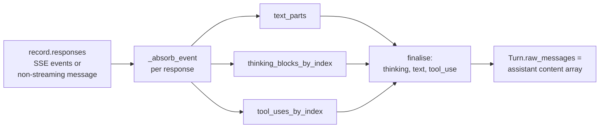

{/* SPDX-FileCopyrightText: Copyright (c) 2026 NVIDIA CORPORATION & AFFILIATES. All rights reserved.
SPDX-License-Identifier: Apache-2.0 */}

# Benchmarking the Anthropic Messages API

Profile Anthropic Messages API servers using AIPerf with the `messages` endpoint type.

## Overview

The `messages` endpoint type targets the Anthropic Messages API (`/v1/messages`). Use it when benchmarking:

- Anthropic API directly (https://api.anthropic.com)
- Self-hosted servers that implement the Anthropic Messages protocol
- Proxy servers that translate to the `/v1/messages` format

It supports streaming and non-streaming responses, text content, extended thinking, tool use, and `raw_messages` for verbatim trace replay.

### Key Differences from OpenAI Chat

| Feature | `chat` (OpenAI) | `messages` |
|---|---|---|
| Endpoint path | `/v1/chat/completions` | `/v1/messages` |
| Auth header | `Authorization: Bearer <key>` | `x-api-key: <key>` |
| System message | In messages array as `{"role": "system"}` | Top-level `system` field |
| Streaming format | OpenAI SSE with `choices[].delta` | Anthropic SSE with typed events |
| Max tokens default | Uses `max_completion_tokens` | `max_tokens` (defaults to 1024) |
| Reasoning content | `reasoning_content` field | `thinking` content blocks |
| Version header | None | `anthropic-version: 2023-06-01` |

---

## Basic Usage

### Non-Streaming

```bash
aiperf profile \
    --model claude-sonnet-4-20250514 \
    --endpoint-type messages \
    --url https://api.anthropic.com \
    --api-key $ANTHROPIC_API_KEY \
    --request-count 20 \
    --concurrency 4
```

### Streaming

Enable streaming to measure time-to-first-token (TTFT) and inter-token latency (ITL):

```bash
aiperf profile \
    --model claude-sonnet-4-20250514 \
    --endpoint-type messages \
    --streaming \
    --url https://api.anthropic.com \
    --api-key $ANTHROPIC_API_KEY \
    --request-count 20 \
    --concurrency 4
```

### With Synthetic Input Tokens

Control input and output token distributions:

```bash
aiperf profile \
    --model claude-sonnet-4-20250514 \
    --endpoint-type messages \
    --streaming \
    --synthetic-input-tokens-mean 500 \
    --synthetic-input-tokens-stddev 50 \
    --output-tokens-mean 200 \
    --output-tokens-stddev 20 \
    --url https://api.anthropic.com \
    --api-key $ANTHROPIC_API_KEY \
    --request-count 50 \
    --concurrency 8
```

### With a System Prompt

Add a shared system prompt across all requests using `--shared-system-prompt-length`. The system message is placed in the top-level `system` field (not in the messages array), matching the Anthropic API specification:

```bash
aiperf profile \
    --model claude-sonnet-4-20250514 \
    --endpoint-type messages \
    --shared-system-prompt-length 100 \
    --url https://api.anthropic.com \
    --api-key $ANTHROPIC_API_KEY \
    --request-count 20
```

---

## Request Format

The endpoint produces payloads conforming to the Anthropic Messages API. A formatted request looks like:

```json
{
    "model": "claude-sonnet-4-20250514",
    "messages": [
        {"role": "user", "content": "What is machine learning?"}
    ],
    "max_tokens": 1024,
    "stream": true
}
```

Key formatting rules:

- **Model**: Taken from the last turn's `model` field, falling back to `--model`
- **Max tokens**: Taken from the last turn's `max_tokens` field, defaulting to **1024** if not set
- **Stream**: Set from `--streaming` flag (default: `false`)
- **System**: Placed as a top-level string field when a system message is provided (never in the messages array)
- **Tools**: Included at the top level when tool definitions are present in the conversation
- **System (raw)**: When a turn carries `raw_system` (a list of content blocks), it is placed verbatim in the payload's top-level `system` field, overriding the conversation-level `system_message` string. See [Per-block system prompts (`raw_system`)](#per-block-system-prompts-raw_system)
- **Extra inputs**: Merged into the payload via `--extra-inputs` (e.g., `--extra-inputs temperature:0.7`)

### Simple Text Content

When a turn has a single text with a single content string and no images, audios, or videos, the content is sent as a plain string:

```json
{"role": "user", "content": "Hello!"}
```

### Complex Content Blocks

When a turn has multiple text items or images, content is sent as a list of typed blocks:

```json
{"role": "user", "content": [
    {"type": "text", "text": "Describe this image"},
    {"type": "image", "source": {"type": "url", "url": "https://example.com/photo.jpg"}}
]}
```

### Raw Messages (Verbatim Replay)

When a turn has `raw_messages` set, those message dicts are expanded directly into the messages list. This is used by trace replay dataset types for faithful reproduction of tool use conversations:

```json
{
    "messages": [
        {"role": "user", "content": "Read the file a.py"},
        {"role": "assistant", "content": [
            {"type": "text", "text": "Let me check."},
            {"type": "tool_use", "id": "tu-1", "name": "read_file", "input": {"path": "a.py"}}
        ]},
        {"role": "user", "content": [
            {"type": "tool_result", "tool_use_id": "tu-1", "content": "file data"}
        ]}
    ]
}
```

---

## Response Parsing

The endpoint handles both streaming and non-streaming responses.

### Non-Streaming Responses

Non-streaming responses have `"type": "message"`. The parser extracts content from the `content` array and usage from the `usage` object:

```json
{
    "type": "message",
    "content": [
        {"type": "text", "text": "Hello, how can I help?"}
    ],
    "usage": {"input_tokens": 10, "output_tokens": 8}
}
```

When both `thinking` and `text` blocks are present, the response is parsed as a `ReasoningResponseData` with separate `content` and `reasoning` fields:

```json
{
    "type": "message",
    "content": [
        {"type": "thinking", "thinking": "Let me analyze this..."},
        {"type": "text", "text": "The answer is 42"}
    ]
}
```

### Streaming Responses

Streaming uses Anthropic's SSE event format. The endpoint handles the following event types:

| Event Type | Action |
|---|---|
| `message_start` | Extracts `usage` (input tokens) from `message.usage` |
| `content_block_delta` with `text_delta` | Extracts incremental text |
| `content_block_delta` with `thinking_delta` | Extracts incremental reasoning |
| `content_block_delta` with `input_json_delta` | Ignored (tool input) |
| `content_block_delta` with `signature_delta` | Ignored |
| `message_delta` | Extracts `usage` (output tokens) |
| `ping`, `content_block_start`, `content_block_stop`, `message_stop` | Ignored |
| `error` | Logged as warning |

A typical streaming sequence:

1. `message_start` -- carries input token usage
2. `ping`
3. `content_block_start` -- signals a new content block
4. `content_block_delta` (text_delta) -- incremental text tokens
5. `content_block_stop`
6. `message_delta` -- carries output token usage and stop reason
7. `message_stop`

---

## Authentication

The Anthropic Messages endpoint uses `x-api-key` header authentication (not `Authorization: Bearer`):

```bash
aiperf profile \
    --model claude-sonnet-4-20250514 \
    --endpoint-type messages \
    --api-key sk-ant-api03-your-key-here \
    --url https://api.anthropic.com
```

The endpoint also sets the `anthropic-version: 2023-06-01` header by default. To override it or add beta headers (e.g., for extended thinking), use `--header`:

```bash
aiperf profile \
    --model claude-sonnet-4-20250514 \
    --endpoint-type messages \
    --api-key $ANTHROPIC_API_KEY \
    --header anthropic-beta:extended-thinking-2025-04-11 \
    --url https://api.anthropic.com
```

Custom headers are merged with the defaults. If you provide `anthropic-version` via `--header`, it takes precedence.

---

## Extra Inputs

Pass additional API parameters with `--extra-inputs`:

```bash
aiperf profile \
    --model claude-sonnet-4-20250514 \
    --endpoint-type messages \
    --extra-inputs temperature:0.7 \
    --extra-inputs top_p:0.9 \
    --url https://api.anthropic.com \
    --api-key $ANTHROPIC_API_KEY
```

These are merged directly into the request payload, producing:

```json
{
    "model": "claude-sonnet-4-20250514",
    "messages": [...],
    "max_tokens": 1024,
    "stream": false,
    "temperature": 0.7,
    "top_p": 0.9
}
```

---

## Custom Dataset Integration

### Single-Turn with Custom Prompts

```bash
cat > prompts.jsonl << 'EOF'
{"text": "Explain the theory of relativity."}
{"text": "Write a Python function to sort a list."}
{"text": "What causes tides?"}
EOF

aiperf profile \
    --model claude-sonnet-4-20250514 \
    --endpoint-type messages \
    --input-file prompts.jsonl \
    --custom-dataset-type single_turn \
    --streaming \
    --url https://api.anthropic.com \
    --api-key $ANTHROPIC_API_KEY \
    --concurrency 4
```

### Multi-Turn Conversations

```bash
cat > conversations.jsonl << 'EOF'
{"session_id": "s1", "turns": [{"text": "What is Rust?"}, {"text": "Compare it to C++."}]}
{"session_id": "s2", "turns": [{"text": "Explain async/await."}, {"text": "Show a Python example."}]}
EOF

aiperf profile \
    --model claude-sonnet-4-20250514 \
    --endpoint-type messages \
    --input-file conversations.jsonl \
    --custom-dataset-type multi_turn \
    --streaming \
    --url https://api.anthropic.com \
    --api-key $ANTHROPIC_API_KEY \
    --concurrency 2
```

---

## Server Token Counts

To use token counts reported by the server (from `usage` fields) instead of client-side tokenization:

```bash
aiperf profile \
    --model claude-sonnet-4-20250514 \
    --endpoint-type messages \
    --use-server-token-count \
    --tokenizer builtin \
    --streaming \
    --url https://api.anthropic.com \
    --api-key $ANTHROPIC_API_KEY
```

The Anthropic Messages API returns usage data at two points during streaming:

- `message_start`: reports `input_tokens` (and cache-related fields)
- `message_delta`: reports `output_tokens`

The usage object may include `cache_creation_input_tokens` and `cache_read_input_tokens` when prompt caching is active.

---

## Advanced features

### Per-block system prompts (`raw_system`)

The conversation-level `system_message` string (set, for example, by `--shared-system-prompt-length`) is rendered as a plain top-level `system: "..."` string. That works for most cases, but cannot express Anthropic's per-block extensions — most importantly `cache_control: {"type": "ephemeral"}` for prompt caching.

To opt in, set `raw_system` on a `Turn` to a list of content blocks. The endpoint resolves it the same way as `raw_tools`: walking the turn list from the end and taking the first non-`None` value (`base_endpoint.py::_latest_turn_attr`). When set, it wins over `system_message`:

```json
{
    "model": "claude-sonnet-4-20250514",
    "system": [
        {"type": "text", "text": "You are a careful code reviewer."},
        {
            "type": "text",
            "text": "<long shared rubric...>",
            "cache_control": {"type": "ephemeral"}
        }
    ],
    "messages": [...],
    "max_tokens": 1024,
    "stream": false
}
```

Notes:

- Latest-non-`None` turn wins — a FORK-mode DAG child that does not redeclare `raw_system` still inherits the parent's value.
- The field is Anthropic-specific. Other endpoints (`chat`, `responses`, ...) ignore it.
- Block contents flow into ISL accounting via the endpoint's system-prompt walk; see [Input token accounting (ISL)](#input-token-accounting-isl) below.
- `raw_system` is currently populated by trace-replay loaders that ingest Anthropic-shaped traces; programmatic callers building `Turn` objects directly can set it as well.
- `--cache-bust system-prefix` / `system-suffix` targets `raw_system` when it is set, since that is what actually ships. The marker is appended or prepended as its own `{"type": "text", ...}` block rather than being spliced into an existing block's text, so a neighbouring `cache_control` breakpoint stays attached to the bytes it was authored against.

### Audio and video are unsupported

The Anthropic Messages API does not accept audio or video content blocks. `_render_audio_part` and `_render_video_part` raise `NotImplementedError` immediately so a misuse fails at `format_payload` time with a clear error rather than producing an opaque server 4xx after dispatch:

```text
NotImplementedError: Anthropic Messages API does not support audio input.
Use a different endpoint, or remove audio content from the turn.
```

This is intentional. If your dataset has audio or video, route it to an endpoint that supports it (for example, the OpenAI `chat` endpoint with a multimodal-capable model) — do not try to coerce it into `messages`.

---

## Internals

### Input token accounting (ISL)

When you set `--synthetic-input-tokens-mean`, AIPerf needs an accurate count of the input tokens it just placed in the request payload to hit your target. The base endpoint walks `messages` content parts dispatched via `PART_TYPES`. Anthropic's `extract_payload_inputs` extends that walk in three places (helpers in `anthropic_messages.py`):

| Helper | What it harvests | Why it matters |
|---|---|---|
| `_walk_system` | Top-level `system` (string OR list of `{"type":"text","text":...}` blocks) | Otherwise the system prompt — often the largest input — is invisible to ISL accounting |
| `_walk_tool_schemas` | `tools[*].input_schema` (serialised as JSON) | Anthropic's schema field is `input_schema`, not OpenAI's `parameters`; the base walk already harvests `name` and `description` |
| `_walk_tool_blocks` | `tool_use` `name` + `input`, and `tool_result` `content` (string or list of text blocks) | The server tokenises these on agentic-history replay; the base walk drops them because they are not in `PART_TYPES` |

The endpoint also overrides `PART_TYPES` itself: `IMAGE` is the bare string `image` (Anthropic's shape) rather than OpenAI's `image_url`, and `AUDIO` and `VIDEO` are explicitly empty sets so the walk does not miscount parts that happen to share OpenAI's type names.

If your synthetic ISL targeting was undercounting agentic / tool-heavy traces before, this is what changed.

### Assistant-turn replay (DAG / FORK mode)

For DAG datasets (`dag_jsonl`) where a child turn forks from a parent's history, AIPerf replays the parent's assistant reply as part of the child request's `messages`. The base implementation captures only the streamed text. Anthropic's `build_assistant_turn` reassembles the full content array — `thinking`, then `text`, then `tool_use` — so a FORK-mode child sees the complete reply the model originally produced.



Reassembly rules (`anthropic_messages.py`):

- **Text** — accumulated from `content_block_delta` events with `delta.type == "text_delta"`.
- **Thinking** — keyed by SSE `index`; `thinking_delta` fragments append to `thinking`, `signature_delta` fragments append to `signature`. Both round-trip — the server requires the matching signature to accept a thinking block on replay.
- **Tool use** — keyed by SSE `index`; `input_json_delta.partial_json` fragments concatenate into a raw string, parsed once at finalise. Malformed JSON is preserved as a string under `input` rather than dropped, so the server rejects it loudly instead of AIPerf silently losing data.
- **Non-streaming `type=message`** responses are absorbed by walking the full `content` array directly.

When neither thinking nor `tool_use` blocks are present, `build_assistant_turn` falls back to the base text-only behaviour — callers that don't use either feature see no change.

---


- **Tokenizer**: Anthropic models use a proprietary tokenizer. When using `--use-server-token-count`, you still need a tokenizer for dataset generation — `--tokenizer builtin` uses a zero-network-access tiktoken tokenizer (also auto-substituted for obvious placeholder model names). For accurate client-side token counts, use a tokenizer that matches the model.
- **Max tokens default**: The endpoint defaults to `max_tokens: 1024` when no value is specified in the turn data. Use `--osl` to control output sequence length.
- **Audio and video**: The Anthropic Messages API does not support audio or video content blocks. `_render_audio_part` / `_render_video_part` raise `NotImplementedError` so the failure surfaces at `format_payload` time. See [Audio and video are unsupported](#audio-and-video-are-unsupported).
- **Custom endpoint path**: The default path is `/v1/messages`. Override with `--custom-endpoint /my/path` if your server uses a different path.
- **Connection strategy**: For multi-turn benchmarks where server-side session affinity matters, use `--connection-reuse-strategy sticky-user-sessions`.
