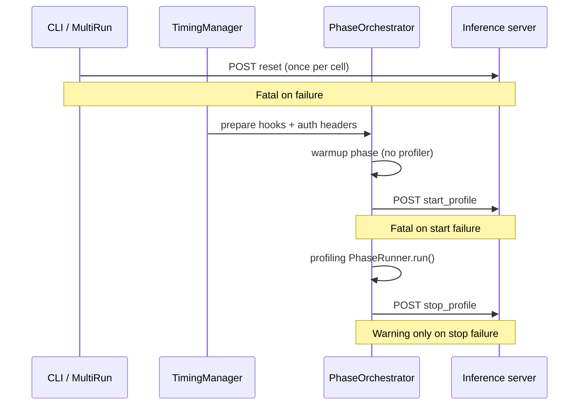

# Benchmark Control Hooks

AIPerf can POST control-plane requests to your inference server around a
benchmark cell: reset the KV cache once before the run, and start/stop a
server profiler around each **profiling** phase (not warmup).

Control traffic uses an isolated HTTP client. It is **not** recorded as
benchmark requests and does **not** appear in metrics or profile exports.

## Quick start

```bash
aiperf profile \
  --model your-model \
  --url http://localhost:8000 \
  --endpoint-type chat \
  --streaming \
  --concurrency 8 \
  --request-count 100 \
  --reset-kv-cache \
  --server-profiler
```

With defaults this issues:

| Hook | When | Default path |
|------|------|--------------|
| KV-cache reset | Once per logical cell, before services start (so before warmup) | `POST {origin}/reset_prefix_cache` |
| Profiler start | Before each `CreditPhase.PROFILING` runner | `POST {origin}/start_profile` |
| Profiler stop | After that profiling runner finishes | `POST {origin}/stop_profile` |

`{origin}` is `scheme://host:port` for each configured `--url`.

## YAML: `false | true | object`

Under `endpoint`, both hooks accept a bool or an object:

```yaml
benchmark:
  models: [your-model]
  endpoint:
    url: http://localhost:8000
    type: chat
    # Disabled (default when omitted)
    reset_kv_cache: false
    server_profiler: false
```

```yaml
benchmark:
  models: [your-model]
  endpoint:
    url: http://localhost:8000
    type: chat
    # Enabled with defaults
    reset_kv_cache: true
    server_profiler: true
```

```yaml
benchmark:
  models: [your-model]
  endpoint:
    url: http://localhost:8000
    type: chat
    reset_kv_cache:
      path: /v1/admin/reset_prefix_cache
      timeout_seconds: 30
      max_retry_seconds: 60
    server_profiler:
      start_path: /v1/admin/start_profile
      stop_path: /v1/admin/stop_profile
      timeout_seconds: 15
```

## CLI flags

| Flag | Maps to |
|------|---------|
| `--reset-kv-cache` | Enable reset with defaults |
| `--reset-kv-cache-path` | `endpoint.reset_kv_cache.path` |
| `--reset-kv-cache-timeout-seconds` | `endpoint.reset_kv_cache.timeout_seconds` |
| `--server-profiler` | Enable profiler with defaults |
| `--server-profiler-start-path` | `endpoint.server_profiler.start_path` |
| `--server-profiler-stop-path` | `endpoint.server_profiler.stop_path` |
| `--server-profiler-timeout-seconds` | `endpoint.server_profiler.timeout_seconds` |

Setting any path/timeout override also enables the corresponding hook
(same as passing `true` / `--reset-kv-cache` / `--server-profiler`).

## Defaults and relative paths

| Setting | Default |
|---------|---------|
| Reset path | `/reset_prefix_cache` |
| Profiler start path | `/start_profile` |
| Profiler stop path | `/stop_profile` |
| Timeouts | 30s when unset (independent of `endpoint.timeout`) |
| `reset_kv_cache` retry budget | 60s when unset |

A retryable `reset_kv_cache` failure - a transport-level error (timeout,
connection error) or a response with status `409`, `423`, `429`, or `503`
(standard "transient, try again" signals) - is retried with exponential
backoff (starting at 1s, doubling up to an 8s cap) until
`reset_kv_cache.max_retry_seconds` elapses. Any other non-2xx response
(e.g. `400`/`401`/`403`/`404`) fails immediately. This tolerates a server
that's transiently busy with unrelated control-plane
work (e.g. finishing a profiler stop) when starting the next run.

Paths must be **relative** (start with `/`) and must not contain `://`.
AIPerf joins each path to every endpoint URL origin. Absolute URLs in
`path` / `start_path` / `stop_path` are rejected at config validation.

Control hooks require HTTP transport. Non-HTTP transports raise a
validation error when either hook is enabled.

## Lifecycle and ownership



- **Reset** runs in the CLI single-run / multi-run path once per logical
  benchmark cell (each sweep cell, each multi-trial subprocess), before
  services start issuing load.
- **Profiler** is owned by `TimingManager` / `PhaseOrchestrator`. Workers
  never fire control hooks.
- Warmup phases never start or stop the profiler.
- **The reset is a per-cell isolation boundary, not a cold-cache
  guarantee for the profiling phase.** It fires before the benchmark
  services start, so if the run also has a warmup phase, warmup traffic
  repopulates the prefix cache before profiling begins. That is the
  intended behavior: the hook exists so one sweep cell (or multi-run
  trial) cannot inherit cache state from the previous one, and warmup
  exists precisely so profiling measures a steady-state server. If you
  want profiling to measure genuinely cold-cache behavior, run without a
  warmup phase at all so the reset is the last thing that touches the
  server before profiling load starts. Warmup is opt-in: omit
  `--warmup-request-count` / `--warmup-num-sessions` /
  `--warmup-duration` on the CLI, or omit the `warmup:` block (and any
  `exclude_from_results` warmup phase) in YAML. Note that
  `--warmup-request-count 0` is **not** the way to do this — the flag is
  constrained to `> 0` and a `0` fails validation with `Input should be
  greater than 0`.
- Multi-URL endpoints: control POSTs go to each **unique** origin
  (`scheme://host:port`); duplicate path-qualified URLs on the same host
  are deduplicated. A partial profiler-start failure best-effort stops
  already-started origins, then re-raises. Profiler stop attempts every
  unique origin and aggregates failures.
- **Seamless non-final profiling:** when a profiling phase has
  `seamless=True` and is not the last phase, profiler **start** still runs
  before send begins, but profiler **stop** is deferred until the phase
  drain callback (after in-flight credits return), not when `run()` returns
  at send-complete.

## Failure policy

| Hook | Failure behavior |
|------|------------------|
| `reset_kv_cache` | Fatal — abort the cell |
| Profiler start | Fatal — profiling does not begin |
| Profiler stop | Warning only — run completes |

Auth headers match readiness probes (`Authorization: Bearer …` or
Anthropic `x-api-key`, plus any `--header` / YAML `endpoint.headers`).

## Mock server

The in-repo mock server exposes countable admin routes for local
verification:

- `POST /reset_prefix_cache` (vLLM-style)
- `POST /flush_cache` (SGLang-style alias; same counter)
- `POST /start_profile`
- `POST /stop_profile`

These routes are outside the inference auth path and do not contribute
to benchmark records.

For per-server path mappings (vLLM, SGLang, TensorRT-LLM), see
[Control Hooks by Server](control-hooks-by-server.md).
