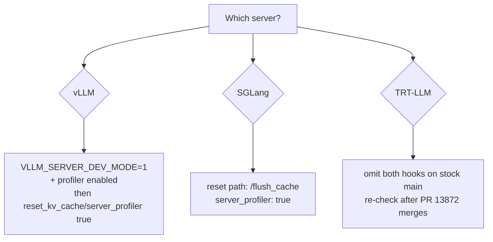

# Control Hooks by Inference Server

How AIPerf's `endpoint.reset_kv_cache` and `endpoint.server_profiler` map
onto **vLLM**, **SGLang**, and **TensorRT-LLM** (`trtllm-serve`).

For the general feature (ownership, failure policy, CLI flags), see
[Benchmark Control Hooks](benchmark-control-hooks.md).

## Quick matrix

| Capability | vLLM | SGLang | TensorRT-LLM (`trtllm-serve`) |
|---|---|---|---|
| Prefix / radix cache reset | `POST /reset_prefix_cache` (**requires `VLLM_SERVER_DEV_MODE=1`**) | `POST /flush_cache` | **No HTTP flush on `main`** (reuse is config-driven) |
| Profiler start | `POST /start_profile` (only if profiler config enabled) | `POST /start_profile` | **Not on `main` yet** — open PR [#13872](https://github.com/NVIDIA/TensorRT-LLM/pull/13872) |
| Profiler stop | `POST /stop_profile` (same gate) | `POST /stop_profile` | Same as start |
| Same origin as OpenAI URL? | Yes | Yes (HTTP server; gRPC uses HTTP sidecar) | N/A until routes land |
| AIPerf defaults work? | Paths yes, **if** server flags enable the routes | Override reset path to `/flush_cache` | Leave both hooks off on stock `main` |

AIPerf always sends **empty-body POSTs** and treats **any 2xx** as success.
Optional JSON bodies that some servers accept on `/start_profile` are
out of scope for the first control-hook pass — use empty POST + manual
stop (AIPerf already pairs start/stop to profiling barriers).

## vLLM

### Source

- Reset: `vllm/entrypoints/serve/dev/cache/api_router.py` →
  `@router.post("/reset_prefix_cache")`. Mounted only via
  `register_vllm_dev_api_routers()` when
  `VLLM_SERVER_DEV_MODE=1` (`vllm/envs.py`).
- Profiler: `vllm/entrypoints/serve/profile/api_router.py` →
  `/start_profile`, `/stop_profile`. Mounted only when
  `profiler_config.profiler` is set (local-dev warning in code).

### Caveats

- Reset returns **HTTP 200** with `{"success": bool}`. A failed reset
  (blocks still held) is still 2xx, so AIPerf will treat it as success.
  Ensure the engine is idle before the hook, or inspect server logs.
- Enable both gates before relying on AIPerf defaults:

```bash
export VLLM_SERVER_DEV_MODE=1
# plus whatever flag/config enables profiler_config.profiler for your vLLM version
```

```yaml
endpoint:
  type: chat
  url: http://127.0.0.1:8000
  reset_kv_cache: true
  server_profiler: true
```

```bash
aiperf profile \
  --model <model> \
  --url http://127.0.0.1:8000 \
  --reset-kv-cache \
  --server-profiler \
  ...
```

## SGLang

### Source

- Flush: `python/sglang/srt/entrypoints/http_server.py` →
  `@app.api_route("/flush_cache", methods=["GET", "POST"])` with query
  `timeout: float = 0.0`. Returns **200** on success, **400** on failure
  (e.g. not idle).
- Profiler: same file → `/start_profile`, `/stop_profile` (`GET`/`POST`).
- gRPC deployments: `grpc_server.py` documents an HTTP sidecar that
  exposes `/start_profile` and `/stop_profile` (flush may also live on
  the HTTP surface depending on deployment).

### Config

```yaml
endpoint:
  type: chat
  url: http://127.0.0.1:30000
  reset_kv_cache:
    path: /flush_cache
    # Optional: wait for idle (query string is allowed on relative paths)
    # path: /flush_cache?timeout=30
  server_profiler: true
```

```bash
aiperf profile \
  --model <model> \
  --url http://127.0.0.1:30000 \
  --reset-kv-cache \
  --reset-kv-cache-path /flush_cache \
  --server-profiler \
  ...
```

Notes:

- Prefer `?timeout=30` (and matching `timeout_seconds` on the hook) when
  cells may still have in-flight work; `timeout=0` fails fast with 400.
- Point `--url` at the HTTP sidecar origin for gRPC-only servers if that
  is where admin routes are exposed.

Docs: [Native APIs](https://docs.sglang.io/docs/basic_usage/native_api),
[Benchmark and Profiling](https://docs.sglang.io/docs/developer_guide/benchmark_and_profiling).

## TensorRT-LLM (`trtllm-serve`)

### Cache reset

Verified on TensorRT-LLM `main`: **no** `/reset_prefix_cache` or
`/flush_cache` on `tensorrt_llm/serve/openai_server.py`. Related admin
routes exist for RL/weight workflows (`/release_memory`,
`/resume_memory`, `/update_weights`) — not a prefix-cache flush.

KV block reuse is controlled at **startup** via `kv_cache_config` /
`enable_block_reuse` (see
[KV cache reuse](https://nvidia.github.io/TensorRT-LLM/advanced/kv-cache-reuse.html)).

For sweep hygiene:

- Disable reuse when cross-cell pollution is unacceptable, **or**
- Restart / redeploy `trtllm-serve` between cells (outside AIPerf hooks).

Do **not** enable `endpoint.reset_kv_cache` against stock `trtllm-serve`
unless your deployment documents a custom admin route.

### Profiler

On current TensorRT-LLM `main`, **`/start_profile` and `/stop_profile` are not
registered**. The in-tree
`tensorrt_llm/serve/scripts/benchmark_serving.py` *calls* those URLs
when `--profile` is set, but the server handlers live in open PR
[#13872](https://github.com/NVIDIA/TensorRT-LLM/pull/13872)
(`state: OPEN`, not merged).

Until that PR (or equivalent) lands in your build:

```yaml
endpoint:
  type: chat
  url: http://127.0.0.1:8000
  # omit reset_kv_cache and server_profiler
```

After the routes exist on your binary, confirm then enable:

```bash
curl -s -o /dev/null -w "%{http_code}\n" -X POST http://127.0.0.1:8000/start_profile
curl -s -o /dev/null -w "%{http_code}\n" -X POST http://127.0.0.1:8000/stop_profile
```

Expect `2xx`. Missing routes make profiler **start** fatal — leave
`server_profiler` off.

## Mock server (local verification)

The in-repo mock server implements:

| Path | Role |
|---|---|
| `POST /reset_prefix_cache` | vLLM-style reset |
| `POST /flush_cache` | SGLang-style flush (same counter as reset) |
| `POST /start_profile` | Profiler start |
| `POST /stop_profile` | Profiler stop |

Example against mock:

```bash
aiperf-mock-server --port 8000 --fast --access-logs &

# vLLM-shaped defaults
aiperf profile --model mock-model --url http://127.0.0.1:8000 \
  --reset-kv-cache --server-profiler --request-count 2 --ui none ...

# SGLang-shaped reset path
aiperf profile --model mock-model --url http://127.0.0.1:8000 \
  --reset-kv-cache --reset-kv-cache-path /flush_cache \
  --server-profiler --request-count 2 --ui none ...
```

Access logs should show reset/flush before profiling traffic, and
`start_profile` / `stop_profile` around the profiling phase.

## Choosing overrides



Always keep paths **relative** (leading `/`). AIPerf joins them to each
unique endpoint origin (`scheme://host:port`).
